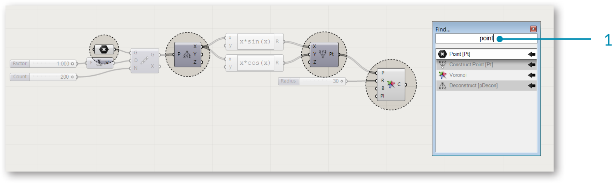
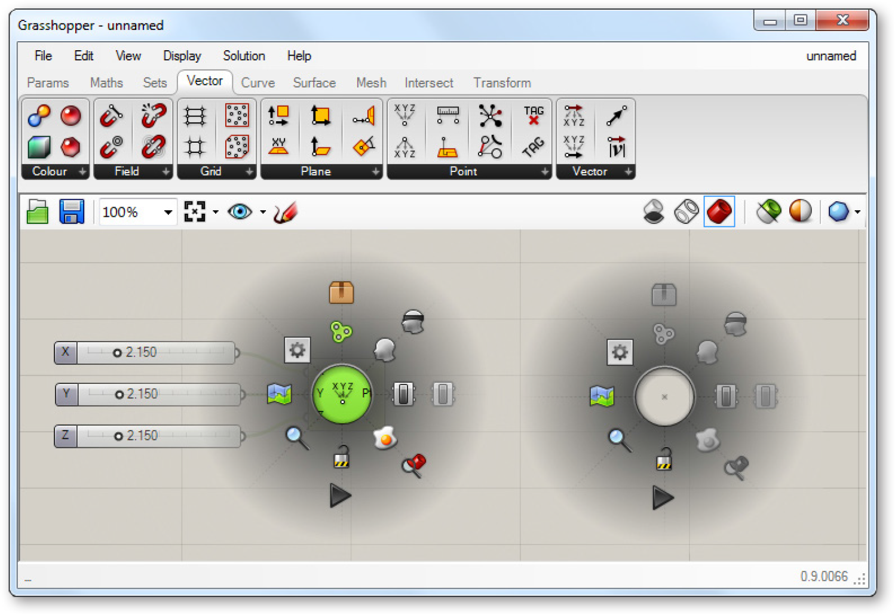
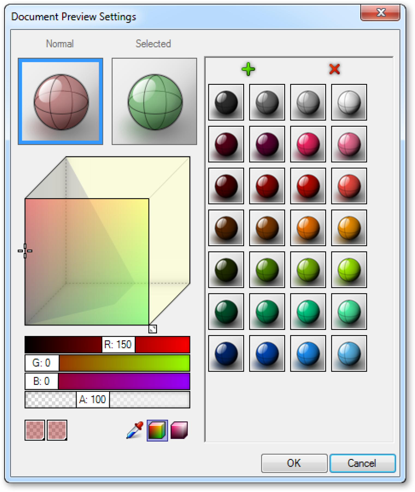

### 1.1.2. THE GRASSHOPPER UI

#####Grasshopper’s visual “plug-and-play” style gives designers the ability to combine creative problem solving with novel rule systems through the use of a fluid graphical interface.

Let’s start by exploring Grasshopper’s user interface UI. Grasshopper is a
visual programming application where you are able to create programs, called
definitions or documents, by dragging components onto the main editing
window (called the canvas). The outputs to these components are connected to
the inputs of subsequent components — creating a graph of information which
can be read from left to right. Let’s get started with the basics.

Assuming you’ve already installed the Grasshopper plugin (see F.0.0), type the
word “Grasshopper” in the Rhino command prompt to display the Grasshopper
Editor. The Grasshopper interface contains a number of elements, most of which
will be very familiar to Rhino users. Let’s look at a few features of the interface.

>1. Windows title bar.
2. Main menu bar.
3. File browser control.
4. Component palettes.
5. Canvas toolbar.
6. Canvas.
7. This area, indicated by a grid of rectangular boxes, provides an interface with which to open recently accessed file. The 3x3 menu shows the files most recently accessed (chronologically) and will display a red rectangular box if the file cannot be found (which can occur if you move a file to a new folder or delete it).
8. The status bar tells you what version of Grasshopper is currently installed on your machine. If a newer version is available, a pop-up menu will appear in your tray providing instructions on how to download the latest version.

####1.1.2.1. THE WINDOWS TITLE BAR
The Editor Window title bar behaves differently from most other dialogs in
Microsoft Windows. If the window is not minimized or maximized, double
clicking the title bar will collapse the dialog into a minimized bar on your
screen. This is a great way to switch between the plug-in and Rhino because it
minimizes the Editor without moving it to the bottom of the screen or behind
other windows. Note that if you close the Editor, the Grasshopper geometry
preview in the Rhino viewport will disappear, but the file won’t actually be
closed. The next time you run the “Grasshopper” command in the Rhino dialog
box, the window will come back in the same state with the same files loaded.
This is because once it is launched from the command prompt, your session
of Grasshopper stays active until that instance of Rhino is closed.

####1.1.2.2. MAIN MENU BAR
The title bar is similar to typical Windows menus, except for the file browser
control on the right (see next section). The File menu provides typical functions
(eg. New File, Open, Save, etc.) in addition to a few utility tools which let you
export images of your current Grasshopper document (see Export Quick Image
and Export Hi-Res Image). You can control different aspects of the user interface
using the View and Display menus, while the Solution menu lets you manage
different attributes about how the solver computes the graph solution.

It is worth noting that many application settings can be controlled through the
Preferences dialog box found under the File menu. The Author section allows
you to set personal metadata which will be stored with each Grasshopper
document while the Display section gives you fine grain control over the look
and feel of the interface. The Files section lets you specify things like how
often and where to store automatically saved file (in case the application is
inadvertently closed or crashes). Finally, the Solver section lets you manage core
and third-party plugins which can extend functionality.

> Note: Be careful when using shortcuts since they are handled by the active window which could either be Rhino, the Grasshopper canvas or any other window inside Rhino. It is quite easy to use a shortcut command, only to realize that you had the wrong active window selected and accidentally invoked the wrong command.

>The Preferences dialog allows you to set many of Grasshopper’s application settings.

####1.1.2.3. FILE BROWSER CONTROL
The File Browser allows you to quickly switch between different loaded files by
selecting them through this drop-down list. Accessing your open files through
the File Browser drop-down list enables you to quickly copy and paste items
from open definitions. Just click on the active file name in the browser control
window and a cascading list of all open files will be displayed (along with a small
thumbnail picture of each open definition) for easy access. You can also hit
Alt+Tab to quickly switch between any open Grasshopper documents.

Of course, you can go through the standard Open File dialog to load any
Grasshopper document, although you can also drag and drop any Grasshopper
file onto the canvas to load a particular definition.

> Grasshopper is a plug-in that works “on-top” of Rhino and as such has its own file types.
The default file type is a binary data file, saved with an extension of .gh. The other file type is known as a Grasshopper XML file, which uses the extension .ghx. The XML (Extensible Markup Language) file type uses tags to define objects and object attributes (much like an .HTML document) but uses custom tags to define objects and the data within each object. Because XML files are formatted as textdocuments, you could open up any Grasshopper XML file in a text editor like NotePad to see the coding that is going on behind the scenes.

Grasshopper has several different methods by which it can open a file, and you
will need to specify which option you would like to use when using this method.

**Open File:** As the name suggests, this file option will simply open any
definition that you drag and drop onto the canvas.

**Insert File:** You can use this option to insert an existing file into the current
document as loose components.

**Group File:** This method will insert a file into an existing document, but will
group all of the objects together.

**Cluster File:** Similar to the group function, this method will insert a file into
an existing document, but will create a cluster object for the entire group
of objects.

**Examine File:** Allows you to open a file in a locked state, meaning you
can look around a particular file but you can’t make any changes to the
definition.

Grasshopper also has an Autosave feature which will be triggered periodically
based on specific user actions. A list of Autosave preferences can be found
under the File menu on the Main Menu Bar. When the active instance of Rhino is
closed, a pop-up dialog box will appear asking whether or not you want to save
any Grasshopper files that were open when Rhino was shut down.

>Autosave only works if the file has already been saved at least once.

>Drag and Drop Files onto the Canvas.

####1.1.2.4. COMPONENT PALETTES
This area organizes components into categories and sub-categories. Categories
are displayed as tabs, and subcategories are displayed as drop-down panels. All
components belong to a certain category. These categories have been labeled
to help you find the specific component that you are looking for (e.g. “Params”
for all primitive data types or “Curves” for all curve related tools). To add a
component to the canvas, you can either click on the objects in the drop-down
menu or you can drag the component directly from the menu onto the canvas.

>Drag + Drop a component from the palette to add a component to the canvas.

Since there can be many more components in each sub-category than will fit into
the palette, a limited number of icons are displayed on each panel. The height
of the component palette and the width of the Grasshopper window can be
adjusted to display more or fewer components per sub-category. To see a menu
of all of the components in a given sub-category, simply click on the black bar at
the bottom of each sub-category panel. This will open a dropdown menu which
provides access to all components in that sub-category.

>1. Catgory tab
2. Sub-category panel.
3. Click the black bar to open the sub-category panel menu.
3. Hover your mouse over a component for a short description.
4. Drop-down menu.

####1.1.2.5. THE CANVAS
The canvas is the primary workspace for creating Grasshopper definitions. It is
here where you interact with the elements of your visual program. You can start
working in the canvas by placing components and connecting wires.

####1.1.2.6. GROUPING
Grouping components together on the canvas can be especially useful for
readability and comprehensibility. Grouping allows you the ability to quickly
select and move multiple components around the canvas. You can create a group
by typing Ctrl+G with the desired components selected. An alternate method
can be found by using the “Group Selection” button under the Edit Menu on the
Main Menu Bar. Custom parameters for group color, transparency, name, and
outline type can be defined by right-clicking on any group object.

>1. A group of components delineated by the Box Outline profile.
2. Right-click anywhere on the group to edit the name and appearance of the group.

>You can also define a group using a meta-ball algorithm by using the Blob Outline profile.

>Two groups are nested inside one another. The color (light blue) has been changed on the outer group to help visually identify one group from the other. Groups are drawn “behind” the components within them and, in cases such as this, there is a depth order to the two groups. To change this, go to Edit > Arrange in the main menu bar.

####1.1.1.7. WIDGETS
There are a few widgets that are available in Grasshopper that can help you
perform useful actions. You can toggle any of these widgets on/off under the
Display menu of the Main Menu bar. Below we’ll look at a few of the most
frequently used widgets.

**The Align Widget**
One useful UI widget which can help you keep your canvas clean is the Align
widget. You can access the Align widget by selecting multiple components at the
same time and clicking on one of the options found in the dashed outline that
surrounds your selected components. You can align left, vertical center, right, or
top, horizontal center, bottom, or distribute components equally through this
interface. When first starting out, you may find that these tools sometimes get in
the way (it is possible to make the mistake of collapsing several components on
top of each other). However, with a little practice these tools can be invaluable as
you begin to structure graphs which are readable and comprehensible.

>1. Align right.
2. Distribute vertically.

**The Profiler Widget**
The profiler lists worst-case runtimes for parameters and components,
allowing you to track down bottlenecks in networks and to compare different
components in terms of performance. Note that this widget is turned off by
default.

>The Profiler widget gives you visual feedback as to which components in your definition could be causing longer computational times.

**The Markov Widget**
This widget uses Markov chains to ‘predict’ which component you may want to
use next based on your behavior in the past. A Markov chain is a process that
consists of a finite number of states (or levels) and some known probabilities. It
can take some time for this widget to become accustomed to a particular user,
but over time you should begin to notice that this widget will begin to suggest
components that you may want to use next.
The Markov Widget can suggest up to five possible components depending
on your recent activity. You can right-click on the Markov widget (the default
location is the bottom left-hand corner of the canvas) to dock it into one of the
other corners of the canvas or to hide it completely.

####1.1.2.8. USING THE SEARCH FEATURE
Although a lot of thought has gone into the placement of each component on
the component panel to make it intuitive for new users, people sometimes find
it difficult to locate a specific component that might be buried deep inside one
of the category panels. Fortunately, you can also find components by name, by
double-clicking on any empty space on the canvas. This will invoke a pop-up
search box. Simply type in the name of the component you are looking for and
you will see a list of parameters or components that match your request.

>Double-click anywhere on the canvas to invoke a key word search for a particular component found in the Component Panels.

>A search for “divide” lists a variety of components.
1. Division operator component.
2. Divide Surface component.
3. Divide Domain2 component.

####1.1.2.9. THE FIND FEATURE
There are literally hundreds (if not thousands) of Grasshopper components
which are available to you and it can be daunting as a beginner to know where
to look to find a specific component within the Component Palettes. The quick
solution is to double-click anywhere on the canvas to launch a search query for
the component you are looking for. However, what if we need to find a particular
component already placed on our canvas? No need to worry. By right-clicking
anywhere on the canvas or pressing the F3 key, you can invoke the Find feature.
Start by typing in the name of the component that you are looking for.

The Find feature employs the use of some very sophisticated algorithms which
search not only for any instances of a component’s name within a definition (a
component’s name is the title of the component found under the Component
Panel which we as users cannot change), but also any unique signatures which
we may have designated for a particular component (known as nicknames).
The Find feature can also search for any component type on the canvas or
search through text panel, scribble, and group content. Once the Find feature
has found a match, it will automatically grey out the rest of the definition and
draw a dashed line around the highlighted component. If multiple matches are
found, a list of components matching your search query will be displayed in the
Find dialog box and hovering over an item in the list will turn that particular
component on the canvas green.

>By right-clicking anywhere on the canvas or pressing the F3 key, you can invoke the Find feature. Start by typing in the name of the component that you are looking for.

>The Find feature can be quite helpful to locate a particular component on the canvas. Right-click anywhere on the canvas to launch the Find dialog box.

>A small arrow will also be displayed next to each item in the list which points
to its corresponding component on the canvas. Try moving the Find dialog box
around on the canvas and watch the arrows rotate in to keep track of their
components. Clicking on the Find result will try to place the component (on the
canvas) next to the Find dialog box.

####1.1.2.10. USING THE RADIAL MENU
As you become more proficient in using the Grasshopper interface, you’ll
begin to find ways to expedite your workflow. Using shortcuts is one way to do
this, however there is another feature which can allow you to quickly access
a number of useful tools – the radial UI menu. You can invoke the radial menu
by hitting the space bar (while your mouse is over the canvas or a component)
or by clicking your middle mouse button. The radial menu will enable different
tools depending on whether you invoke the menu by clicking directly on top
of a component, or just anywhere on the canvas. In the image below, you see
the radial menu has more features available when clicking on top of a selected
component versus just clicking anywhere else on the canvas. This menu can
dramatically increase the speed at which you create Grasshopper documents.

>The Radial UI menu allows you to quickly access frequently used menu items.

####1.1.2.11. THE CANVAS TOOLBAR
The canvas toolbar provides quick access to a number of frequently used
Grasshopper features. All of the tools are available through the menu as well,
and you can hide the toolbar if you like. The toolbar can be re-enabled from the
View tab on the Main Menu Bar.

>1. **Open File:** A shortcut to open a Grasshopper File.
2.  **Save File:** A shortcut to save the currentGrasshopper File.
3.  **Zoom Defaults**: Default zoom settings that allow you to zoom in or out of your canvas at predefined intervals.
4. **Zoom Extents:** Zoom to the extents of your definition. Click on the arrow next to the Zoom Extents icon to select one of the sub-menu items to zoom to a particular region within your definition.
5. **Named Views: **This feature exposes a menu allowing you to store or recall any view area in your definition.
6. **The Sketch Tool:** The sketch tool works similarly to the pencil
tool set found in Adobe Photoshop with a few added features.

>1. **Preview Settings:** If a Grasshopper component generates some form of geometry, then a preview of this geometry will be visible in the viewport by default. You can disable the preview on a perobject basis by right-clicking each component and de-activating the preview feature, or globally change the preview state by using one of these three buttons.
2. Wire-frame preview.
3. Turn off preview.
4. Shaded preview (default).
5. **Preview Selected Objects:** With this button toggled, Grasshopper will only display geometry that is part of selected components, even if those components have a preview=off state.
6. **Document Preview Settings:** Grasshopper has a default color scheme for selected (semi-transparent green) and unselected (semi-transparent red) geometry. It is possible to override this color scheme with the Document Preview Settings dialog.
7. **Preview Mesh Quality:** For optimization purposes, these settings allow you to control the quality of the mesh/surface display of the geometry rendered in Rhino. Higher quality settings will cause longer calculation times, whereas lower settings will display less accurate preview geometry. It should be noted that the geometry still maintains a high-degree of resolution when baked into the Rhino document – these settings merely effect the display performance and quality.

>The sketch tool allows changes to the line weight, line type, and color. By right-clicking on the selected sketch object you can choose to simplify your line to create a smoother effect. Right-click on your sketch object and select “Load from Rhino”. When prompted, select any 2D shape in your Rhino scene. Once you have selected your referenced shape, hit Enter, and your previous sketch line will be reconfigured to your Rhino reference shape.

>Note: Your sketch object may have moved from its original location once you have loaded a shape from Rhino. Grasshopper places your sketch object relative to the origin of the canvas (upper left hand corner) and the world xy plane origin in Rhino.

>Grasshopper has a default color scheme for selected (semi-transparent green) and unselected (semi-transparent red) geometry. It is possible to override this color scheme with the Document Preview Settings dialog.

