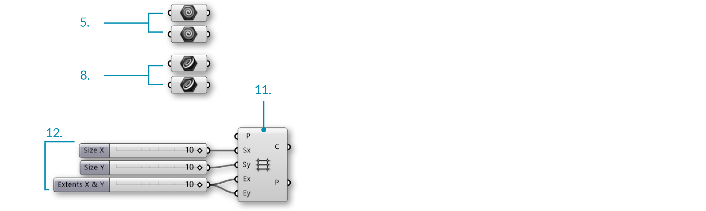
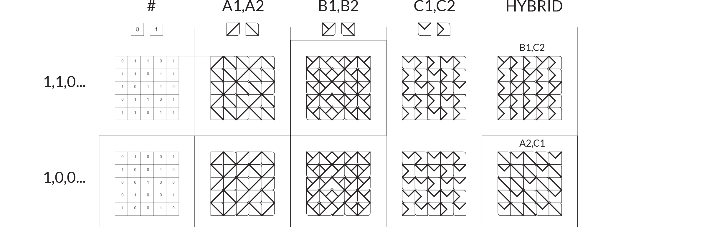
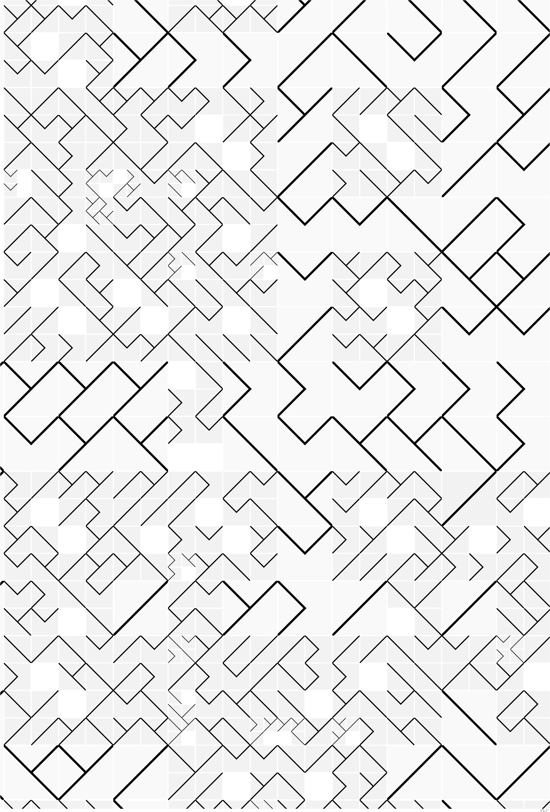

### 1.4.7. WORKING WITH LISTS

Lets take a look at an example using the components from the previous section. In this example, we are creating a tile pattern by mapping geometry to a rectangular grid. The pattern is created by using the List Item component to retrieve the desired tile from a list of geometry.

>1. Geometry corresponding to index 1
2. Geometry corresponding to index 0
3. Rectangular grid

>1. Mapping pattern
2. Mapped geometry

||||
|--|--|--|
|01.| Start a Rhinoceros File. ||
|02.| Create two equally sized squares.||
|03.| Create different geometries in each square. <blockquote>In the example shown above, we created a simple surface with a tab. The tab is filleted to demonstrate the orientation and the base is filleted to distinguish the two geometries.</blockquote>||
|04.| Start a new definition, type Ctrl+N (in Grasshopper).||
|05.| </b>Params/Geometry/Geometry</b> – Drag and drop two <b>Geometry</b> parameters onto the canvas.| |
|06.| Right-Click the first <b>Geometry</b> Parameter and select set one Geometry. Set the first Geometry that you are referencing. ||
|07.| Right-Click the second <b>Geometry</b> Parameter and select set one Geometry. Set the second Geometry that you are referencing.  <blockquote>It is possible to reference multiple geometries in a single parameter, but for simplicity were are using two separate parameter components.</blockquote>||
|08.| <b>Params/Geometry/Curve</b> – Drag and drop two <b>Curve</b> parameters onto the canvas.||
|09.| Right-Click the first <b>Curve</b> Parameter and select set one Curve. Set the first square that you are referencing.||
|10.| Right-Click the second <b>Curve</b> Parameter and select set one Curve. Set the second square that you are referencing.  <blockquote>Be sure that the geometry and the square that you are referencing correspond.</blockquote>||
|11.| **Vector/Grid/Rectangular** – Drag and drop a <b>Rectangular Grid</b> component onto the canvas. ||
|12.| **Params/Input/Slider** - Drag and drop three <b>Number Sliders</b> on the canvas. ||
|13.| Double-click on the first <b>Number Slider</b> and set the following:<ul>Rounding: Integers Lower Limit: 0 Upper Limit: 10 Value: 10 </ul>||
|14.| Double-click on the second <b>Number Slider</b> and set the following:<ul>Rounding: Integers Lower Limit: 0 Upper Limit: 10 Value: 10 </ul>||
|15.| Double-click on the third <b>Number Slider</b> and set the following:<ul>Name: Extents X & Y Rounding: Integers Lower Limit: 0 Upper Limit: 10 Value: 10 </ul>||
|16.| Connect the first <b>Number Slider</b> to the Size X (Sx) input of the <b>Rectangular Grid</b> component.||
|17.| Connect the second <b>Number Slider</b> to the Size Y (Sy) input of the <b>Rectangular Grid</b> component.||
|18.| Connect the third <b>Number Slider</b> to the Extent X (Ex) input and the Extent Y (Ey) input of the <b>Rectangular Grid</b> component.|||

||||
|--|--|--|
|19.| <b>Sets/Tree/Merge</b> – Drag and drop two <b>Merge</b> components onto the canvas.||
|20.| Connect the first <b>Geometry</b> parameter to Data Stream 1 (D1) input of the first <b>Merge</b> component. ||
|21.| Connect the second <b>Geometry</b> parameter to Data Stream 2 (D2) input of the first <b>Merge</b> component. ||
|22.| Connect the first <b>Curve</b> parameter to Data Stream 1 (D1) input of the second <b>Merge</b> component. ||
|23.| Connect the second <b>Curve</b> parameter to Data Stream 1 (D2) input of the second <b>Merge</b> component. ||
|24.| Right-click the Cells (C) output of the <b>Rectangular Grid</b> component and select Flatten. |||

||||
|--|--|--|
|25.| <b>Sets/List/List Length</b> – Drag and drop a <b>List Length</b> component onto the canvas.||
|26.| Connect the Cells (C) output of the <b>Rectangular Grid</b> component to the List (L) input of the <b>List Length</b> component. ||
|27.| <b>Sets/Sequence/Repeat Data</b> – Drag and drop a <b>Repeat Data</b> component onto the canvas.||
|28.| Connect the Length (L) output of the <b>List Length</b> component to the Length (L) input of the <b>Repeat Data</b> component. ||
|29.| <b>Params/Input/Panel</b> – Drag and drop a <b>Panel</b> onto the canvas.||
|30.| Double-click the <b>Panel</b>. Deselect multiline data, wrap items, and special codes. Enter the following:<ul>1 0 0</ul> <blockquote>This is the pattern in which the geometries are being distributed. 0 is calling out the first referenced Geometry and 1 is calling out the second referenced Geometry. Changing the number sequence will change the pattern, as will changing the extents of the grid.</blockquote>||
|31.| Connect the <b>Panel</b> to the Data (D) input of the <b>Repeat Data</b> component.|||

||||
|--|--|--|
|32.| <b>Sets/List/List Item</b> – Drag and drop two <b>List Item</b> components.||
|33.| Connect the Result (R) output of the first <b>Merge</b> component to the List (L) input of the first <b>List Item</b>component.||
|34.| Connect the Result (R) output of the second <b>Merge</b> component to the List (L) input of the second <b>List Item</b> component.||
|35.| Connect the Data (D) output of the <b>Repeat Data</b> component to the Index (i) input of the first and second <b>List Item</b> components.||
|36.| <b>Transform/Affine/Rectangle Mapping</b> – Drag and Drop the <b>Rectangle Mapping</b> component onto the canvas.||
|37.| Connect the Cells (C) output of the <b>Rectangular Grid</b> component to the Target (T) input of the <b>Rectangular Mapping</b> component.||
|38.| Connect the items (I) output of the first <b>List Item</b> component to the Geometry (G) input of the <b>Rectangular Mapping</b> component.||
|39.| Connect the items (I) output of the second <b>List Item</b> component to the Source (S) input of the <b>Rectangular Mapping</b> component.|||

Changing the input geometry and the pattern will change the final tile pattern.

