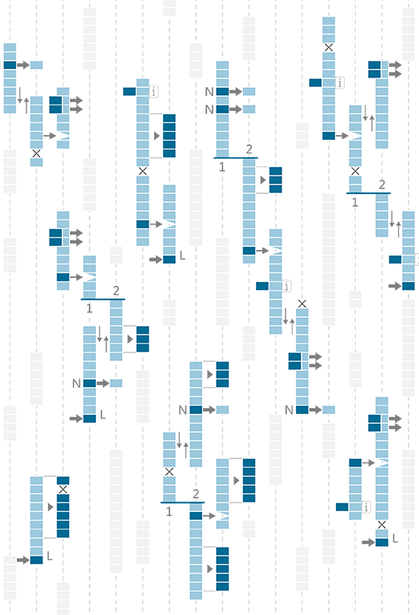

## 1.4. Designing with Lists

####One of the most powerful features of Grasshopper is the ability to quickly build and manipulate lists of data. This chapter will explain how to create, manipulate, and visualize list data.

