### 1.5.3. Creating Data Trees

#####Grasshopper contains tools for changing the structure of a data tree. Theese tools can help you access specific data within a tree, and change the way it is stored, ordered, and identified.

Let’s look at some data tree manipulations and visualize how they affect the tree.

####1.5.3.1. FLATTEN
Flattening removes all levels of a Data Tree, resulting in a single List. Using the Flatten component (Sets/Tree/Flatten) on the P output of our Divide Curve component, we can use the Param Viewer to visualize the new data structure.

>In the Param Viewer, we can see that we now only have 1 branch containing a list of 48 points.

####1.5.3.2. GRAFT TREE
Grafting creates a new Branch for every Data Item. If we run the data through the Graft Tree component (Sets/Tree/Graft Tree), each division point now has its own individual branch, rather than sharing a branch with the other division points on the same curve.

>In the Param Viewer, we can see that what was data with 8 branches of 6 items each, we now have 8 branches with 6 sub-branches containing 1 item each.

####1.5.3.3. SIMPLIFY TREE
Simplify removes overlapping Branches in a Data Tree. If we run the data through the Simplify Tree component (Sets/Tree/Simplify Tree), the first branch, containing no data, has been removed.

>In the Param Viewer, we still have 8 branches of 6 items each, but the first branch has been removed.

####1.5.3.4. FLIP MATRIX
The Flip Matrix component (Sets/Tree/Flip Matrix) Swaps the “Rows” and “Columns” of a Data Tree with two Path Indices.

>In the Param Viewer, we can see that what was data with 8 branches of 6 items each, we now have 6 branches with 8 items each.

The Flatten, Graft, and Simplify operations can be applied to the component input or output itself, rather than feeding the data through a separate component. Just right-click the desired input or output and select Flatten, Graft, or Simplify from the menu. The component will display an icon to indicate that the tree is being modified. Keep in mind Grasshopper’s program flow. If you flatten a component input, the data will be flattened before the component
operation is performed. If you flatten a component output, the data will be flattened after the component performs its action.

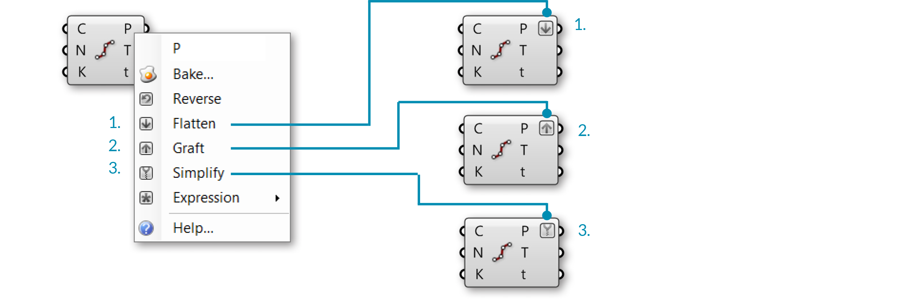
>1. Flattened output P
2. Grafted output P
3. Simplified output P

####1.5.3.5. THE PATH MAPPER
The Path Mapper component (Sets/Tree/Path Mapper) allows you to perform lexical operations on data trees. Lexical operations are logical mappings between data paths and indices which are defined by textual (lexical) masks and patterns.

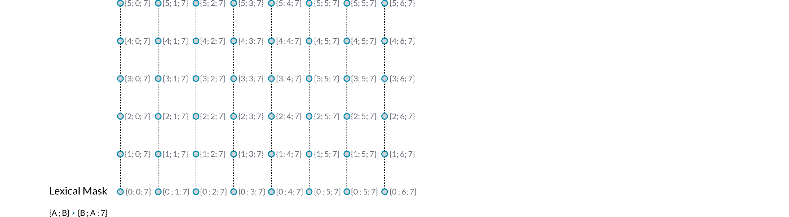
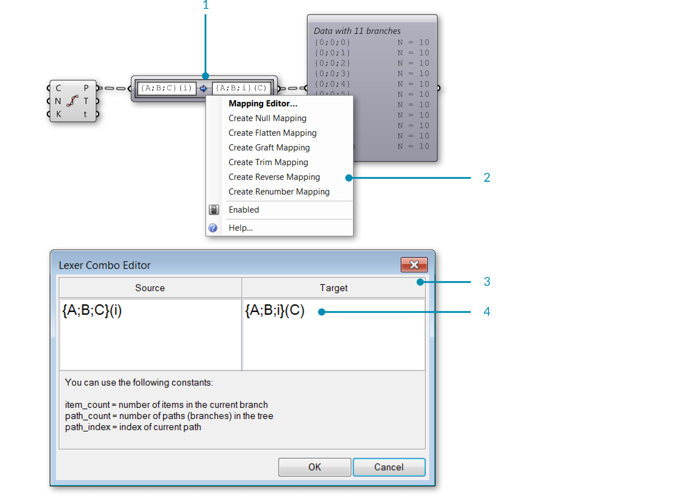
>1. The Path Mapper component
2. Right-click the Path Mapper component and select a predefined mapping option from the menu, or open the mapping editor
3. The Mapping Editor
4. You can modify a data tree by re-mapping the path index and the desired branch

####1.5.3.6. WEAVING DEFINITION
In this example, we will manipulate lists and data trees to weave lists of points, define a pattern, and create surface geometry.

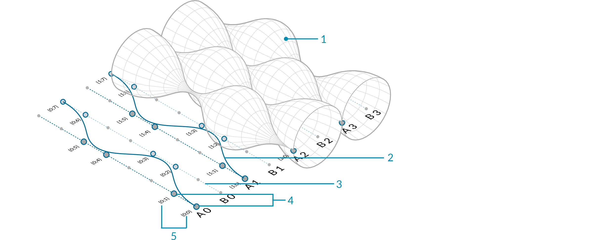
>1. Revolved NURBS surface
2. NURBS curve
3. Curve array
4. Division points
5. Paths (indices) of points

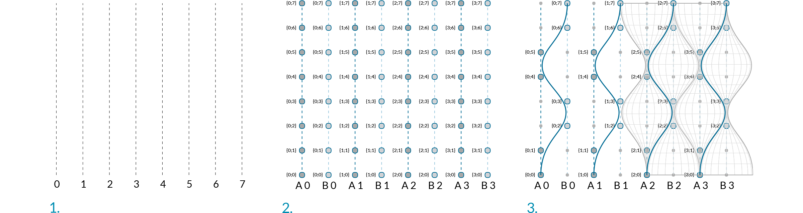
>1. Array curves
2. Dispatch curves into lists A and B, divide curves
3. Cull poits, weave, and revolve

||||
|--|--|--|
|01.| Start a new definition, type Ctrl+N (in Grasshopper)||
|02.| **Curve/Primitive/Line SDL** – Drag and drop the **Line SDL** component onto the canvas||
|03.| **Vector/Point/Construct Point** – Drag and drop the **Construct Point** component onto the canvas||
|04.| Connect the Point (Pt) output of the **Construct Point** component to the Start (S) Input of the **Line SDL** component||
|05.| **Vector/Vector/Unit Y** – Drag and drop the vector **Unit Y** component onto the canvas <blockquote>The factor of Unit Vector components is 1.0 by default.</blockquote>||
|06.| Connect the **Unit Y** component to the Direction (D) input of the **Line SDL** component|||

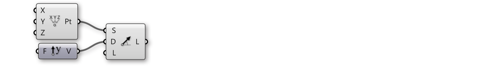

||||
|--|--|--|
|07.| **Params/Input/Number Slider** – Drag and drop the **Number Slider** component onto the canvas||
|08.| Double-click on the **Number Slider** and set the following: <ul>Name: Length Rounding: Integer Lower Limit: 0 Upper Limit: 96 Value: 96</ul>||
|09.| Connect the **Number Slider** to the Length (L) input of the **Line SDL** component||
|10.| **Transform/Array/Linear Array** – Drag and drop the **Linear Array** component onto the canvas||
|11.| Connect the Line (L) output of the **Line SDL** component to the Geometry (G) input of the **Linear Array** component||
|12.| **Vector/Vector/Unit X** – Drag and drop the vector **Unit X** component onto the canvas||
|13.| **Params/Input/Number Slider** – Drag and drop two **Number Slider** components onto the canvas||
|14.| Double-click on the first **Number Slider** and set the following: <ul>Name: Offset Distance Rounding: Integer Lower Limit: 1 Upper Limit: 10 Value: 4</ul>||
|15.| Double-click on the second **Number Slider** and set the following: <ul>Name: # of Offsets Rounding: Even Lower Limit: 2 Upper Limit: 20 Value: 20</ul>||
|16.| Connect the **Number Slider** (Offset Distance) to the Factor (F) input of the **Unit X** component||
|17.| Connect the Vector (V) output of the **Unit X** component to the Direction (D) input of the **Linear Array** component||
|18.| Connect the **Number Slider** (# of Offsets) to the Count (N) input of the **Linear Array** component|||

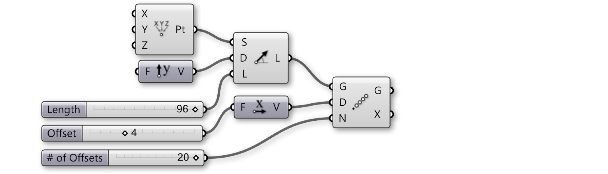

>You should now see an array of lines in the Rhino viewport. The three sliders allow you to change the length of the lines, their distance from each other, and the number of lines in the array.

||||
|--|--|--|
|19.| **Sets/Lists/Dispatch** – Drag and drop the **Dispatch** component onto the canvas|[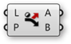](/appendix/index.html#SLDispatch)|
|20.| Connect the Geometry (G) output of the **Linear Array** component to the List (L) input of the **Dispatch** component||
|21.| **Params/Input/Panel** – Drag and drop the **Panel** component onto the canvas ||
|22.| Double-click the **Panel**, deselect Multiline Data, Wrap Items and Special Codes, and enter the following: <ul>true false</ul>||
|23.| Connect the **Panel** to the Pattern (P) input of the **Dispatch** component||
|24.| **Curve/Division/Divide Curve** – Drag and drop two **Divide Curve** components onto the canvas||
|25.| Connect the List A (A) output of the **Dispatch** component to the Curve (C) input of the first **Divide Curve** component||
|26.| Connect the List B (B) output of the **Dispatch** component to the Curve (C) input of the second **Divide Curve** component||
|27.| **Params/Input/Number Slider** – Drag and drop the **Number Slider** component onto the canvas||
|28.| Double-click on the **Number Slider** and set the following:<ul>Name: Divisions Rounding: Integer Lower Limit: 0 Upper Limit: 20 Value: 20</ul>||
|29.| Connect the **Number Slider** (Divisions) to the Count (N) input of both **Divide Curve** components.|||

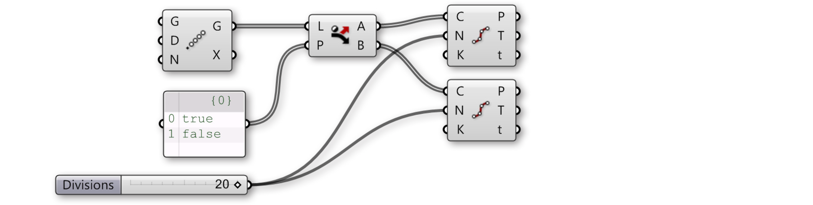

>1. The Dispatch component sends every second curve in the array to a separate list.
2. The Divide Curve component divides the curves into the number of segments specified by the slider. Adjust the slider to change the number of points.

||||
|--|--|--|
|30.| **Sets/Sequence/Cull Pattern** – Drag and drop two **Cull Pattern** components onto the canvas||
|31.| Connect the Points (P) output of the first **Divide Curve** component to the List (L) input of the first **Cull Pattern** component||
|32.| Connect the Points (P) output of the second **Divide Curve** component to the List (L) input of the second **Cull Pattern** component||
|33.| **Params/Input/Panel** – Drag and drop a second **Panel** component onto the canvas||
|34.| Double-click the second **Panel** and deselect: Multiline Data, Wrap Items, and Special Codes. Then enter the following:<ul>1 1 0 0</ul> <blockquote>We are using 1 and 0 in place of true and false. These are the two syntaxes that Grasshopper accepts for boolean values.</blockquote>||
|35.| Connect the second **Panel** to the Pattern (P) input of the first **Cull Pattern** component||
|36.| Connect the second **Pane**l to the Pattern (P) input of the second **ull Pattern** component||
|37.| Right-click on the Pattern (P) input of the second **Cull Pattern** component and select Invert  <blockquote>This will invert the **Cull Pattern**, a useful trick to keep definitions short.</blockquote>||
|38.| **Sets/List/Weave** – Drag and drop the **Weave** component onto the canvas||
|39.| Connect the second **Panel** to the Pattern (P) input of the **Weave** component||
|40.| Right-click the Pattern (P) input of the **Weave** component and select reverse||
|41.| Connect the List (L) output of the first **Cull Pattern** component to the Stream 0 (0) input of the **Weave** component||
|42.| Connect the List (L) output of the second **Cull Pattern** component to the Stream 0 (0) input of the **Weave** component||
|43.| **Curve/Spline/Nurbs Curve** – Drag and drop the **Nurbs Curve** component onto the canvas||
|44.| Connect the Weave (W) output of the **Weave** component to the Vertices (V) input of the **Nurbs Curve** component.|||

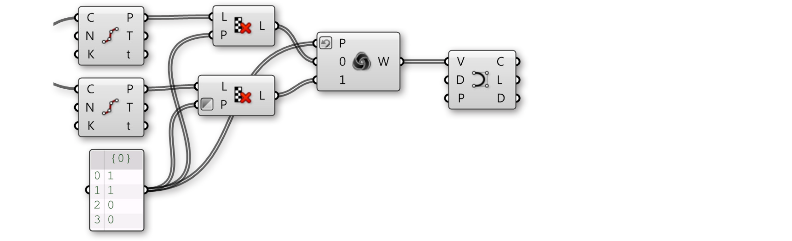

>1. The cull patterns remove alternating points from each list.
2. The Weave component collects data from the point lists according to a custom pattern. This data is fed into the interpolate component to create curves.

||||
|--|--|--|
|45.| **Surface/Freeform/Revolution** – Drag and drop two **Revolution** components onto the canvas||
|46.| Connect the Curve output of the **Nurbs Curve** component to the Profile Curve (P) input of both **Revolution** components.||
|47.| Right Click on Axis (A) input of both **Revolution** components and select Graft.||
|48.| Connect the List A (A) output of the **Dispatch** component to the Axis (A) input of the first **Revolution** component||
|49.| Connect the List B (B) output of the **Dispatch** component to the Axis (A) input of the second **Revolution** component  <blockquote>Select all the components except the two Revolution components and turn the preview off - it is helpful to turn previews off as you build the definition to focus on the most recent geometry</blockquote>|||

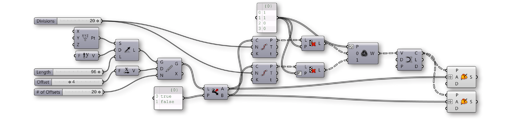

