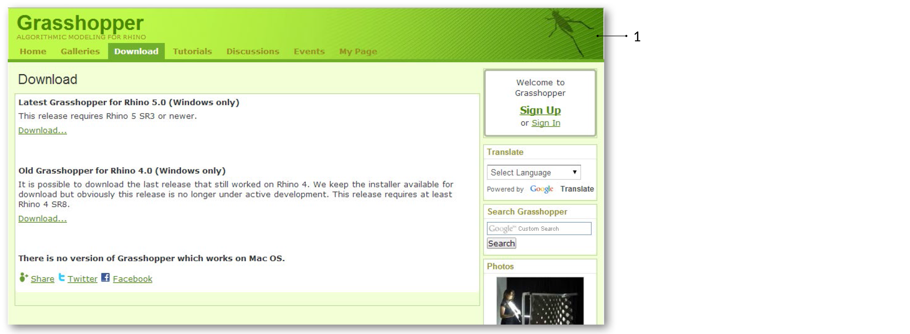
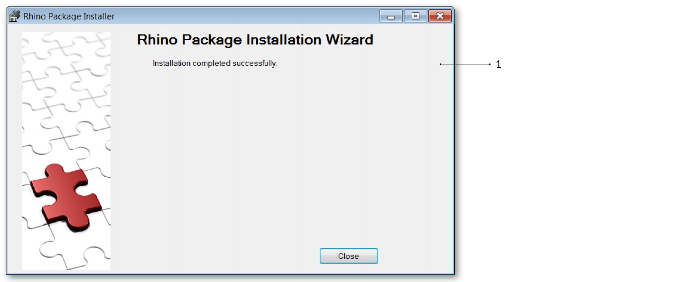
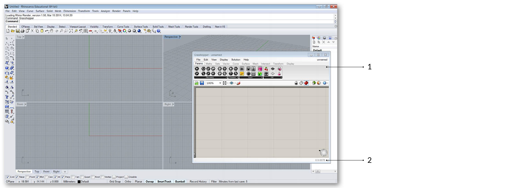
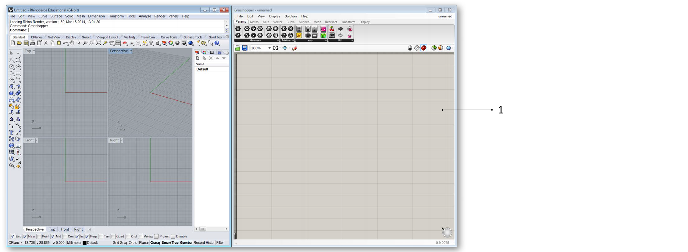

## F.0.0 INSTALLING AND LAUNCHING GRASSHOPPER

#####The Grasshopper plugin is updated frequently so be sure to update to the latest build.
#####Note that there is currently no version of Grasshopper for Mac.

This is a test by CM

###F.0.0.0 DOWNLOADING
To download the Grasshopper plug-in, visit the Grasshopper web site. Click on the Download tab at the top of the page, and when prompted on the next screen, enter your email address. Now, right click on the download link, and choose Save Target As from the menu. Select a location on your hard drive (note: the file cannot be loaded over a network connection, so the file must be saved locally to your computer’s hard drive) and save the executable file to that address.

>1. Download Grasshopper from the [grasshopper3d.com](http://grasshopper3d.com) website.

###F.0.0.1 INSTALLING
Select Run from the download dialog box follow the installer instructions. (note: you must have Rhino 5 already installed on your computer for the plug-in to install properly).

>1. Follow the steps in the Installation wizard.

###F.0.0.2 LAUNCHING
To Launch Grasshopper, type Grasshopper into the Rhino Command line. When you launch Grasshopper, the first thing you will see is a new window floating in front of Rhino. Within this window you can create node-based programs to automate various types of functionality in Rhino. Best practice is to arrange the windows so that they do not overlap and Grasshopper does not obstruct the Rhino viewports.

>1. Type “Grasshopper” into the Rhino command line to launch the Grasshopper plugin.

>1. The Grasshopper window floats on top of the Rhino viewports.
>2. Grasshopper displays the version number at the bottom of the window.

>1. Split the screen so that Grasshopper does not obstruct the Rhino Viewports.
You can do this by dragging each window to opposite sides of the screen, or by
holding the Wondows key and pressing the left or right arrows.

