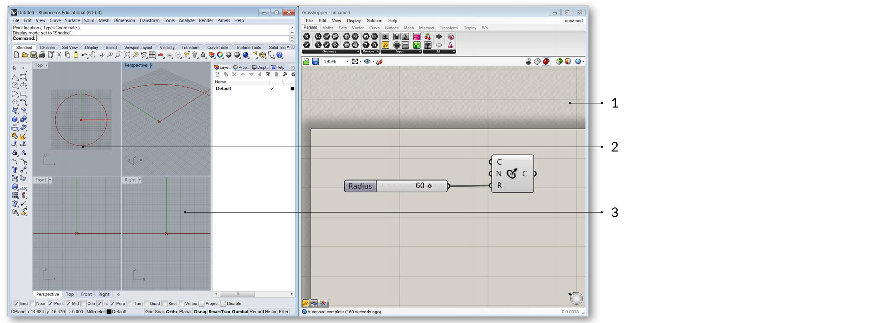
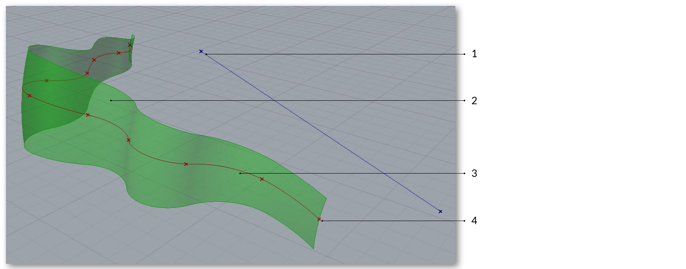
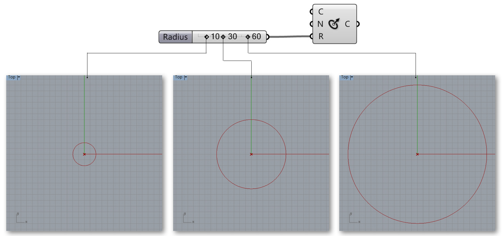
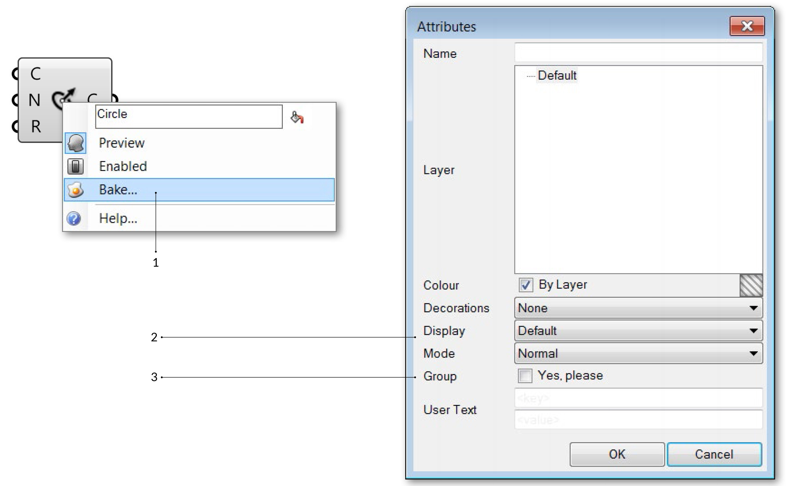
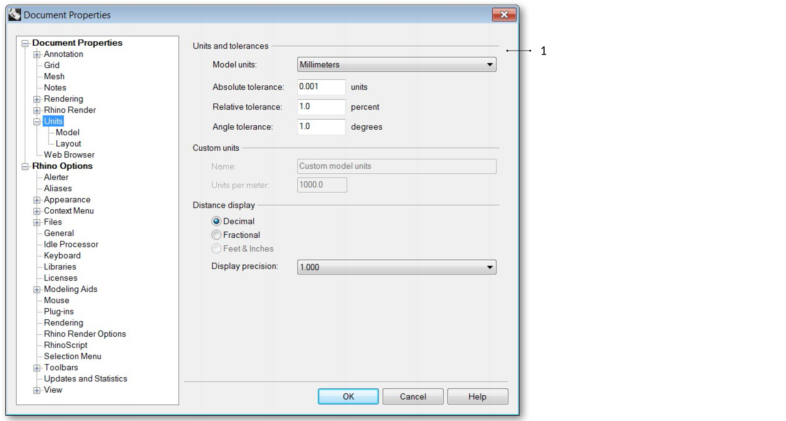
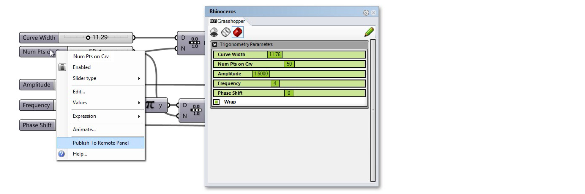
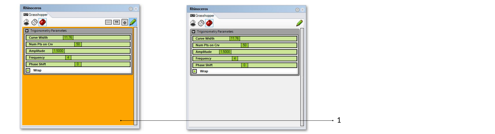
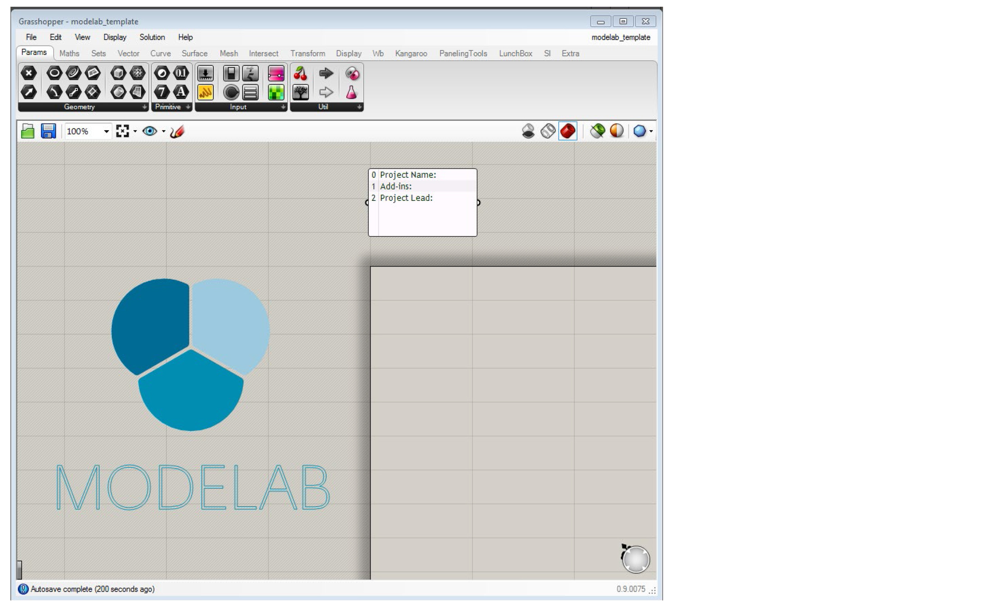
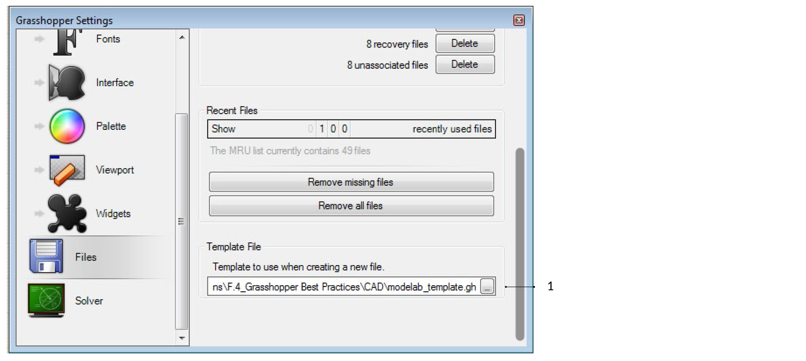

## F.0.2 TALKING TO RHINO

#####Unlike a Rhino document, a Grasshopper definition does not contain any actual objectsor geometry. Instead, a Grasshopper definition represents a set of rules & instructions for how Rhino can automate tasks.

>1. Grasshopper Application window.
2. Grasshopper preview geometry.
3. Rhino viewports.

###F.0.2.0 VIEWPORT FEEDBACK
All geometry that is generated using the various Grasshopper components will
show up (by default) in the Rhino viewport. This preview is just an Open GL
approximation of the actual geometry, and as such you will not be able to select
the geometry in the Rhino viewport (you must first bake it into the scene). You
can turn the geometry preview on/off by right-clicking on a component and
selecting the Preview toggle. The geometry in the viewport is color coded to
provide visual feedback. The image below outlines the default color scheme.

>_Note: This is the default color scheme, which can be modified using the Document Preview Settings tool on the canvas toolbar._

>1. Blue feedback means you are currently making a selection in the Rhino Viewport.
2. Green geometry in the viewport belongs to a component which is currently selected.
3. Red geometry in the viewport belongs to a component which is currently unselected.
4. Point geometry is drawn as a cross rather than a rectangle to distinguish it from other Rhino point objects.

###F.0.2.1 LIVE WIRES
Grasshopper is a dynamic environment. Changes that are made are live and their
preview display is updated in the Rhino viewport.

###F.0.2.2 GUMBALL WIDGET
When storing geometry as internalized in a Grasshopper parameter, the gumball
allows you to interface with that geometry in the Rhino viewport. This update is
live and updates will occur as you manipulate the gumball. In contrast, geometry
referenced from Rhino directly will continue to exist in the Rhino document and
updates from Grasshopper will happen only after any changes occur (as opposed
to during).

###F.0.2.3 BAKING GEOMETRY
In order to work with (select, edit, transform, etc.) geometry in Rhino that was
created in Grasshopper, you must “bake” it. Baking instantiates new geometry
into the Rhino document based on the current state of the Grasshopper graph. It
will no longer be responsive to the changes in your definition.

>1. Bake by right-clicking a component and selecting Bake.
2. A dialog will appear that allows you to select onto which Rhino layer the geometry will 
bake.
3. Grouping your baked geometry is a convenient way to manage the instantiated Rhino geometry, particularly if you are creating many objects with Grasshopper.

###F.0.2.4 UNITS & TOLERANCES
Grasshopper inherits units and tolerances from Rhino. To change the units,
type Document Properties in the Rhino command line to access the Document
Properties menu. Select Units to change the units and tolerances.

>1. Change the units and tolerances in the Rhino Document Properties menu.

###F.0.2.5 REMOTE CONTROL PANEL
Once you get the hang of it, Grasshopper is an incredibly powerful and flexible 
tool which allows you to explore design iterations using a graphic interface. 
However, if you’re working with a single screen then you may have already 
noticed that the Grasshopper editor takes up a lot of screen real-estate. Other 
than constantly zooming in and out and moving windows around your screen, 
there really isn’t an elegant solution to this problem. That is…until the release of the Remote Control Panel!

The Remote Control Panel (RCP) provides a minimal interface to control your 
definition without taking up a substantial portion of your screen. The RCP can 
be instantiated by clicking on the toggle under the View menu of the Main Menu 
bar. By default, the RCP is blank — meaning it doesn’t contain any information 
about your current Grasshopper document. To populate the RCP with UI 
elements like sliders, toggles, and buttons, simply right click on the element 
and click Publish To Remote Panel. This will create a new group and create a 
synchronized UI element in the RCP. Changing the value of the element in the 
RCP will also update the value in the graph, as well as modify any geometry 
in the viewport which might be dependant on this parameter. You can publish 
multiple elements and populate a complete interface which can be used to 
control your file without having the clutter of the visual graph showing up on top 
of the Rhino viewport.

>_Note: The RCP will inherit the UI elements name and use it as the label. It is good practice to update your sliders and toggles with comprehensible and meaningful names. This will translate directly to your RCP making it easier to use._

> _In order to get a UI element (eg. slider, toggle, button, etc.) to show up in the Remote Control Panel, we have to first publish it._

The RCP UI can also be customized – allowing you to control where objects 
appear in the interface, the names and colors of different groups. To modify the 
layout of the RCP you first have to switch from Working Mode (the default RCP 
view) to Edit Mode. You can enter the Editing Mode by clicking on the green 
pencil in the upper right hand corner of the RCP. Once in Editing Mode, you can 
create new UI groups, rearrange elements within groups, add labels, change 
colors and more. To delete a UI element, simply drag the element outside the 
border of the RCP. You cannot change the individual values of the parameters if 
you are in Editing Mode. Instead, you will have to click on the green pencil icon 
to switch back to the standard Working Mode.

>_The Remote Control Panel has two modes: Edit Mode (left) which allows you to reorganize the look and feel of the RCP, and Working Mode where you can modify the actual values of the UI elements._

>1. The Remote Control Panel in Edit Mode has an orange background.

###F.0.2.6 FILE MANAGEMENT 
If your Grasshopper file references geometry from Rhino, you must open that
same file for the definition to work. Keep your files organized by storing the
Grasshopper and Rhino files in the same folder, and giving them related names.

>1. Project Folder.
2. Rhino file.
3. Grasshopper file.

###F.0.2.7 TEMPLATES
Creating and specifiying a template file in your Grasshopper preferences is
convenient way to set up every new Grasshopper definition you create. The
template can include Grasshopper components as well as panels and sketch
objects for labeling.

>_Create a template file and save it_

>1. In File/Preferences, load the file you just created under Template File. Your template will now be used each time you create a new file.

