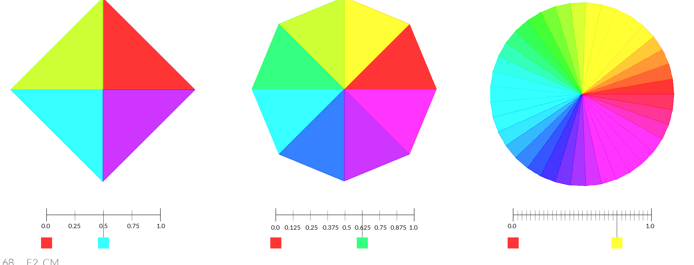
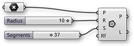
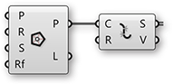
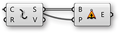
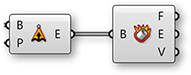
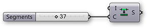
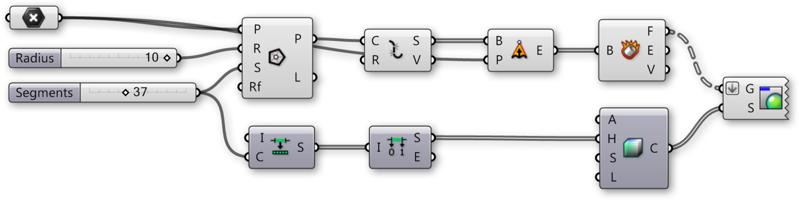

# F.2.3 Domains & Color

#####The color wheel is a model for organizing colors based on their hue. In Grasshopper, colors can be defined by their hue value in a range of 0.0 to 1.0. Domains are used to define a range of all possible values between a set of numbers between a lower limit(A) and an upper limit (B).

>In the color wheel, hue corresponds to the angle. Grasshopper has taken this 0-360 domainand remapped it between zero and one.

By dividing the Hue domain (0.0 to 1.0) by the number of segments desired, we
can assign a hue value to each segment to create a color wheel.

In this example, we will use Grasshopper’s domain and color components to
create a color wheel with a variable amount of segments.

<ol style="background-color:#EEEEEE">
<li>Type Ctrl+N (in Grasshopper) to start a new definition</li> 
<li>Curve/Primitive/Polygon – Drag and drop a polygon component onto the
canvas
 

</li> 
<li>Params/Geometry/Point – Drag and drop a Point Parameter onto the
canvas
 

</li> 
<li>Right-Click on the Point Component and select set one point</li> 
<li>Set a point in the model space.</li> 
<li>Connect the Point Parameter (Base Point) to the Plane (P) input of the
polygon component
  

</li> 
<li>Params/Input/Number Sliders – Drag and drop two number sliders onto
the canvas</li> 
<li>Double-click on the first slider and set the following:
<ul> Rounding: Integers 
Lower Limit: 0 
Upper Limit: 10 
Value: 10</ul></li> 
<li>Double-click on the second slider and set the following:
<ul> Rounding: Integers 
Lower Limit: 0 
Upper Limit: 100 
Value: 37</ul></li> 
<li>Connect the Number Slider (Radius) to the Radius (R) input of the
Polygon component
  

<ul>*Note: When you connect a number slider to a component in will automatically change its name to the name of input that it is connecting to.*</ul>
</li> 
<li>Connect the Number Slider (Segments) to the Segments (S) input of the
Polygon component</li> 
<li>Curve/Util/Explode – Drag and drop an Explode component onto the
canvas.</li> 
<li>Connect the Polygon (P) output of the Polygon component to the Curve
(C) input of the Explode component
 

</li> 
<li>Surface/Freeform/Extrude Point – Drag and drop the Extrude Point
component onto the canvas</li> 
<li>Connect the Segments (S) output of the Explode component to the Base
(B) input of the Extrude Point
 

<li>Connect the Point Parameter (Base Point) to the Extrusion Tip (P)</li> 
<li>Surface/Analysis/Deconstruct Brep – Drag and drop the Deconstruct
Brep component on to the canvas</li> 
<li>Connect the Extrusion (E) output of the Extrude Point component to the
Deconstruct Brep (B) component
 

</li> 
<li>Maths/Domain/Divide Domain – Drag and drop the Divide Domain
component</li> 
<li>Connect the Number Slider (Segments) to the Count (C) input of the
Divide Domain component
 

</li> 
<li>Math/Domain/Deconstruct Domain – Drag and drop the Deconstruct
Domain component</li> 
<li>Connect the Segments (S) output of the Divide Domain component to the Domain (I) input of the Deconstruct Domain component</li> 
<li>Display/Colour/Colour HSL – Drag and drop the Colour HSL component</li> 
<li>Connect the Start (S) output of the Deconstruct Domain component to the Hue (H) input of the Colour HSL components
  

<ul>*Note:The Base Domain (I) is automatically set between 0.0-1.0 which is what we need for this exercise.*</ul>
</li> 
<li>Display/Preview/Custom Preview – Drag and drop the Custom Preview component</li> 
<li>Right click on the Geometry (G) input of the Custom Preview component and select Flatten
 

</li> 
<li>Connect the Faces (F) output of the Deconstruct Brep component to the Geometry (G) input of the Custom Preview</li> 
<li>Connect the Colour (C) output of the Colour HSL component to the Shade (S) input of the Custom Preview Components
  

</li>
</ol>

For different color effects, try connecting the Deconstruct Domain component to the saturation (S) or Luminance (L) inputs of the Colour HSL component.

