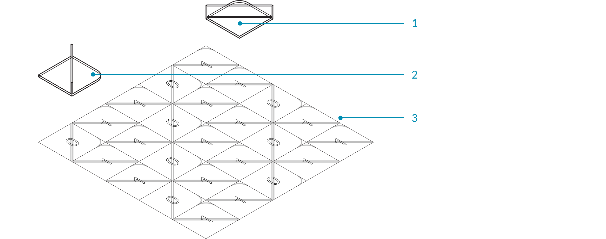
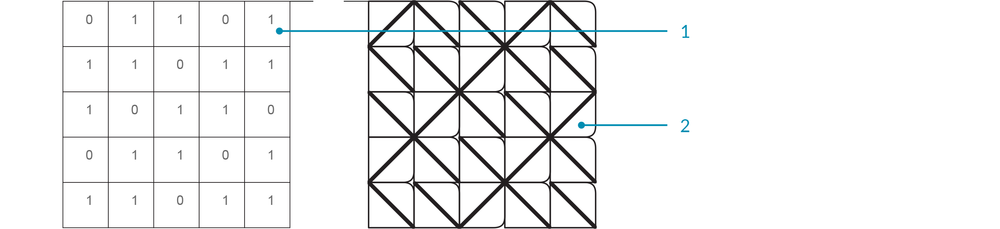
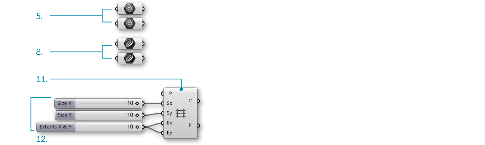
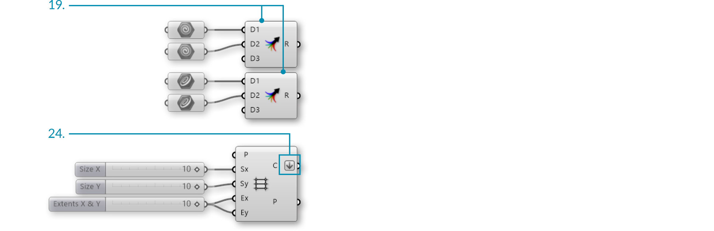
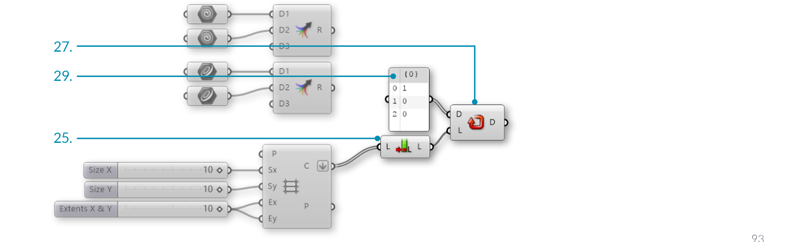
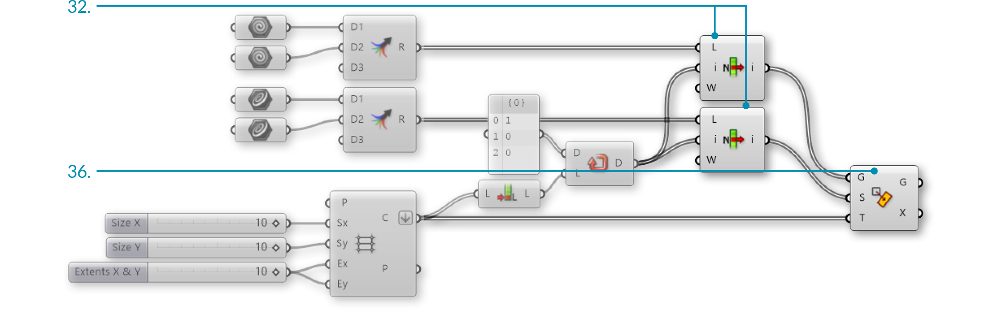

### 1.4.7. WORKING WITH LISTS

Lets take a look at an example using the components from the previous section. In this example, we are creating a tile pattern by mapping geometry to a rectangular grid. The pattern is created by using the List Item component to retrieve the desired tile from a list of geometry.

>1. Geometry corresponding to index 1
2. Geometry corresponding to index 0
3. Rectangular grid

>1. Mapping pattern
2. Mapped geometry

<ol style="background-color:#EEEEEE">
<li> Start a Rhinoceros File. </li>
<li> Create two equally sized squares. </li>
<li> Create different geometries in each square. 
*In the example shown above, we created a simple surface with a tab. The tab is filleted to demonstrate the orientation and the base is filleted to distinguish the two geometries.*</li>
<li> Start a new definition, type Ctrl+N (in Grasshopper). </li>
<li> **Params/Geometry/Geometry** – Drag and drop two **Geometry** parameters onto the canvas. </li>
<li> Right-Click the first **Geometry** Parameter and select set one Geometry. Set the first Geometry that you are referencing. </li>
<li> Right-Click the second **Geometry** Parameter and select set one Geometry. Set the second Geometry that you are referencing. </li>
<li> **Params/Geometry/Curve** – Drag and drop two **Curve** parameters onto the canvas. </li>
<li> Right-Click the first **Curve** Parameter and select set one Curve. Set the first square that you are referencing. </li>
<li> Right-Click the second **Curve** Parameter and select set one Curve. Set the second square that you are referencing.  
*Be sure that the geometry and the square that you are referencing correspond.*</li>
<li> Vector/Grid/Rectangular – Drag and drop a **Rectangular Grid** component onto the canvas. </li>
<li> Params/Input/Slider - Drag and drop three **Number Sliders** on the canvas. </li>
<li> Double-click on the first **Number Slider** and set the following:
<ul>Rounding: Integers 
Lower Limit: 0 
Upper Limit: 10 
Value: 10 </ul></li>
<li> Double-click on the second **Number Slider** and set the following:
<ul>Rounding: Integers 
Lower Limit: 0 
Upper Limit: 10 
Value: 10 </ul></li>
<li> Double-click on the third **Number Slider** and set the following:
<ul>Name: Extents X & Y 
Rounding: Integers 
Lower Limit: 0 
Upper Limit: 10 
Value: 10 </ul></li>
<li> Connect the first **Number Slider** to the Size X (Sx) input of the **Rectangular Grid** component. </li>
<li> Connect the second **Number Slider** to the Size Y (Sy) input of the **Rectangular Grid** component. </li>
<li> Connect the third **Number Slider** to the Extent X (Ex) input and the Extent Y (Ey) input of the **Rectangular Grid** component.  
 </li>
 
<li> **Sets/Tree/Merge** – Drag and drop two *Merge* components onto the canvas. </li>
<li> Connect the first **Geometry** parameter to Data Stream 1 (D1) input of the first **Merge** component. </li>
<li> Connect the second **Geometry** parameter to Data Stream 2 (D2) input of the first **Merge** component. </li>
<li> Connect the first **Curve** parameter to Data Stream 1 (D1) input of the second **Merge** component. </li>
<li> Connect the second **Curve** parameter to Data Stream 1 (D2) input of the second **Merge** component. </li>
<li> Right-click the Cells (C) output of the **Rectangular Grid** component and select Flatten.  
 </li>
 
<li> **Sets/List/List Length** – Drag and drop a **List Length** component onto the canvas. </li>
<li> Connect the Cells (C) output of the **Rectangular Grid** component to the List (L) input of the **List Length** component. </li>
<li> **Sets/Sequence/Repeat Data** – Drag and drop a **Repeat Data** component onto the canvas. </li>
<li> Connect the Length (L) output of the **List Length** component to the Length (L) input of the **Repeat Data** component. </li>
<li> **Params/Input/Panel** – Drag and drop a **Panel** onto the canvas. </li>
<li> Double-click the **Panel**. Deselect multiline data, wrap items, and special codes. Enter the following:
<ul>1 
0 
0</ul></li>
<i>This is the pattern in which the geometries are being distributed. 0 is calling out the first referenced Geometry and 1 is calling out the second referenced Geometry. Changing the number sequence will change the pattern, as will changing the extents of the grid.</i></ul>
<li> Connect the **Panel** to the Data (D) input of the **Repeat Data** component.  
</li>
 
<li> **Sets/List/List Item** – Drag and drop two **List Item** components. </li>
<li> Connect the Result (R) output of the first **Merge** component to the List (L) input of the first **List Item** component. </li>
<li> Connect the Result (R) output of the second **Merge** component to the List (L) input of the second **List Item** component. </li>
<li> Connect the Data (D) output of the **Repeat Data** component to the Index (i) input of the first and second **List Item** components. </li>
<li> **Transform/Affine/Rectangle Mapping** – Drag and Drop the **Rectangle Mapping** component onto the canvas. </li>
<li> Connect the Cells (C) output of the **Rectangular Grid** component to the Target (T) input of the **Rectangular Mapping** component. </li>
<li> Connect the items (I) output of the first **List Item** component to the Geometry (G) input of the **Rectangular Mapping** component. </li>
<li> Connect the items (I) output of the second **List Item** component to the Source (S) input of the **Rectangular Mapping** component.  
 
 </li>
</ol>

Changing the input geometry and the pattern will change the final tile pattern.

