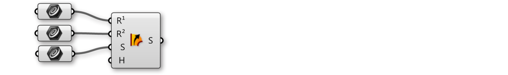
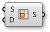
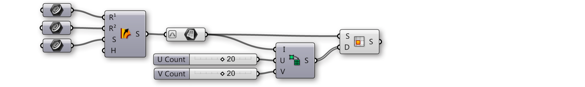
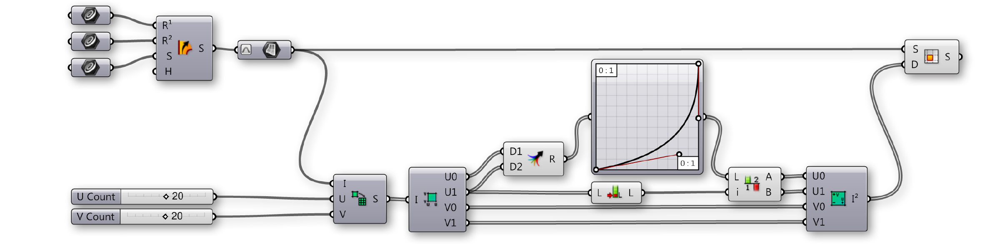
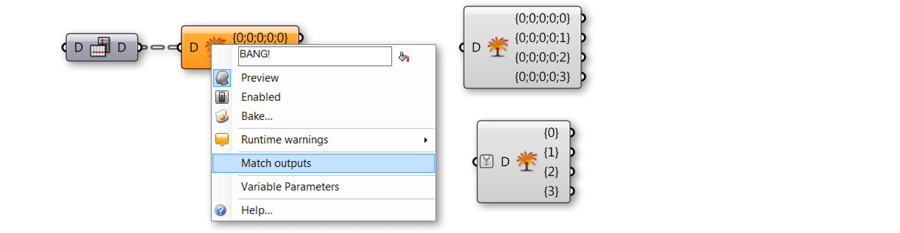
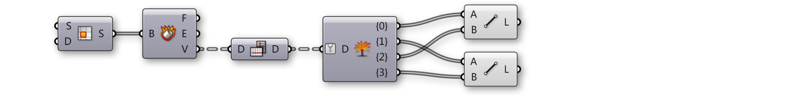
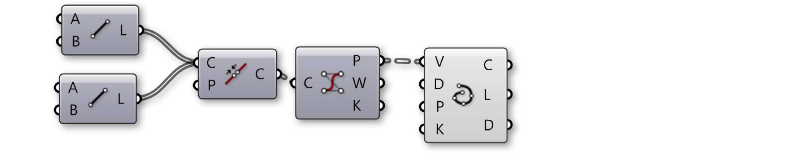
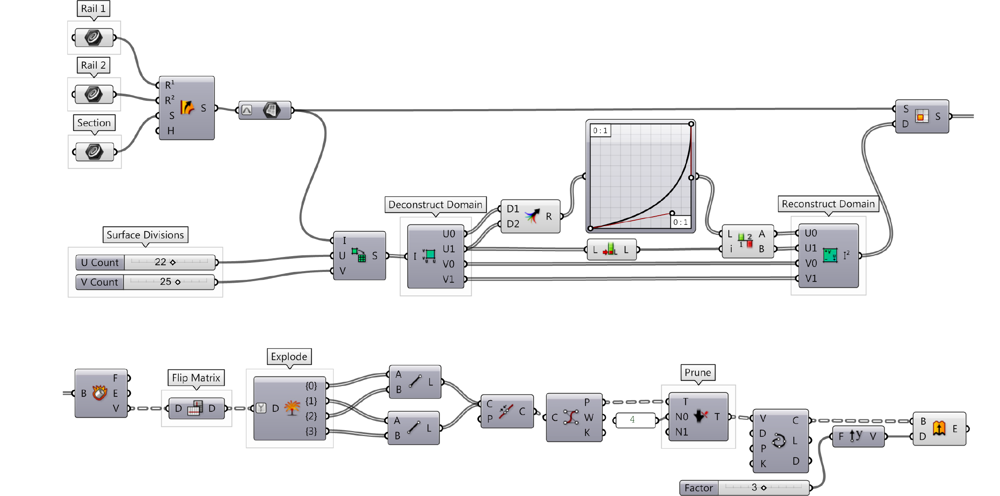

### 1.5.3. Working with Data Trees

#####Grasshopper contains tools for changing the structure of a data tree. Theese tools can help you access specific data within a tree, and change the way it is stored, ordered, and identified.

Let’s look at some data tree manipulations and visualize how they affect the tree.

####1.5.3.1. FLATTEN
Flattening removes all levels of a Data Tree, resulting in a single List. Using the Flatten component (Sets/Tree/Flatten) on the P output of our Divide Curve component, we can use the Param Viewer to visualize the new data structure.

>In the Param Viewer, we can see that we now only have 1 branch containing a list of 48 points.

####1.5.3.2. GRAFT TREE
Grafting creates a new Branch for every Data Item. If we run the data through the Graft Tree component (Sets/Tree/Graft Tree), each division point now has its own individual branch, rather than sharing a branch with the other division points on the same curve.

>In the Param Viewer, we can see that what was data with 8 branches of 6 items each, we now have 8 branches with 6 sub-branches containing 1 item each.

####1.5.3.3. SIMPLIFY TREE
Simplify removes overlapping Branches in a Data Tree. If we run the data through the Simplify Tree component (Sets/Tree/Simplify Tree), the first branch, containing no data, has been removed.

>In the Param Viewer, we still have 8 branches of 6 items each, but the first branch has been removed.

####1.5.3.4. FLIP MATRIX
The Flip Matrix component (Sets/Tree/Flip Matrix) Swaps the “Rows” and “Columns” of a Data Tree with two Path Indices.

>In the Param Viewer, we can see that what was data with 8 branches of 6 items each, we now have 6 branches with 8 items each.

The Flatten, Graft, and Simplify operations can be applied to the component input or output itself, rather than feeding the data through a separate component. Just right-click the desired input or output and select Flatten, Graft, or Simplify from the menu. The component will display an icon to indicate that the tree is being modified. Keep in mind Grasshopper’s program flow. If you flatten a component input, the data will be flattened before the component
operation is performed. If you flatten a component output, the data will be flattened after the component performs its action.

>1. Flattened output P
2. Grafted output P
3. Simplified output P

####1.5.3.5. THE PATH MAPPER
The Path Mapper component (Sets/Tree/Path Mapper) allows you to perform lexical operations on data trees. Lexical operations are logical mappings between data paths and indices which are defined by textual (lexical) masks and patterns.

>1. The Path Mapper component
2. Right-click the Path Mapper component and select a predefined mapping option from the menu, or open the mapping editor
3. The Mapping Editor
4. You can modify a data tree by re-mapping the path index and the desired branch

####1.5.3.6. WEAVING DEFINITION
In this example, we will manipulate lists and data trees to weave lists of points, define a pattern, and create surface geometry.

>1. Revolved NURBS surface
2. NURBS curve
3. Curve array
4. Division points
5. Paths (indices) of points

>1. Array curves
2. Dispatch curves into lists A and B, divide curves
3. Cull poits, weave, and revolve

----
####TESTING LINK!####
Click [here](/appendix/index.html#index) to test the link to the appendix.
**ALSO** - try clicking the first icon in step 2 below.

---

||||
|--|--|--|
|01.| Start a new definition, type Ctrl+N (in Grasshopper)||
|02.| **Curve/Primitive/Line SDL** – Drag and drop the **Line SDL** component onto the canvas||
|03.| **Vector/Point/Construct Point** – Drag and drop the **Construct Point** component onto the canvas||
|04.| Connect the Point (Pt) output of the **Construct Point** component to the Start (S) Input of the **Line SDL** component||
|05.| **Vector/Vector/Unit Y** – Drag and drop the vector **Unit Y** component onto the canvas| The factor of Unit Vector components is 1.0 by default.|
|06.| Connect the **Unit Y** component to the Direction (D) input of the **Line SDL** component|||

||||
|--|--|--|
|07.| **Params/Input/Number Slider** – Drag and drop the **Number Slider** component onto the canvas||
|08.| Double-click on the **Number Slider** and set the following: <ul>Name: Length Rounding: Integer Lower Limit: 0 Upper Limit: 96 Value: 96</ul>||
|09.| Connect the **Number Slider** to the Length (L) input of the **Line SDL** component||
|10.| **Transform/Array/Linear Array** – Drag and drop the **Linear Array** component onto the canvas||
|11.| Connect the Line (L) output of the **Line SDL** component to the Geometry (G) input of the **Linear Array** component||
|12.| **Vector/Vector/Unit X** – Drag and drop the vector **Unit X** component onto the canvas||
|13.| **Params/Input/Number Slider** – Drag and drop two **Number Slider** components onto the canvas||
|14.| Double-click on the first **Number Slider** and set the following: <ul>Name: Offset Distance Rounding: Integer Lower Limit: 1 Upper Limit: 10 Value: 4</ul>||
|15.| Double-click on the second **Number Slider** and set the following: <ul>Name: # of Offsets Rounding: Even Lower Limit: 2 Upper Limit: 20 Value: 20</ul>||
|16.| Connect the **Number Slider** (Offset Distance) to the Factor (F) input of the **Unit X** component||
|17.| Connect the Vector (V) output of the **Unit X** component to the Direction (D) input of the **Linear Array** component||
|18.| Connect the **Number Slider** (# of Offsets) to the Count (N) input of the **Linear Array** component|||

>You should now see an array of lines in the Rhino viewport. The three sliders allow you to change the length of the lines, their distance from each other, and the number of lines in the array.

||||
|--|--|--|
|19.| **Sets/Lists/Dispatch** – Drag and drop the **Dispatch** component onto the canvas||
|20.| Connect the Geometry (G) output of the **Linear Array** component to the List (L) input of the **Dispatch** component||
|21.| **Params/Input/Panel** – Drag and drop the **Panel** component onto the canvas ||
|22.| Double-click the **Panel**, deselect Multiline Data, Wrap Items and Special Codes, and enter the following: <ul>true false</ul>||
|23.| Connect the **Panel** to the Pattern (P) input of the **Dispatch** component||
|24.| **Curve/Division/Divide Curve** – Drag and drop two **Divide Curve** components onto the canvas||
|25.| Connect the List A (A) output of the **Dispatch** component to the Curve (C) input of the first **Divide Curve** component||
|26.| Connect the List B (B) output of the **Dispatch** component to the Curve (C) input of the second **Divide Curve** component||
|27.| **Params/Input/Number Slider** – Drag and drop the **Number Slider** component onto the canvas||
|28.| Double-click on the **Number Slider** and set the following:<ul>Name: Divisions Rounding: Integer Lower Limit: 0 Upper Limit: 20 Value: 20</ul>||
|29.| Connect the **Number Slider** (Divisions) to the Count (N) input of both **Divide Curve** components.|||

>1. The Dispatch component sends every second curve in the array to a separate list.
2. The Divide Curve component divides the curves into the number of segments specified by the slider. Adjust the slider to change the number of points.

||||
|--|--|--|
|30.| **Sets/Sequence/Cull Pattern** – Drag and drop two **Cull Pattern** components onto the canvas||
|31.| Connect the Points (P) output of the first **Divide Curve** component to the List (L) input of the first **Cull Pattern** component||
|32.| Connect the Points (P) output of the second **Divide Curve** component to the List (L) input of the second **Cull Pattern** component||
|33.| **Params/Input/Panel** – Drag and drop a second **Panel** component onto the canvas||
|34.| Double-click the second **Panel** and deselect: Multiline Data, Wrap Items, and Special Codes. Then enter the following:<ul>1 1 0 0</ul> | We are using 1 and 0 in place of true and false. These are the two syntaxes that Grasshopper accepts for boolean values.|
|35.| Connect the second **Panel** to the Pattern (P) input of the first **Cull Pattern** component||
|36.| Connect the second **Pane**l to the Pattern (P) input of the second **ull Pattern** component||
|37.| Right-click on the Pattern (P) input of the second **Cull Pattern** component and select Invert  |This will invert the **Cull Pattern**, a useful trick to keep definitions short.|
|38.| **Sets/List/Weave** – Drag and drop the **Weave** component onto the canvas||
|39.| Connect the second **Panel** to the Pattern (P) input of the **Weave** component||
|40.| Right-click the Pattern (P) input of the **Weave** component and select reverse||
|41.| Connect the List (L) output of the first **Cull Pattern** component to the Stream 0 (0) input of the **Weave** component||
|42.| Connect the List (L) output of the second **Cull Pattern** component to the Stream 0 (0) input of the **Weave** component||
|43.| **Curve/Spline/Nurbs Curve** – Drag and drop the **Nurbs Curve** component onto the canvas||
|44.| Connect the Weave (W) output of the **Weave** component to the Vertices (V) input of the **Nurbs Curve** component.|||

>1. The cull patterns remove alternating points from each list.
2. The Weave component collects data from the point lists according to a custom pattern. This data is fed into the interpolate component to create curves.

||||
|--|--|--|
|45.| **Surface/Freeform/Revolution** – Drag and drop two **Revolution** components onto the canvas||
|46.| Connect the Curve output of the **Nurbs Curve** component to the Profile Curve (P) input of both **Revolution** components.||
|47.| Right Click on Axis (A) input of both **Revolution** components and select Graft.||
|48.| Connect the List A (A) output of the **Dispatch** component to the Axis (A) input of the first **Revolution** component||
|49.| Connect the List B (B) output of the **Dispatch** component to the Axis (A) input of the second **Revolution** component|Select all the components except the two Revolution components and turn the preview off - it is helpful to turn previews off as you build the definition to focus on the most recent geometry|

####1.5.3.7. RAIL INTERSECTION DEFINITION
In this example, we will use some of Grasshopper’s tools for manipulating data trees to retreive, reorganize, and interpolate the desired points contained in a data tree and create a lattice of intersecting fins.

>1. Sweep with two rails to create a NURBS surface.
2. Divide the surface into variable sized segments, extract vertices. Data comprised of one list with four items in each segment.
3. Flip the matrix to change the data structure. Data comprised of four lists, each containing a single corner point of each segment.
4. Explode the tree to connect corner points and draw diagonal lines across each segement.
5. Prune the tree to cull branches containing insufficient points to construct a degree 3 NURBS curve and interpolate points.
6. Extrude the curves to create intersecting fins.

||||
|--|--|--|
|01.| Start a new definition, type Ctrl+N (in Grasshopper) ||
|02.| Params/Geometry/Curve – Drag and drop three curve parameters onto the canvas ||
|03.| Surface/Freeform/Sweep2 – Drag a Sweep2 component onto the canvas||
|04.| Right-click the first curve parameter and select “Set one curve.” Select the first rail curve in the Rhino viewport||
|05.| Right-click the second curve parameter and select “Set one curve.” Select the second rail curve in the Rhino viewport||
|06.| Right-click the third curve parameter and select “Set one curve.” Select the section curve in the Rhino viewport||
|07.| Connect the outputs of the curve parameters to the Rail 1 (R1), Rail 2 (R2), and Sections (S) inputs respectively|||

>We have just created a NURBS surface

||||
|--|--|--|
|08.| Params/Geometry/Surface – drag a surface parameter to the canvas||
|09.| Connect the Brep (S) output of the Sweep2 component to the input of the surface parameter||
|10.| Right-click the surface parameter and select “Reparameterize”.   *In this step, we re-mapped the u and v domains of the surface between 0 and 1. This will make future operations possible.*||
|11.| Maths/Domain/Divide Domain2 – drag and drop a Divide Domain2 component onto the canvas||
|12.| Params/Input/Number Slider – drag two number sliders onto the canvas||
|13.| Double click the first slider and set the following:<ul>Rounding: Integer Lower Limit: 1 Upper Limit: 40 Value: 20</ul>||
|14.| Set the same values on the second slider||
|15.| Connect the output of the reparameterized surface parameter to the Domain (I) input of the Divide Domain2 component||
|16.| Connect the first number slider to the U Count (U) input of the Divide Domain2 component||
|17.| Connect the second number slider to the V Count (V) input of the Divide Domain2 component||
|18.| Surface/Util/Isotrim – Drag and drop the Isotrim component onto the canvas||
|19.| Connect the Segments (S) output of the Divide Domain2 component to the Domain (D) input of the Isotrim component||
|20.| Connect the output of the surface parameter to the Surface (S) input of the Isotrim component|||

>We have now divided out surface into smaller, equally sized, surfaces. Adjust the U and V Count sliders to change the number of divisions. Lets add a Graph Mapper to give the segments variable size.

||||
|--|--|--|
|21.| Maths/Domain/Deconstruct Domain2 – Drag a Deconstruct Domain2 component onto the canvas||
|22.| Maths/Domain/Construct Domain2 – Drag a Construct Domain2 component to the canvas||
|23.| Params/Input/Graph Mapper – Drag a Graph Mapper to the canvas||
|24.| Sets/List/List Length – Drag a List Length component to the canvas||
|25.| Sets/Tree/Merge – Drag a Merge component to the canvas ||
|26.| Sets/List/Split List – Drag a Split List component to the canvas   *The Merge and Split components are used here so that the same Graph Mapper could be used for both the U min and U max values.*||
|27.| Connect the U min (U0) and U max (U1) outputs of the Deconstruct Domain2 component to the Data 1 (D1) and Data 2 (D2) inputs of the Merge component||
|28.| Connect the Result (R) output of the Merge component to the input of the Graph Mapper||
|29.| Right-click the Graph Mapper and select “Bezier” under “Graph Types”||
|30.| Connect a second wire from the U max (U1) output of the Deconstruct Domain2 component to the List (L) input of the List Length component||
|31.| Connect the Graph Mapper output to the List (L) input of the Split List||
|32.| Connect the Length (L) output of the List Length component to the Index (i) input of the Split List component||
|33.| Connect the List A (A) output of the Split List component to the U min (U0) input of the Construct Domain2 component||
|34.| Connect the List B (B) output of the Split List component to the U max (U1) input of the Construct Domain2 component||
|35.| Connect the V min (V0) output of the Deconstruct Domain2 component to the V min (V1) input of the Construct Domain2 component||
|36.| Connect the V max (V1) output of the Deconstruct Domain2 component to the V max (V1) input of the Construct Domain2 component||
|37. |Connect the 2D Domain (I2) output of the Construct Domain2 component to the Domain (D) input of the Isotrim component, replacing the existing connection|||

>We have just deconstructed the domains of each surface segment, remapped the U values using a Graph Mapper, and reconstructed the domains. Adjust the grips of the Graph Mapper to change the distribution of the surface segments. Let’s use Data Trees to manipulate the surface divisions.

||||
|--|--|--|
|38.| Surface/Analysis/Deconstruct Brep – Drag the deconstruct Brep component onto the canvas||
|39.| Sets/Tree/Flip Matrix – Drag the Flip Matrix Component to the canvas||
|40.| Sets/Tree/Explode Tree – Drag the Explode Tree component to the canvas||
|41.| Connect the Surface (S) output of the Isotrim component to the Brep (B) input of the Deconstruct Brep component   *The Deconstruct Brep component deconstructs a Brep into Faces, Edges, and Vertices. This is helpful if you want to operate on a specific constituent of the surface.*||
|42.| Connect the Vertices (V) output of the Deconstruct Brep component to the Data (D) input of the Flip Matrix component   *We just changed the Data tree structure from one list of four vertices that define each surface, to four lists, each containing one vertex of each surface.*||
|43.| Connect the Data (D) output of the Flip Matrix component to the Data (D) input of the Explode Tree component||
|44.| Right-click the Explode Tree component and select “Match Outputs”||
|45.| Right-click the Data (D) input of the Explode Tree component and select simplify|||

>Each output of the Explode Tree component contains a list of one vertex of each surface. In other words, one list with all the top right corners, one list with all the bottom right corners, one list of top left corners, and one list of bottom left corners.

||||
|--|--|--|
|46.| Curve/Primitive/Line – Drag and drop two line components onto the canvas||
|47.| Connect the Branch 0 {0} output of the Explode Tree component to the Start Point (A) input of the first Line component||
|48.| Connect the Branch 1 {1} output of the Explode Tree component to the Start Point (A) input of the Second Line component||
|49.| Connect the Branch 2 {2} output of the Explode Tree component to the End Point (B) input of the first Line component||
|50.| Connect the Branch 3 {3} output of the Explode Tree component to the End Point (B) input of the Second Line component|||

>We have now connected the corner points of each surface diagonally with lines.

||||
|--|--|--|
|51.| Curve/Until/Join Curves – Drag and drop the Join Curves component to the canvas||
|52.| Curve/Analysis/Control Points – Drag a Control Points component onto the canvas||
|53.| Curve/Spline/Interpolate – Drag and drop the Interpolate component onto the canvas||
|54.| Connect the Line (L) outputs of each Line component to the Curves (C) input of the Join Curves component    *Hold down the Shift key to connect multiple wires to a single input* ||
|55.| Connect the Curves (C) output of the Join Curves component to the Curve (C) input of the Control Points component||
|56.| Connect the Points (P) output of the Control Points component to the Vertices (V) input of the Interpolate component||
|| <blockquote>We have now joined our lines into polylines and reconstructed them as NURBS curves by interpolating their control points. In the Rhino viewport, you might notice that the shorter curves are still straight lines. This is because you cannot make a degree three NURBS curve with fewer than four control points. Let’s manipulate the data tree to eliminate lists of control points with less than four items.</blockquote>||
|57.| Sets/Tree/Prune Tree – Drag and drop the Prune Tree component onto the canvas||
|58.| Params/Input/Panel – Drag a Panel onto the canvas||
|59.| Connect the Points (P) output of the Control Points component to the Tree (T) input of the Prune Tree component   *If you connect one Param Viewer to the Points (P) output of the Control Points component, and another to the Tree (T) output of the Prune Tree component, you can see that the number of branches has been reduced.*||
|60.| Double click the Panel and enter 4.||
|61.| Connect the output of the Panel to the Minimum (N0) input of the Prune Tree component||
|62.| Connect the Tree (T) output of the Prune Tree||
|63.| Surface/Freeform/Extrude – Drag and drop the Extrude component onto the canvas||
|64.| Vector/Vector/Unit Y – Drag a Unit Y component onto the canvas  *You may need to use a Unit X vector, depending on the orientation of your referenced geometry in Rhino*||
|65.| Params/Input/Number Slider – Drag a number slider onto the canvas||
|66.| Double click the Number Slider and set the following:<ul>Rounding: Integer Lower Limit: 1 Upper Limit: 5 Value: 3</ul>||
|67.| Connect the Curve (C) output of the Interpolate component to the Base (B) input of the Extrude component||
|68.| Connect the Number Slider output to the Factor (F) input of the Unit Y component||
|69.| Connect the Unit Vector (V) output of the Unit Y component to the Direction (D) input of the Extrude component|||

>You should now see a diagonal grid of strips or fins in the Rhino Viewport. Adjust the Factor slider to chnage the depth of the fins

