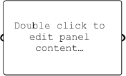
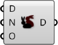
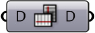
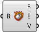
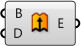

## 2.1. Index

#####This index provides additional information on all the components used in this primer, as well as other components you might find useful. This is just an introduction to over 500 components in the Grasshopper plugin.

Parameters
--

####Geometry
||||
|--|--|--|
|P.G.Crv|Curve Parameter Represents a collection of Curve geometry. Curve geometry is the common denominator of all curve types in Grasshopper.||
|P.G.Circle|Circle Parameter Represents a collection of Circle primitives.||
|P.G.Geo|Geometry Parameter Represents a collection of 3D Geometry.||
|P.G.Pipeline|Geometry Pipeline Defines a geometry pipeline from Rhino to Grasshopper.||
|P.G.Pt|Point Parameter Point parameters are capable of storing persistent data. You can set the persistent records through the parameter menu.||
|P.G.Srf|Surface Parameter Represents a collection of Surface geometry. Surface geometry is the common denominator of all surface types in Grasshopper.||

####Primitive
||||
|--|--|--|
|P.P.Bool|Boolean Parameter Represents a collection of Boolean (True/False) values.||
|P.P.D|Domain Parameter Represents a collection of one-dimensional Domains. Domains are typically used to represent curve fragments and continuous numeric ranges. A domain consists of two numbers that indicate the limits of the domain, everything in between these numbers is part of the domain.||
|P.P.D2|Domain2 Parameter Contains a collection of two-dimensional domains. 2D Domains are typically used to represent surface fragments. A two-dimensional domain consists of two one-dimensional domains.||
|P.P.ID|Guid Parameter Represents a collection of Globally Unique Identifiers. Guid parameters are capable of storing persistent data. You can set the persistent records through the parameter menu.||
|P.P.Int|Integer Parameter Represents a collection of Integer numeric values. Integer parameters are capable of storing persistent data. You can set the persistent records through the parameter menu.||
|P.P.Num|Number Parameter Represents a collection of floating point values. Number parameters are capable of storing persistent data. You can set the persistent records through the parameter menu.||
|P.P.Path|File Path Contains a collection of file paths.||

####Input
||||
|--|--|--|
|P.I.Toggle|Boolean Toggle Boolean (true/false) toggle.||
|P.I.Button|Button Button object with two values. When pressed, the button object returns a true value and then resets to false.||
|P.I.Swatch|Color Swatch A swatch is a special interface object that allows for quick setting of individual color values. You can change the color of a swatch through the context menu.||
|P.I.Grad|Gradient Control Gradient controls allow you to define a color gradient within a numeric domain. By default the unit domain (0.0 ~ 1.0) is used, but this can be adjusted via the L0 and L1 input parameters. You can add color grips to the gradient object by dragging from the color wheel at the upper left and set color grips by right clicking them.||
|P.I.Graph|Graph Mapper Graph mapper objects allow you to remap a set of numbers. By default the {x} and {y} domains of a graph function are unit domains (0.0 ~ 1.0), but these can be adjusted via the Graph Editor. Graph mappers can contain a single mapping function, which can be picked through the context menu. Graphs typically have grips (little circles), which can be used to modify the variables that define the graph equation. By default, a graph mapper objects contains no graph and performs a 1:1 mapping of values.||
|P.I.Slider|Number Slider A slider is a special interface object that allows for quick setting of individual numeric values. You can change the values and properties through the menu, or by double-clicking a slider object. Sliders can be made longer or shorter by dragging the rightmost edge left or right. Note that sliders only have an output (ie. no input).||
|P.I.Panel|Panel A panel for custom notes and text values. It is typically an inactive object that allows you to add remarks or explanations to a Document. Panels can also receive their information from elsewhere. If you plug an output parameter into a Panel, you can see the contents of that parameter in real-time. All data in Grasshopper can be viewed in this way. Panels can also stream their content to a text file.||
|P.I.List|Value List Provides a list of preset values from which to choose.||

####Utilities
||||
|--|--|--|
|P.U.Cin|Cluster Input Represents a cluster input parameter.||
|P.U.COut|Cluster Output Represents a cluster input parameter.||
|P.U.Dam|Data Dam Delay data on its way through the document.||
|P.U.Jump|Jump Jump between different locations.||
|P.U.Viewer|Param Viewer A viewer for data structures.||
|P.U.Scribble|Scribble A quick note.||

Maths
--

####Domain
||||
|--|--|--|
|M.D.Bnd|Bounds Create a numeric domain which encompasses a list of numbers.||
|M.D.Consec|Consecutive Domains Create consecutive domains from a list of numbers.||
|M.D.Dom|Construct Domain Create a numeric domain from two numeric extremes.||
|M.D.Dom2Num|Construct Domain² Create a two-dimensional domain from four numbers.||
|M.D.DeDomain|Deconstruct Domain Deconstruct a numeric domain into its component parts.||
|M.D.DeDom2Num|Deconstruct Domain² Deconstruct a two-dimensional domain into four numbers.||
|M.D.Divide|Divide Domain² Divides a two-dimensional domain into equal segments.||
|M.D.Inc|Includes Test a numeric value to see if it is included in the domain.||
|M.D.ReMap|Remap Numbers Remap numbers into a new numeric domain.||

####Operators
||||
|--|--|--|
|M.O.Add|Addition Mathematical addition.||
|M.O.Div|Division Mathematical division.||
|M.O.Equals|Equality Test for (in)equality of two numbers.||
|M.O.And|Gate And Perform boolean conjunction (AND gate). Both inputs need to be True for the result to be True.||
|M.O.Not|Gate Not Perform boolean negation (NOT gate).||
|M.O.Or|Gate Or Perform boolean disjunction (OR gate). Only a single input has to be True for the result to be True.||
|M.O.Larger|Larger Than Larger than (or equal to).||
|M.O.Multiply|Multiplication Mathematical multiplication.||
|M.O.Smaller|Smaller Than Larger than (or equal to).||
|M.O.Similar|Similarity Test for similarity of two numbers.||
|M.O.Sub|Subtraction Mathematical subtraction.||

####Script
||||
|--|--|--|
|M.S.Eval|Evaluate Evaluate an expression with a flexible number of variables.||
|M.S.Expression|Expression Evaluate an expression.||

####Trig
||||
|--|--|--|
|M.T.Cos|Cosine Compute the cosine of a value.||
|M.T.Deg|Degrees Convert an angle specified in radians to degrees.||
|M.T.Rad|Radians Convert an angle specified in degrees to radians.||
|M.T.Sin|Sine Compute the sine of a value.||

####Utilities
||||
|--|--|--|
|M.U.Avr|Average Solve the arithmetic average for a set of items.||
|M.U.Phi|Golden Ratio Returns a multiple of the golden ratio (Phi).||
|M.U.Pi|Pi Returns a multiple of Pi.||

Sets
--

####List
||||
|--|--|--|
|S.L.Combine|Combine Data Combine non-null items out of several inputs.||
|S.L.CrossRef|Cross Reference Cross Reference data from multiple lists.||
|S.L.Dispatch|Dispatch Dispatch the items in a list into two target lists. List dispatching is very similar to the [Cull Pattern] component, with the exception that both lists are provided as outputs.||
|S.L.Ins|Insert Items Insert a collection of items into a list.||
|S.L.Item|List Item Retrieve a specific item from a list.||
|S.L.Lng|List Length Measure the length of a list. Elements in a list are identified by their index. The first element is stored at index zero, the second element is stored at index one and so on and so forth. The highest possible index in a list equals the length of the list minus one.||
|S.L.Long|Longest List Grow a collection of lists to the longest length amongst them.||
|S.L.Split|Split List Split a list into separate parts.||
|S.L.Replace|Replace Items Replace certain items in a list.||
|S.L.Rev|Reverse List Reverse the order of a list. The new index of each element will be N-i where N is the highest index in the list and i is the old index of the element.||
|S.L.Shift|Shift List Offset all items in a list. Items in the list are offset (moved) towards the end of the list if the shift offset is positive. If Wrap equals True, then items that fall off the ends are re-appended.||
|S.L.Short|Shortest List Shrink a collection of lists to the shortest length amongst them.||
|S.L.Sift|Sift Pattern Sift elements in a list using a repeating index pattern.||
|S.L.Sort|Sort List Sort a list of numeric keys. In order for something to be sorted, it must first be comparable. Most types of data are not comparable, Numbers and Strings being basically the sole exceptions. If you want to sort other types of data, such as curves, you’ll need to create a list of keys first.||
|S.L.Weave|Weave Weave a set of input data using a custom pattern. The pattern is specified as a list of index values (integers) that define the order in which input data is collected.||

####Sets
||||
|--|--|--|
|S.S.Culli|Cull Index Cull (remove) indexed elements from a list.||
|S.S.Cull|Cull Pattern Cull (remove) elements in a list using a repeating bit mask. The bit mask is defined as a list of Boolean values. The bit mask is repeated until all elements in the data list have been evaluated.||
|S.S.Dup|Duplicate Data Duplicate data a predefined number of times. Data can be duplicated in two ways, either copies of the list are appended at the end until the number of copies has been reached, or each item is duplicated a number of times before moving on to the next item.||
|S.S.Jitter|Jitter Randomly shuffles a list of values. The input list is reordered based on random noise. Jittering is a good way to get a random set with a good distribution. The jitter parameter sets radius of the random noise. If jitter equals 0.5, then each item is allowed to reposition itself randomly to within half the span of the entire set.||
|S.S.Random|Random Generate a list of pseudo random numbers. The number sequence is unique but stable for each seed value. If you do not like a random distribution, try different seed values.||
|S.S.Range|Range Create a range of numbers. The numbers are spaced equally inside a numeric domain. Use this component if you need to create numbers between extremes. If you need control over the interval between successive numbers, you should be using the [Series] component.||
|S.S.Repeat|Repeat Data Repeat a pattern until it reaches a certain length.||
|S.S.Series|Series Create a series of numbers. The numbers are spaced according to the {Step} value. If you need to distribute numbers inside a fixed numeric range, consider using the [Range] component instead.||

####Tree
||||
|--|--|--|
|S.T.Explode|Explode Tree Extract all the branches from a tree.||
|S.T.Flatten|Flatten Tree Flatten a data tree by removing all branching information.||
|S.T.Flip|Flip Matrix Flip a matrix–like data tree by swapping rows and columns.||
|S.T.Graft|Graft Tree Typically, data items are stored in branches at specific index values (0 for the first item, 1 for the second item, and so on and so forth) and branches are stored in trees at specific branch paths, for example: {0;1}, which indicates the second sub-branch of the first main branch. Grafting creates a new branch for every single data item.||
|S.T.Merge|Merge Merge a bunch of data streams.||
|S.T.Path|Path Mapper Perform lexical operations on data trees. Lexical operations are logical mappings between data paths and indices which are defined by textual (lexical) masks and patterns.||
|S.T.Prune|Prune Tree Removes all branches from a Tree that carry a special number of Data items. You can supply both a lower and an upper limit for branch pruning.||
|S.T.Simplify|Simplify Tree Simplify a tree by removing the overlap shared amongst all branches.||
|S.T.TStat|Tree Statistics Get some statistics regarding a data tree.||
|S.T.Unflatten|Unflatten Tree Unflatten a data tree by moving items back into branches.||

Vector
--

####Grid
||||
|--|--|--|
|V.G.HexGrid|Hexagonal 2D grid with hexagonal cells.||
|V.G.RecGrid|Rectangular 2D grid with rectangular cells.||
|V.G.SqGrid|Square 2D grid with square cells||

####Point
||||
|--|--|--|
|V.P.Pt|Construct Point Construct a point from {xyz} coordinates.||
|V.P.pDecon|Deconstruct Deconstruct a point into its component parts.||
|V.P.Dist|Distance Compute Euclidean distance between two point coordinates.||

####Vector
||||
|--|--|--|
|V.V.X|Unit X Unit vector parallel to the world {x} axis.||
|V.V.Y|Unit Y Unit vector parallel to the world {y} axis.||
|V.V.Vec2Pt|Vector 2Pt Create a vector between two points.||

Curve
--

####Analysis
||||
|--|--|--|
|C.A.CP|Control Points Extract the nurbs control points and knots of a curve.||

####Division
||||
|--|--|--|
|C.D.Divide|Divide Curve Divide a curve into equal length segments.||

####Primitive
||||
|--|--|--|
|C.P.Cir|Circle Create a circle defined by base plane and radius.||
|C.P.Cir3Pt|Circle 3Pt Create a circle defined by three points.||
|C.P.CirCNR|Circle CNR Create a circle defined by center, normal and radius.||
|C.P.Line|Line SDL Create a line segment defined by start point, tangent and length.||
|C.P.Polygon|Polygon Create a polygon with optional round edges.||

####Spline
||||
|--|--|--|
|C.S.IntCrv|Interpolate Create an interpolated curve through a set of points.||
|C.S.KinkCrv|Kinky Curve Construct an interpolated curve through a set of points with a kink angle threshold.||
|C.S.Nurbs|Nurbs Curve Construct a nurbs curve from control points.||
|C.S.PLine|PolyLine Create a polyline connecting a number of points.||

####Util
||||
|--|--|--|
|C.U.Explode|Explode Explode a curve into smaller segments.||
|<C.U.Join|Join Curves Join as many curves as possible.||
|C.U.Offset|Offset Offset a curve with a specified distance.||

Surface
--

####Analysis
||||
|--|--|--|
|S.A.DeBrep|Deconstruct Brep Deconstruct a brep into its constituent parts.||

####Freeform
||||
|--|--|--|
|S.F.Boundary|Boundary Surfaces Create planar surfaces from a collection of boundary edge curves.||
|S.F.Extr|Extrude Extrude curves and surfaces along a vector.||
|S.F.ExtrPt|Extrude Point Extrude curves and surfaces to a point.||
|S.F.Loft|Loft Create a lofted surface through a set of section curves.||
|S.F.RevSrf|Revolution Create a surface of revolution.||
|S.F.Swp2|Sweep2 Create a sweep surface with two rail curves.||

####Primitive
||||
|--|--|--|
|S.P.BBox|Bounding Box Solve oriented geometry bounding boxes.||

####Util
||||
|--|--|--|
|S.U.SDivide|Divide Surface Generate a grid of {uv} points on a surface.||
|S.U.SubSrf|Isotrim Extract an isoparametric subset of a surface.||

Mesh
--

####Triangulation
||||
|--|--|--|
|M.T.Voronoi|Voronoi Planar voronoi diagram for a collection of points.||

Transform
--

####Affine
||||
|--|--|--|
|T.A.RecMap|Rectangle Mapping Transform geometry from one rectangle into another.||

####Array
||||
|--|--|--|
|T.A.ArrLinear|Linear Array Create a linear array of geometry.||

####Morph
||||
|--|--|--|
|T.M.Morph|Box Morph Morph an object into a twisted box.||
|T.M.SBox|Surface Box Create a twisted box on a surface patch.||

Display
--

####Color
||||
|--|--|--|
|D.C.HSL|Colour HSL Create a colour from floating point {HSL} channels.||

####Dimensions
||||
|--|--|--|
|D.D.Tag|Text tags A text tag component allows you to draw little Strings in the viewport as feedback items. Text and location are specified as input parameters. When text tags are baked they turn into Text Dots.||
|D.D.Tag3D|Text Tag 3D Represents a list of 3D text tags in a Rhino viewport||

####Preview
||||
|--|--|--|
|D.P.Preview|Custom Preview Allows for customized geometry previews.||

####Vector
||||
|--|--|--|
|D.V.Points|Point List Displays details about lists of points.||

