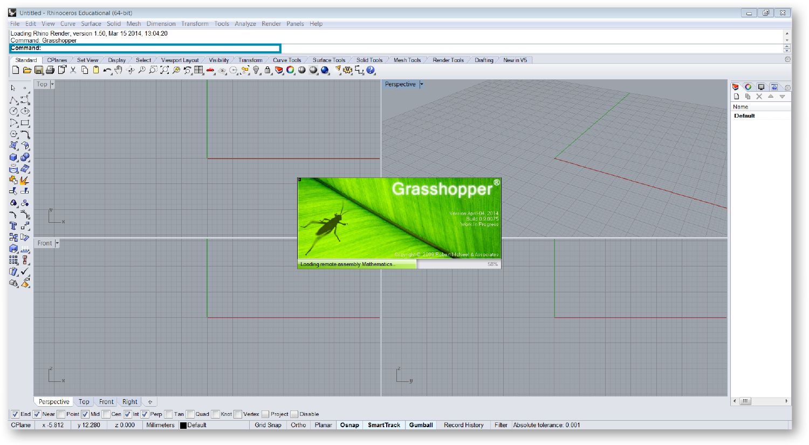

### 1.1.1. INSTALLATION UND START VON GRASSHOPPER

##### Das Grasshopper plugin wird häufig aktualisiert, weshalb Du sicherstellen solltest, immer die neueste Version installiert zu haben.
##### Es sei darauf hingewiesen, dass es momentan keine Version von Grasshopper für Mac gibt.

#### 1.1.1.1. HERUNTERLADEN
Um das Grasshopper Plug-In herunterzuladen, besuche die Grasshopper Webseite. Klicke auf die Registrierkarte Download am oberen Rand der Seite, und wenn Du auf der nächsten Seite dazu aufgefordert wirst, gib Deine Emailadresse ein. Nun kannst Du den Link zum Herunterladen mit der rechten Maustaste anklicken und die Option “Ziel speichern unter” aus dem Menü auswählen. Wähle den Speicherort auf Deiner Festplatte (Hinweis: Die Datei kann nicht über eine Netzwerkverbindung geladen werden, deshalb muss die Datei lokal auf Deiner Festplatte gespeichert werden) und speichere dort die ausführbaren Dateien.

> Lade Grasshopper von der [grasshopper3d.com](http://grasshopper3d.com) Webseite herunter. 

#### 1.1.1.2. INSTALLATION
Wähle “ausführen” von den Downloadoptionen aus und folge den Anweisungen im Installationsdialog. (Hinweis: Du musst Rhino 5 bereits auf Deinem Computer installiert haben, damit das Plug-In ausgeführt werden kann.).

> Folge den Anweisungen des Installationsdialogs.

#### 1.1.1.3. STARTEN
Um Grasshopper zu starten, gib “Grasshopper” in die Rhino Befehlszeile ein. Wenn Du Grasshopper startest, wirst Du als erstes ein neues Fenster vor dem Rhinofenster schweben sehen. In diesem Fenster kannst Du knotenbasierte Programme erstellen, welche die vielfältige Funktionalität von Rhino automatisieren können. Eine bewährte Methode ist es, die Fenster so nebeneinander anzuordnen, dass sie sich nicht überlappen und Grasshopper nicht die Ansichtsfenster von Rhino versperrt.

> Gib “Grasshopper” in die Rhino Befehlszeile ein, um das Grasshopper Plug-In zu starten.

>1. Das Grasshopperfenster schwebt über den Ansichtsfenstern von Rhino.
>2. Grasshopper zeigt die Versionsnummer am unteren Ende des Fensters an.

> Unterteile den Bildschirm, sodass Grasshopper nicht die Ansichtsfenster von Rhino versperrt. Du kannst dies erreichen, indem Du die Fenster auf gegenüberliegende Seiten des Bildschirms ziehst, oder indem Du die Windowstaste gedrückt hältst und die Cursorpfeile nach links oder rechts drückst.
