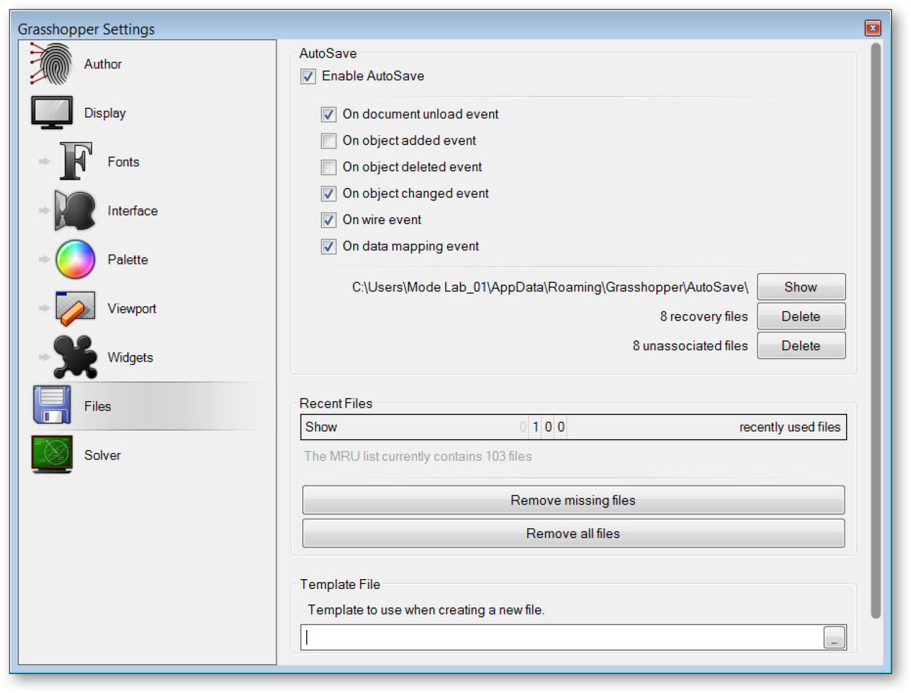
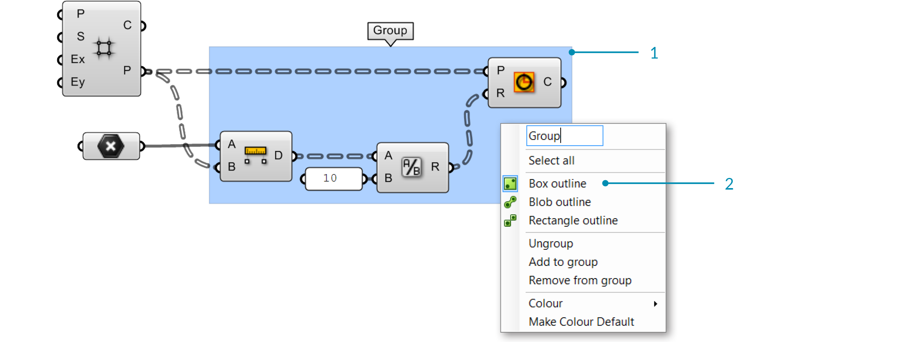
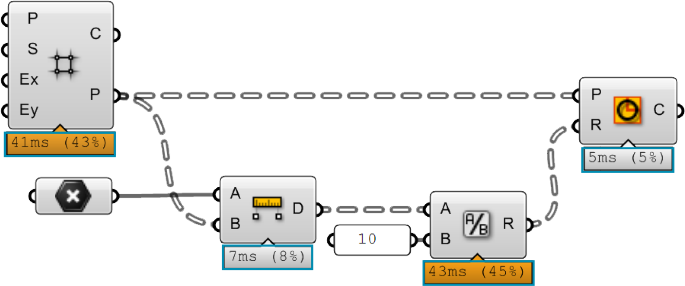

### 1.1.2. DIE GRASSHOPPER BENUTZEROBERFLÄCHE

##### Der visuelle “plug-and-play” Stil von Grasshopper gibt Designern die Fähigkeit kreative Problemlösung mit neuen regelbasierten Systemen in einer fluiden, graphischen Benutzeroberfläche zu kombinieren.

Lass uns damit beginnen die Benutzeroberfläche von Grasshopper zu erkunden. Grasshopper ist eine visuelle Programmierungsanwendung, die es erlaubt Programme, Definitionen genannt, zu erstellen, indem Komponenten in das zentrale Editorfenster (Canvas genannt) gezogen werden. Die Ausgaben dieser Komponenten werden mit den Eingaben folgender Komponenten verbunden und erzeugen so einen Informationsfluss, der von links nach rechts gelesen wird. Lasst uns mit den Grundlagen anfangen.

Angenommen, Du hast bereits das Grasshopper Plugin installiert (vgl. F.0.0), gib das Wort “Grasshopper” in die Rhino Befehlszeile ein und öffne damit den Grasshopper
Editor. Die Grasshopper Oberfläche beinhaltet eine Anzahl an Elementen, die einem Rhino Nutzer sehr bekannt sind. Schauen wir uns die neuen Bestandteile nun an.

>1. Fenstertitelleiste.
2. Menüleiste
3. Dateibrowsersteuerung.
4. Komponentenpalette.
5. Canvas Werkzeugleiste.
6. Canvas.
7. Dieser Bereich, der durch ein Raster von rechteckigen Feldern gekennzeichnet ist, stellt eine Oberfläche bereit, mit der die zuletzt geöffneten Dateien geöffnet werden können. Das 3x3 Menü zeigt die zuletzt genutzten Dateien in chronologischer Reihenfolge und wird rote Felder anzeigen, sobald die entsprechende Datei nicht gefunden werden kann (was vorkommt, wenn Du Dateien in einen neuen Ordner verschiebst oder löschst).
8. Die Statusleiste nennt die von Dir genutzte Version von Grasshopper, welche gerade auf Deiner Maschine installiert ist. Falls eine neue Version verfügbar ist, wird ein Pop-Up-Fenster erscheinen und Dir die Anweisungen zum Download der neuesten Version zur Verfügung stellen.

#### 1.1.2.1. DIE FENSTERTITELLEISTE
Die Fenstertitelleiste des Editors verhält sich unterschiedlich von den meisten anderen Dialogen in Microsoft Windows. Falls das Fenster nicht minimiert oder maximiert ist, wird der Dialog auf Doppelklick in diese Leiste zu einer Leiste auf Deinem Bildschirm minimiert. Dies ist eine ausgezeichnete Möglichkeit zwischen dem Plugin und Rhino zu wechseln, weil der Editor minimiert wird ohne dass er sich zur Unterseite des Bildschirms bewegt oder hinter einem anderen Fenster verschwindet. Merke, dass, falls Du den Editor schließt, die Grasshopper Geometrievorschau im Rhino Ansichtsfenster verschwindet, die Datei jedoch nicht geschlossen wird. Das nächste Mal, wenn Du den “Grasshopper” Befehl in die Rhino Befehlszeile eingibst, wird das Fenster im selben Zustand, mit denselben Dateien geöffnet, wieder erscheinen. Das passiert, weil Deine Grasshopper Session aktiv bleibt, bis Rhino geschlossen wird, sobald Du sie einmal von der Rhino Eingabe aus geöffnet hast.

#### 1.1.2.2. MENÜLEISTE
Die Titelleiste ist ähnlich wie Windowsmenüleisten, außer der Dateibrowsersteuerung an der rechten Seite (siehe nächster Abschnitt). Das Dateimenü stellt, zusätzlich zu einigen nützlichen Werkzeugen, welche Dich Bilder von Deinem aktuellen Grasshopper Dokument exportieren lassen (siehe Export von schnellen Bildern und Export von Hi-Res Bildern), die typischen Funktionen zur Verfügung (z.B. Neue Datei, Öffnen, Speichern, etc.). Du kannst die verschiedenen Aspekte der Benutzeroberfläche steuern, indem Du die Menüs „View“ und „Display“ verwendest, während das Menü „Solution“ Dich die verschiedenen Eigenschaften der Berechnung der graphischen Lösung durch den Solver verwalten lässt.

Es ist es wert anzumerken, dass viele Einstellungen der Anwendung durch den „Preferences“ Dialog gesteuert werden können, der im „File“ Menü zu finden ist. Der „Author“ Bereich erlaubt es Dir Deine persönlichen Metadaten einzutragen, welche in jedem Grasshopper Dokument gespeichert werden, während der „Display“ Abschnitt Dir die Möglichkeit gibt, die Feinabstimmung von Aussehen und Handhabung vorzunehmen. Der „Files“ Bereich erlaubt es Dir, Dinge zu spezifizieren, wie beispielsweise die Häufigkeit und der Speicherort für Autosavedateien (im Falle des unbeabsichtigten Schließens oder eines Absturzes der Anwendung). Schließlich, im „Solver“ Bereich, kannst Du die Kern- und Drittanbieter-Plugins verwalten, welche die Funktionalität erweitern.

> Merke: Sei vorsichtig, wenn Du Tastaturkürzel verwendest, da diese im aktiven Fenster angewendet werden, welches entweder das von Grasshopper oder von Rhino sein kann. Es ist schnell passiert ein Tastaturkürzel anzuwenden, ohne zu merken, dass es im falschen Fenster angewendet wurde und einen ungewollten Befehl ausgelöst hat.

>Der „Preferences“ Dialog erlaubt es Dir viele Einstellungen der Grasshopper Anwendung zu steuern.

#### 1.1.2.3. DATEIBROWSERSTEUERUNG
Der Dateibrowser erlaubt es Dir schnell zwischen verschiedenen geladenen Dateien umzuschalten, indem diese in der Drop-Down Liste ausgewählt werden. Der Zugang zu geöffneten Dateien durch die Drop-Down Liste des Dateibrowser ermöglicht es Teile von geöffneten Definitionen schnell zu kopieren und einzufügen. Klicke einfach auf den aktiven Dateinamen in der Dateibrowsersteuerung und eine fallende Liste aller geöffneten Dateien wird angezeigt werden (zusammen mit kleinen Vorschaubildern jeder geöffneten Definition). Du kannst ebenfalls Alt+Tab drücken, um schnell zwischen offenen Grasshopper Dokumenten umzuschalten.

Natürlich kannst Du auch durch den Standarddialog „Open file“ gehen, um Grasshopper Definitionen zu laden, auch wenn Du einfach eine Grasshopper Datei auf den Canvas ziehen kannst um eine bestimmte Definition zu öffnen.

> Grasshopper ist ein Plugin, das „über“ Rhino arbeitet und deshalb eigene Dateitypen bereitstellt
Der Standarddateityp ist eine binäre Datendatei, die mit der Erweiterung .gh gespeichert wird. Der andere Dateityp ist als Grasshopper XML Datei bekannt und verwendet die Erweiterung .ghx. Der XML (Extensible Markup Language) Dateityp nutzt Tags um Objekte und Objektattribute zu definieren (ähnlich einem HTML Dokument), jedoch programmspezifische Tags, um die Daten innerhalb eines Objektes zu beschreiben. Weil XML Dateien als Textdokumente formatiert sind, kannst Du die Grasshopper XML Dateien in einem Texteditor wie NotePad öffnen, um hinter die Kulissen der Kodierung zu sehen.

Grasshopper hat verschiedene Methoden mit welchen es Dateien öffnen kann, und Du wirst angeben müssen, welche der Optionen Du anwenden möchtest, wenn Du eine bestimmte Methode nutzt.

**Open File:** Wie der Name suggestiert, öffnet diese Option einfach eine beliebige Definition, die Du in den Canvas ziehen kannst.

**Insert File:** Du kannst diese Option benutzen, um eine bestehende Datei in das aktuelle Dokument als lose Komponenten einzufügen.

**Group File:** Diese Methode wird eine Datei in ein bestehendes Dokument einfügen, jedoch die Objekte miteinander gruppieren.

**Cluster File:** Ähnlich zur Option „group function“, wird hier eine Datei in ein bestehendes Dokument eingefügt, wobei die Objekte der Gruppe in einem Clusterobjekt zusammengefügt werden.

**Examine File:** Erlaubt es Dir eine Datei in einem geschlossenen Zustand zu öffnen, was bedeutet, dass Du Dir die Datei ansehen, aber keine Änderungen an ihr vornehmen kannst.

Grasshopper hat auch eine Autosave Funktion, die regelmäßig auf Grundlage der Nutzerinteraktion ausgelöst wird. Eine Liste der Autosave Präferenzen kann im Dateimenü in der Menüleiste gefunden werden. Wenn eine aktive Instanz von Rhino geschlossen wird, erscheint ein Pop-Up Dialog, der abfragt, ob Du Grasshopper Dateien speichern möchtest, die geöffnet waren, als Rhino geschlossen wurde.

>Autosave arbeitet nur, wenn eine Datei mindestens schon einmal gespeichert wurde.

>Ziehe Dateien auf den Canvas.

#### 1.1.2.4. KOMPONENTEN PALETTEN
Dieser Bereich organisiert Komponenten in Kategorien und Unterkategorien, Kategorien werden als Reiter dargestellt und Unterkategorien in Drop-Down Paneelen. Alle Komponenten gehören bestimmten Kategorien an. Diese Kategorien wurden benannt, um Dir zu helfen bestimmte Komponenten zu finden, wenn Du danach suchst (z.B. “Params” für alle einfachen Datentypen oder “Curves” für alle kurvenbezogenen Werkzeuge). Um Komponenten zum Canvas hinzuzufügen kannst Du entweder die Objekte im Drop-Down Menü anklicken oder sie direkt vom Menü auf den Canvas ziehen.

>Ziehe eine Komponente von der Palette direkt auf den Canvas um sie einzufügen.

Da es mehr Komponenten in jeder Unterkategorie geben kann, als in die Palette passen, wird nur eine begrenzte Anzahl in dem entsprechenden Paneel angezeigt. Die Höhe der Komponentenpalette und die Breite des Grasshopperfensters können angepasst werden, um mehr oder weniger Komponenten pro Unterkategorie darzustellen. Um ein Menü aller Komponenten einer bestimmten Unterkategorie zu sehen, klicke einfach auf die schwarze Leiste an der Unterseite des jeweiligen Paneels einer Unterkategorie. So wird ein Drop-Down Menü geöffnet, das Dir den Zugang zu allen Komponenten der Unterkategorie ermöglicht.

>1. Kategoriereiter
2. Unterkategoriepaneel
3. Klicke auf die schwarze Leiste um das Unterkategoriemenü zu öffnen.
3. Bewege Deine Maus über eine Komponente um eine Kurzbeschreibung zu erhalten.
4. Drop-down Menü.

#### 1.1.2.5. DER CANVAS
Der Canvas ist die primäre Arbeitsoberfläche, um Grasshopperdefinitionen zu erstellen. Hier kannst Du mit den verschiedenen Elementen Deines visuellen Programms interagieren. Du kannst damit beginnen auf dem Canvas zu arbeiten, indem Du Komponenten platzierst und diese mit Kabeln verbindest.

#### 1.1.2.6. GRUPPIEREN
Komponenten auf dem Canvas miteinander zu gruppieren kann insbesondere nützlich sein um die Lesbakeit und die Verständlichkeit von Definitionen zu verbessern. Gruppieren gibt Dir die Möglichkeit mehrere Komponenten schnell auszuwählen und auf dem Canvas zu bewegen. Du kannst eine Gruppe erstellen, indem Du Ctrl+G eingibst, während Du die gewünschten Komponenten ausgewählt hast. Eine alternative Methode kannst Du unter dem “Group Selection” Knopf des „Edit“ Menüs in der Menüleiste finden. Benutzerdefinierte Parameter für Gruppenfarben, -transparenz, -namen und -konturliniendarstellung können mit einem Rechtsklick auf ein Gruppenobjekt eingestellt werden.

>1. Eine Gruppe von Komponenten mit einer Boxlinienkontur gerahmt.
2. Rechtsklicke irgendwo auf die Gruppe um den Namen und die Darstellung der Gruppe zu bearbeiten.

>Du kannst eine Gruppe auch mit einem Meta Ball Algorithmus darstellen, indem Du eine Blob Konturlinie auswählst.

>Zwei Gruppen sind hier ineinander verschachtelt, die Farbe (hellblau) wurde bei der äußeren Gruppe verändert um die Lesbarkeit der einzelnen Gruppen zu verbessern. Gruppen werden „hinter“ die Komponenten gezeichnet, die sie beinhalten und, wie in diesem Fall, mit verschiedenen Tiefen. Um dies zu verändern gehe zu Edit > Arrange in der Menüleiste.

#### 1.1.1.7. WIDGETS
In Grasshopper sind einige Widgets verfügbar, die Dir helfen können nützliche Aktionen auszuführen. Du kannst sie im Display Menü der Menüleiste an- bzw. ausschalten. Nachfolgend werden wir uns einige der am häufigsten benutzten Widgets ansehen.

**Das Align Widget**
Ein nützliches Benutzeroberflächen-Widget, welches Dir helfen kann Deinen Canvas in Ordnung zu halten ist das Align Widget. Du kannst es nutzen, indem Du mehrere Komponenten zur gleichen Zeit auswählst und eine der Optionen in der Strichlinie auswählst, welche die ausgewählten Komponenten umgibt. Du kannst die Komponenten links, in der vertikalen Mitte, rechts oder oben, im horizontalen Zentrum, unten oder gleichmäßig verteilt über die Benutzeroberfläche ausrichten. Wenn Du gerade beginnst, wirst Du feststellen, dass diese Werkzeuge Dir manchmal in den Weg kommen (hier kannst Du den Fehler machen alle Komponenten auf einer Stelle zusammenzuführen). Jedoch sind sie mit etwas Übung sehr hilfreich, wenn es darum geht strukturierte Graphen mit einer hohen Lesbarkeit und Verständlichkeit zu erstellen.

>1. Rechtsbündiges Ausrichten.
2. Vertikale Verteilung.

**Das Profiler Widget**
Der Profiler listet die Laufzeiten für den ungünstigsten Fall für die einzelnen Parameter und Komponenten, um Dir zu erlauben die Engpässe in Netzwerken zu finden und die Laufzeiten von verschiedenen Komponenten miteinander zu vergleichen. Die Widgets sind standardmäßig ausgeschalten.

>Das Profiler Widget gibt Dir visuelles Feedback, welche Komponenten Deiner Definition längere Laufzeiten verursachen können.

**Das Markov Widget**
Dieses Widget nutzt Markovketten um, basierend auf Deinem vergangenen Verhalten, „vorherzusehen“, welche Komponenten Du vielleicht als nächstes nutzen möchtest. Eine Markovkette ist ein Prozess, der aus einer begrenzten Anzahl verschiedener Zustände (oder Ebenen) und bekannten Wahrscheinlichkeiten besteht. Es kann einige Zeit dauern, bis sich dieses Widget an ein bestimmtes Nutzerverhalten gewöhnt hat, aber über einige Zeit sollte es beginnen Dir die Komponenten vorzuschlagen, welche Du als nächstes nutzen möchtest. Das Markov Widget kann, abhängig von Deiner vorausgegangenen Aktivität, bis zu fünf verschiedene Komponenten vorschlagen. Du kannst auf das Markov Widget rechtsklicken, um es in eine bestimmte Ecke des Canvas zu heften oder es komplett zu verstecken (die Standardposition ist in der linken unteren Ecke des Canvas).

#### 1.1.2.8. NUTZUNG DER SUCHFUNKTION
Obwohl einige Gedanken in die Platzierung der einzelnen Komponenten in den Komponentenpaneelen gegangen sind, um es für den Nutzer intuitiv zugänglich zu machen, ist es manchmal schwierig bestimmte Komponenten, welche tief in den Kategoriepaneelen verborgen sind auszumachen. Glücklicherweise kannst Du auch jede Komponente unter ihrem Namen finden, wenn Du auf einen leeren Bereich im Canvas doppelklickst. Dies wird eine Pop-Up Suchleiste öffnen. Gib einfach den Namen der Komponente ein, nach der Du suchst und Du wirst eine Liste von Parametern und Komponenten erhalten, die Deiner Anfrage entsprechen.

>Doppelklicke irgendwo auf den Canvas um die Schlüsselwortsuche für eine bestimmte Komponente aus den Komponentenpaneelen zu aktivieren.

>Eine Suche nach “divide” listet eine Vielfalt von Komponenten.
1. Division operator Komponente.
2. Divide Surface Komponente.
3. Divide Domain2 Komponente.

#### 1.1.2.9. DIE FIND FUNKTION
Es gibt buchstäblich hunderte (wenn nicht tausende) von Grasshopper Komponenten, welche Dir zur Verfügung stehen und es kann für einen Einsteiger ziemlich entmutigend sein zu wissen, wo bestimmte Komponenten in den Komponentenpaletten zu finden sind. Die schnellste Lösung ist es irgendwo auf den Canvas doppelzuklicken und eine Suchanfrage für die Komponente einzugeben. Was jedoch tun, wenn Du eine bestimmte Komponente suchst, die bereits auf dem Canvas platziert wurde? Kein Grund zur Sorge. Mit einem Rechtsklick irgendwo auf den Canvas oder mit einem Druck auf die F3 Taste kannst Du die „Find“ Funktion aufrufen. Beginne einfach, indem Du den Namen der gesuchten Komponente eingibst.

Die „Find“ Funktion verwendet sehr ausgefeilte Algorithmen, welche nicht nur nach einer Instanz eines bestimmten Komponentennamen in einer Definition suchen (ein Komponentenname ist der Titel der Komponenten unter der er im Kompontenpaneel gefunden werden kann und kann vom Nutzer nicht geändert werden), sondern auch nach einzigartigen Signaturen, welchen wir bestimmten Komponenten zugeordnet haben können (auch Kosenamen genannt).
Die „Find“ Funktion kann auch für die Suche nach Komponententypen auf dem Canvas verwendet werden oder nach Inhalten von Paneelen, Skizzen und Gruppeninhalten suchen. Sobald die „Find“ Funktion einen Treffer gefunden hat, wird es automatisch den Rest der Definition ausgrauen und eine Strichlinie um die hervorgehobene Komponente zeichnen. Wenn mehrere Treffer vorliegen, wird eine Liste der zutreffenden Komponenten für die Suchanfrage in der „Find“ Dialogbox angezeigt und sobald Du mit der Maus über einen Eintrag fährst, wird die entsprechende Komponente im Canvas grün dargestellt.

>Indem Du irgendwo auf den Canvas rechtsklickst oder die F3 Taste drückst, kannst Du die „Find“ Funktion aufrufen. Beginne mit der Eingabe des Namens der Komponente nach der Du suchst.

>Die „Find“ Funktion kann recht hilfreich sein, wenn Du eine bestimmte Komponente auf dem Canvas lokalisieren möchtest. Rechtsklicke irgendwo auf den Canvas um die „Find“ Dialogbox zu starten.

>Ein kleiner Pfeil wird zusätzlich neben den Listeneinträgen angezeigt, der auf die entsprechenden Komponenten auf dem Canvas zeigt. Versuche die „Find“ Dialogbox auf dem Canvas zu bewegen und beobachte die Rotation der Pfeile um den Komponenten zu folgen, auf welche sie zeigen. Klicke auf das gewünschte Suchergebnis um die Komponente (auf dem Canvas) neben der „Find“ Dialogbox darzustellen.

#### 1.1.2.10. NUTZUNG DES RADIALMENÜS
Sobald Du kompetenter im Umgang mit der Grasshopper Oberfläche bist, wirst Du einen bestimmten Arbeitsablauf beschleunigen. Tastaturkürzel sind ein Weg, um dies zu erreichen; jedoch gibt es auch eine andere Funktion, die Dir helfen kann schnellen Zugang zu einer Reihe von nützlichen Werkzeugen zu erlangen – Das Radialmenü der Benutzeroberfläche. Du kannst Das Radialmenü öffnen, indem Du die Leertaste drückst (während sich Deine Maus über dem Canvas oder einer Komponente befindet) oder indem Du die mittlere Maustaste drückst. Das Radialmenü wird verschiedene Werkzeuge bereitstellen, abhängig davon, ob Du das Menü direkt oberhalb einer Komponente oder irgendwo über dem Canvas aufrufst. In dem Bild unterhalb kannst du sehen, dass das Radialmenü im Vergleich zum Aufruf oberhalb des leeren Canvas mehr Funktionen hat, wenn Du es oberhalb einer ausgewählten Komponente aufrufst. Dieses Menü kann die Geschwindigkeit in der Du Grasshopper Dokumente erstellst dramatisch erhöhen.

>Das Radialmenü der Benutzeroberfläche ermöglicht es Dir häufig genutzte Menüelemente schnell zu erreichen.

#### 1.1.2.11. DIE CANVASWERKZEUGLEISTE
Die Canvaswerkzeugleiste ermöglicht schnellen Zugriff auf eine Anzahl häufig genutzter Grasshopper Funktionen. Alle Werkzeuge sind auch durch die Menüleiste zugänglich und Du kannst die Werkzeugleiste verstecken, wenn Du willst. Die Werkzeugleiste kann im „View“ Reiter der Menüleiste wieder eingeschaltet werden.

>1. **Open File:** Schnellzugriff um eine Datei zu öffnen.
2.  **Save File:** Schnellzugriff um eine Datei zu speichern.
3.  **Zoom Defaults**: Die Standardeinstellungen für den Zoom, die es Dir erlauben in bestimmten Intervallen herein- und herauszuzoomen.
4. **Zoom Extents:** Zoom auf den gesamten Umfang der Definition. Klicke auf den Pfeil neben dem „Zoom Extends“ Symbol um eines der Untermenüelemente auszuwählen um eine bestimmte Region Deiner Definition anzusehen.
5. **Named Views: **Diese Funktion eröffnet ein Menü, das es ermöglicht jeden Ansichtsbereich Deiner Definition zu speichern und wiederherzustellen.
6. **Das Skizzenwerkzeug:** Das Skizzenwerkzeug arbeitet ähnlich wie das Bleistiftwerkzeug in Adobe Photoshop mit ein paar zusätzlich hinzugefügten Funktionen.

>1. **Vorschaueinstellungen:** Wenn eine Grasshopper Komponente Geometrien erzeugt, wird die Vorschau dieser Geometrie im Ansichtsfenster standardmäßig dargestellt. Du kannst die Vorschau pro Objekt ausschalten wenn Du diese rechtsklickst und die Vorschaufunktion deaktivierst, oder global den Vorschauzustand einstellen, indem Du diese drei Knöpfe benutzt.
2. Wire-frame Vorschau.
3. Vorschau ausschalten.
4. Teiltransparente Vorschau (Standard).
5. **Vorschau ausgewählter Objekte:** Wird dieser Knopf gedrückt, wird Grasshopper nur die Geometrien darstellen, die Teil der aktiven Auswahl sind, auch wenn diese Komponenten in ihren Objekteigenschaften die Vorschau ausgeschalten haben.
6. **Dokumentvorschau Einstellungen:** Grasshopper hat ein Standardfarbschema für ausgewählte (teiltransparent grün) und unausgewählte (teiltransparent rot) Geometrien. Es ist möglich dieses Farbschema in den Dokumentvorschau Einstellungen zu überschreiben.
7. **Vorschau Mesh Qualität:** Aus Optimierungsgründen kann die Qualität der Mesh- und Flächendarstellung kontrolliert werden mit der die Geometrien in Rhino dargestellt werden. Höhere Qualitätswerte werden zu höheren Laufzeiten für die Berechnung führen, während niedrigere Einstellungen zu einer weniger akuraten Darstellung führen werden. Es soll angemerkt werden, dass die Geometrie trotz der Einstellung eine hohe Auflösung der Darstellung in Rhino aufweisen wird, sobald sie in das Rhinodokument gebacken wird – die Einstellungen selbst haben nur einen geringen Einfluss auf die Darstellungsleistung und -qualität.

>Das Skizzenwerkzeug erlaubt es die Strichstärke, Strichtype und Farbe zu ändern. Mit einem Rechtsklick auf ein ausgewähltes Skizzenobjekt kannst Du wählen, ob Du Deine Linien vereinfachen willst, um eine glattere Darstellung zu erreichen. Rechtsklicke auf Dein Skizzenobjekt und wähle “Load from Rhino” um eine beliebige 2d Form in die Rhinoszene zu laden. Sobald Du eine Form als Referenz ausgewählt hast und die Eingabetaste drückst, wird Deine Skizzenlinie in die referenzierte Form rekonfiguriert.

>Merke: Dein Skizzenobjekt kann sich von seiner ursprünglichen Position bewegt haben, sobald Du eine Form von Rhino geladen hast. Grasshopper platziert Dein Skizzenobjekt relativ zum Ursprung des Canvas (Ecke links oben) und dem Ursprung der Welt-XY-Achse in Rhino.

>Grasshopper hat ein Standardfarbschema für ausgewählte (teiltransparent grün) und unausgewählte (teiltransparent rot) Geometrien. Es ist möglich dieses Farbschema in den Dokumentvorschau Einstellungen zu überschreiben.
