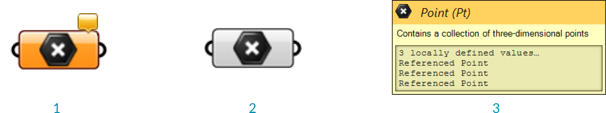
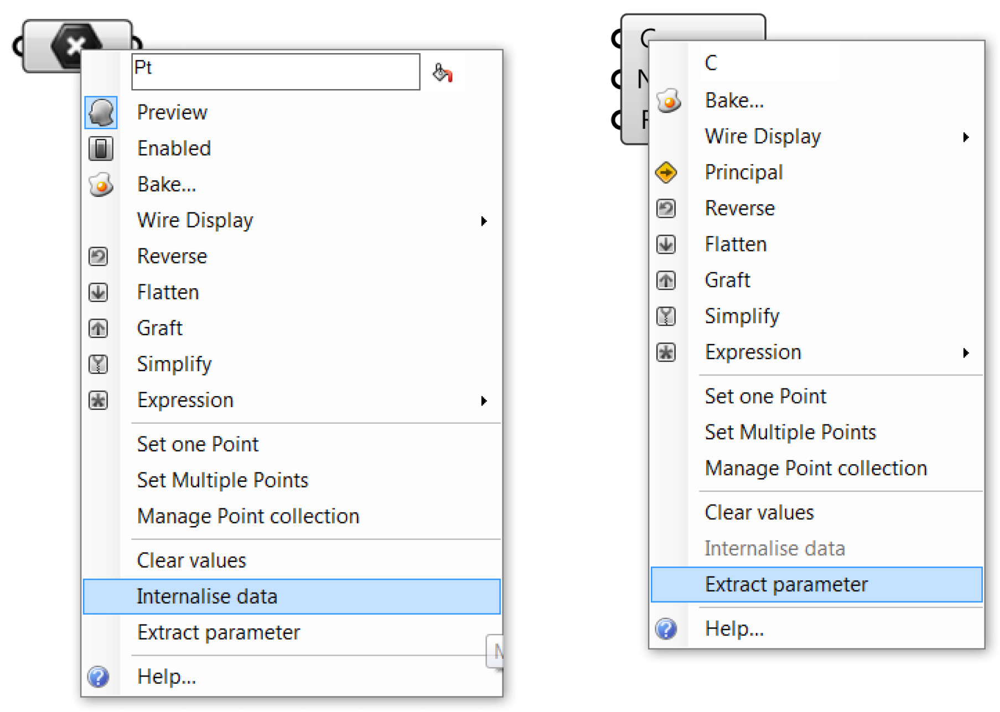

### 1.2.3. DATENTYPEN

#####Die meisten Parameter koennen zwei verschiedene Arten von Daten speichern: Volatile und persistente Daten. Volatile Daten sind von einer oder mehreren Quellen eingespeist und werden zerstoert (oder neuerhoben) wenn die Loesung erneut startet. Persistente Daten sind Daten, welche spezifisch vom Benutzer eingestellt werden.

####1.2.3.1. PERSISTENTE DATEN
Persistente Daten sind durch ein Menu, und abhaengig von der Art des Parameters durch unterschiedliche Manager, zugaenglich. Ein Punktparameter zum Beispiel ermoeglicht es Dir einen oder mehrere Punkte durch sein Menu auszuwaehlen. Aber lass uns noch ein paar Schritte zurueckgehen und sehen, wie sich ein Punktparameter so verhaelt.

Wenn Du einen Punktparameter vom "Params/Geometry Paneel" auf die Leinwand ziehst, ist der Parameter orange, was anzeigt, dass der Parameter eine Warnung enthaelt. Es ist nichts ernstes, da die Warnung Dich einfach darueber informiert, dass der Parameter leer ist (er enthaelt keine persistenten Eintraege und er konnte keine volatilen Daten empfangen) und deshalb keinen Effekt auf das Ergebnis der Loesung hat. Das Kontextmenu des Parameters bietet zwei Wege der Einstellung von persistenten Daten: einzelne oder mehrere. Rechtsklicke auf den Parameter um mehrere Punkte zu setzen. Sobal Du auf eines dieser Menuelemente klickst, wird da Grasshopperfenster verschwinden und Du wirst aufgefordert werden einen Punkt in einem der Rhinoansichtsfenster auszuwaehlen.

Sobald Du alle Punkte bestimmt hast, kannst Du Enter druecken und sie werden Bestandteil der persistenten Datensammlung des Parameters werden. Das bedeutet, dass der Parameter nicht mehr leer ist und seine Farbe von orange zu grau aendert. (Merke, dass der Informationsbalon in der rechten oberen Ecke der Komponente ebenfalls verschwunden ist und keine Warnungen mehr vorhanden sind). An diesem Punkt kannst Du die gespeicherten Punkte in diesem Parameter fuer jede weitere folgende Eingabe in Deiner Definition verwenden.

>1. Der Parameter ist orange und zeigt damit an, dass er keine persistenten Dateneintraege enthaelt (und keine volatilen Daten empfangen hat) und somit keinen Effekt auf das Ergebnis der Loesung hat. Rechtsklicke auf einen beliebigen Parameter um persistente Daten auszuwaehlen.
2. Sobald der Parameter einige persistente Daten enthaelt, wird die Komponente ihre Farbe von orange zu grau aendern.
3. Der Werkzeugtip fuer einen Punktparameter zeigt die persistenten Daten (eine Sammlung von Referenzpunkten), die gespeichert ist.

####1.2.3.2. VOLATILE DATEN
Volatile Daten, wie der Name schon nahelegt, sind nicht permanent und werden jedes Mal wenn die Loesung abgeschlossen ist geloescht. Jedoch kann eine Begebenheit ausloesen, dass die Loesung wiederaufgebaut und die Szene aktualisiert wird. Generell werden die meisten Daten, die waehrend der Erzeugung der Loesung entstehen als volatil bezeichnet.

Wie bereits genannt, wrerden Grasshopperdaten in Parametern gespeichert (entweder in volatiler oder in persistenter Form) und in verschiedenen Komponenten genutzt. Wenn Daten nicht als permanente Daten in Parametern gespeichert werden, muss sie implizit aus einer anderen Quelle kommen. Jeder Parameter (ausser Ausgabeparameter) definiert woher er seine Daten bezieht und die meisten Parameter sind dabei nicht besonders spezifisch. Du kannst einen "Number"-Parameter (welche nur besagt, dass es sich um eine Dezimalzahl handelt) mit einem Integereingabeparameter verbinden und er wird sich um die Umwandlung kuemmern.

Du kannst den Weg in dem Daten bezogen und gespeichert werden im Kontextmenu eines Parameters oder eines Komponenteneingabeparameters veraendern. Um gespeicherte Referenzgeometrie aus Rhino in der Grasshopperdefinition selbst zu veraendern, rechtsklicke aud den Parameter und waehle "Internalise Data" aus dem Menu. Dies ist hilfreich, wenn Deine Grasshopperdatei unabhaengig von der referenzierten Rhinodatei werden soll.

Du kannst auch Daten in Komponenteneingabeparametern internalisieren. Sobald Du "Internalise Data" im Menu ausgewaehlt hast, werden alle Kable von dem entsprechenden Eingabeparameter entfernt. Die Daten wurden von volatil zu persistent umgewandeelt und werden im weiteren Verlauf nicht mehr aktualisiert.

Wenn Du willst, dass die Daten wieder volatil werden, kannst Du einfach wieder Kabel in den Eingabeparameter einstecken und die Werte werden automatisch ersetzt. Du kannst auch auf den Eingabeparameter rechtsklicken und "Extract parameter" waehlen. Grasshopper wird einen Parameter erzeugen und ihn mit dem Eingabeparameter verbinden, der die Daten enthaelt.

####1.2.3.3. EINGABEPARAMETER
Grasshopper hat eine Bandbreite an Parametern, die Dir die Moeglichkeit eroeffnen die Komponenteneingabeparameter mit den Daten zu verbinden und dadurch Kontrolle ueber die veraenderlichen Ergebnisse in der Definition auszuueben. Diese Parameter veraendern sich mit der entsprechenden Eingabe und erzeugen volatile Daten.

**Schieberegler**
Die Schieberegler ("number slider") sind die wichtigsten und am haeufigsten genutzten Eingabeparameter. Sie erlauben es uns Werte zwischen zwei Extremen auszugeben, indem wir mit einem Mausgriff interagieren. Schieberegler koennen benutzt werden um einen bestimmten Wert zu spezifizieren und die Veraenderung der Definition zu beobachten, die durch den Mausgriff erzeugt werden. Ein Schieberegler aollte jedoch auch als Mittel gesehen werden, um erfolgreich Wertegrenzen unserer Definition festzulegen.

>1. Ziehe den Schieberegler um seinen Wert zu aendern - jedes Mal, wenn Du dies tust wird Grasshopper die Loesung erneut berechnen.
2. Rechtsklicke auf eine Schiebereglerkomponente um ihren Namen, Typ und Wert zu aendern.
3. Editierbares Textfeld fuer den Namen des Schiebereglers.
4. Waehle den Typ an Zahlen den der Schieberegler verwenden soll.
5. Veraendere die Wertegrenzen des Schiebereglers.
6. Doppelklicke auf den Namen der Schiebereglerkomponente um den Schiebereglereditor zu oeffnen.

**Graph mapper**
Der "Graph Mapper" ist eine zwei-dimensionale Benutzeroberflaeche mit der wir die nummerischen Werte modifizieren koennen, indem wir die Eingabewerte an der x-Achse des Graphs antragen und die entsprechenden Funktionswerte entlang der y-Achse ausgeben. Er ist sehr nuetzlich um einen Satz Werte innerhalb einer intuitiven, Mausgriff-basierten Benutzeroberflaeche modulieren zu koennen.

>1. Bewege die Griffe um den Graph zu bearbeiten - jedes Mal, wenn Du dies tust, wird Grasshopper die Loesung neu berechnen.
2. Rechtsklicke die "Graph mapper" Kompenente um den Graphtypen zu waehlen.

>1. Doppelklicke den "Graph mapper"um den Grapheditor zu oeffnen.
2. Aendere die x und y Domaene.

**Value List**
Die Werteliste speichert eine Sammlung von Werten entsprechend einer Liste entlang einer entsprechenden Liste von Labels, zugewiesen, durch ein Gleichheitssymbol. Sie ist im Besonderen hilfreich, wenn Du ein paar Moeglichkeiten zur Auswahl haben willst, die entsprechend bedeutungsvoll benannt wurde um bestimmte Ausgabewerte zur Verfuegung zu haben.

>1. Rechtsklicke auf die Werteliste Komponente und waehle eine Option aus dem Menu.
2. Doppelklicke die Werteliste Komponente um den Editor zu oeffnen und Werte hinzuzufuegen oder zu aendern.
3. Im Dropdownmodus, klicke auf den Pfeil um einen der Werte auszuwaehlen. Die Loesung wird jedes Mal neu berechnet, wenn Du den Wert aenderst.
4. Im Checklistenmodus, klicke neben die Werte, um sie auszuwaehlen. Die Komponente wird alle ausgewaehlten Werte ausgeben.
5. Im Wertesequenz- und Wertezyklusmodus, klicke die Pfeile nach links und rechts, um Dich durch die Werte zu bewegen.
