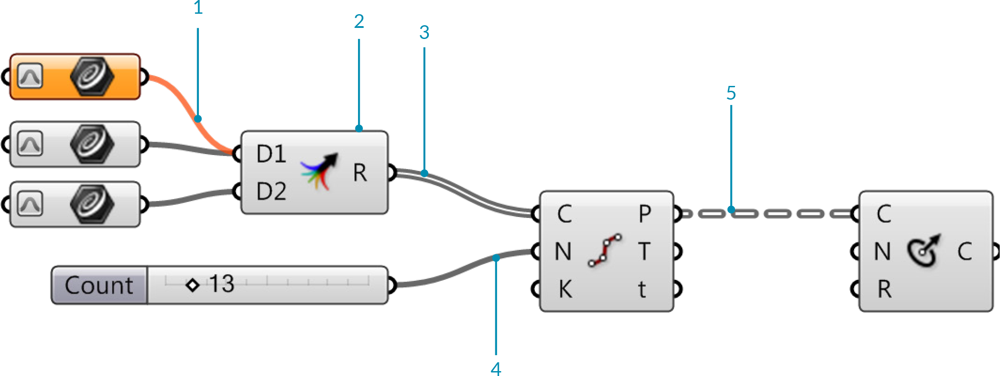

### 1.2.4. KOMPONENTEN VERKABELN

##### Wenn Daten nicht in einem permanenten Satz eines Parameters gespeichert sind, müssen sie von einer anderen Quelle übernommen werden. Daten werden von einer Komponente zur anderen durch Kabel übertragen. Du kannst Dir diese buchstäblich als elektrische Kabel vorstellen, die Datenimpluse von einem Objekt zum anderen übertragen.

#### 1.2.4.1. VERBINDUNGSMANAGEMENT
Um Komponenten zu verbinden, klicke und ziehe nahe dem Kreis an der Ausgabeseite eines Objektes. Ein Verbindungskabel wird an Deiner Maus angeheftet. Sobald die Maus über einem möglichen Zieleingabeparameter schwebt, wird sich das Kabel verbinden und verfestigen. Dies ist keineswegs eine permanente Verbindung, bis Du die Maustaste loslässt. Es macht keinen Unterschied, ob wir die Verbindungen von "links nach rechts" oder von "rechts nach links" erstellen.

>1. Die "Divide Curve" Komponente teilt eine Kurve in gleich lange Segmente.
2. "Curve" Parameter - rechtsklicke und wähle "Set One Curve" um eine Rhinogeometrie zu referenzieren.

>Linksklicke und ziehe ein Kabel vom Ausgabeparameter (1.) eines Objekts zu einem Eingabeparameter (2.) eines anderen.

>4. Wenn Du STRG hältst, wird der Cursor rot werden und die Zielquelle wird aus der Quellenliste entfernt werden.
5. Als Standard werden neue Verbindungen bestehende Verbindungen löschen. Halte SHIFT gedrückt, während Du das Verbindungskabel ziehst um mehrere Quellen zu definieren. Der Cursor wird grün um das additive Verhalten darzustellen.

>6. Du kannst Kabel ebenfalls durch das Kontextpopupmenü entfernen - rechtsklicke auf den Griff am Eingabe- oder Ausgabeparameter und wähle "disconnect".
7. Wenn mehrere Verbindungen bestehen, kannst Du in einer Liste aussuchen, welche Du lösen möchtest.
8. Wenn Du Deine Maus über ein Element bewegst, werden die entsprechenden Verbindungen in rot hervorgehoben.

#### 1.2.4.2. FANCY WIRES
Kabel repräsentieren die Verbindungen, sowie den Fluss der Daten in einem Graph einer Definition. Grasshopper kann nun auch visuellen Hinweise darauf geben, was in den Kabel so vor sich geht. Die Standardeinstellung für diese sogenannten “fancy wires” ist ausgeschalten, weshalb Du sie einschalten musst, bevor Du die verschiedenen Typen von Linien für die Verbindungskabel sehen kannst. Um dies zu tun, klicke einfach auf den "View Tab" in der Hauptmenüleiste und wähle den Knopf genannt “Draw Fancy Wires”. Fancy wires kann Dir viele Informationen darüber geben, welche Typen von Information von einer Komponente zur anderen fließen.

>1. Leeres Element - Ein orangener Kabeltyp zeigt an, dass keine Information darin übertragen wird. Dieser Parameter hat eine Warnung erzeugt weil er keine Daten enthält und damit keine Information über das Kabel gesendet wird.
2. Die "Merge" Komponente ist eine Alternative, um mehrere Quellen mit einem einzelnen Eingabeparameter zu verbinden. 
3. Liste – Wenn die Information, welche von einer Komponente ausfließt, eine Liste von Informationen enthält, wird der Kabeltyp als graue Doppellinie dargestellt.
4. Einzelnes Element – Die Daten aus einem beliebigen Parameter enthalten ein einzelnes Element und das Kabel wird als durchgehende graue Linie dargestellt.
5. Baum – Informationen, die zwischen Komponenten übertragen werden und eine Datenstruktur enthalten, werden als graue, gestrichelte Doppellinie dargestellt.

#### 1.2.4.3. KABELDARSTELLUNG
Wenn Du eine lange Zeit damit zugebracht hast, an einer einzelnen Grasshopper Definition zu arbeiten, hast Du eventuell gemerkt, dass die Leinwand relativ schnell mit einer Menge Kabel zugekleistert wird. Glücklicherweise haben wir die Fähigkeit die Darstellung der Kabel für jeden einzelnen Eingabeparameter einer Komponente zu bestimmen.

Dabei gibt es drei Kabeldarstellungen: "Default Display", "Faint Display", and "Hidden Display". Um die Kabeldarstellung zu bearbeiten, rechtsklicke einfach auf den Eingabeparameter einer Komponente und wähle eine der Darstellungen im "Wire Display" Popupmenü aus.

>1. Versteckte Darstellung – Wenn "hidden display" ausgewählt wurde, wird das Kabel komplett unsichtbar. Die Daten werden dann kabellos von der Quelle zum Eingabeparameter übertragen. Wenn Du die Quelle oder die Zielkomponente auswählst, wird ein grünes Kabel erscheinen und Dir zeigen, welche Komponenten untereinander verbunden sind. Sobald Du die Komponente nicht mehr ausgewählt hast, wird das Kabel wieder verschwinden.
2. Standarddarstellung – Die Option "Default Wire Display" wird alle Verbindungen zeigen (wenn "Fancy Wires" eingeschalten wurde).
3. Matte Darstellung – "Faint Wire Display" zeichnet eine sehr dünne, semitransparente Verbindung. Matte und versteckte Darstellung können sehr hilfreich sein, wenn viele Quellkabel an einem einzelnen Eingabeparameter ankommen.