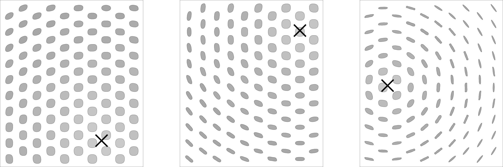


### 1.3.2. Arbeiten mit Attraktoren

#####Attraktoren sind Punkte, die wie virtuelle Magneten wirken - jeder zieht andere Objekte an oder stößt diese ab. In Grasshopper kann jede von Rhino referenzierte oder in Grasshopper erstellte Geometrie als Attraktor verwendet werden. Attraktoren können eine Anzahl von Parametern der sie umgebenden Objekte beeinflussen, inkl. Skalierunng, Rotation, Farbe und Position. Diese Parameter werden im Verhältnis zur Attraktorgeometrie verändert.

>1. Attraktorpunkt
2. Vektoren
3. Kreise orientieren sich in Richtung des Attraktors entsprechend ihrer Normalen

Im Bild oberhalb werden Vektoren zwischen dem Attraktorpunkt und dem Zentrum eines jeden Kreises gezeichnet. Diese Vektoren werden verwendet, um die Ausrichtung der Kreise zu definieren, damit sie immer zum Attraktorpunkt zeigen. Derselbe Attraktor könnte benutzt werden um andere Parameter der Kreise zu verändern. Zum Beispiel könnte der Kreis am nächsten zum Attraktorpunkt größer skaliert werden, indem man die Länge jedes Vektors verwendet, um den Radius eines jeden Kreises zu skalieren.

####1.3.2.1. ATTRAKTORDEFINITION

>Beispieldateien zu diesem Abschnitt: [http://grasshopperprimer.com/appendix/A-2/1_gh-files.html](http://grasshopperprimer.com/appendix/A-2/1_gh-files.html)

>>Beispieldateien zu diesem Abschnitt: [Download](../../appendix/A-2/gh-files/1.3.2.1_attractor definition.gh)


In diesem Beispiel werden wir einen Attraktorpunkt nutzen, um ein Raster aus Kreisen, basierend auf den Vektoren zwischen ihren Zentren und dem Attraktorpunkt, auszurichten. Jeder Kreis wird ausgerichtet, sodass sein Normalenvektor auf den Attraktorpunkt zeigt.

||||
|--|--|--|
|01.| Drücke Strg+N in Grasshopper, um eine neue Definition zu beginnen||
|02.| **Vector/Grid/Hexagonal** -  Ziehe eine **Hexagonal Grid** Komponente auf die Leinwand||
|03.| **Parameter/Input/Slider** - Ziehe zwei **Numeric Sliders** auf die Leinwand||
|04.| Doppelklicke auf den ersten **Numeric Slider** und setze die folgenden Werte:
<ul>Name: Cell Radius Rounding: Floating Point Lower Limit: 0.000 Upper Limit: 1.000 Value: 0.500</ul>||
|05.| Doppelklicke auf den zweiten **Numeric Slider** und setze die folgenden Werte:<ul>Name: # of Cells Rounding: Integers Lower Limit: 0 Upper Limit: 10 Value: 10</ul>||
|06.| Verbinde den **Numeric Slider** (Cell Radius) mit dem Eingabeparameter für die Grösse (S) der **Hexagon Grid** Komponente||
|07.| Verbinde den **Numeric Slider** (# of Cells) mit dem Abmessung X Eingabeparameter (Ex) und mit dem Abmessung Y Eingabeparameter (Ey) der **Hexagon Grid** Komponente|||

||||
|--|--|--|
|08.| **Curve/Primitive/Circle CNR** - Ziehe eine **Circle CNR** Komponente auf die Leinwand||
|09.| Verbinde den Ausgabeparameter für Punkte (P) von **Hexagon Grid** mit dem Zentrumeingabeparameter (C) input der **Circle CNR** Komponente||
|10.| Verbinde den **Numeric Slider** (Cell Radius) mit dem Radius Eingabeparameter (R) der **Circle CNR** Komponente.||
|11.| **Vector/Vector/Vector 2Pt** - Ziehe die **Vector 2Pt** Komponente auf die Leinwand||
|12.| Verbinde den Punktausgabeparameter (P) der **Hexagonal Grid** Komponente zum Basispunkt Eingabeparameter (A) der **Vector 2Pt** Komponente.||
|13.| **Params/Geometry/Point** – Ziehe die **Point** Komponente auf die Leinwand||
|14.| Rechtsklicke die **Point** Komponente und wähle einen Punkt. Im Modellraum kannst Du wählen an welcher Stelle Du den Attraktorpunkt haben möchtest||
|15.| Verbinde die **Point** Komponente mit dem Endpunkteingabeparameter (B) der **Vector 2Pt** Komponente||
|16.| Verbinde den Vektor Ausgabeparameter (V) von **Vector 2Pt** mit dem Normalenvektoreingabeparameter(N) der **Circle CNR** Komponente.|||

||||
|--|--|--|
|17.| **Curve/Util/Offset** – Ziehe die **Offset** Komponente auf die Leinwand.||
|18.| **Params/Input/Slider** - Ziehe einen **Numeric Slider** auf die Leinwand||
|19.| Doppelklicke auf den Schieberegler und setze die folgenden Werte:<ul>Name: Offset Distance Rounding: Floating Point Lower Limit: - 0.500 Upper Limit: 0.500 Value: -0.250</ul>||
|20.| Verbinde den **Numic Slider** (Offset Distance) mit dem Eingabeparameter Distanz (D) der **Offset** Komponente|||

||||
|--|--|--|
|21.| **Surface/Freeform/Boundary Surfaces** – Ziehe **Boundary Surfaces** auf die Leinwand||
|22.| Verbinde den Ausgabeparameter Kurven (C) der **Offset** Komponente mit dem Kanten Eingabeparameter (E) der **Boundary Surfaces** Komponente|||

