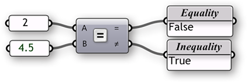
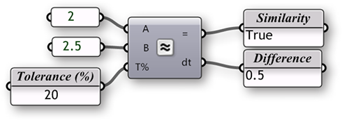



### 1.3.3. Mathematik, Funktionen & Konditionale

>Beispiedateien zu diesem Abschnitt: [http://grasshopperprimer.com/appendix/A-2/1_gh-files.html](http://grasshopperprimer.com/appendix/A-2/1_gh-files.html)

>Beispiedateien zu diesem Abschnitt: [Download](../../appendix/A-2/gh-files/1.3.3_operators and conditionals.gh)


#####Zu wissen, wie man mit numerischen Informationen umgeht, ist eine grundlegende Fertigkeit, die Du lernen musst, um Grasshopper zu nutzen. Grasshopper enthält viele Komponenten, um mathematische Operationen auszuführen, Konditionale auszuwerten und Mengen von Zahlen zu manipulieren.

In der Mathematik werden Zahlen in Mengen organisiert und es gibt zwei mit denen Du wahrscheinlich bekannt bist:

Integer Zahlen: […, -5, -4, -3, -2, -1, 0, 1, 2, 3, 4, 5, …]<br>
Reelle Zahlen: [8, …, -4.8, -3.6, -2.4, -1.2, 0.0, 1.234, e, 3.0, 4.0, …, 8]

Neben anderen Zahlenmengen, die es gibt, interessieren uns diese beiden am meisten, da Grasshopper diese bevorzugt verwendet. Obwohl es Grenzen in der Darstellung dieser Mengen gibt und diese in einer digitalen Umgebung genau definiert sind, können wir sie mit einem hohen Grad an Präzision annähern. Zusätzlich sollten wir die Unterscheidung zwischen integralen Zahlenarten (integers) and Gleitkommazahlen (real numbers) als Unterschied zwischen einer diskreten und einer kontinuierichen Domäne verstehen. In diesem Kapitel werden wir verschiedene Methoden für die Arbeit mit und die Auswertung von verschiedenen Zahlenmengen erkunden. 

####1.3.3.1. DER MATH REITER
Die meisten Komponenten, die mit mathematischen Operationen und Funktionen zu tun haben, können unter den folgenden Unterkategorien des "Math" Reiters gefunden werden:


>1. Domänen werden benutzt, um die Bandbreite von Werten (früher als Intervalle bekannt) zwischen zwei Werten zu definieren. Die Komponenten unter dem "Domain" Reiter erlauben es Dir verschiedene Domänen zu schaffen oder zu zerlegen.
2. In der Mathematik organisiert eine Matrix eine Reihe von Zahlen in Zeilen und Spalten. Diese Unterkategorie enthält eine Reihe von nützlichen Werkzeugen, um Matrizen zu schaffen und zu verändern.
3. Operatoren werden genutzt, um mathematische Operationen, wie Addition, Subtraktion, Multiplikation, u.a. auszuführen. Konditionale Operatoren erlauben es festzulegen, ob eine Menge von Zahlen größer als, kleiner als, oder gleich groß im Vergleich zu einer anderen Menge ist.
4. Polynome sind eines der wichtigsten Konzepte in Algebra, Mathematik und Wissenschaft. Du kannst die Komponenten aus dieser Unterkategorie nutzen, um Fakultäten, Logarithmen oder Exponentiale zu berechnen.
5. Die "Script" Unterkategorie enthält Einzel- und Multivariabel- Ausdrücke, sowie VB.NET and C# Komponenten zur Entwicklung von Skripten.
6. Diese Komponenten ermöglichen es Dir trigonometrische Funktionen, wie Sinus, Kosinus und Tangent zu berechnen.
7. Die "Time" Unterkategorie hat eine Anzahl von Komponenten, die es Dir erlauben Instanzen von Datum und Zeit zu erstellen.
8. Die Unterkategorie "Utility" ist ein Sack von Komponenten, die in einer Bandbreite von mathematischen Gleichungen angewendet werden können. Suche hier, wenn Du versuchst Minima oder Maxima über zwei Listen von Zahlen zu finden oder den Durchschnitt einer Menge von Zahlen zu berechnen.

####1.3.3.2. OPERATOREN
Wie bereits genannt, sind Operatoren eine Menge an Komponenten, die algebraische Funktionen mit zwei numerischen Eingabevariablen nutzen, welche in der Ausgabe eines einzelnen Wertes resultieren.

Die meiste Zeit wirst Du die mathematischen Operatoren in arithmetischen Prozessen im Bezug auf eine Zahlenmenge finden. Jedoch können diese Operatoren auch auf verschiedene Datentypen, inkl. Punkte und Vektoren angewendet werden.


####1.3.3.3. KONDITIONALE OPERATOREN
Fast jede Programmiersprache hat eine Methode, um konditionale Ausdrücke auszuwerten. In den meisten Fällen wird der Programmierer ein Stück Code entwerfen, welches eine einfache Frage wie "Was wäre wenn?" stellt. Was wäre wenn die Fläche einer Stockwerksumgrenzung einen realistischen Betrag überschreitet? Diese wichtigen Fragen stellen eine höhere Ebene der Abstraktion da. Computerprogramme haben die Möglichkeit auszuwerten "was wäre wenn" und entsprechende Aktionen auf die Antwort der Frage folgen zu lassen. Lass uns einen Blick auf ein einfaches Konditional werfen, das ein Programm interpretieren würde: Wenn das Objekt eine Kurve ist, lösche es. Das Stück Code schaut zuerst auf das Objekt und stellt in einer boolschen Variable fest, ob es sich dabei um eine Kurve handelt. Der boolsche Wert ist "wahr", wenn das Objekt eine Kurve ist oder "falsch", wenn das Objekt keine Kurve ist. Der zweite Teil des Ausdrucks führt eine Aktion entsprechend dem Ergebnis des konditionalen Ausdrucks aus; in diesem Fall wird das Objekt gelöscht, wenn es keine Kurve sein sollte. Dieser konditionale Ausdruck wird "If Statement"genannt. In diesem Kontext gibt es vier konditionale Operatoren (in der "Math/Operators" Unterkategorie), die Konditionale auswerten und boolsche Werte ausgeben.

Die "Equality" Komponente nimmt zwei Listen und vergleicht die ersten Elemente der Liste A mit dem ersten Element der Liste B. Wenn die beiden Werte dieselben sind, wird "Wahr" als boolscher Wert ausgegeben; auf der anderen Seite, wenn die beiden Werte ungleich sind, wird "Falsch" ausgegeben. Die Komponente rotiert durch die Liste in Übereinstimmung mit dem "Data Matching" Algorithmus (als Standard ist die Einstellung "Longest List"). Es gibt zwei Ausgabeparameter für diese Komponente. Der erste gibt eine Liste mit boolschen Werten aus, die angibt, welcher der Werte in der einen Liste mit einem in der anderen Liste übereinstimmt. Der zweite Ausgabeparameter gibt eine Liste aus, die zeigt welche Werte nicht gleich den entsprechenden Werten in der zweiten Liste sind - oder eine invertierte Liste im Vergleich zum ersten Ausgabeparameter.



Die "Similarity" Komponente wertet die Daten von zwei Listen aus und prüft diese auf Ähnlichkeit der beiden Zahlen. Sie ist beinahe identisch mit dem Verhalten der "Equality" Komponente, jedoch mit einer Ausnahme: sie hat einen prozentualen Eingabeparameter, der es erlaubt ein Verhältnis der zulässigen Abweichung zwischen Werten der Liste A und der Liste B anzugeben, ausserhalb derer Ungleichheit angenommen wird. Die "Similarity" Komponente hat ausserdem einen Ausgabeparameter, der in absoluten Werten angibt, welche Distanz zwischen den Werten der beiden Listen liegt.



Die "Larger Than" Komponente wird die Daten aus zwei Listen vergleichen und bestimmen, ob der erste Wert von Liste A größer ist als der erste Wert von Liste B. Die beiden Ausgabeparameter erlauben es Dir festzulegen, ob Du die beiden Listen entsprechend der größer als (>) oder größer als oder gleich (>=) Funktion auswerten möchtest.


Die "Smaller Than" Komponente verhält sich entgegengesetzt zur "Larger Than" Komponente. Die "Smaller Than" Komponente bestimmt, ob die Werte einer Liste A kleiner sind als die Werte einer Liste V und gibt die entsprechenden boolschen Werte aus. Ähnlich wie zuvor, kannst Du mit den beiden Ausgabeparametern wählen, ob Du die Listen entsprechend der kleiner als (<) oder kleiner als oder gleich (<=) Funktion auswerten willst.


####1.3.3.4. TRIGONOMETRIE KOMPONENTEN

>Beispieldateien für diesen Abschnitt: [http://grasshopperprimer.com/appendix/A-2/1_gh-files.html](http://grasshopperprimer.com/appendix/A-2/1_gh-files.html)

>Beispieldateien für diesen Abschnitt: [Download](../../appendix/A-2/gh-files/1.3.3.4_trigonometry components.gh)


Wir haben bereits gezeigt, dass wir eine "Expression" (oder "Evaluate") Komponente nutzen können um konditionale Ausdrücke, sowie algebraische Gleichungen auswerten zu können. Jedoch gibt es auch andere Wege, um einfache Ausdrücke mit ein paar eingebauten trigonometrischen Funktionen zu berechnen. Wir können diese Funktionen nutzen, um periodische Phänomene zu beschreiben, wie beispielsweise sinusartige Wellenformen, wie Wellen im Ozean, Schallwellen und Lichtwellen.


>1. Line<br>
```y(t) = 0```
2. Sine Curve<br>
```y(t) = sin(t)```
3. Helix<br>
```x(t) = cos(t)```<br>
```y(t) = sin(t)```<br>
```z(t) = b(t)```
4. Spiral<br>
```x(t) = t*cos(t)```<br>
```y(t) = t*cos(t)```

In diesem Beispiel werden wir Grasshopper benutzen, um verschiedene trigonometrische Kurven mit den trigonomischen Funktionskomponenten aus dem "Math"-Reiter zu beschreiben:

<style>
td:nth-child(1) {color: #008DB2}
td:nth-child(3)	{width: 15%}
td {background-color: #F9F9F9}
thead {display: none}
</style>

||||
|--|--|--|
|01.| Tippe Strg+N (in Grasshopper), um eine neue Definition zu beginnen||
|02.| **Params/Geometry/Point** – Ziehe einen **Point** Parameter  auf die Leinwand|[](../../appendix/A-1/0_index-of-components.html#PGPt)|
|03.| Rechtsklicke den **Point** Parameter und klicke "Set One Point" - wähle einen Punkt aus dem Rhinoansichtsfenster||
|04.| **Vector/Vector/Unit X** – Ziehe eine **Unit X** Komponente auf die Leinwand|[](../../appendix/A-1/0_index-of-components.html#VVX)|
|05.| **Params/Input/Number Slider** – Ziehe eine **Number Slider** Komponente auf die Leinwand|[](../../appendix/A-1/0_index-of-components.html#PISlider)|
|06.| Doppelklicke auf den **Number Slider** und setze folgende Werte:<ul>Rounding: Integer<br>Lower Limit: 10<br>Upper Limit: 40<br>Value: 20</ul>||
|07.|** Transform/Array/Linear Array** – Ziehe eine **Linear Array** Komponente auf die Leinwand|[](../../appendix/A-1/0_index-of-components.html#TAArrLinear)|
|08.| Verbinde den Ausgabeparameter des **Point** Parameters mit dem Geometrie (G) Eingabeparameter der **Linear Array** Komponente||
|09.| Verbinde den Einheitsvektor (V) Ausgabeparameter der **Unit X** Komponente mit dem Richtung (D) Eingabeparameter der**Linear Array** Komponente<br><blockquote>Du solltest eine Linie mit 20 Punkten entlang der x-Achse in Rhino sehen. Passe den Schieberegler an, um die Anzahl der Punkte in der Reihe zu verändern.</blockquote>||
|10.| Verbinde den **Number Slider** Ausgabeparameter mit dem Anzahl (N) Eingabeparameter der **Linear Array** Komponente||
|11.| **Curve/Spline/Interpolate** – Ziehe eine **Interpolate Curve** Komponente auf die Leinwand|[](../../appendix/A-1/0_index-of-components.html#CSIntCrv)|
|12.| Verbinde den Geometrie (G) Ausgabeparameter der **Linear Array** Komponente mit dem Eckpunkte (V) Eingabeparameter der **Interpolate Curve** Komponente|||


>Wir habe gerade eine Linie erzeugt, indem wir eine Reihe von Punkten zu einer Kurve verbunden haben. Lass uns nun versuchen die Trigonometriekomponenten in Grasshopper zu nutzen, um die Kurve zu verändern:

||||
|--|--|--|
|13.| **Vector/Point/Deconstruct** – Ziehe eine **Deconstruct** Komponente auf die Leinwand|[](../../appendix/A-1/0_index-of-components.html#VPpDecon)|
|14.| **Vector/Point/Construct Point** - Ziehe eine **Construct Point** Komponente auf die Leinwand|[](../../appendix/A-1/0_index-of-components.html#VPPt)|
|15.| **Maths/Trig/Sine** - Ziehe eine **Sine** Komponente auf die Leinwand|[](../../appendix/A-1/0_index-of-components.html#MTSin)|
|16.| Entferne das Kabel vom Eckpunkte (V) Eingabeparameter der **Interpolate Curve** Komponente.<br><blockquote>Du kannst Kabel entfernen, indem Du mit gedrückter Strg-Taste entlangziehst oder indem Du auf den Eingabeparameter rechtsklickst und "Disconnect" auswählst.</blockquote>||
|17.| Verbinde den Geometrie (G) Ausgabeparameter der **Linear Array** Komponente mit dem Punkt (P) Eingabeparameter der **Deconstruct** Komponente||
|18.| Verbinde den Punkt X (X) Ausgabeparameter der **Deconstruct** Komponente mit dem X Koorinate (X) 
Eingabeparameter der**Construct Point** Komponente||
|19.| Verbinde ein zweites Kabel vom Punkt X (X) Ausgabeparameter der **Deconstruct** Komponente mit dem Wert (x) Eingabeparameter der **Sine** Komponente||
|20.| Verbinde den Ergebnis (y) Ausgabeparameter der **Sine** Komponente mit dem Y Koordinate (Y) Eingabeparameter der **Construct Point** Komponente<br><blockquote>Wir haben nun unsere Punkte mit den gleichen x-Werten rekonstruiert und dabei die y-Werte mit der Sinuskurve modifiziert.</blockquote>||
|21.| Verbinde den Punkt (Pt) Ausgabeparameter der **Construct Point** Komponente mit dem Eckpunkte (V) Eingabeparameter der**Interpolate** Komponente|||

</li><br>
>Du solltest nun eine Sinuskurve entlang der x-Achse in Rhino sehen

||||
|--|--|--|
|22.| **Maths/Trig/Cosine** – Ziehe eine **Cosine** Komponente auf die Leinwand|[](../../appendix/A-1/0_index-of-components.html#MTCos)|
|23.| Verbinde ein drittes Kabel mit dem Punkt X (X) Ausgabeparameter der **Deconstruct** Komponente mit dem Wert (x) Eingabeparameter der **Cosine** Komponente||
|24.| Verbinde den Ergebnis (y) Ausgabeparameter der **Cosine** Komponente mit dem Z Koordinate (Z) Eingabeparameter der**Construct Point** Komponente|||

</li><br>
>Wir haben nun eine dreidimensionale Helix

||||
|--|--|--|
|25.| **Maths/Operators/Multiplication** – Ziehe zwei **Multiplication** Komponenten auf die Leinwand|[](../../appendix/A-1/0_index-of-components.html#MOMultiply)|
|26.| Verbinde Kabel von den Punkt X (X) Ausgabeparameter der **Deconstruct** Komponente mit den (A) Eingabeparametern jeder**Multiplication** Komponente||
|27.| Verbinde den Ergebnis (y) Ausgabeparameter der **Sine** Komponente mit dem (B) Eingabeparameter der ersten **Multiplication** Komponente||
|28.| Verbinde den Ergebnis (y) Ausgabeparameter der **Cosine** Komponente mit dem (B) Eingabeparameter der zweiten**Multiplication** Komponente||
|29.| Verbinde die Kabel des Y Koordinate (Y) Eingabeparameter mit dem Eingabeparameter der **Construct Point** Komponente||
|30.| Verbinde den Ergebnis (R) Ausgabeparameter der ersten **Multiplication** Komponente mit dem X Koordinate (X) Eingabeparameter der **Construct Point** Komponente||
|31.| Verbinde den Ergebnis (R) Ausgabeparameter der zweiten **Multiplication** Komponente mit dem Z Koordinate (Z) Eingabeparameter der **Construct Point** Komponente|||


>Du solltest nun eine spiralförmige Kurve sehen


####1.3.3.5. EXPRESSIONS

>Beispieldateien für diesen Abschnitt: [http://grasshopperprimer.com/appendix/A-2/1_gh-files.html](http://grasshopperprimer.com/appendix/A-2/1_gh-files.html)

>Beispieldateien für diesen Abschnitt: [Download](../../appendix/A-2/gh-files/1.3.3.5_expressions.gh)


Die "Expression" Komponente (und ihr Bruder die "Evaluate" Komponente) sind sehr flexible Werkzeuge; dazu ist zu sagen, dass sie für eine Vielzahl von verschiedenen Anwendungen genutzt werden können. Wir können die "Expression" (oder die "Evaluate" Komponente) heranziehen, um mathematische Algorithmen auszuwerten und numerische Daten als Ausgabeparameter zurückzugeben.


In den folgenden Beispielen werden wir uns mathematische Spiralen ansehen, die in der Natur gefunden werden können, und wie wir mit wenigen Funktionskomponenten ähnliche Muster in Grasshopper erzeugen können. Wir werden in unserer Definition trigonometrische Kurven als Ausgangspunkt wählen.

||||
|--|--|--|
|01.| Öffne die trigonometrische Kurven Definition aus dem vorherigen Beispiel||
|02.| Lösche die **Sine**, **Cosine**, **Multiplication**, und **Interpolate** Komponenten||
|03.| **Params/Input/Number Slider** – Ziehe einen Schieberegler auf die Leinwand||
|04.| Doppelklicke auf den **Number Slider** und setze folgende Werte:<ul>Rounding: Float<br>Lower Limit: 0.000<br>Upper Limit: 1.000<br>Value: 1.000</ul>||
|05.| Verbinde den **Number Slider** mit dem Faktor (F) Eingabeparameter der "Unit X" Komponente.<br><blockquote>Die Schieberegler erlauben es Dir die Distanz zwischen den Punkten der Reihe zu verändern.</blockquote>||
|06.| **Maths/Script/Expression** – Ziehe zwei **Expression** Komponenten auf die Leinwand|[](../../appendix/A-1/0_index-of-components.html#MSExpression)|
|07.| Doppelklicke die erste **Expression** Komponente um den "Expression Editor" zu öffnen und ändere den Ausdruck in: ```x*sin(x)```||
|08.| Doppelklicke die zweite **Expression** Komponente um den "Expression Editor" zu öffnen und ändere den Ausdruck in: ```x*cos(x)```|||


>Doppelklicke die "Expression" Komponente, um den Grasshopper "Expression Editor" zu öffnen

||||
|--|--|--|
|09.| Verbinde die beiden Kabel des Punkt X (X) Ausgabeparameters der **Deconstruct** Komponente mit dem Variable x (x) Eingabeparameter jeder **Expression** Komponente||
|10.| Verbinde den Ergebnis (R) Ausgabeparameter mit der ersten **Expression** Komponente mit dem X Koordinate (X) Eingabeparameter der **Construct Point** Komponente||
|11.| Verbinde den Ergebnis (R) Ausgabeparameter der zweiten **Expression** Komponente mit dem Y Koordinate (Y) Eingabeparameter der **Construct Point** Komponente<br><blockquote>Wir haben die trigonometrischen Funktionen und Multiplikationsoperatoren mit den "Expression" Komponenten ersetzt und dadurch eine effizientere Definition erzeugt.</blockquote>||
|12.| **Mesh/Triangulation/Voronoi** – Ziehe eine **Voronoi** Komponente auf die Leinwand|[](../../appendix/A-1/0_index-of-components.html#MTVoronoi)|
|13.| **Params/Input/Number Slider** – Ziehe einen **Number Slider** auf die Leinwand||
|14.| Doppelklicke auf den **Number Slider** und setze folgende Werte:<ul>Rounding: Integer<br>Lower Limit: 1<br>Upper Limit: 30<br>Value: 30</ul>||
|15.| Verbinde den **Number Slider** mit dem Radius (R) Eingabeparameter der **Voronoi** Komponente||
|16.| Verbinde den Punkt (Pt) Ausgabeparameter der **Construct Point** Komponente mit dem Punkte (P) Eingabeparameter der **Voronoi** Komponente|||


Du kannst verschiedene Voronoimuster durch die Manipulation der Werte für "Factor, "Count" und "Radius" mit den Schiebereglern erzeugen. Unterhalb sind drei Beispiele:


>1. Factor = 1.000, Radius = 15
2. Factor = 0.400, Radius = 10
3. Factor = 0.200, Radius = 7

---

