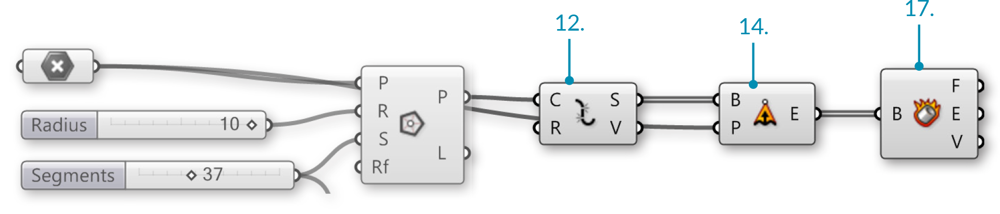


###1.3.4. Domaenen & Farben


>Beispieldateien fuer diesen Abschnitt: [http://grasshopperprimer.com/appendix/A-2/1_gh-files.html](http://grasshopperprimer.com/appendix/A-2/1_gh-files.html)

>>Beispieldateien fuer diesen Abschnitt: [Download](../../appendix/A-2/gh-files/1.3.4_domains and color.gh)


#####Das Farbrad ist ein Modell um Farben basierend auf ihrem Farbton zu organisieren. In Grasshopper werden Farben durch einen Farbton zwischen 0.0 to 1.0 beschrieben. Domaenen werden verwendet um ein Spektrum an moeglichen Werten zwischen einer Untergrenze (A) und einer Obergrenze (B) anzugeben.

>Auf dem Farbrad entspricht der Farbton dem Winkel. Grasshopper hat diese 0-360 Domaene genommen und auf eine zwischen null und eins uebertragen.

Indem die Farbtondomaene (0.0 to 1.0) mit der Anzahl an gewuenschten Segmenten unterteilt wird, koemmem wor dem Wert des Farbtons dem entsprechenden Segment zuordnen um ein Farbrad zu erzeugen.

In diesem Beispiel werden wir Grasshopper's Domaenen und Farbkomponenten heranziehen um ein Farbrad mit variabler Anzahl von Segmenten zu erzeugen.

||||
|--|--|--|
|01.| Tippe Ctrl+N (in Grasshopper) um eine neue Definition zu erzeugen||
|02.| **Curve/Primitive/Polygon** – Ziehe eine **Polygon** Komponente auf die Leinwand||
|03.| **Params/Geometry/Point** – Ziehe einen **Point** Parameter auf die Leinwand||
|04.| Rechtsklicke auf die **Point** Komponente und waehle "Set one point"||
|05.| Waehle einen Punkt aus dem Modellraum.||
|06.| Verbinde den **Point** Parameter (Basispunkt) mit dem Ebene (P) Eingabeparameter der **Polygon** Komponente||
|07.| **Params/Input/Number Sliders** – Ziehe zwei **Number Sliders** auf die Leinwand||
|08.| Doppelklicke den ersten **Number Sliders** und setze folgende Werte:<ul>Rounding: Integers Lower Limit: 0 Upper Limit: 10 Value: 10</ul>||
|09.| Doppelklicke den zweiten **Number Sliders** und setze folgende Werte:<ul>Rounding: Integers Lower Limit: 0 Upper Limit: 100 Value: 37</ul>||
|10.| Verbinde den **Number Slider** (Radius) mit dem Radius (R) Eingabeparameter der **Polygon** Komponente <blockquote>Wenn Du den Schieberegler mit einer Komponente verbindest, aendert er automatisch seinen Namen in den des Eingabeparameters mit dem er verbunden wird.</blockquote>||
|11.| Verbinde den **Number Slider** (Segmente) mit dem segmente (S) Eingabeparameter der **Polygon** Komponente|||

||||
|--|--|--|
|12.| **Curve/Util/Explode** – Ziehe eine **Explode** Komponente auf die Leinwand.||
|13.| Verbinde den Polygon (P) Ausgabeparameter der **Polygon** Komponente mit dem Kurve (C) Eingabeparameter der **Explode** Komponente||
|14.| **Surface/Freeform/Extrude Point** – Ziehe eine **Extrude Point** Komponente auf die Leinwand||
|15.| Verbinde den Segmente (S) Ausgabeparameter der **Explode** Komponente mit dem Basis (B) Eingabeparameter von **Extrude Point**||
|16.| Verbinde den **Point** Parameter (Basispunkt) mit dem Extrusionsspitze (P) Eingabeparameter der **Extrude Point** Komponente||
|17.| **Surface/Analysis/Deconstruct Brep** – Ziehe eine **Deconstruct Brep** Komponente auf die Leinwand||
|18.| Verbinde den Extrusion (E) Ausgabeparameter der **Extrude Point** Komponente mit der **Deconstruct Brep** (B) Komponente|||

||||
|--|--|--|
|19.| **Maths/Domain/Divide Domain** – Ziehe eine **Divide Domain** Komponente auf die Leinwand<blockquote>Die Basisdomaene (I) ist automatisch zwischen 0.0-1.0, was wir fuer diese Uebung benoetigen</blockquote>||
|20.| Verbinde den **Number Slider** (Segmente) mit dem Anzahl (C) Eingabeparameter der **Divide Domain** Komponente||
|21.| **Math/Domain/Deconstruct Domain** – Ziehe eine **Deconstruct Domain** Komponente auf die Leinwand||
|22.| Verbinde den Segmente (S) Ausgabeparameter der **Divide Domain** Komponente mit dem Domaene (I) Eingabeparameter der **Deconstruct Domain** Komponente||
|23.| **Display/Colour/Colour HSL** – Ziehe eine **Colour HSL** Komponente auf die Leinwand||
|24.| Verbinde den Start (S) Ausgabeparameter der **Deconstruct Domain** Komponente mit dem Farbton (H) Eingabeparameter der **Colour HSL** Komponente||
|25.| **Display/Preview/Custom Preview** – Ziehe eine **Custom Preview** Komponente auf die Leinwand||
|26.| Rechtsklicke auf den Geometrie (G) Eingabeparameter der **Custom Preview** Komponente und waehle "Flatten"<blockquote>Siehe 1-4 gestalten mit Datenbaeumen fuer Details</blockquote>||
|27.| Verbinde den Seitenflaechen (F) Ausgabeparameter der **Deconstruct Brep** Komponente mit dem Geometrie(G) Eingabeparameter der **Custom Preview** Komponente||
|28.| Verbinde den Farb (C) Ausgabeparameter der **Colour HSL** Komponente mit dem Schattierung (S) Eingabeparameter der **Custom Preview** Komponente|||

Fuer verschiedene Farbeffekte, versuche die "Deconstruct Domain" Komponente mit den Saettigungs (S) oder Leuchtdichte (L) Eingabeparametern der "Colour HSL" Komponente zu verbinden.

