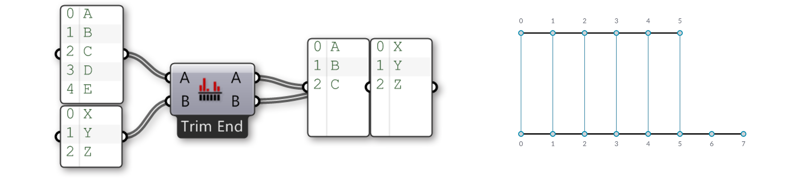

### 1.4.3. Abgleichung von Datenstroemen

>Beispiele zu diesem Abschnitt: [http://grasshopperprimer.com/appendix/A-2/1_gh-files.html](http://grasshopperprimer.com/appendix/A-2/1_gh-files.html)

>Beispiele zu diesem Abschnitt: [Download](../../appendix/A-2/gh-files/1.4.3_data matching.gh)


#####Datenabgleich ist ein Problem ohne saubere Loesung. Es taucht auf, wenn eine Komponente Zugriff auf Eingabeparameter mit unterschiedlicher Anzahl von Datenelementen hat. Die Veraenderung des Datenabgleichalgorithmus kann zu sehr verschiedenen Ergegnissen fuehren.

Stelle Dir eine Komponente vor, die eine Linie zwischen Punkten zeichnet. Sie wird zwei Eingabeparameter haben, die beide Punktkoordinaten beinhalten (Liste A und Liste B):

Wie Du hier sehen kannst gibt es verschiedene Arten die Linien von einer Menge von Punkten zur anderen zu zeichnen. Neu in Grasshopper 0.9 sind die drei Komponenten zum Datenabgleich, die im "Sets/List" Reiter gefunden werden: "Shortest List", "Longest List", und "Cross Reference". Diese neuen Komponenten erlauben groessere Flexibilitaet der drei grundlegenden Datenabgleichalgorithmen. Ein Rechtsklick auf die jeweilige Komponente gibt die Moeglichkeit mehrere Datenabgleichoptionen aus einem Menu auszuwaehlen.

Der einfachste Weg ist es die Elemente des Eingabeparameters eins zu eins zu verbinden bis der Datenstrom abreisst. Dis nennt man **“Shortest List”** Algorithmus:

>Waehle eine Option fuer den Datenabgleichalgorithmus aus dem Komponentenmenu, indem Du auf die Komponente rechtsklickst.

Der **“Longest List”** Algorithmus verbindet Elemente des Eingabeparameters bis beide Datenstroeme abreissen. Dis ist das Standardverhalten der Komponente:

Schliesslich macht die **“Cross Reference”** Methode alle moeglichen Verbindungen:

Dies ist grundsaetzlich gefaehrlich, da die Anzahl von Elementen im Ausgabeparameter enorm sein kann. Das Problem wird offensichtlicher, wenn mehr Eingabeparameter involviert sind und die volatile Datenvererbung die Daten vervielfacht, aber die Logik der Definition die selbe bleibt.

Lass uns die "Shortest List" Komponente etwas genauer ansehen:

In diesem Fall haben wir zwei Eingabelisten {A,B,C,D,E} und {X,Y,Z}. Benutzen wir die "Trim End" Option, so werden die beiden letzten Elemente der ersten Liste ausser acht gelassen, do dass die beiden Listen die gleiche Laenge haben.

Die "Trim Start" Option laesst die beiden ersten Elemente der ersten Liste asser acht, so dass die beiden Listen die gleiche Laenge haben.

Die "Interpolate" Option ueberspringt das zweite und vierte Element der ersten Liste. Nun sehen wir uns die "Cross Reference" Komponente an:

Nun haben wir zwei Eingabelisten {A,B,C} und {X,Y,Z}. Normalerweise wuerde Grasshopper ueber beide Listen iterieren und die Kombinationen {A,X}, {B,Y} und {C,Z} bilden. Hier jedoch werden sechs weitere Kombinationen beruecksichtigt: {A,Y}, {A,Z}, {B,X}, {B,Z}, {C,X} und {C,Y}. Wie Du sehen kannst besteht die Ausgabe der "Cross Reference" Komponente momentan aus neun Permutationen.

Wir koenen das Verhalten der "Cross Reference" Komponente in einer Tabelle darstellen. Die Zeilen repraesentieren die erste Liste und ihre Elemente, die Spalten die zweite. Wenn wir alle moeglichen Permutationen erzeugen, wird die Tabelle in jeder Zelle einen Punkt haben, da jede Zelle eine einzigartige Kombination von zwei Quellelementen darstellt.

Manchmal jedoch moechtest Du nicht alle moeglichen Permutationen erhalten. Manchmal willst Du bestimmte Zonen aussparen, weil sie bedeutungslose oder falsche Berechnungen liefern wuerden. Ein haeufiges Ausschlussprinzip ist es alle Zellen auszusparen, die auf der Diagonale der Tabelle liegen (diese Option ist als "diagonal" in der "Cross Reference" Komponente enthalten) und schliesst die Kombinationen {0,0}, {1,1}, {2,2} und {3,3} aus.
Wenn wir dies auf unsere Listen {A,B,C}, {X,Y,Z} anwenden, wuerden wir erwarten die Kombinationen {A,X}, {B,Y} und {C,Z} vorzufinden:

Die Regel fuer den diagonalen Datenabgleich ist: “Ueberspringe alle Permutationen, in denen die Elemente jeweils den selben Listenindex haben”. ‘Coincident’ Datenabgleich ist der selbe Algorithmus wie Datenabgliech, wenn zwei Listen als Eingabe vorhanden sind, aber die Regel ist etwas anders: “Lasse alle Permutationen aus, in denen zwei Elemente die selben Listenindices aufweisen”.

Die vier verbleibenden Datenabgleichalgorithmen sind alle Variationen des selben Themas. ‘Lower triangle’ Datenabgleich wendet folgende Regel an: “Lasse alle Permutationen aus, in denen eder Index eines Elementes niedriger ist als der Index des Elementes in der naechsten Liste”, was zu einem leeren Dreieck fuehrt, das aber Elemente auf der Diagonale beinhaltet.

‘Lower triangle (strict)’ Datenabgleich geht einen Schritt weiter, indem er auch die Elemente auf der Diagonale ausspart:

‘Upper Triangle’ und ‘Upper Triangle (strict)’ spiegeln das Verhalten des vorher beschriebenen Algorithms, was zu einem leeren Dreieck auf der anderen Seite der Diagonale fuehrt.
