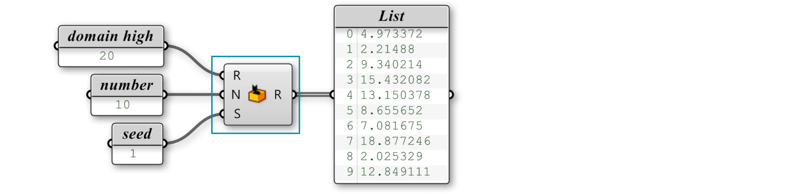

### 1.4.4. Listen erstellen

>Beispieldateien für diesen Abschnitt: [http://grasshopperprimer.com/appendix/A-2/1_gh-files.html](http://grasshopperprimer.com/appendix/A-2/1_gh-files.html)

>Beispieldateien für diesen Abschnitt: [Download](../../appendix/A-2/gh-files/1.4.4_list creation.gh)


#####Es gibt viele verschiedene Wege um Listen in Grasshopper zu erzeugen. Weiter unten werden wir ein paar Methoden zur Erzeugung von Listen anschauen und dann genauer untersuchen, wie die Daten genutzt werden können um Informationen im Ansichtsfenster zu visualisieren.

####1.4.4.1. HÄNDISCHE ERZEUGUNG VON LISTEN
Vielleicht der einfachste Weg um Listen zu erstellen (und die am meisten übersehene Methode) ist die händische Eingabe von Werten einer Liste in einen Parameter. Die Nutzung dieser Methode erhöht die Verantwortung, die der Nutzer trägt, weil diese Methode auf der direkten Eingabe durch den Nutzer beruht (d.h. persistente Daten) um die Liste zu erstellen. Damit die Werte der Liste verändert werden, muss der Nutzer jeden einzelnen Wert individuell eingeben, was sich entsprechend schwierig gestaltet, wenn die Liste viele Werte beinhaltet. Es gibt einige Wege um Listen händisch zu erstellen. Ein Weg ist es einen Zahlenparameter zu nutzen. Rechtsklicke auf den Zahlenparameter und wähle “Manage Number Collection.”

>1. Rechtsklicke den Zahlenparameter um den "Number collection Manager" zu öffnen.
2. Klicke das "Add Item" Symbol um eine Zahl zur Liste hinzuzufügen.
3. Doppelklicke eine Zahl um ihren Wert zu ändern.

Eine andere Methode ist die manuelle Eingabe der Liste in ein Paneel. Versichere Dich, dass die Option “Multiline Data” ausgeschaltet ist.

####1.4.4.2. RANGE
Die "Range" Komponente, die unter "Sets/Sequence/Range" gefunden werden kann, erzeugt eine Liste von gleichmäßig verteilten Zahlen zwischen einem Tief- und einem Hochwert, genannt Domäne. Eine Domäne (manchmal auch Intervall genannt) besteht aus jeder möglichen Zahl zwischen zwei numerischen Extremen.

Eine "Range" Komponente unterteilt eine numerische Domäne in gleiche Segmente und gibt eine entsprechende Liste von Werten aus.

>1. Anzahl von Schritten = 10
2. Domäne erstreckt sich von 0 bis 1
3. Gesamtanzahl von Punkten = 13

Im Beispiel unterhalb wurde die numerische Domäne zwischen 0 und 20 definiert. Die  "Range" Komponente nimmt diese Domäne und teilt sie durch die Anzahl von Schritten (in diesem Fall 10). Nun haben wir 10 gleichmäßig verteilte Segmente. Die "Range" Komponente gibt die Liste von Werten zurück. Weil der erste und letzte Wert der Liste erhalten bleiben, ergibt die Ausgabe einer "Range" Komponente immer eine Zahl mehr als die angegebene Anzahl von Schritten. Im Beispiel oben haben wir 10 Schritte angegeben, also liefert die "Range" Komponente 11 Werte.

>Erstelle eine Liste mit der "Range" Komponente, indem Du eine Domäne und eine Anzahl von Schritten definierst.

Dir ist vielleicht aufgefallen, dass an dem eben erstellten Setup etwas seltsam ist. Wir wissen, dass eine Domäne immer durch zwei Werte definiert wird (dem Hoch- und Tiefwert). Jedoch haben wir in unserer Definition nur einen einzelnen Wert mit dem Eingabeparameter der Domäne verbunden. Um Fehler zu vermeiden, nimmt Grasshopper an, dass wir versuchen eine Domäne zu erstellen, die von null bis zu einem bestimmten Wert (dem Wert unseres Schiebereglers) geht. Damit die Reihe zwischen zwei Werten erstellt wird, die nicht bei null beginnen, muessen wir die "Construct Domain" Komponente nutzen um die Domäne zu spezifizieren.

>Um eine Reihe mit einer Domäne zu erstellen, die nicht bei null beginnt, nutze die "Construct Domain" Komponente.

####1.4.4.3. SERIEN
Die "Series" Komponente ist ähnlich zur "Range" Komponente, da sie auch eine Liste mit Zahlen erstellt. Jedoch ist die "Series" Komponente auch verschieden, weil sie eine Reihe von bestimmten Zahlen erstellt, die durch einen Startwert, die Schrittgröße und die Anzahl der gewünschten Werte beschrieben wird.

>Die "Series" Komponente erstellt eine Liste basierend auf einem Startwert, der Schrittgröße und der Anzahl von Werten, die in der Liste enthalten sein sollen.

###1.4.4.4. RANDOM
Die "Random" Komponente (Sets/Sequence/Random) kann sogenannte pseudorandomierte Werte erzeugen. Sie werden "pseudo" randomiert genannt, da sie eine einzigartige Zahlenfolge beschreiben, die stabil aus einem Samenwert hervorgehen. Deshalb kannst Du eine komplett zufällige Zahl nur dadurch erzeugen, dass Du den Samenwert veränderst (S Eingabeparameter). Die Domäne, wie im vorangegangenen Beispiel, wird durch ein Intervall zwischen zwei numerischen Extremen definiert.

