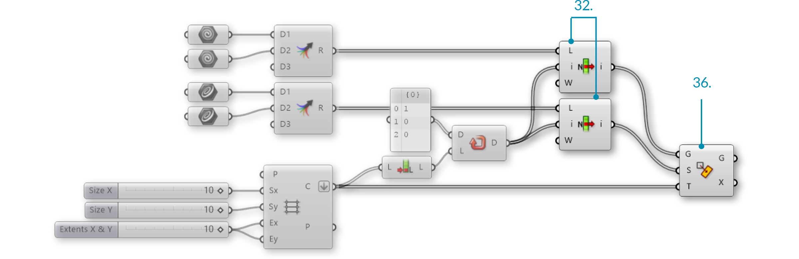


### 1.4.7. MIT LISTEN ARBEITEN

>Beispieldateien zu diesem Abschnitt: [http://grasshopperprimer.com/appendix/A-2/1_gh-files.html](http://grasshopperprimer.com/appendix/A-2/1_gh-files.html)


>>Beispieldateien zu diesem Abschnitt: [Download](../../appendix/A-2/gh-files/1.4.7_working with lists.gh)



Lass uns einen Blick auf ein Beispiel werfen, das die Komponenten des vorausgegangenen Abschnitts beinhaltet. In diesem Beispiel werden wir ein Fliesenmuster erzeugen, das durch die Abbildung von Geometrie auf ein Raster erzeugt wird. Das Muster wird durch die Nutzung der "List Item" Komponente erzeugt um die gewünschte Fliese aus einer Liste von Geometien zu beziehen.

>1. Geometrie entsprechend Index 1
2. Geometrie entsprechend Index 0
3. Rechtwinkliges Raster

>1. Abbildungsmuster
2. Abgebildete Geometrie

||||
|--|--|--|
|01.| Beginne eine Rhinoceros Datei. ||
|02.| Erstelle zwei gleichgroße Quadrate.||
|03.| Erstelle verschiedene Geometrien innerhalb der beiden Quadrate. <blockquote>Im oben dargestellten Beispiel haben wir eine einfache Fläche mit einem Knick erstellt. Der Knick ist ausgerundet, um die Ausrichtung darzustellen und die Basis ist ausgerundet um die beiden Geometrien zu unterscheiden.</blockquote>||
|04.| Beginne eine neue Definition, drücke Strg+N (in Grasshopper).||
|05.| **Params/Geometry/Geometry** – Ziehe zwei **Geometry** Parameter auf die Leinwand.| |
|06.| Rechtsklicke den ersten **Geometry** Parameter und wähle "Set one Geometry". Referenziere die erste Geometrie. ||
|07.| Rechtsklicke auf den zweiten **Geometry** Parameter und wähle "Set one Geometry". Wähle die zweite Geometrie, die Du referenzieren willst.  <blockquote>Es ist möglich mehrere Geometrien in einem einzigen Parameter zu referenzieren, aber der Einfachkeit halber werden wir zwei verschiedene Parameterkomponenten benutzen.</blockquote>||
|08.| **Params/Geometry/Curve** – Ziehe zwei **Curve** Parameter auf die Leinwand.||
|09.| Rechtsklicke den ersten **Curve** Parameter und wähle "Set one Curve". Wähle die erste Kurve, die Du referenzieren möchtest.||
|10.| Rechtsklicke den zweiten **Curve** Parameter und wähle "Set one Curve". Wähle die zweite Kurve, die Du referenzieren möchtest.  <blockquote>Versichere Dich, dass die Geometrie und das Quadrat, welche Du auswählst, miteinander korrespondieren.</blockquote>||
|11.| **Vector/Grid/Rectangular** – Ziehe eine **Rectangular Grid** Komponente auf die Leinwand. ||
|12.| **Params/Input/Slider** - Ziehe drei **Number Sliders** auf die Leinwand||
|13.| Doppelklicke auf den ersten **Number Slider** und setze folgende Werte:<ul>Rounding: Integers Lower Limit: 0 Upper Limit: 10 Value: 10 </ul>||
|14.| Doppelklicke auf den zweiten **Number Slider** und setze folgende Werte:<ul>Rounding: Integers Lower Limit: 0 Upper Limit: 10 Value: 10 </ul>||
|15.| Doppelklicke den dritten **Number Slider** und setze folgende Werte:<ul>Name: Extents X & Y Rounding: Integers Lower Limit: 0 Upper Limit: 10 Value: 10 </ul>||
|16.| Verbinde den ersten **Number Slider** mit dem Größe X (Sx) Eingabeparameter der **Rectangular Grid** Komponente.||
|17.| Verbinde den zweiten **Number Slider** mit dem Größe Y (Sy) Eingabeparameter der **Rectangular Grid** component.||
|18.| Verbinde den dritten **Number Slider** mit dem Abmessung X (Ex) Eingabeparameter und dem Abmessung Y (Ey) Eingabeparameter der **Rectangular Grid** Komponente.|||

||||
|--|--|--|
|19.| **Sets/Tree/Merge** – Ziehe zwei **Merge** Komponenten auf die Leinwand.||
|20.| Verbinde den ersten **Geometry** Parameter mit dem Datenstrom 1 (D1) Eingabeparameter der ersten **Merge** Komponente. ||
|21.| Verbinde den zweiten **Geometry** Parameter mit dem Datenstrom 2 (D2) Eingabeparameter der ersten **Merge** Komponente. ||
|22.| Verbinde den ersten **Curve** Parameter mit dem Datenstrom 1 (D1) Eingabeparameter der zweiten **Merge** Komponente. ||
|23.| Verbinde den zweiten **Curve** Parameter mit dem Datenstrom 2 (D2) Eingabeparameter der zweiten**Merge** Komponente. ||
|24.| Rechtsklicke auf den Zellen (C) Ausgabeparameter der **Rectangular Grid** Komponente und wähle "Flatten". |||

||||
|--|--|--|
|25.| **Sets/List/List Length** – Ziehe eine **List Length** Komponente auf die Leinwand.||
|26.| Verbinde den Zellen (C) Ausgabeparameter der **Rectangular Grid** Komponente mit dem Liste (L) Eingabeparameter der **List Length** Komponente. ||
|27.| **Sets/Sequence/Repeat Data** – Ziehe eine **Repeat Data** Komponente auf die Leinwand.||
|28.| Verbinde den Laenge (L) Ausgabeparameter der **List Length** Komponente mit dem Laenge (L) Eingabeparameter der **Repeat Data** Komponente. ||
|29.| **Params/Input/Panel** – Ziehe ein **Panel** auf die Leinwand.||
|30.| Doppelklicke das **Panel**. Deaktiviere "Multiline Data", "Wrap Items" und "Special Codes".
Gib folgenden Text ein:<ul>1 0 0</ul> <blockquote>Dies ist das Muster in dem die Geometrien verteilt werden. 0 ruft die erste referenzierte Geometrie auf und 1 ruft die zweite referenzierte Geometrie auf. Änderungen an der Reihenfolge der Zahlen oder an den Abmessungen des Rasters werden das Muster verändern.</blockquote>||
|31.| Verbinde das **Panel** mit dem Daten (D) Eingabeparameter der **Repeat Data** Komponente.|||

||||
|--|--|--|
|32.| **Sets/List/List Item** – Ziehe zwei **List Item** Komponenten auf die Leinwand.||
|33.| Verbinde den Ergebnis (R) Ausgabeparameter der ersten **Merge** Komponente mit dem Liste (L) Eingabeparameter der ersten **List Item** Komponente.||
|34.| Verbinde den Ergebnis (R) Ausgabeparameter der zweiten **Merge** Komponente mit dem Liste (L) Eingabeparameter der zweiten **List Item** Komponente.||
|35.| Verbinde den Daten (D) Ausgabeparameter der **Repeat Data** Komponente mit dem Index (i) Eingabeparameter der ersten und zweiten **List Item** Komponente.||
|36.| **Transform/Affine/Rectangle Mapping** – Ziehe eine **Rectangle Mapping** Komponente auf die Leinwand.||
|37.| Verbinde den Zellen (C) Ausgabeparameter der **Rectangular Grid** Komponente mit dem Ziel (T) Eingabeparameter der **Rectangular Mapping** Komponente.||
|38.| Verbinde den Elemente (I) Ausgabeparameter der ersten **List Item** Komponente mit dem Geometrie (G) Eingabeparameter der **Rectangular Mapping** Komponente.||
|39.| Verbinde den Elemente (I) Ausgabeparameter der zweiten **List Item** Komponente mit dem Quelle (S) Eingabeparameter der **Rectangular Mapping** Komponente.|||

Veränderungen an der Eingabegeometrie und am Muster werden das Fliesenmuster verändern.

