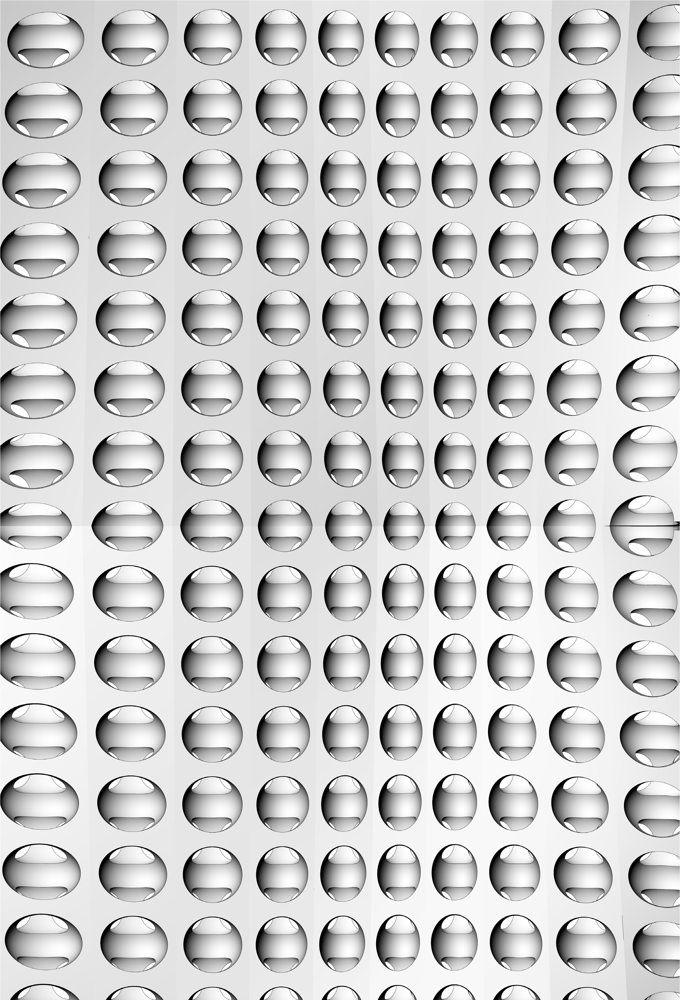

###1.5.1. Flaechen Geometrien

#####NURBS (non-uniform rational B-splines) sind mathematische Repraesentationen, die ein Modell einer beliebigen Form akkurat aus einer einfachen 2D Linien, einem Kreis, Boden oder einer Kiste die komplexeste, organische 3D Freiformflaeche oder -koerper entwickeln koennen. Auf Grund der Flexibilitaet und Praezision der koennen NURBS Modelle in jedem beliebigen Prozess, von der Illustration und Animation bis zur Herstellung genutzt werden.

Abgesehen von ein paar primitiven Flaechentypen, wie Kugeln, Kegel, Flaechen und Zylinder, unterstuetzt Thino drei verschiedenen Arten von Freiform Flaechentypen, wobei der nuetzlichste die NURBS Flaeche ist. Aehnlich wir bei den Kurven, kann mit der NURBS Flaeche jede moegliche Form als Flaeche dargestellt werden, was die Rueckfallebene in Rhino darstellt. Sie ist ausserdem die bei weitem nuetzlichste Flaechendefinition und die, auf die wir uns konzentrieren werden.

>1. Kugel Primitivkoerper [plane, radius]
2. Zylinder Primitivkoerper [plane, radius, height]
3. Flaeche Primitivkoerper [plane, width, height]
4. Kegel Primitivkoerper [plane, radius, height]

####1.5.1.1. NURBS FLAECHEN
NURBS Flaechen sind sehr aehnlich zu NURBS Kurven. Die selben Algorithmen werden verwendet, om die Form, Normalen, Tangenten, Kruemmungen und anderen Eigenschaften zu berechnen, aber es gibt auch klare Unterschiede. Zum Beispiel haben Kurven Tangentenvektoren und Normalenebenen, waehrend Flaechen Normalenvektoren und Tangentialebenen besitzen. Das bedeutet, dass Kurven an definierten Positionen keine Orientierung haben, waehrend Flaechen keine definierte Richtung besitzen. Im Fall von NURBS Flaechen gibt es genau zwei Richtungen, die in der Geometrie einbeschrieben sind, weil NURBS Flaechen aus rechtwinkligen Rastern aus {u} und {v} Kurven aufgebaut sind. Auch wenn diese Richtungen oft beliebig sind, werden wir sie sowieso nutzen, weil sie uns das Leben so viel einfacher machen.

>Du kannst Dir NURBS Flaechen als Raster aus NURBS Kurven in zwei Richtungen vorstellen. Die Form einer NURBS Flaeche ist durch eine Anzahl von Kontrollpunkten und den Grad der Flaeche in u und v Richtung definiert. NURBS Flaechen sind eine effiziente Art um Freiformflaechen mit einem hohen Grad an Praezision zu speichern und zu repraesentieren.

**Flaechen Domaenen**
Eine Flaechendomaene ist durch einen Bereich von (u,v) Parametern bestimmt, der in einen 3D Punkt auf der Flaeche ausgewertet werden kann. Die Domaene ist normalerweise in jeder Richtung (u oder v) durch zwei reelle Zahlen (u_min und u_max) und (v_min und v_max) beschrieben. Die Domaene einer Flaeche zu veraendern wird Reparametrisierung genannt.

In Grasshopper ist es oft nuetzlich eine NURBS Flaeche zu reparametrisieren, so dass die u und v Domaene jeweils von 0 bis 1 reicht. Dies ermoeglicht es uns die Flaeche einfach auszuwerten und mit ihr zu arbeiten.

>Auswertung von Parametern eines gleichmaessigen Intervalls im 2D Parameterraster wird nicht notwendigerweise eine gleimaessige Unterteilung des 3D Raums bedeuten.

**Flaechenauswertung**
Die Auswertung einer Flaeche an einem Parameter innerhalb der Flaechendomaene resultiert in einem Punkt auf der Flaeche. Merke Dir, dass der Mittelpunkt einer Domaene (mid-u,
mid-v) nicht notwendigerweise der Mittelpunkt der 3D Flaeche ist. Wenn Du nun u- und v-Werte ausserhalb der Domaene der Flaeche auswerten willst, wirst Du kein nuetzliches Ergebnis erhalten.

**Normalenvektoren und Tagentialebenen**
Die Tangentialebene einer Flaeche an einem bestimmten Punkt ist die Ebene, welche die Flaeche an einem Punkt beruehrt. Die z-Richtung der Tangentialflaeche repraesentirt die Normalentichtung der Flaeche an diesem Punkt.

Grasshopper behandelt NURBS Flaechen aehnlich wie Rhino, weil es diese auf dem selben Kern von Operationen aufbaut, die notwendig sind um die Flaeche zu erzeugen. Da Grasshopper jedoch die Flaeche oberhalb des Rhinoansichtsfenster darstellt (aus diesem Grund kann man die Geometrien, welche in Grasshopper erzeugt werden nicht auswaehlen, wiss sie in die Szene gebacken werden) sind manche der Mesheinstellungen etwas niedriger, um die Geschwindigkeit von Grasshopper relativ hoch zu halten. Du hast vielleicht festgestellt, dass manche Polygonnetze (Meshes) facettiert sind, aber das ist zu erwarten und ist ein Ergebnis der Grasshopper Darstellungsoptionen. Jede gebackene Geometrie wird die hoeheren Mesheinstellungen von Rhino verwenden.

####1.5.1.2. FLAECHEN PROJIZIIEREN
Im vorherigen Abschnitt, haben wir erklaert, dass NURBS Flaechen ihren eigenen Koordinatenraum besitzen und dass dieser durch u und v Domaenen beschrieben wird. Dies bedeutet, dass zweidimensionale Geometrien, welche durch x und y Koordinaten beschrieben werden auf den uv Raum der Flaeche abgebildet werden koennen. Die Geometrien wird sich veraendern und verzerren um sich an die Kruemmung der Flaeche anzupassen. Dies it unterschiedlich zu einer einer einfachen Projektion auf eine Flaeche, bei der Vektoren von der  2D Geometrie in eine bestimmte Richtung gezeichet werden, bis sie mit einer Flaeche verschneiden.

>Du kannst Dir eine Projektion als einen Schattenwurf auf eine Flaeche vorstellen und eine Abbildung als eine Geometrie, die ueber die Flaeche gezogen wird.
1. Abgebildete Geometrie definiert durch uv Koordination
2. Projiziierte Geometrie auf einer Flaeche

So wie 2D Geometrie auf den uv Raum einer Flaeche abgebildet werden kann, ist es moeglich eine Geometie, die in einer Kiste enthalten ist, auf eine verzerrte Kiste auf einem Flaechenabschnitt abzubilden. Diese Operation wird "Box Morph" genannt und ist nuetzlich um eine gekruemmte Flaeche mit dreidimensionalen geometrischen Komponenten zu bevoelkern.

Um eine Reihe verzerrter Kisten auf einer Flaeche anzuordnen, muss die Flaechendomaene unterteilt werden, um ein Raster von Flaechenabschnitten zu erzeugen. Die verzerrten Kisten werden erzeugt, indem Normalenvektoren an den Ecken eines jeden Flaechenabschnitts bis zur gewuenschten Hoehe angetragen werden und eine Kiste erzeugen, deren Eckpunkte durch die Endpunkte dieser Vektoren bestimmt werden.

####1.5.1.3. MORPH DEFINITION

>Beispieldateien zu diesem Abschnitt: [http://grasshopperprimer.com/appendix/A-2/1_gh-files.html](http://grasshopperprimer.com/appendix/A-2/1_gh-files.html)

>Beispieldateien zu diesem Abschnitt: [Download](../../appendix/A-2/gh-files/1.5.1.3_morphing definition.gh)


In diesem Beispiel werden wir die "Box Morph"Komponente einsetzen um eine NURBS Flaeche mit geometrischen Komponenten zu bevoelkern.

>1. NURBS Flaeche bevoelkert mit Komponenten.
2. Urspruengliche Komponente in ihrer Referenzkiste.
3. Flaeche unterteilt in Flaechenabschnitte.
4. Reihe verzerrter Kisten auf einer Flaeche.

||||
|--|--|--|
|01.|Beginne eine neue Definition, druecke Strg+N (in Grasshopper)||
|02.|**Params/Geometry/Surface** – Ziehe einen **Surface** Parameter auf die Leinwand <blockquote>Diese Flaeche werden wir mit geometrischen Komponenten bevoelkern.</blockquote>||
|03.|**Params/Geometry/Geometry** – Ziehe einen **Geometry** Parameter auf die Leinwand <blockquote>Dies ist die Komponente, die auf der Flaeche aufgereiht wird.</blockquote>||
|04.|Rechtsklicke auf den **Surface** Parameter und waehle “Set One Surface” – waehle eine Flaeche im Rhinoansichtsfenster, die Du referenzieren moechtest||
|05.|Rechtsklicke den **Geometry** Parameter und waehle “Set One Geometry” – waehle Deine Rhinogeometrie||
|06.|**Maths/Domain/Divide Domain2** – Ziehe eine **Divide Domain2** Komponente auf die Leinwand||
|07.|**Params/Input/Number Slider** – Ziehe drei **Number Sliders** auf die Leinwand||
|08.|Doppelklicke den ersten **Number Slider** und setze folgende Werte: <ul>Rounding: Integer Lower Limit: 0 Upper Limit: 10 Value: 5</ul>||
|09.|Setze die selben Werte beim zweiten und dritten **Number Sliders**||
|10.|Verbinde den Ausgabeparameter des **Surface** Parameter mit dem Domaene (I) Eingabeparameter der **Divide Domain2** Komponente||
|11.|Verbinde den ersten **Number Slider** mit dem Anzahl U (U) Eingabeparameter der **Divide Domain2** Komponente||
|12.|Verbinde den zweiten **Number Slider** mit dem Annzahl V (V) Eingabeparmeter der **Divide Domain2** Komponente||
|13.|**Transform/Morph/Surface Box** – Ziehe die **Surface Box** Komponente auf die Leinwand||
|14.|Verbinde den Ausgabeparameter des **Surface** Parameter mit dem Flaeche (S) Eingabeparameter der **Surface Box** Komponente||
|15.|Verbinde den Segmente (S) Ausgabeparameter der **Divide Domain2** Komponente mit dem Domaene (D) Eingabeparameter der **Surface Box** Komponente|||

>Du musst nun ein Raster aus verzerrten Kisten sehen, die Deine Referenzflaeche bevoelkern. Veraendere die Anzahl U und V Schieberegler um die Zahl der Kisten zu veraendern und bewege den Hoehenschieberegler um ihre Hoehe anzupassen.

||||
|--|--|--|
|16.|Verbinde den dritten **Number Slider** mit dem Hoehe (H) Eingabeparemeter der**Surface Box** Komponente||
|17.|**Surface/Primitive/Bounding Box** – Ziehe eine **Bounding Box** Komponente auf die Leinwand||
|18.|**Transform/Morph/Box Morph** – Ziehe eine **Box Morph** Komponente auf die Leinwand||
|19.|Verbinde den Ausgabeparameter des **Geometry** Parameter mit dem Inhalt (C) Eingabeparameter der **Bounding Box** Komponente||
|20.|Verbinde den Ausgabeparameter des **Geometry** Parameter mit dem Geometrie (G) Eingabeparameter der **Box Morph** Komponente||
|21.|Verbinde den Kiste (B) Ausgabaparameter der **Bounding Box** Komponente mit dem Referenz(R) Eingabeparameter der **Box Morph** Komponente||
|22.|Verbinde den verzerrte Kiste (B) Ausgabeparameter der **Surface Box** Komponente mit dem Ziel(T) Eingabeparameter der **Box Morph** Komponente|||

>Du solltest nun sehen, wie die Flaeche mit Deiner Geometrie bevoelkert wurde.

