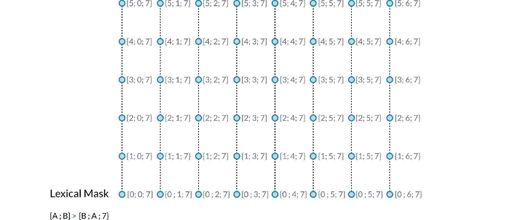
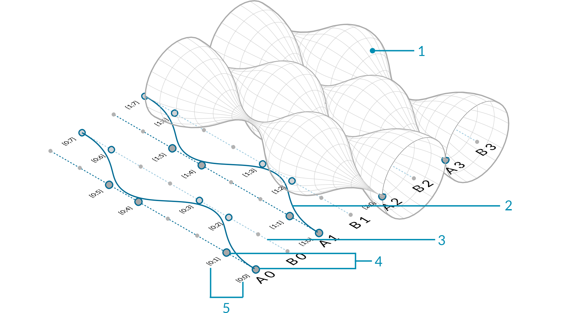
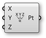
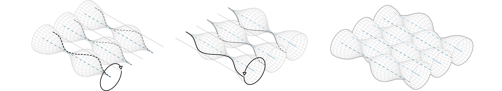

### 1.5.3. Erstellen von Datenbäumen

>Beispieldateien zu diesem Abschnitt: [http://grasshopperprimer.com/appendix/A-2/1_gh-files.html](http://grasshopperprimer.com/appendix/A-2/1_gh-files.html)

>Beispieldateien zu diesem Abschnitt: [Download](../../appendix/A-2/gh-files/1.5.3_creating data trees.gh)


##### Grasshopper enthält Werkzeuge um die Struktur von Datenbäumen zu verändern. Diese Werkzeuge helfen auf spezifische Daten innerhalb des Baumes zuzugreifen und die Art in der sie gespeichert, geordnet oder identifiziert sind zu verändern.

Lass uns einige Möglichkeiten zur Manipulation und Visualisierung von Datenbäumen und ihre Wirkungsweise ansehen.

#### 1.5.3.1. EINEBNEN VON DATENBÄUMEN
Einebnen von Datenbäumen entfernt alle Ebenen eines Datenbaumes und ergibt eine einfache Liste. Wende die "Flatten" Komponente (Sets/Tree/Flatten) auf den P Ausgabeparameter der "Divide Curve" Komponente an und visualisiere die neue Datenstruktur mit dem "Param Viewer".

>Im "Param Viewer" können wir sehen, dass wir nun nur noch einen Ast haben, der aus einer Liste mit 48 Punkten besteht.

#### 1.5.3.2. AUFPFROPFEN VON DATENBÄUMEN
Aufpfropfen erzeugt einen neuen Ast für jedes Datenelement. Wenn wir die Daten durch die "Graft Tree" Komponente (Sets/Tree/Graft Tree) senden, wird jeder Teilungspunkt einen individuellen Ast bilden, anstatt einen Ast mit den anderen Teilungspunkten auf derselben Kurve zu bilden.

>Im "Param Viewer" können wir nun sehen, dass wir anstatt einer Datenstruktur mit 8 Ästen zu je 6 Elementen nun 8 Äste mit je sechs Unterästen haben, die jeweils ein Element enthalten.

#### 1.5.3.3. VEREINFACHEN VON DATENBÄUMEN
Das vereinfachen von Datenbäumen entfernt überlappende Äste eines Datenbaumes. Wenn wir die Daten zur "Simplify Tree" Komponente (Sets/Tree/Simplify Tree) senden, wird der erste Ast, der keine Daten enthält, entfernt werden.

>Im "Param Viewer" sehen wir immer noch 8 Äste zu je 6 Elementen, aber der erste Ast wurde entfernt.

#### 1.5.3.4. DREHEN DER MATRIX
Die "Flip Matrix" Komponente (Sets/Tree/Flip Matrix) vertauscht die Zeilen und Spalten eines Datenbaumes mit zwei Pfadebenen.

>In "Param Viewer" können wir sehen, dass anstatt der 8 Ästen mit 6 Elementen nun 6 Äste zu je 8 Elementen vorliegen.

Das Einebnen, Aufpfropfen und Vereinfachen sind Operationen, die auch direkt auf die Eingabe- und Ausgabeparameter angewendet werden können, anstatt die Daten durch eine separate Komponente zu schleifen. Rechtsklicke einfach auf den gewünschten Eingabe- oder Ausgabeparameter und wähle entsprechend "Flatten", "Graft", oder "Simplify" aus dem Menü. Die Komponente wird ein Symbol darstellen, das anzeigt, dass der Baum modifiziert wurde. Denke an den Programmfluss von Grasshopper. Wenn Du einen Komponenteneingabeparameter einebnest, dann werden die Daten vor der eigentlichen Operation der Komponente eingeebnet. Wenn Du die Ausgabekomponente einebnest, dann werden die Daten erst nach Ausführung der Funktion der Komponente eingeebnet.

>1. Einebnen des Ausgabeparameters P
2. Aufpfropfen des Ausgabeparameters P
3. Vereinfachen des Ausgabeparameters P

#### 1.5.3.5. DER PATH MAPPER
Die "Path Mapper" Komponente (Sets/Tree/Path Mapper) erlaubt es lexikale Operationen auf Datenbäume anzuwenden. Lexikale Operationen sind logische Abbildungsverfahren zwischen Dateipfaden und Indizes, die mit text-basierten (lexikalen) Masken und Mustern definiert werden.

>1. Die "Path Mapper" Komponente
2. Rechtsklicke auf die "Path Mapper"Komponente und wähle eine vordefinierte Abbildungsoption aus dem Menü oder öffne den Abbildungseditor.
3. Der Abbildungseditor
4. Du kannst den Datenbaum verändern, indem Du die Pfadindizes und gewünschten Äste neu zuweist

#### 1.5.3.6. WEBEN DEFINITION

>Beispieldateien zu diesem Abschnitt: [http://grasshopperprimer.com/appendix/A-2/1_gh-files.html](http://grasshopperprimer.com/appendix/A-2/1_gh-files.html)

>Beispieldateien zu diesem Abschnitt: [Download](../../appendix/A-2/gh-files/1.5.3.6_weaving definition.gh)


In diesem Beispiel werden wir Listen und Datenbäume manipulieren um Listen von Punkten miteinander zu verweben, um damit ein Muster und eine Flächengeometrie zu erzeugen.

>1. Rotierte NURBS Fläche
2. NURBS Kurve
3. Kurvenarray
4. Teilungspunkte
5. Pfade (Indizes) von Punkten

>1. Kurven als Reihe anordnen
2. Teile die Kurven in zwei Listen A und B und unterteile die Kurven
3. Entferne Punkte, verwebe die Listen und rotiere die Fläche

||||
|--|--|--|
|01.| Beginne eine neue Definition, drücke Strg+N (in Grasshopper)||
|02.| **Curve/Primitive/Line SDL** – Ziehe eine **Line SDL** Komponente auf die Leinwand||
|03.| **Vector/Point/Construct Point** – Ziehe eine **Construct Point** Komponente auf die Leinwand||
|04.| Verbinde den Punkte (Pt) Ausgabeparameter der **Construct Point** Komponente mit dem Start (S) Eingabeparameter der **Line SDL** Komponente||
|05.| **Vector/Vector/Unit Y** – Ziehe eine **Unit Y** Vektorkomponente auf die Leinwand <blockquote>Der Faktor der Einheitsvektor Y Komponente ist 1.0 als Standard.</blockquote>||
|06.| Verbinde die **Unit Y** Komponente mit dem Richtung (D) Eingabeparameter der **Line SDL** Komponente|||

||||
|--|--|--|
|07.| **Params/Input/Number Slider** – Ziehe eine **Number Slider** Komponente auf die Leinwand||
|08.| Doppelklicke den **Number Slider** und setze folgende Werte: <ul>Name: Length Rounding: Integer Lower Limit: 0 Upper Limit: 96 Value: 96</ul>||
|09.| Verbinde den **Number Slider** mit dem Laenge (L) Eingabeparameter der **Line SDL** Komponente||
|10.| **Transform/Array/Linear Array** – Ziehe eine **Linear Array** Komponente auf die Leinwand||
|11.| Verbinde den Linie (L) Ausgabeparameter der **Line SDL** Komponente mit dem Geometrie (G) Eingabeparameter der **Linear Array** Komponente||
|12.| **Vector/Vector/Unit X** – Ziehe eine Einheitsvektor X **Unit X** Komponente auf die Leinwand||
|13.| **Params/Input/Number Slider** – Ziehe zwei **Number Slider** Komponenten auf die Leinwand||
|14.| Doppelklicke auf den ersten **Number Slider** und setze folgende Werte: <ul>Name: Offset Distance Rounding: Integer Lower Limit: 1 Upper Limit: 10 Value: 4</ul>||
|15.| Doppelklicke den zweiten **Number Slider** und setze die folgenden Werte: <ul>Name: # of Offsets Rounding: Even Lower Limit: 2 Upper Limit: 20 Value: 20</ul>||
|16.| Verbinde den **Number Slider** (Versatzdistanz) mit dem Faktor (F) Eingabeparameter der **Unit X** Komponente||
|17.| Verbinde den Vektor (V) Ausgabeparameter der **Unit X** Komponente mit dem Richtung (D) Eingabeparameter der **Linear Array** Komponente||
|18.| Verbinde den **Number Slider** (Anzahl der Versatzaktionen) mit dem Anzahl (N) Eingabeparameter der **Linear Array** Komponente|||

>Du solltest nun eine Reihe von Linien in Deinem Rhinoansichtsfenster sehen. Die drei Schieberegler erlauben es Dir die Länge der Linien, deren Abstand zueinander und die Anzahl der Linien in der Reihe zu verändern.

||||
|--|--|--|
|19.| **Sets/Lists/Dispatch** – Ziehe eine **Dispatch** Komponente auf die Leinwand||
|20.| Verbinde den Geometrie (G) Ausgabeparameter der **Linear Array** Komponente mit dem Liste (L) Eingabeparameter der **Dispatch** Komponente||
|21.| **Params/Input/Panel** – Ziehe eine **Panel** Kompoenente auf die Leinwand||
|22.| Doppelklicke das **Panel**, entferne die Auswahl für "Multiline Data", "Wrap Items" und "Special Codes", und gib folgendes ein: <ul>true false</ul>||
|23.| Verbinde das **Panel** mit der Muster (P) Eingabeparameter der **Dispatch** Komponente||
|24.| **Curve/Division/Divide Curve** – Ziehe zwei **Divide Curve** Komponenten auf die Leinwand||
|25.| Verbinde den Liste A (A) Ausgabeparameter der **Dispatch** Komponente mit dem Kurve (C) Eingabeparameter der ersten **Divide Curve** Komponente||
|26.| Verbinde den Liste B (B) Ausgabeparameter der **Dispatch** Komponente mit dem Kurve (C) Eingabeparameter der zweiten **Divide Curve** Komponente||
|27.| **Params/Input/Number Slider** – Ziehe eine **Number Slider** Komponente auf die Leinwand||
|28.| Doppelklicke auf den **Number Slider** und setze die folgenden Werte:<ul>Name: Divisions Rounding: Integer Lower Limit: 0 Upper Limit: 20 Value: 20</ul>||
|29.| Verbinde den **Number Slider** (Teilungen) mit dem Anzahl (N) Eingabeparameter der beiden **Divide Curve** Komponenten.|||

>1. Die "Dispatch" Komponente sendet jede zweite Kurve des Arrays in eine separate Liste.
2. Die "Divide Curve" Komponente teilt die Kurven in eine Anzahl von Segmenten, die vom Schieberegler bestimmt wird.

||||
|--|--|--|
|30.| **Sets/Sequence/Cull Pattern** – Ziehe zwei **Cull Pattern** Komponenten auf die Leinwand||
|31.| Verbinde den Punkte (P) Ausgabeparameter der ersten **Divide Curve** Komponente mit dem Liste (L) Eingabeparameter der ersten **Cull Pattern** Komponente||
|32.| Verbinde den Punkte (P) Ausgabeparameter der zweiten **Divide Curve** Komponente mit dem Liste (L) Eingabeparameter der zweiten **Cull Pattern** Komponente||
|33.| **Params/Input/Panel** – Ziehe eine zweite **Panel** Komponente auf die Leinwand||
|34.| Doppelklicke die zweite **Panel** Komponente und entferne die Auswahl von: "Multiline Data", "Wrap Items", und "Special Codes". Dann gib folgendes ein:<ul>1 1 0 0</ul> <blockquote>Wir benutzen 0 und 1 anstatt "wahr" und "falsch". Dies sind die beiden Arten boolsche Werte einzugeben, die Grasshopper akzeptiert.</blockquote>||
|35.| Verbinde das zweite **Panel** mit dem Muster (P) Eingabeparameter der ersten **Cull Pattern** Komponente||
|36.| Verbinde das zweite **Panel** mit dem Muster (P) Eingabeparameter der zweiten **Cull Pattern** Komponente||
|37.| Rechtsklicke auf den Muster (P) Eingabeparameter der zweiten **Cull Pattern** Komponente und wähle "Invert"  <blockquote>Dies wird die **Cull Pattern** umkehren, ein nützlicher Trick um Definitionen kurz zu halten.</blockquote>||
|38.| **Sets/List/Weave** – Ziehe eine **Weave** Komponente auf die Leinwand||
|39.| Verbinde das zweite **Panel** mit dem Muster (P) Eingabeparameter der **Weave** Komponente||
|40.| Rechtsklicke den Muster (P) Eingabeparameter der **Weave** Komponente und wähle "Reverse"||
|41.| Verbinde den Liste (L) Ausgabeparameter der ersten **Cull Pattern** Komponente mit dem Strom 0 (0) Eingabeparameter der **Weave** Komponente||
|42.| Verbinde den Liste (L) Ausgabeparameter mit der zweiten **Cull Pattern** Komponente mit dem Strom 1 (1) Eingabeparameter der**Weave** Komponente||
|43.| **Curve/Spline/Nurbs Curve** – Ziehe eine **Nurbs Curve** Komponente auf die Leinwand||
|44.| Verbinde den Gewebe (W) Ausgabeparameter der **Weave** Komponente mit dem Eckpunkte (V) Eingabeparameter der**Nurbs Curve** Komponente.|||

>1. Die "Cull Pattern" Komponenten entfernen alternierend Punkte von der jeweiligen Liste.
2. Die "Weave" Komponente sammelt Daten von der Punkteliste entsprechend dem benutzerdefinierten Muster. Diese Daten werden in eine "Interpolate Kurve" Komponente eingegeben, um die Kurven zu erstellen.

||||
|--|--|--|
|45.| **Surface/Freeform/Revolution** –Ziehe zwei **Revolution** Komponenten auf die Leinwand||
|46.| Verbinde den Kurven (C) Ausgabeparameter der **Nurbs Curve** Komponente mit dem Profilkurve (P) Eingabekomponenten der beiden **Revolution** Komponenten.||
|47.| Rechtsklicke auf den Achse (A) Eingabeparameter beider **Revolution** Komponenten und wähle "Graft".||
|48.| Verbinde den Liste A (A) Ausgabeparameter der **Dispatch** Komponente mit dem Achse (A) Eingabeparameter der ersten **Revolution** Komponente||
|49.| Verbinde den Liste B (B) Ausgabeparameter der **Dispatch** Komponente mit dem Achse (A) Eingabeparameter der zweiten **Revolution** Komponente  <blockquote>Wähle alle Komponenten außer den beiden "Revolution" Komponenten und schalte die Grasshoppervorschau aus - es ist hilfreich die Vorschau auszuschalten und während des Aufbaus einer Definition auf den letzten Stand der Geometrie zu fokusieren.</blockquote>|||

