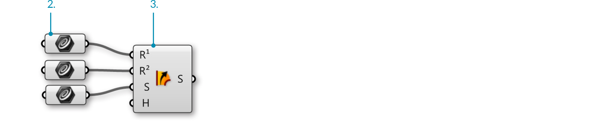
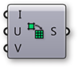
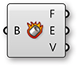



### 1.5.4. Arbeiten mit Datenbaeumen

>Beispieldateien zu diesem Abschnitt: [http://grasshopperprimer.com/appendix/A-2/1_gh-files.html](http://grasshopperprimer.com/appendix/A-2/1_gh-files.html)

>Beispieldateien zu diesem Abschnitt: [Download](../../appendix/A-2/gh-files/1.5.4_rail intersect definition.gh)


In diesem Beispiel werden wir die Grasshopper Werkzeuge zur Manipulation von Datenbaeumen nutzen um Daten zu entnehmen, neu zu organisieren und zwischen den gewuenschten Punkten zu interpolieren um ein Raumtragwerk aus miteinander verschneidenden Finnen zu erstellen.

>1. Ziehe eine Flaeche entlang zwei Schienen auf, um eine NURBS Flaeche zu erhalten.
2. Teile die Flaeche in Segmente variabler Groesse auf und extrahiere die Eckpunkte. Die erstellten Daten bestehen aus einer List mit vier Elementen je Segment.
3. Drehe die Matrix, um die Datenstruktur zu veraendern. Die Daten bestehen nun aus vier Listen mit je einem Eckpunkt pro Element in jeder Liste.
4. Nutze "Explode Tree" um den Datenbaum aufzugliedern und die Punkte miteinander zu verbinden, um die Diagonlen eines jeden Elements zu zeichnen.
5. Mit "Prune Tree" entferne die Aeste mit unzureichenden Punkten um eine NURBS Kurve mit Grad  3 zu erstellen und interpoliere die Punkte.
6. Extrudiere die Kurve, um die verschneidenden Finnen zu erstellen.

||||
|--|--|--|
|01.| Beginne eine neue Definition, druecke Strg+N (in Grasshopper) ||
|02.| **Params/Geometry/Curve** – Ziehe drei **curve** Parameter auf die Leinwand ||
|03.| **Surface/Freeform/Sweep2** – Ziehe eine **Sweep2** Komponente auf die Leinwand||
|04.| Rechtsklicke den ersten **Curve** Parameter und waehle “Set one curve.” Waehle die erste Schienenkurve im Rhinoansichtsfenster aus||
|05.| Rechtsklicke den zweiten **Curve** Parameter und waehle “Set one curve.” Waehle die zweite Schienenkurve im Rhinoansichtsfenster aus||
|06.| Rechtsklicke auf den dritten **Curve** Parameter und waehle “Set one curve.” Waehle die Schnittkurve im Rhinoansichtsfenster aus||
|07.| Verbinde den Ausgabeparameter der **Curve** Parameter mit den Schiene 1 (R1), Schiene 2 (R2), und Schnittkurve (S) Eingabeparameter der **Sweep2** Komponente entsprechend|||

>Wir haben gerade eine NURBS Flaeche erstellt.

||||
|--|--|--|
|08.| **Params/Geometry/Surface** – Ziehe einen **Surface** Parameter auf die Leinwand||
|09.| Verbinde den Brep (S) Ausgabeparameter der **Sweep2** Komponente mit dem Eingabeparameter des **Surface** Parameter||
|10.| Rechtsklicke auf den **Surface** Parameter und waehle “Reparameterize”.  <blockquote>In diesem Schritt, bilden wir die u und v Domaene der Flaeche auf eine Domaene von 0 bis 1 ab. Dies wird die zukuenftigen Operationen erleichtern.
|11.| **Maths/Domain/Divide Domain2** – Ziehe eine **Divide Domain2** Komponente auf die Leinwand||
|12.| **Params/Input/Number Slider** – Ziehe zwei **Number Sliders** auf die Leinwand||
|13.| Doppelklicke den ersten **Number Sliders** und setze die folgenden Werte:<ul>Rounding: Integer Lower Limit: 1 Upper Limit: 40 Value: 20</ul>||
|14.| Setze die selben Werte beim zweiten Sli**Number Sliders**||
|15.| Verbinde den Ausgabeparameter des reparametrisierten **Surface** Parameters mit dem Domaene (I) Eingabeparameter der **Divide Domain2** Komponente||
|16.| Verbinde den ersten **Number Sliders** mit dem Anzahl U (U) Eingabeparameter der **Divide Domain2** Komponente||
|17.| Verbinde den zweiten **Number Sliders** mit dem Anzahl V (V) Eingabeparameter der **Divide Domain2** Komponente||
|18.| **Surface/Util/Isotrim** – Ziehe eine **Isotrim** Komponente auf die Leinwand||
|19.| Verbinde den Segmente (S) Ausgabaparameter der **Divide Domain2** Komponente mit dem Domaene (D) Eingabeparameter der **Isotrim** Komponente||
|20.| Verbinde den Ausgabeparameter des **Surface** Parameter mit dem Flaeche (S) Eingabeparameter der **Isotrim** Komponente|||

>Wir haben jetzt eine Flaeche in kleinere, gleich grosse Flaechen unterteilt. Pass den Anzahl U und V Schieberegler and um die Anzahl der Teilungen zu veraendern. Lass uns einen "Graph Mapper" hinzufuegen, um den Segmenten eine variable Groesse zu geben.

||||
|--|--|--|
|21.| **Maths/Domain/Deconstruct Domain2** – Ziehe eine **Deconstruct Domain2** Komponente auf die Leinwand||
|22.| **Maths/Domain/Construct Domain2** – Ziehe eine **Construct Domain2** Komponente auf die Leinwand||
|23.| **Params/Input/Graph Mapper** – Ziehe einen **Graph Mapper** auf die Leinwand||
|24.| **Sets/List/List Length** – Ziehe eine **List Length** Komponente auf die Leinwand||
|25.| **Sets/Tree/Merge** – Ziehe eine **Merge** Komponente auf die Leinwand||
|26.| **Sets/List/Split List** – Ziehe eine **Split List** Komponente auf die Leinwand <blockquote>Die "Merge" und "Split" Komponenten sind hier so angeordnet, dass sie den selben "Graph Mapper" fuer die U min und U max Werte nutzen koennen.</blockquote>||
|27.| Verbinde den U min (U0) und U max (U1) Ausgabeparameter der **Deconstruct Domain2** Komponente mit dem  Daten 1 (D1) und Daten 2 (D2) Eingabeparameter der **Merge** Komponente||
|28.| Verbinde den Ergebnis (R) Ausgabeparameter der **Merge** Komponente mit dem Eingabeparameter des **Graph Mapper**||
|29.| Rechtsklicke auf den **Graph Mapper** und waehle “Bezier” unter “Graph Types”||
|30.| Verbinde ein zweites Kabel vom U max (U1) Ausgabeparameter der **Deconstruct Domain2** Komponente mit dem Liste (L) Eingabeparameter der **List Length** Komponente||
|31.| Verbinde den **Graph Mapper** Ausgabeparameter mit dem Liste (L) Eingabeparameter der **Split List** Komponente||
|32.| Verbinde den Laenge (L) Ausgabeparameter der **List Length** Komponente mit dem Index (i) Eingabeparameter der **Split List** Komponente||
|33.| Verbinde den Liste A (A) Ausgabeparameter der **Split List** Komponente mit dem U min (U0) Eingabeparameter der **Construct Domain2** Komponente||
|34.| Verbinde den Liste B (B) Ausgabeparameter der **Split List** Komponente mit dem U max (U1) Eingabeparameter der **Construct Domain2** Komponente||
|35.| Verbinde den V min (V0) Ausgabeparameter der **Deconstruct Domain2** Komponente mit dem V min (V1) Eingabeparameter der **Construct Domain2** Komponente||
|36.| Verbinde den V max (V1) Ausgabeparameter der **Deconstruct Domain2** Komponente mit dem V max (V1) Eingabeparameter der **Construct Domain2** Komponente||
|37. |Verbinde den 2D Domain (I2) Ausgabeparameter der **Construct Domain2** Komponente mit dem Domaene (D) Eingabeparameter der **Isotrim** Komponente und ersetzte dabei die bestehenden Verbindungen|||

>Wir haben gerade die Domaenen jedes Flaechenelements zerlegt, die U Werte mit dem "Graph Mapper" neu abgebildet und die Domaenen aus den Bestandteilen neu erstellt. Passe die Griffe der "Graph Mapper" Komponente an, um die Verteilung der Flaechenelemente zu veraendern. Lass uns die Datenbaeume der Flaechenteilung nun veraendern und sehen, was passiert.

||||
|--|--|--|
|38.| **Surface/Analysis/Deconstruct Brep** – Ziehe eine **Deconstruct Brep** Komponente auf die Leinwand||
|39.| **Sets/Tree/Flip Matrix** – Ziehe eine **Flip Matrix** Komponente auf die Leinwand||
|40.| **Sets/Tree/Explode Tree** – Ziehe eine **Explode Tree** Komponente auf die Leinwand||
|41.| Verbinde den Flaeche (S) Ausgabeparameter der **Isotrim** Komponente mit dem Brep (B) Eingabeparameter der **Deconstruct Brep** Komponente  <blockquote>Die "Deconstruct Brep" Komponente zerlegt einen Brep in Oberflaechen, Kanten und Eckpunkte. This Dies ist hilfreich, wenn Du einen spezifischen Bestandteil einer Flaeche bearbeiten willst.</blockquote>||
|42.| Verbinde den Eckpunkte (V) Ausgabeparameter der **Deconstruct Brep** Komponente mit dem Daten (D) Eingabeparameter der **Flip Matrix** Komponente  <blockquote>Wir haben gerade die Datenstruktur con einer Liste mit vier Eckpunkten die eine Flaeche definieren, zu vier Listen mit je einem Eckfunkt jeder Flaeche transformiert.</blockquote>||
|43.| Verbinde den Daten (D) Ausgabeparameter der **Flip Matrix** Komponente mit dem Daten (D) Eingabeparameter der **Explode Tree** Komponente||
|44.| Rechtsklicke auf die **Explode Tree** Komponente und waehle “Match Outputs”||
|45.| Rechtsklicke auf den Daten (D) Eingabeparameter der**Explode Tree** Komponente und waehle "simplify"|||

>Jeder Ausgabeparameter der "Explode Tree" Komponente enthaelt eine Liste mit einem Eckpunkt jeder einzelnen Flaeche. In anderen Worten, eine Liste mit allen Ecken rechts oben, eine Liste mit allen Ecken rechts unten, eine Liste mit allen Ecken links unten und eine Liste mit allen Ecken links oben.

||||
|--|--|--|
|46.| **Curve/Primitive/Line** – Ziehe eine **Line** Komponente auf die Leinwand||
|47.| Verbinde den Ast 0 {0} Ausgabeparameter der **Explode Tree** Komponente mit dem Startpunkt (A) Eingabeparameter der ersten **Line** Komponente||
|48.| Verbinde den Ast 1 {1} Ausgabeparameter der **Explode Tree** Komponente mit dem Startpunkt (A) Eingabeparameter der zweiten **Line** Komponente||
|49.| Verbinde den Ast 2 {2} Ausgabeparmeter der **Explode Tree** Komponente mit dem Endpunkt (B) Eingabeparameter der ersten **Line** Komponente||
|50.| Verbinde den Ast 3 {3} Ausgabeparmeter der **Explode Tree** Komponente mit dem Endpunkt (B) Eingabeparameter der zweiten **Line** Komponente|||

>Wir haben nun die Eckpunkte einer jeden Flaeche diagonal mit Linien verbunden.

||||
|--|--|--|
|51.| **Curve/Util/Join Curves** – Ziehe eine **Join Curves** Komponente auf die Leinwand||
|52.| **Curve/Analysis/Control Points** – Ziehe eine **Control Points** Komponente auf die Leinwand||
|53.| **Curve/Spline/Interpolate** – Ziehe eine **Interpolate** Komponente auf die Leinwand||
|54.| Verbinde den Linie (L) Ausgabeparameter jeder **Line** Komponente mit dem Kurven (C) Eingabeparmeter der **Join Curve** Komponente  <blockquote>Halte Schift gedrueckt, um mehrere Kabel mit einem Eingabeparameter zu verbinden.<blockquote> ||
|55.| Verbinde den Kurven (C) Ausgabeparameter der **Join Curves** Komponente mit dem Kurven (C) Eingabeparameter der **Control Points** Komponente||
|56.| Verbinde den Punkte (P) Ausgabeparameter der **Control Points** Komponente mit dem Eckpunkte (V) Eingabeparameter der **Interpolate** Komponente|||

>Wir haben nun unsere Linien zu Polylinien zusammengefuegt und als NURBS Kurven neu aufgebaut, indem wir ihre Kontrollpunkte interpoliert haben. Wie Du vielleicht gemerkt hast, sind die kuerzeren Kurven im Rhino Ansichtsfenster immer noch gerade Linien. Dies liegt darin begruendet, dass Du eine NURBS Kurve dritten Grades nicht mit weniger als vier Kontrollpunkten erstellen kannst. Lass uns den Datenbaum anpassen, um die Listen der Kontrollpunkte mit weniger als vier Elementen zu entfernen.

||||
|--|--|--|
|57.| **Sets/Tree/Prune Tree** – Ziehe eine **Prune Tree** Komponente auf die Leinwand||
|58.| **Params/Input/Panel** – Ziehe ein Paneel auf die Leinwand||
|59.| Verbinde den Punkte (P) Ausgabeparameter der **Control Points** Komponente mit dem Baum (T) Eingabeparameter der **Prune Tree** Komponente  <blockquote>Wenn Du einen "Param Viewer" mit dem Punkte (P) Ausgabeparameter der "Control Points" Komponente verbindest und einen anderen mit dem Baum (T) Ausgabeparameter der "Prune Tree" Komponente, kannst Du sehen, dass die Anzahl der Aeste reduziert wurde.</blockquote>||
|60.| Doppelklicke auf das **Panel** und gebe 4 ein.||
|61.| Verbinde den Ausgabeparameter des **Panel** mit dem Minimum (N0) Eingabparameter der **Prune Tree** Komponente||
|62.| Verbinde den Baum (T) Ausgabeparameter der **Prune Tree** Komponente mit dem Eckpunkte (V) Eingabeparameter der **Interpolate** Komponente||
|63.| **Surface/Freeform/Extrude** – Ziehe eine **Extrude** Komponente auf die Leinwand||
|64.| **Vector/Vector/Unit Y** – Ziehe eine **Unit Y** Komponente auf die Leinwand  *Du benoetigst vielleicht einen Y Einheitsvektor, je nachdem, in welcher Ortientierung Du die Geometrie in Rhino referenziert hast*||
|65.| **Params/Input/Number Slider** – Ziehe einen **Number Slider** auf die Leinwand||
|66.| Doppelklicke den **Number Slider** und setze die folgenden Werte:<ul>Rounding: Integer Lower Limit: 1 Upper Limit: 5 Value: 3</ul>||
|67.| Verbinde den Kurve (C) Ausgabeparameter der **Interpolate** Komponente mit dem Basis(B) Eingabeparameter der **Extrude** Komponente||
|68.| Verbinde den **Number Slider** Ausgabeparameter mit dem Faktor (F) Eingabeparameter der  **Unit Y** Komponente||
|69.| Verbinde den Einheitsvektor (V) Ausgabeparameter der **Unit Y** Komponente mit dem Richtung(D) Eingabeparameter der **Extrude** Komponente|||

>Du solltest nun ein Diagonalraster von Streifen oder Finnen im Rhinoansichtsfenster sehen. Passe den Faktor Schieberegler an, um die Tiefe der Finnen zu veraendern

