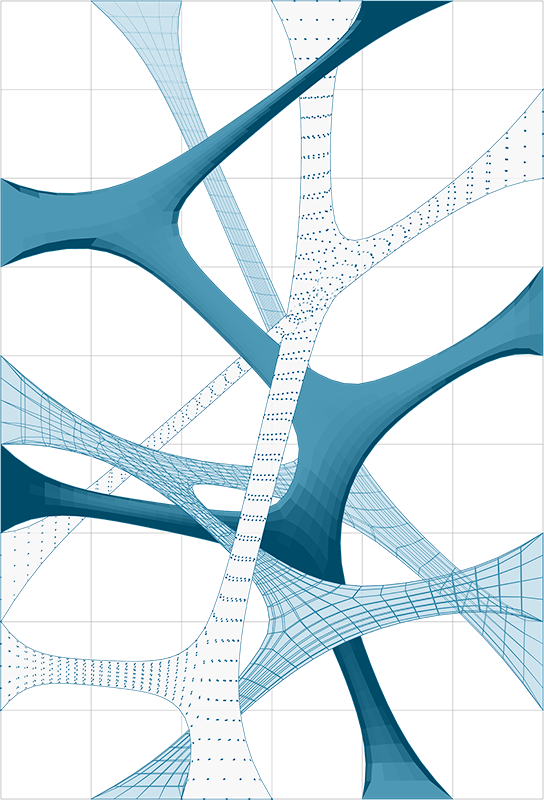

## 1.6. Mit Polygonnetzen arbeiten

#### Im Feld der computerbasierten Modellierung sind Polygonnetze die häufigste Form der Darstellung von 3D Geometrien. Polygonnetzgeometrien sind eine leichtgewichtige und flexible Alternative zur Arbeit mit NURBS und werden überall, vom Rendern und Visualisieren bis zur digitalen Fabrikation und 3D Druck, verwendet. Dieses Kapitel wird eine Einführung in die Handhabung von Polygonnetzgeometrien in Grasshopper geben.

