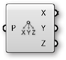

### 1.6.3 Polygonnetze erstellen

##### Im letzten Abschnitt haben wir uns die grundlegende Struktur von Polygonnetzen angesehen. In diesem Abschnitt werden wir eine kurze Einführung in die verschiedenen Wege geben eine Polygonnetzgeometrie zu erzeugen.

Es gibt drei fundamentale Wege, um ein Polygonnetz in Grasshopper zu erzeugen:
1. Mit einem primitven Polygonnetzkörper beginnen
2. Händisch ein Polygonnetz von Netzflächen und Eckpunkten erzeugen
3. Umwandeln von NURBS Geometrien in Polygonnetze

#### 1.6.3.1 Primitive Körper

Grasshopper kommt mit ein paar einfachen primitiven Polygonnetzkomponenten:

>1. **Mesh Box** - Dieser primitive Körper benötigt ein Kistenobjekt als Eingabeparameter, der die Größe und Position, sowie die X, Y und Z Werte, welche die Anzahl von Netzflächen bestimmen, übergibt. Die sechs Seiten der Polygonnetzkiste sind "unverschweißt", um Knicke zu erlauben. (Im nachfolgenden Abschnitt werden wir mehr Informationen zu verschweißten Polygonnetzen liefern.)
2. **Mesh Plane** - Dieser primitive Körper benötigt ein Rechteck als Eingabeparameter, um die Größe und Position der Ebene zu bestimmen, sowie die W und H Werte, um die Anzahl der Netzflächen zu definieren.
3. **Mesh Sphere** - Dieser primitive Körper benötigt eine Basisebene, um das Zentrum und die Orientierung der Kugel zu definieren, den Radius für die Größe und U/V Werte, um die Anzahl der Netzflächen festzulegen.
4. **Mesh Sphere Ex** - Auch als "Quadball" bekannt, erzeugt dieser primitive Körper eine Kugel, die aus sechs Abschnitten besteht, die entsprechend dem C Eingabeparameter unterteilt werden. Ein Quadball ist topologisch gleich einem Würfel, auch wenn er geometrisch eine Kugel ist.

#### 1.6.3.2 Polygonnetze konstruieren

Wir haben im vorangegangenen Abschnitt gesehen, dass die **Construct Mesh** Komponente genutzt werden kann, um ein Polygonnetz aus einer Liste von Eckpunkten und einer Liste von Netzflächen (und einer optinonalen Liste von Farben) zu erzeugen. Ein Polygonnetz händisch zu konstruieren kann sehr mühselig sein, weshalb diese Komponente öfter genutzt wird, um eine bestehende Liste von Netzflächen und Eckpunkten zu bearbeiten, die mit der **Deconstruct Mesh** Komponente aus einem bestehenden Polygonnetz extrahiert wurde.

#### 1.6.3.3 NURBS zu Polygonnetz

Vielleicht die am häufigsten genutzte Methode zur Erstellung eines komplexen Polygonnetzes ist die Erzeugung von einer NURBS Geometrie. Individuelle NURBS Flächen können mit der **Mesh Surface** Komponente in Polygonnetze umgewandelt werden, die einfach Flächen entlang ihrer UV Koordinaten unterteilt und viereckige Netzflächen erzeugt. Diese Komponente ermöglicht es, eine Zahl für die Unterteilung in U und V Richtung für das resultierende Polygonnetz einzugeben.

Komplexere Polyflächen können nicht mit der **Mesh Brep** Komponente in ein einzelnes Polygonnetz umgewandelt werden. Diese Komponente hat einen Eingabeparameter für optionale Einstellungen, die durch die eingebauten Optionen für *Geschwindigkeit* und *Qualität* oder einer *Custom Settings* Komponente definiert werden können. Eine andere Möglichkeit ist, mit einem Rechtsklick auf den S Eingabeparameter die Option "Set Mesh Options" zu nutzen. Für die effiziente Nutzung von Polygonnetzen ist es oftmals notwendig, diese zu verfeinern, indem Strategien wie Wiederaufbauen, Glätten und Unterteilen angewendet werden. Einige dieser Techniken werden wir später in diesem Primer beschreiben.

>1. **Mesh Surface** wandelt eine NURBS Fläche in ein Polygonnetz um
2. **Mesh Brep** kann Polyflächen und kompliziertere Geometrien in ein einzelnes Polygonnetz umwandeln. Die Anpassung der Einstellungen ermöglicht es mit mehr oder weniger Netzflächen ein feineres oder gröberes Polygonnetz darzustellen.

MERKE: Es ist generell viel leichter eine NURBS Geometrie in ein Polygonnetz umzuwandeln, als anders herum. Während die UV Koordinaten einer NURBS Fläche eine einfache Umwandlung in viereckige Netzflächen erlaubt, ist die entgegengesetzte Abbildung nicht immer eindeutig möglich, da ein Polygonnetz aus dreieckigen und viereckigen Netzflächen bestehen kann, die nicht die einfache Extraktion von UV Koordinaten erlauben.

#### 1.6.3.4 Übung

In dieser Übung werden wir einfache primitive Polygonnetzkörper nutzen, um eine Transformation der Eckpunkte durchzuführen und dann eine farbbasierte Annäherung der Normalenvektoren in einem Renderingprozess darzustellen.


>Beispieldateien für diesen Abschnitt: [http://grasshopperprimer.com/appendix/A-2/1_gh-files.html](http://grasshopperprimer.com/appendix/A-2/1_gh-files.html)

>eispieldateien fuer diesen Abschnitt: [Download](../../appendix/A-2/gh-files/1.6.3_creating meshes.gh)


||||
|--|--|--|
|01.| Beginne eine neue Definition, drücke Strg-N (in Grasshopper)||
|02.| **Mesh/Primitive/Mesh Sphere** - Ziehe eine **Mesh Sphere** Komponente auf die Leinwand||
|03.| **Params/Input/Number Slider** - Ziehe eine **Number Slider** Komponente auf die Leinwand und setze die folgenden Werte: <ul>Rounding: Integer Lower Limit:0 Upper Limit: 100 Value: 10</ul>||
|04.| Verbinde den **Number Slider** mit dem Anzahl U (U) und dem Anzahl V (V) Eingabeparameter der **Mesh Sphere** Komponente|||

>Passe den Slider an und beobachte die Veränderung der Auflösung der Kugel im Rhinoansichtsfenster. Höhere Werte resultieren in einer glatteren Kugel, aber erzeugen auch größere Datensätze, die dann höhere Rechenzeiten zur Folge haben.

||||
|--|--|--|
|05.| **Mesh/Analysis/Deconstruct Mesh** - Ziehe eine **Deconstruct Mesh** Komponente auf die Leinwand||
|06.| Verbinde den Polygonnetz (M) Ausgabeparameter der **Mesh Sphere** Komponente mit dem Polygonnetz (M) Eingabeparameter der **Deconstruct Mesh** Komponente||
|07.| **Transform/Euclidean/Move** - Ziehe eine **Move** Komponente auf die Leinwand||
|08.| Verbinde den Eckpunkte (V) Ausgabeparameter der **Deconstruct Mesh** Komponente mit dem Geometrie (G) Eingabeparameter der **Move** Komponente||
|09.| Verbinde den Normalen (N) Ausgabeparameter der **Deconstruct Mesh** Komponente mit dem Bewegungsvektor (T) Eingabeparameter der **Move** Komponente||
|10.| **Mesh/Analysis/Construct Mesh** - Ziehe eine **Construct Mesh** Komponente auf die Leinwand||
|11.| Verbinde den Geometrie (G) Ausgabeparameter der **Move** Kopmonente mit dem Eckpunkte (V) Eingabeparameter der **Construct Mesh** Komponente||
|12.| Verbinde den Netzflächen (F) Ausgabeparameter der **Deconstruct Mesh** Komponente mit dem Netzflächen Eingabeparameter (F) der **Construct Mesh** Komponente|||

>Wir dekonstruieren ein Polygonnetz, um seine Eckpunkte, Netzflächen und Normalen zu erhalten. Wir bewegen dann einfach jeden Eckpunkt entsprechend seines Normalenvektors. Da wir nicht die Topologie der Kugel verändert haben, können wir die Liste der Netzflächen wieder verwenden, um das neue Polygonnetz zu erzeugen. Normalenvektoren haben eine Länge von eins. Somit haben wir eine neue Kugel mit einem um eins größeren Radius als die ursprüngliche Kugel erzeugt. 

Als nächstes werden wir eine Sinusfunktion nutzen, um eine Kugel auf eine komplexere Art zu manipulieren.

||||
|--|--|--|
|13.| **Vector/Point/Deconstruct** - Ziehe eine **Deconstruct** Komponente auf die Leinwand||
|14.| Verbinde den Eckpunkte (V) Ausgabeparameter der **Deconstruct Mesh** Komponente mit dem Punkt (P) Eingabeparameter der **Deconstruct** Komponente||
|15.| **Params/Input/Number Slider** - Ziehe zwei **Number Slider** Komponenten auf die Leinwand||
|16.| Setze die Werte der ersten **Number Slider** auf: <ul>Name: Amplitude  Rounding: Float Lower Limit: 0 Upper Limit: 10</ul>||
|17.| Setze die Werte des zweiten **Number Slider** auf: <ul>Name: Frequency Rounding: Float Lower Limit: 0 Upper Limit: 5</ul>||
|18.| **Maths/Script/Expression** - Ziehe eine **Expression** Komponente auf die Leinwand||
|19.| Zoome auf die **Expression** Komponente, bis Du die Optionen zum Hinzufügen und Entfernen von Eingabevariablen sehen kannst und drücke auf '+' um eine 'z' Variable hinzuzufügen||
|20.| Rechtsklicke auf den 'y' Eingabeparameter der **Expression** Komponente und ändere den Text auf 'A'||
|21.| Rechtsklicke auf den 'z' Eingabeparameter der **Expression** Komponente und ändere den Text auf 'f'||
|22.| Doppelklicke die **Expression** Komponente und passe den Ausdruck an, indem Du folgende Gleichung eingibst: <ul>A\*sin(x\*f/π)</ul>||
|23.| Verbinde den X Ausgabeparameter der **Deconstruct** Komponente mit dem 'x' Eingabeparameter der **Expression** Komponente||
|24.| Verbinde den Amplitude **Number Slider** mit dem A Eingabeparameter und den Frequenz **Number Slider** mit dem 'f' Eingabeparameter der **Expression** Komponente||
|25.| **Maths/Operators/Multiplication** - Ziehe eine **Multiplication** Komponente auf die Leinwand||
|26.| Verbinde den Normalen (N) Ausgabeparameter der **Deconstruct Mesh** Komponente mit dem A Eingabeparameter der **Multiplication** Komponente||
|27.| Verbinde den Ergebnis (R) Ausgabeparameter der **Expression** Komponente mit dem B Eingabeparameter der **Multiplication** Komponente||
|28.| Verbinde den Ergebnis (R) Ausgabeparameter der **Multiplication** Komponente mit dem Bewegungsvektor (T) Eingabeparameter der **Move** Komponente|||

>Passe die Amplitude des Frequenz Schiebereglers an, um zu sehen, wie sich das neu konstruierte Polygonnetz verändert.

||||
|--|--|--|
|29.| **Mesh/Primitive/Mesh Colours** - Ziehe eine **Mesh Colours** Komponente auf die Leinwand||
|30.| **Params/Input/Gradient** - Ziehe eine **Gradient** Komponente auf die Leinwand   <blockquote>Du kannst mit einem Rechtsklick auf die Gradientenkomponente die Option "Presets" auswählen, um den Farbgradienten zu ändern. In diesem Beispiel benutzen wir den Rot-Gelb-Blau-Gradienten</blockquote>||
|31.| Verbinde den Ergebnis (R) Ausgabeparameter der **Expression** Komponente mit dem Parameter (t) Eingabeparameter der **Gradient** Komponente||
|32.| Verbinde den Ausgabeparameter der **Gradient** Komponente mit dem Farben (C) Eingabeparameter der **Mesh Colours** Komponente||
|33.| Verbinde den Polygonnetz (M) Ausgabeparameter der **Construct Mesh** Komponente mit dem Polygonnetz (M) Eingabeparameter der **Mesh Colours** Komponente   <blockquote>In diesem Schritt können wir dasselbe Ergebnis erzielen, wenn wir den Gradienten direkt mit dem Farben (C) Eingabeparameter der **Construct Mesh** Komponente verbinden</blockquote>|||

>Wir haben die Ergebnisse der Gleichung benutzt, um die Bewegung der Eckpunkte und die Farbe des Polygonnetzes zu verändern, sodass der Gradient in diesem Fall mit dem Umfang der Bewegung der Eckpunkte übereinstimmt.

Für den letzten Abschnitt dieser Übung werden wir stattdessen die Richtung der Normalen relativ zum Vektor einer Lichtquelle heranziehen, um den grundlegenden Prozess des Renderings eines Polygonnetzes darzustellen.

||||
|--|--|--|
|34.| **Mesh/Analysis/Deconstruct Mesh** - Ziehe eine **Deconstruct Mesh** Komponente auf die Leinwand||
|35.| Verbinde den Polygonnetz (M) Ausgabeparameter der **Construct Mesh** Komponente mit dem Polygonnetz (M) Eingabeparameter der **Deconstruct Mesh** Komponente  <blockquote> Während die Topologie des ursprünglichen Polygonnetzes nicht verändert wurde, werden sich die Normalenvektoren verändern, weshalb wir eine neue **Deconstruct Mesh** Komponente benötigen, um die neuen Normalen zu ermitteln.</blockquote||
|36.| **Vector/Vector/Unit Z** - Ziehe eine **Unit X** Komponente auf die Leinwand  <blockquote> Wir werden diesen Vektor als Richtung der Lichtquelle nutzen. Du kannst andere Vektoren nutzen oder eine Linie von Rhino referenzieren, um die Übung dynamischer zu gestalten</blockquote>||
|37.| **Vector/Vector/Angle** - Ziehe eine **Angle** Komponente auf die Leinwand||
|38.| Verbinde den Normalen (N) Ausgabeparameter der **Deconstruct Mesh** Komponente mit dem A Eingabeparameter der **Angle** Komponente||
|39.| Verbinde den Ausgabeparameter der **Unit Z** Komponente mit dem B Eingabeparameter der **Angle** Komponente||
|40.| **Maths/Util/Pi** - Ziehe eine **Pi** Komponente auf die Leinwand||
|41.| Verbinde die **Pi** Komponente mit dem Obergrenze (L1) Eingabeparameter der **Gradient** Komponente||
|42.| Verbinde den Winkel (A) Ausgabeparameter der **Angle** Komponente mit dem Parameter (t) Eingabeparameter der **Gradient** Komponente|||

>Wir haben eine weiß-nach-schwarz Voreinstellung für unseren Gradienten. Dieser setzt die Polygonnetzfarbe entsprechend dem Winkel zwischen der Normalen und der Lichtquelle mit Normalen, die direkt auf die Lichtquelle ausgerichtet sind auf schwarz und Normalen, die von der Lichtquelle wegzeigen in weiß (um etwas genauer zu sein, können wir den Gradienten umkehren, indem wir die Griffe anpassen). Der eigentliche Prozess ein Polygonnetz zu rendern ist viel komplizierter, aber dies ist der grundlegende Prozess um Licht und Schatten auf gerenderten Objekten zu erzeugen.

---

