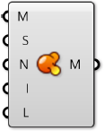

### 1.6.4 Polygonnetzoperationen

#####Im letzten Abschnitt haben iwr die grundlegende Struktur von Polygonnetzes angeschaut. In diesem Abschnitt werden wir Wege ansehen um Polygonnetzgeometrien zu manipulieren.

####1.6.4.1 Glaettung

Glaettere Polzgonnetze koennen erreicht werden, indem die Anzahl der Netzflaechen erhoeht wird. Dieser Prozess wird *Unterteilung* genannt. Dies kann oft zu sehr grossen Datensaetzen fuehren, welche viel Rechenzeit und zusaetzliche Erweiterungen fuer Grasshopper benoetigen. In dieser Situation kann die **Smooth** Komponente als Alternative genutzt werden, um weniger gacettierte Meshes zu erzeugen ohne die Anzahl der Eckpunkte und Netzflaechen zu erhoehen oder die Topologie zu veraendern. Die *Staerke*, *Anzahl der Iterationen* und *Versatzbegrenzung* koennen genutzt werden um die Art zu beeinflussen, in der die Glaettung passiert.

Verbindung eines boolschen Wertes mit einem Eingabeparameter N gibt uns die Option freie Eckpunkte zu ueberspringen. Exkpunkte sind frei, wenn sie mit einer offenen Kante verbunden sind, mit der Bedeutung dass er sich in der aeusseren Begrenzung des Polygonnetzes befindet. Indem Du diese Option einschaltet, kannst Du die aeusseren Begrenzungen eines Polygonnetzes erhalten, waehrend Du die inneren  Kanten des Polygonnetzes glaettest.

>1. Urspruengliches Polygnnetz einer Kiste mit drei Netzflaechen entfernt
2. Glaettung nach 2 Iterationen
3. 6 Iterationen
4. 25 Iterationen
5. 50 Iterationen

####1.6.4.2 Unschaerfe

Die **Blur** Komponente verhaelt sich aehnlich wie die "Smooth" Komponente, abgesehen von den Eckpunktfarben. Es kann auch benutzt werden um die gazackte Erscheinung von Farbpolygonnetzen, auch wenn der Effekt geringer ist, da die Geometrie nicht veraendert wird.

>1. Initial mesh
2. Blur after 1 iterations
3. 6 iterations
4. 12 iterations
5. 20 iterations

####1.6.4.3 Triangulierung

Um die Planaritaet einer jeden Netzfleache zu sichern oder um das Polygonnetz zu anderen Programmen zu exportieren, die keine viereckigen Netzflaechen erlauben, ist es manchmal noetig ein Polygonnetz zu triangulieren. Mit der Nutzung der **Triangulate** Komponente, wird jede viereckige Netzflaeche durch zwei dreieckige ersetzt. Grasshopper nimmt immer die kuerzeste Diagonale der Netzflaeche um eine Netzflaeche mit einer neuen Kante zu unterteilen.

>1. Urspruengliches Polygonnetz mit viereckigen Netzflaechen
2. Hinzugefuegte Kanten in Uebereinstimmung mit der kurzesten Distanz zwischen viereckigen Netzflaechen
3. Trianguliertes Polygonnetz als Ergebnis

####1.6.4.4 Schweissen

Im letzten Abschnitt, haben wir festgestellt, dass ein einzelner Eckpunkt von benachbarten Netzflaechen geteilt werden kann und dass die Normale fuer diesen Eckpunkt wird aus dem Durchnitt der Normalen der angrenzenden Netzflaechen berechnet, was eine glattere Darstellung gibt. Manchmal ist es jedoch gewuenscht, dass eine Scharfe Kante oder ein Saum erzeugt werden, an welchen ein glatter Uebergang zwischen einer Netzflaeche und der benachbarten nicht stattfinden soll. In dieser Situation ist es notwendig fuer jede Netzflaeche an einem Schnittpunkt eine eigene Exkpunktnormale zu definieren. Die Liste von Eckpunkten wuerde mindestens zwei Punkte enthalten die eine Koordinate teilen aber verschiedene Indizes besitzen.

>1. Verschweisste Netzflaeche - Beide Netzflaechen teilen die Vertices 1 und 2. Die Eckpunktnormalen an diesen Eckpunkten entsprechen dem Durchschnitt der Netzflaechennormalen der angrenzenden Netzflaechen.
2. Unverschweisste Netzflaeche - Duplizierete Exkpunkte wurden der Liste hinzugefuegt. Eckpunkte 1 und 6 und Eckpunkte 2 und 5 haben identische Koordinaten, aber unterschiedliche Eckpunkte. Sie haben jeweils ihre eigenen Eckpunktnormalen. Der Prozess zwei Eckpunkte in der selben Position zu nehmen und sie zu einem gemeinsamen Eckpunkt zusammenzufuehren nennen wit *schweissen*, wobei *entschweissen* einen einzelnen Eckpunkt und ihn in mehrere Eckpunkte zu teilen.

Die **Weld** Komponente nutzt einen Grenzwinkel als Eingabeparameter. Alle benachbarten Netzflaechen mit einem eingeschlossenen Winkel kleiner dem Grenzwinkel werden miteinander verschweisst, wodurch gemeinsame Eckpunkte mit geteilten Eckpunktnormalen entstehen, die die Werte der angrenzenden Flaechennormalen mitteln. **Unweld** funktioniert auf die entgegengesetzte Art und Weise, in der angrenzende Netzflaechen mit einem Winkel groesser dem Grenzwinkel entschweisst werden und die bisher geteilten Eckpunkte dupliziert werden.

>1. Die Standardpolygonnetzkiste hat 726 Eckpunkte. Das Polygonnetz ist an den Ecken der Kiste gekantet und die Eckpunkte an diesen Eckpunkten sind dupliziert.
2. Wenn das Polygonnetz mit einem Winkel groesser als 90 Grad verschweisst wird, werden die Netzflaechen alle verschweisst und die Anzahl der Endpunkte wurde auf 602 reduziert, waehrend die Anzahl der Netzflaechen die selbe bleibt.
3. Wenn wir uns die Vorschaugeometrie ansehen, koennen wir auch feststellen, dass das gerenderte verschweisste Polygonnetz geglaettete Ecken hat.
4. Entgegen der "Smooth" Komponente, welche die Polygonnetzgeometrie veraendern, wirkt dieses Polygonnetz nur geglaettet, weil die Eckpunktnormalen eine Rolle in Rendering und Schattierung spielen. die eigentliche Position der Eckpunkte bleibt unveraendert.

Im oben gezeigten Bild haben wir einen Winkel von 91 Grad angenommen, weil wir wissen, dass die Seiten eines Quadrats 90 Grad Winkel enthaelt. Um ein Polygonnetz vollstaendig zu verschweissen solltest Du einen Winkel von 180 Grad angeben.