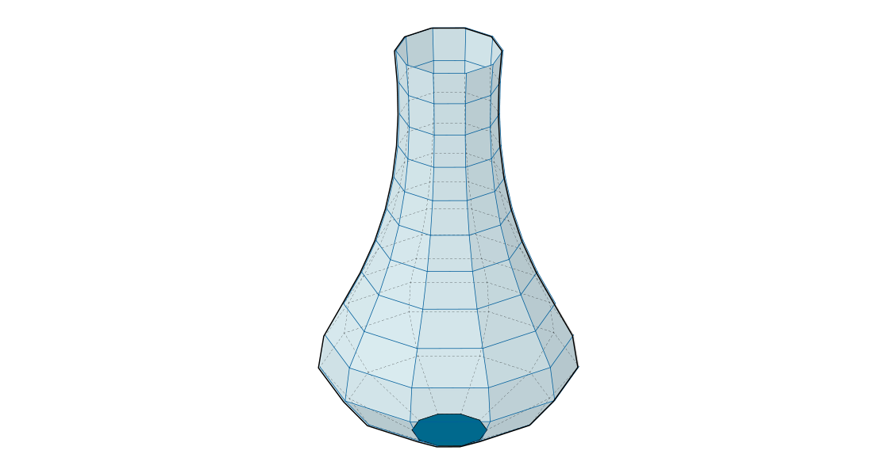
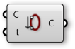
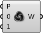
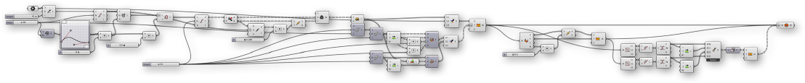

### 1.6.6 Arbeiten mit Polygonnetzgeometrien

##### In diesem Abschnitt werden wir uns durch eine Übung arbeiten, die einen kompletten Polygonnetzkörper erstellt. Am Ende der Übung werden wir eine dynamische Definition für eine Vase entwickelt haben, die 3D gedruckt werden kann.


>Beispieldateien für diesen Abschnitt: [http://grasshopperprimer.com/appendix/A-2/1_gh-files.html](http://grasshopperprimer.com/appendix/A-2/1_gh-files.html)

>Beispieldateien für diesen Abschnitt: [Download](../../appendix/A-2/gh-files/1.6.6_working with meshes.gh)


Da diese Definition etwas länger ist als die vorausgegangenen Beispiele in diesem Primer, werden wir zuerst durch die grundlegenden Schritte gehen, die wir unternehmen:

>1. Erstelle eine Serie von Kreisen, um einen Zylinder als Basisgeometrie zu erzeugen
2. Nutze die "Graph Mapper" Komponente, um das Profil der Vase zu definieren
3. Konstruiere die Topologie der Netzflächen, um ein einzelnes Polygonnetz zu erzeugen
4. Verschließe den unteren Teil des Polygonnetzes mit einer Kappe
5. Führe eine Verdrehung entlang der Vertikalen ein, um eine dynamischere Form zu erhalten
6. Führe Furchen als Textur der Vase ein
7. Versetze die Polygonnetzfläche, um der Vase Wandstärke zu geben.
8. Verschließe den oberen Spalt zwischen den beiden Polygonnetzen, um einen geschlossenen Körper zu erstellen

||||
|--|--|--|
|01.| Beginne eine neue Definition, drücke Strg+N (in Grasshopper)||
|02.| **Params/Geometry/Point** - Ziehe einen **Point** Parameter auf die Leinwand||
|03.| Referenziere einen Punkt in Rhino, indem Du auf die **Point** Komponente rechtsklickst und "Set one point" wählst. Dies wird als Ursprungspunkt für die Vase dienen.   <blockquote>Du kannst einen Punkt manuell in Grasshopper erzeugen, indem Du auf die Leinwand doppelklickst, um das Suchfenster zu öffnen und dann die Koordinaten getrennt durch Kommas eingibst: '0,0,0' (ohne die Anführungszeichen)</blockquote>||
|04.| **Params/Input/Number Slider** - Ziehe eine **Number Slider** Komponente auf die Leinwand und setze folgende Werte: <ul>Name: Length Lower Limit: 1 Upper Limit: 10</ul>||
|05.| **Curve/Primitive/Line SDL** - Ziehe eine **Line SDL** Komponente auf die Leinwand||
|06.| Verbinde die **Point** Komponente mit dem Start (S) Eingabeparameter der **Line SDL** Komponente und verbinde den **Number Slider** mit dem Länge Eingabeparameter.   <blockquote>Der Standardwert für die Richtung (D) der **Line SDL** Komponente ist der Z Einheitsvektor, den wir in diesem Beispiel nutzen werden.</blockquote>||
|07.| **Params/Input/Number Slider** - Ziehe einen **Number Slider** auf die Leinwand und gib die folgenden Werte ein: <ul>Name: V Count Rounding: Integer Lower Limit: 1 Upper Limit: 100</ul>||
|08.| **Curve/Division/Divide Curve** - Ziehe eine **Divide Curve** Komponente auf die Leinwand||
|09.| Verbinde den Linie (L) Ausgabeparameter der **Line SDL** Komponente mit dem Kurve (C) Eingabeparameter der **Divide Curve** Komponente||
|10.| Verbinde den **V Count** Schieberegler mit dem Anzahl (N) Eingabeparameter der **Divide Curve** Komponente||
|11.| **Curve/Primitive/Circle CNR** - Ziehe eine **Circle CNR** Komponente auf die Leinwand||
|12.| Verbinde den Punkte (P) Ausgabeparameter der **Divide Curve** Komponente mit dem Zentrum (C) Eingabeparameter der **Circle CNR** Komponente|||

>Wir haben eine Serie von Kreisen vertikal gestapelt. Wir werden diese als Profil für unsere Vase nutzen.

Als nächstes werden wir die Radien der Kreise mit dem "Graph Mapper" steuern.

||||
|--|--|--|
|13.| **Sets/Sequence/Range** - Ziehe eine **Range** Komponente auf die Leinwand||
|14.| Verbinde den **V Count** Schieberegler mit dem Schritte (N) Eingabeparameter der **Range** Komponente||
|15.| **Params/Input/Graph Mapper** - Ziehe eine **Graph Mapper** Komponente auf die Leinwand||
|16.| Rechtsklicke auf den **Graph Mapper**, klicke 'Graph Types' im Menu und wähle 'Bezier'||
|17.| **Params/Input/Number Slider** - Ziehe eine **Number Slider** Komponente auf die Leinwand und setze die folgenden Werte: <ul>Name: Width Lower Limit: 0 Upper Limit: 10</ul>||
|18.| **Maths/Operators/Multiplication** - Ziehe eine **Multiplication** Komponente auf die Leinwand||
|19.| Verbinde den **Graph Mapper** des **Width** Schieberegler mit den A und B Eingabeparametern der **Multiplication** Komponente||
|20.| Verbinde den Ergebnisse (R) Ausgabeparameter der **Multiplication** Komponente mit dem Radius (R) Eingabeparameter der **Circle CNR** Komponente|||

>Nutze die Griffe des **Graph Mapper**, um die Profile der Kreise anzupassen. 

>MERKE: Es ist wichtig sich zu versichern, dass der Startpunkt der Bezierkurve auf dem  **Graph Mapper** ungleich 0 ist. Indem wir den Startpunkt des "Graph Mapper" größer 0 wählen, stellen wir sicher, dass die Vase eine horizontale Standfläche hat.

Wie haben nun ein Profil für unsere Vase. Als nächstes werden wir die Polynetzfläche erzeugen. Dies beinhaltet die Erzeugung der Eckpunkte und die Definition der Netzflächen entsprechend der Indizes der Eckpunkte.

||||
|--|--|--|
|21.| **Params/Input/Number Slider** - Ziehe eine **Number Slider** Komponente auf die Leinwand: <ul>Name: U Count Rounding: Even Lower Limit: 2 Upper Limit: 100</ul>||
|22.| **Curve/Division/Divide Curve** - Ziehe eine **Divide Curve** Komponente auf die Leinwand||
|23.| Verbinde den Kreise (C) Ausgabeparameter der **Circle CNR** Komponente mit dem Kurve (C) Eingabeparameter der **Divide Curve** Komponente, und verbinde den **U Count** Schieberegler mit dem Anzahl (N) Eingabeparameter  <blockquote>Der Punkte (P) Ausgabeparameter dieser Komponente enthält die Eckpunkte, die wir zur Erstellung unseres Polygonnetzes benutzen</blockquote>||
|24.| **Sets/Sequence/Series** - Ziehe zwei **Series** Komponenten auf die Leinwand||
|25.| Verbinde den **U Count** Schieberegler mit dem Schritte (N) Eingabeparameter der ersten **Series** Komponente, und verbinde den **V Count** Schieberegler mit dem Anzahl(C) Eingabeparameter der **Series** Komponente||
|26.| Verbinde den Serie (S) Ausgabeparameter mit der ersten **Series** Komponente mit dem Start (S) Eingabeparameter der zweiten **Series** Komponente, und verbinde den **U Count** Schieberegler mit dem Anzahl (C) Eingabeparameter||
|27.| **Sets/List/Shift List** - Ziehe eine **Shift List** Komponente auf die Leinwand||
|28.| Verbinde den Ausgabeparameter der **Series** Komponente mit der Liste (L) Eingabeparameter der **Shift List** Komponente||
|29.| **Maths/Operators/Addition** - Ziehe zwei **Addition** Komponenten auf die Leinwand||
|30.| Verbinde den Ausgabeparameter der zweiten **Series** Komponente des **U Count** Schieberegler mit den A und B Eingabeparameter der ersten **Addition** Komponente||
|31.| Verbinde den Ausgabeparameter der **Shift List** Komponente des **U Count** Schiebereglers mit den A und B Eingabeparameter der **Addition** Komponente||
|32.| **Mesh/Primitive/Mesh Quad** - Ziehe eine **Mesh Quad** Komponente auf die Leinwand||
|33.| Verbinde die folgenden Eingabeparameter der **Mesh Quad** Komponente: <ul>A - Second **Series** component B - **Shift List**   C - Erste **Addition** Komponente D - Zweite **Addition** Komponente</ul> <blockquote>Wir haben nun eine Topologie für unser Polygonnetz zu Grunde gelegt. Diese Netzflächen werden mit den Eckpunkten kombiniert. Die Ordnung dieser Verbindungen ist essentiell, also prüfe noch einmal alle Verbindungen bis zu diesem Punkt!</blockquote>||
|34.| **Sets/Tree/Flatten** - Ziehe eine **Flatten Tree** Komponente auf die Leinwand||
|35.| Verbinde den Punkte (P) Ausgabeparameter der **Divide Curve** Komponente mit dem Baum (T) Eingabeparameter der **Flatten Tree** Komponente||
|36.| **Mesh/Primitive/Construct Mesh** - Ziehe eine **Construct Mesh** Komponente auf die Leinwand||
|37.| Verbinde den Baum (T) Ausgabeparameter der **Flatten Tree** Komponente mit dem Eckpunkte (V) Eingabeparameter der **Construct Mesh** Komponente||
|38.| Verbinde den Netzflächen (F) Ausgabeparameter der **Mesh Quad** Komponente mit dem Netzflächen (F) Eingabeparameter der **Construct Mesh** Komponente. Rechtklicke den F(Netzflächen) Eingabeparameter und wähle 'Flatten'|||

>Wir haben nun die Polygonnetzfläche für unsere Vase.

 

Als nächstes werden wir den Boden der Vase schließen. Um dies zu tun, werden wir den ursprünglichen Ausgangspunkt zu unserer Liste von Eckpunkten hinzufügen und dann dreieckige Netzflächen zu diesem Punkt von der unteren Kante der Vase erzeugen.

||||
|--|--|--|
|39.| **Sets/Sequence/Series** - Ziehe eine **Series** Komponente auf die Leinwand||
|40.| Verbinde den **U Count** Schieberegler mit dem Anzahl (C) Eingabeparameter der **Series** Komponente||
|41.| **Sets/List/List Length** - Ziehe eine **List Length** Komponente auf die Leinwand||
|42.| Verbinde den Baum (T) Ausgabeparameter der **Flatten Tree** Komponente mit dem Liste (L) Eingabeparameter der **List Length** Komponente   <blockquote>Dies wird der Index des Ursprungs sein, wenn wir ihn zu unserer Liste der Eckpunkte hinzugefügt haben.</blockquote>||
|43.| **Sets/List/Shift List** - Ziehe eine **Shift List** Komponente auf die Leinwand||
|44.| **Mesh/Primitive/Mesh Triangle** - Ziehe eine **Mesh Triangle** Komponente auf die Leinwand||
|45.| Verbinde die folgenden Eingabeparameter der **Mesh Triangle** Komponente: <ul>A - Neueste **Series** Komponente B - **List Length** C - **Shift List**</ul>||
|46.| **Sets/Tree/Merge** - Ziehe zwei **Merge** Komponenten auf die Leinwand||
|47.| Verbinde den Baum (T) Ausgabeparameter der **Flatten Tree** Komponente mit dem D1 Eingabeparameter, und verbinde die ursprüngliche **Point** Komponente mit dem D2 Eingabeparameter der ersten**Merge** Komponente||
|48.| Verbinde den Netzflächen Ausgabeparameter (F) der **Mesh Quad** Komponente mit dem D1 Eingabeparameter, und verbinde den **Mesh Triangle** Ausgabeparameter mit dem D2 Eingabeparameter der zweiten **Merge** Komponente||
|49.| Verbinde die erste **Merge** Komponente mit dem Eckpunkte (V) Eingabeparameter der **Construct Mesh** Komponente, und verbinde die zweite **Merge** Komponente mit dem Netzflächen (F) Eingabeparameter der **Construct Mesh** Komponente.|||

>Wir haben den Boden der Vase mit dreieckigen Netzflächen verschlossen.

 

Wir werden jetzt etwas Detail zur Vase hinzufügen. Wir werden beginnen, indem wir der vertikalen Richtung eine Kurve geben, indem wir die Säume der ursprünglichen Kreise anpassen

||||
|--|--|--|
|50.| **Curve/Util/Seam** - Ziehe eine **Seam** Komponente auf die Leinwand||
|51.| Verbinde den Kreis (C) Ausgabeparameter der  **Circle CNR** Komponente mit dem Kurve (C) Eingabeparameter der **Seam** Komponente||
|52.| Rechtsklicke den Kurve (C) Eingabeparameter der **Seam** Komponente und wähle'Reparameterize'||
|53.| **Params/Input/Number Slider** - Ziehe eine **Number Slider** Komponente auf die Leinwand. Wir werden die Standardeinstellungen für diesen Schieberegler anwenden.||
|54.| **Maths/Operator/Multiplication** - Ziehe eine **Multiplication** Komponente auf die Leinwand.||
|55.| Verbinde den Ausgabeparameter der **Graph Mapper** mit dem A Eingabeparameter, und den neuesten **Number Slider** mit dem B Eingabeparameter der **Multiplication** Komponente||
|56.| Verbinde den Ergebnis (R) Ausgabeparameter der **Multiplication** Komponente mit dem Parameter (t) Eingabeparameter der **Seam** Komponente|||

>Die Krümmung wird erreicht, indem wir die *Saum* Position der ursprünglichen Kreise anpassen, indem wir denselben "Graph Mapper" des Vasenprofils benutzen.

 

Als nächstes werden wir vertikale Furchen in die Vase einarbeiten.

||||
|--|--|--|
|57.| **Sets/List/Dispatch** - Ziehe eine **Dispatch** Komponente auf die Leinwand||
|58.| Verbinde den Punkte (P) Ausgabeparameter der zweiten **Divide Curve** Komponente mit dem Liste (L) Eingabeparameter der **Dispatch** Komponente   <blockquote>Wir nutzen den Standardmuster (P) Eingabeparameter der **Dispatch** Komponente, um die Punkte in zwei Listen in alternierendem Muster aufzuteilen.</blockquote>||
|59.| **Vector/Vector/Vector 2Pt** - Ziehe eine **Vector 2Pt** Komponente auf die Leinwand||
|60.| Verbinde den B Ausgabeparameter der **Dispatch** Komponente mit dem A Eingabeparameter der **Vector 2Pt** Komponente||
|61.| Verbinde den Punkte (P) Ausgabeparameter der ersten **Divide Curve** Komponente mit dem B Eingabeparameter der **Vector 2Pt** Komponente||
|62.| Rechtsklicke den B Eingabeparameter der **Vector 2Pt** Komponente und wähle 'Graft', und rechtsklicke den Vereinheitlichung (U) Eingabeparameter, gehe zu'Set Boolean' und wähle 'True'   <blockquote>Dies produziert einen Einheitsvektor für jeden Punkt, der auf das Zentrum der Kreise deutet</blockquote>||
|63.| **Params/Input/Number Slider** - Ziehe eine **Number Slider** Komponente auf die Leinwand. Wir werden die Standardeinstellungen verwenden||
|64.| **Maths/Operator/Multiplication** - Ziehe eine **Multiplication** Komponente auf die Leinwand||
|65.| Verbinde den Vektor (V) Ausgabeparameter der **Vector 2Pt** Komponente mit dem A Eingabeparameter, und verbinde den **Number Slider** mit dem B Eingabeparameter der **Multiplication** Komponente||
|66.| **Transform/Euclidean/Move** - Ziehe eine **Move** Komponente auf die Leinwand||
|67.| Verbinde den B Ausgabeparameter der **Dispatch** Komponente mit dem Geometrie (G) Eingabeparameter der **Move** Komponente||
|68.| Verbinde den Ergebnis (R) Ausgabeparameter der **Multiplication** Komponente mit dem Richtungsvektor (T) Eingabeparameter der **Move** Komponente||
|69.| **Sets/List/Weave** - Ziehe eine**Weave** Komponente auf die Leinwand||
|70.| Verbinde den A Ausgabeparameter der **Dispatch** Komponente mit dem 0 Eingabeparameter der **Weave** Komponente||
|71.| Verbinde den Geometrie (G) Ausgabeparameter der **Move** Komponente mit dem 1 Eingabeparameter der **Weave** Komponente||
|72.| Verbinde den Gewebe (W) Ausgabeparameter der **Weave** Komponente mit dem Baum (T) Eingabeparameter der **Flatten Tree** Komponente|||

>Erinnere Dich daran, zurückzugehen und Deine Schieberegler und "Graph Mapper" anzupassen, um zu sehen, wie sich das Modell verändert und um sicherzugehen, dass alles immer noch funktioniert. Dies ist bekannt als "Biegung" des Modells und soll regelmäßig gemacht werden, um zu sehen, ob Fehler in der Definition vorliegen.

Wir haben jetzt eine einzelne Fläche für unsere Vase. Wenn wir die Vase 3D drucken wollen, benötigen wir einen geschlossenen Körper. Wir werden den Körper erzeugen, indem wir das Polygonnetz versetzen und die beiden Polygonnetze zu einem Körper zusammenfügen.

||||
|--|--|--|
|73.| **Mesh/Analysis/Deconstruct Mesh** - Ziehe eine **Deconstruct Mesh** Komponente auf die Leinwand||
|74.| Verbinde den Polygonnetz (M) Ausgabeparameter der **Construct Mesh** Komponente mit dem Polygonnetz Eingabeparameter (M) der **Deconstruct Mesh** Komponente||
|75.| **Params/Input/Number Slider** - Ziehe eine **Number Slider** Komponente auf die Leinwand. Wir werden die Standardeinstellungen verwenden||
|76.| **Maths/Operator/Multiplication** - Ziehe eine **Multiplication** Komponente auf die Leinwand||
|77.| Verbinde den Normalen (N) Ausgabeparameter der **Deconstruct Mesh** Komponente mit dem A Eingabeparameter und verbinde den **Number Slider** mit dem B Eingabeparameter der **Multiplication** Komponente||
|78.| **Transform/Euclidean/Move** - Ziehe eine **Move** Komponente auf die Leinwand||
|79.| Verbinde den Eckpunkte (V) Eingabeparameter der **Deconstruct Mesh** Komponente mit dem Geometrie (G) Eingabeparameter der **Move** Komponente||
|80.| Verbinde den Ergebnis (R) Ausgabeparameter der **Multiplication** Komponente mit dem Richtungsvektor (T) Eingabeparameter der **Move** Komponente||
|81.| **Mesh/Primitive/Construct Mesh** Ziehe eine **Construct Mesh** Komponente auf die Leinwand||
|82.| Verbinde den Geometrie (G) Ausgabeparameter der **Move** Komponente mit dem Eckpunkte (V) Eingabeparameter der **Construct Mesh** Komponente||
|83.| Verbinde den Netzflächen (F) Ausgabeparameter der **Deconstruct Mesh** Komponente mit dem Netzflächen (F) Eingabeparameter der **Construct Mesh** Komponente|||

>Durch das Versetzen des Polygonnetzes entlang der Eckpunktnormalen haben wir eine Innenseite und eine Außenseite der Vase, aber immer noch einen Spalt zwischen den beiden Polygonnetzen

Der letzte Schritt wird es sein, das Polygonnetz zu schließen, indem wir ein neues Polygonnetz erzeugen, um den Spalt zu schließen und dann die Polygonnetze miteinander verbinden.

||||
|--|--|--|
|84.| **Mesh/Analysis/Mesh Edges** - Ziehe eine **Mesh Edges** Komponente auf die Leinwand||
|85.| Verbinde den Polygonnetz (M) Ausgabeparameter der ersten **Construct Mesh** Komponente mit dem Polygonnetz (M) Eingabeparameter der **Mesh Edges** Komponente||
|86.| **Curve/Util/Join Curves** - Ziehe eine **Join Curves** Komponente auf die Leinwand||
|87.| Verbinde den offene Kanten (E1) Ausgabeparameter der **Mesh Edges** Komponente mit dem Kurven (C) Eingabeparameter der **Join Curves** Komponente||
|88.| **Curve/Analysis/Control Points** - Ziehe eine **Control Points** Komponente auf die Leinwand||
|89.| Verbinde den Kurven (C) Ausgabeparameter der **Join Curves** Komponente mit dem Kurven (C) Eingabeparameter der **Control Points** Komponente   <blockquote>Durch das Verbinden der Kurven und das Extrahieren der Kontrollpunkte sichern wir, dass die Ordnung der Punkte entlang des Rands der Vase konsistent ist, was wichtig für die Orientierbarkeit und Mannigfaltigkeit des finalen Polygonnetzes ist</blockquote>||
|90.| **Sets/List/Shift List** - Ziehe eine **Shift List** Komponente auf die Leinwand||
|91.| Verbinde den Punkte (P) Ausgabeparameter der **Control Points** Komponente mit dem Liste (L) Eingabeparameter der **Shift List** Komponente||
|92.| Wiederhole Schritte 84 bis 91 für die zweite **Construct Mesh** Komponente||
|93.| **Sets/Tree/Entwine** - Ziehe eine **Entwine** Komponente auf die Leinwand||
|94.| Zoome auf die **Entwine** Komponente, um die Optionen zu sehen und einen zusätzlichen Eingabeparameter zu erhalten. Wir werden vier Eingabeparameter brauchen. Verbinde sie auf die folgende Art: <ul>{0;0} - Punkte (P) der ersten **Control Points** Komponente {0;1} - Ausgabeparameter der ersten **Shift List**  {0;2} - Ausgabeparameter der zweiten **Shift List** {0;3} - Punkte (P) der zweiten **Control Points** Komponente</ul>||
|95.| **Sets/Tree/Flip Matrix** - Ziehe eine **Flip Matrix** Komponente auf die Leinwand||
|96.| Verbinde den Ergebnis (R) Ausgabeparameter der **Entwine** Komponente mit dem Daten (D) Eingabeparameter der **Flip Matrix** Komponente||
|97.| **Mesh/Primitive/Construct Mesh** - Ziehe eine **Construct Mesh** Komponente auf die Leinwand||
|98.| Verbinde den Daten (D) Ausgabeparameter der **Flip Matrix** Komponente mit dem Eckpunkte (V) Eingabeparameter der **Construct Mesh** Komponente||
|99.| **Mesh/Util/Mesh Join** - Ziehe eine **Mesh Join** Komponente auf die Leinwand||
|100.| Verbinde alle drei **Construct Mesh** Komponenten mit dem Eingabeparameter der **Mesh Join** Komponente, indem Du Shift gedrückt hältst, während Du die Verbindungen erstellst (oder nutze eine **Merge** Komponente). Rechtsklicke den Polygonnetz (M) Eingabeparameter der **Mesh Join** Komponente und wähle 'Flatten'|||

---

