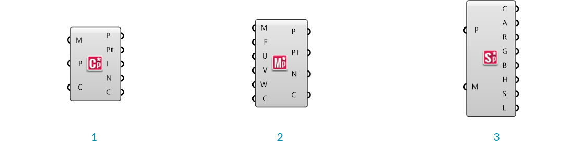

###2.1.3. Element* Komponenten

####2.1.3.1 Analyse

>1. Mesh Closest Point 
2. Mesh Evaluate
3. Mesh Sample Plus

**Element\* Mesh Closest Point**

Abweichend von Grasshopper's **Mesh Closest Point** Komponente, berechnet diese Komponente auch den Normalenvektor und die Farbe der ausgegebenen Punkte und ueberkommt die Notwendigkeit der **Mesh Eval** Komponente, was der Graphen auf der Leinwand vereinfacht.

**Element\* Mesh Evaluate**

Die Grasshopper eigene **Mesh Eval** Komponente benoetigt einen Polygonnetzparameter als Eingabe, der von der **Mesh Closest Point** Komponente ausgegeben wird, aber recht schwierig haendisch zu erstellen ist. Element's "Closest Point" Komponente ermoeglicht die direkte Eingabe des Index einer Netzflaeche und ihrer baryzentrischen Koordinaten.

Merke - baryzentrische Koordinaten sind auf eine Art und weise definiert, dass sie immer zu eins aufaddieren. Wenn die Eingabewerte U, V und W nicht auf eins aufaddieren, wird diese Komponente das Verhaeltnis der drei Werte beibehalten, waehrend sie normalisiert werden. Zum Beispiel, wenn Du die Eingabewerte 2, 2 und 4 eingibst, wird der Polygonnetzparameter mit {0.25;0.25;0.5} berechnet.

**Element\* Mesh Sample Plus**

Diese Komponente wird benutzt, um schnell Farbinformation aus einem Polygonnetz zu extrahieren. Sie gibt Alpha, Rot, Gruen, Blau, Farbton, Saettigung, und Leuchtkraftwerte der eingegebenen Punkte aus. Wenn ein gegebener Punkt nicht auf dem Polygonnetz liegt, wird diese Komponente den naehesten Punkt auf dem Polygonnetz berechnen. Diese Komponente nutzt parallele Datenverarbeitung um die Geschwindigkeit zu erhoehen.

####2.1.3.2 Daten

>1. Datenvisualisierer
2. Benachbarte Kanten
3. Benachbarte Netyflaechen
4. Benachbarte Eckpunkte

**Element\* Data Visualizer**

Diese Komponente wird verwendet um Halbkantendaten der Netzflaechen eines Eingabepolygonnetzes zu visualieren.

**Element\* Edge Neighbors**

Diese Komponente bietet die Moeglichkeit Daten zur Nachbarschaft von Kanten eines Eingabepolygonnetzes strukturiert auszugeben. Die Ausgabedaten werden als Baum mit einem Ast fuer jede Kante in dem Polygonnetz ausgegeben. Sie gibt die Meshkanten, deren Entpunkte und die Mittelpunkte der Netzflaechen angrenzend an jeder Kante ("dual graph"), die benachbarten Kanten als Linienobjekte (in Reihe entgegen dem Uhrzeigersinn) und benachbarte Netzflaechenmittelpunkte (in Bezug auf die Kanten Start- und Endpunkte) aus.

> **Edge Neighbors** - Kanten, Eckpunkte an den Enden, angrenzende Netzflaechenmittelpunkte, benachbarte Kanten und benachbarte Netzflaechenmittelpunkte

**Element\* Face Neighbors**

Diese Komponente ist aehnlich zu den anderen in diesem Abschnitt, aber die Daten im Baum sind entsprechende der Netzflaechen geordnet, mit einem Ast pro Netzflaeche. Die Ausgabeparameter sind die Netzflaechenmittelpunkte, die Eckpunkte jeder Netzflaeche (angeordnet entgegen dem Uhrzeigersinn), benachbarte Kanten (angeordnet entgegen dem Uhrzeigersinn) und die Mittelpunkte der benachbarten Flaechen (angeordnet entgegen dem Uhrzeigersinn).

> **Face Neighbors** - Netzflaechenmittelpunkte, Netzflaecheneckpunkte, benachbarte Kanten und benachbarte Netzflaechenmittelpunkte

**Element\* Vertex Neighbors**

Diese Komponente gibt die Polygonnetzeckpunkte, benachbarte Eckpunkte (angeordnet entgegen dem Uhrzeigersinn), benachbarte Kanten (angeordnet entgegen dem Uhrzeigersinn) und benachbarte Netzflaechenmittelpunkte (angeordnet entgegen dem Uhrzeigersinn) in einem strukturierten Datenbaum entsprechend den Eckpunkten des Polygonnetzes aus.

> **Vertex Neighbors** - Eckpunkte, benachbarte Eckpunkte, benachbarte Kanten, benachbarte Netzflaechenmittelpunkte

####2.1.3.3 Primitive Polygonnetzkoerper

Element\* stellt vier zusetzliche primitve Polygonnetzkoerper zur Verfuegung: den Dodekaeder, Tetraeder, Oktaeder und Ikosaeder. Diese Komponente nimmt eine einzelne Zahl als Eingabeparameter fuer den Radius und produziert ein Polygonnetz mit dem Koordinatenursprung als Zentrum, das aus einer Netzflaeche pro Seite besteht. Mit dem zusaetzlichen Einsatz des Wuerfels, der bereits in Grasshopper zur Verfuegung steht, macht das fuenf platonische Koerper. 

>1. Dodekaeder
2. Tetraeder
3. Oktaeder
4. Ikosaeder

####2.1.3.4 Glaettung

**Element\* Smooth** stellt einen optimierten Glaettungsalgorithmus zur Verfuegung, der effizienter arbeitet als Grasshopper's **Smooth Mesh**, wenn er fuer groessere Datensaetze eingesetzt wird. Er nutzt den Laplaceschen Glaettungsalgorithmus fuer halbkantenstrukturierte Polygonnetze. Er veraendert nicht die Topologie oder die Anzahl der Eckpunkte eines verschweissten Polygonnetzes, wird aber identische Eckpunkte zusannebfuehren, die aus einem unverschweissten Polygonnetz resultieren. Wir koennen die Glaettungsstaerke, Grenbedingungen, Grenztoleranzen, sowie die Anzahl der Iterationen angeben.

####2.1.3.5 Unterteilung

**Element\* Catmull Clark Subdivision** 

Dies ist eine rekursive Unterteilung basierend auf dem Catmull Clark Algorithmus. Wir koennen die Anzahl der Iterationen, sowie die Art des Umgangs mit offenen Kanten bestimmen.

**Element\* Constant Quad**

Diese Unterteilungskomponente wird ein Polygonnetz mit ausschliesslich viereckigen Netzflaechen erzeugen indem sie eine weitere Netzflaeche fuer jede Kante des Polygonnetzes hinzufuegt.

>1. Constant Quad Unterteilung
2. Catmull Clark Unterteilung

####2.1.3.6 Transformation

>1. Mesh Windown
2. Mesh Frame
3. Mesh Thicken
4. Mesh Offset
5. Mesh Poke Face

Diese Komponenten stellen eine Anzahl von unterschiedlicher Transformationen zur Verfuegung, die unten beschrieben werden. Jede Komponente hat die zusaetzliche Moeglichkeit Distanzdaten pro Eckpunk anzunehmen um eine Variation der Transformationsstaerke ueber das Polygonnetz zu erreichen.

**Element\* Mesh Window**

Stellt ein neues Polygonnetz innerhalb der Netzflaechen mit einem Versatzwert her. Diese Komponente akzeptiert entweder ein Polygonnetz oder eine Liste von geschlossenen Polylinien als Eingabe.

**Element\* Mesh Frame**

Die Ausgabe ist ein Rahmen um die Netzflaechen. Jede resultierende Netzflaeche wird ein neues Loch im Zentrum haben. Diese Komponente akzeptiert entweder ein Polygonnetz oder eine Liste von geschlossenen Polylinien als Eingabe.

**Element\* Mesh Thicken**

Diese Komponente wird einem Eingabepolygonnetz Materialstaerke entsprechend der Eckpunktnormalen entsprechend der zur Verfuegung gestellten Eingabewerte zuweisen.

**Element\* Mesh Offset**

Diese Komponente erstellt einen Versatz zum urspruenglichen Polygonnetz entsprechend der Eckpunktnormalen.

**Element\* Mesh Poke Face**

Zuerst werden die Netzflaechen mit einer "Frame" Operation geteilt und dass die Innenflaeche nochmals mittig unterteilt. Fuer diesen Teil der Netzflaeche kann ein Wert angegeben werden, der die innenliegenden Netzflaechen entlang der Flaechennormalen verschiebt. Zum Beispiel wir ein vierseitiges Polygon ("Quad") in vier dreiseitige Polygone, mit einem gemeinsamen Eckpunkt in deren Mitte, unterteilt. Der Hoeheneingabeparameter erlaubt es den Eckpunkt entsprechend zu transformieren.

>1. Mesh Window
2. Mesh Frame
3. Ikosaeder nach der aufeinanderfolgenden Anwendung der "Mesh Frame", "Mesh Thicken" und Polygonnetzteilung Komponenten.

####2.1.3.7 Dienstprogramme

>1. Mesh Combine & Clean
2. Mesh Edges
3. Mesh Status

**Element\* Mesh Combine and Clean** 

Diese Komponente verbindet verschiedene Polygonnetze mit den zusaetzlichen Optionen das Polygonnetz basierend auf einem Winkel zu verschweissen oder identische Eckpunkte zu verbinden. Diese Komponente stellt ebenso moegliche topologische Probleme fest und gibt diese als Anmerkungen und Warnungen mit detaillierten Beschreibungen aus. Im Fall, dass die Zusammenfuehrung von identischen Eckpunkte eine schlechte Topologie erzeugt, wird die Komponente die unveraenderten Eingabepolygonnetze ausgeben, anstatt sie zusammenzufuehren. Der Nutzer kann auch angeben das Polygonnetz zusammenzufuehren ohne die Eckpunkte zu veraendern.

**Element\* Mesh Edges** 

Diese Komponente gibt die offenen Kanten, Kante, Netzflaechenpolylinien und fuer unverschweisste Polygonnetze die unverschweissten Polygonnetzkanten aus.

**Element\* Mesh Status** 

Diese Komponente gibt Polygonnetzinformationen basierend auf der Topologie aus. Es gibt zwei verschiedene Modi in denen wir die Informationen ansehen koennen. Die erste ist die Ausgabe von Daten zur Geometrie, wie Polygonnetzvaliditaet, Anzahl der Exkpunkte, Anzahl der Netzflaechen und Anzahl der normalen. Die andere ist die Ausgabe des Polygonnetzstatus, welcher den Zustand des Polygonnetzes beschreibt, ob es nicht-mannigfaltige Kannten, degenerierte Netzflaechen, die Anzahl der offenen Kanten oder die Anzahl unverbundener Netzflaechen ist. Diese Komponente operiert nicht auf einem Polygonnetz, es gibt lediglich Informationen fuer den Nutzer aus. Es gibt auch eine Option fuer die Kombination identischer Eckpunkte, wodurch der Nutzer den Effekt dieser Option auf die entsprechenden Daten beobachten kann.