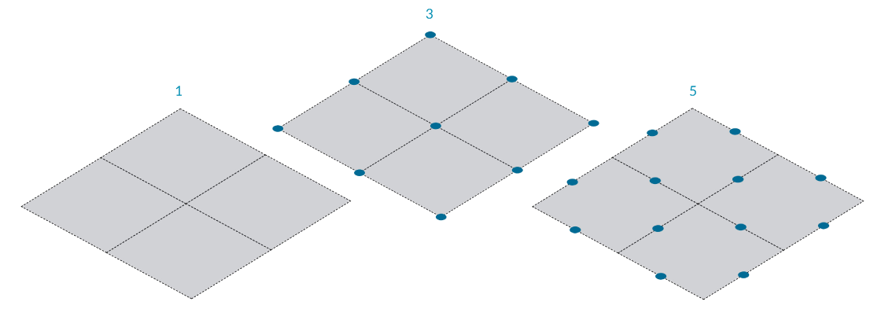
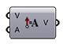
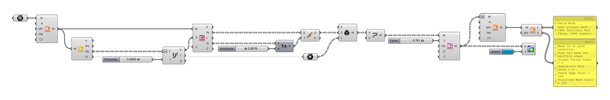
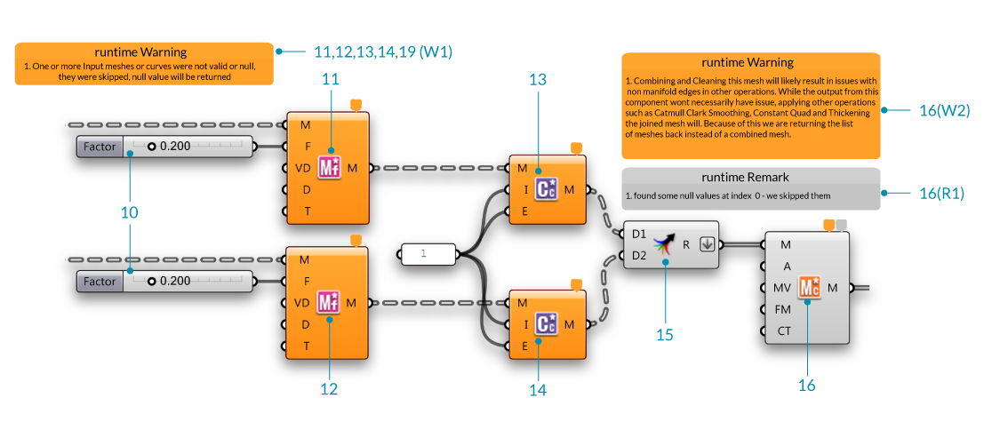

### 2.1.5. Architektonisches Fallbeispiel 

##### In diesem Abschnitt werden wir uns durch eine einfache Übungsdatei arbeiten, die als Einführung für die Arbeit mit dem Elementwerkzeug gedacht ist. Wir werden einige Muster und Fassadengestaltungen im Feld der Architektur erkunden, welche die Halbdatenstrukturen zusammen mit einfachen Elemtkomponenten ohne die Nutzung von polygonnetzeckpunktbezogenen Funktionen einarbeiten.

#### 2.1.5.1 Beispiel 1


>Beispieldateien zu diesem Abschnitt: [http://grasshopperprimer.com/appendix/A-2/1_gh-files.html](http://grasshopperprimer.com/appendix/A-2/1_gh-files.html)

>Beispieldateien zu diesem Abschnitt: [Download](../../appendix/A-2/gh-files/2.1.5.1_Architecture Case Study_A.gh)


---

---

||||
|--|--|--|
|00.| Erstelle eine Polygonnetzebene in Rhino mit **XFaces = 2 & YFaces = 2** und beginne eine neue Definition, drücke Strg-N (in Grasshopper)||
|01.| **Params/Geometry/Mesh** - Ziehe einen **Mesh** Container auf die Leinwand||
|01b.| Referenziere das Polygonnetz aus Rhino indem Du auf die **Mesh** Komponente rechtsklickst und "Set one Mesh" auswählst.  <blockquote>Wir werden eine einfache Polygonnetzebene verwenden, um Dich durch die Definition zu führen, fühle Dich frei, das Polygonnetz durch ein beliebiges eigenes Polygonnetz zu ersetzen</blockquote>||
|02.| **Element\*/Utility/Mesh Combine and Clean** - Ziehe eine **Element* Mesh Combine and Clean** Komponente auf die Leinwand||
|03.| **Element\*/Data/Vertex Neighbors** - Ziehe eine **Element* Vertex Neighbors** Komponente auf die Leinwand| |
|04.| **Params/Input/Number Slider** - Ziehe eine **Number Slider** Komponente auf die Leinwand und setze folgende Werte: <ul>Lower Limit: 0.0000 Upper Limit: 1.0000</ul>||
|05.| **Curve/Analysis/Evaluate Curve** - Ziehe eine **Evaluate Curve** Komponente auf die Leinwand||
|05b.| Verbinde den Benachbarte Kanten (NE) Ausgabeparameter der **Element* Vertex Neighbors** Komponente mit dem Kurve (C) Eingabeparameter der **Evaluate Curve** Komponente||
|05c.| Verbinde den **Number Slider** mit dem Fließkomma (t) Eingabeparameter der **Evaluate Curve** Komponente und setze den Wert auf 0.5000||
|05d.| Rechtsklicke auf den Kurve (C) Eingabeparameter der **Evaluate Curve** Komponente und aktiviere **Reparameterize** |||

---

||||
|--|--|--|
|06.| **Element\*/Analyse/Mesh Closest Point** - Ziehe eine **Element* Mesh Closest Point** Komponente auf die Leinwand||
|06a.| Verbinde den Polygonnetz (M) Ausgabeparameter der **Element\*/Utility/Mesh Combine and Clean** Komponente mit dem Polygonnetz (M) Eingabeparameter der **Element* Mesh Closest Point** Komponente||
|06b.| Verbinde den Punkte (P) Ausgabeparameter der **Curve/Analysis/Evaluate Curve** Komponente mit dem Punkt (P) Eingabeparameter der **Element* Mesh Closest Point** Komponente||
|07.| **Params/Input/Number Slider** - Ziehe eine **Number Slider** Komponente auf die Leinwand und setze die folgenden Werte: <ul>Rounding: Float Lower Limit:0 Upper Limit: 10.000</ul>||
|08.| **Vector/Vector/Amplitude** - Ziehe eine **Amplitude** Komponente auf die Leinwand||
|09.| **Transform/Euclidean/Move** - Ziehe eine **Move** Komponente auf die Leinwand||
|10.| **Params/Geometry/Point** - Ziehe einen **Point** Container auf die Leinwand||
|10b.| Verbinde den Netzflächenmittelpunkt Ausgabeparameter (FC) der **Element* Vertex Neighbors** Komponente mit dem **Point** Container||
|11.| **Sets/List/Weave** - Ziehe eine **Weave** Komponente auf die Leinwand|||

---

||||
|--|--|--|
|12.| **Curve/Primitive/Polyline** - Ziehe eine **Polyline** Komponente auf die Leinwand||
|12b.| Verbinde den Gewebe Ausgabeparameter (W) der **Weave** Komponente mit dem Eckpunkte (V) Eingabeparameter der **Polyline** Komponente||
|12c.| Rechtsklicke auf den Geschlossene Kurve (C) Eingabeparameter der **Polyline** Komponente, klicke "Set Boolean" und setze den Wert auf Wahr  <blockquote>Nun wurde eine geschlossene Polylinie erzeugt.</blockquote>||
|13.| **Params/Input/Number Slider** - Ziehe eine **Number Silder** Komponente auf die Leinwand. Wir werden das Standardintervall von 0 bis 1 für diesen Schieberegler beibehalten||
|14.| **Element\*/Transform/Mesh Frame** - Ziehe eine **Element* Mesh Frame** Komponente auf die Leinwand.||
|14b.| Verbinde den Polylinie (Pl) Ausgabeparameter der **Polyline** Komponente mit dem Geometrie (G) Eingabeparameter der **Mesh Frame** Komponente  <blockquote>Merke, dass die **Mesh Frame** Komponente entweder Polygonnetze oder eine Liste von geschlossenen Polylinien als Eingabe annehmen kann</blockquote>||
|14c.| Verbinde die **Number Slider** Komponente mit dem Faktor (F) Eingabeparameter der **Mesh Frame** Komponente|||

---

||||
|--|--|--|
|15.| **Element\*/Utility/Mesh Combine and Clean** - Ziehe eine **Element* Mesh Combine and Clean** Komponente auf die Leinwand| |
|15b.| Rechtsklicke auf den Verbinde Typ (CT) Eingabeparameter der **Element* Mesh Combine and Clean** Komponente, klicke "Set Integer" und setze den Wert auf 1.  <blockquote>Der Verbinde Typ Eingabeparameter hat zwei Optionen (0, kombiniert und säubert die Polygonnetze) und (1, verbindet die Polygonnetze in der Liste ohne die Eckpunkte zu verschmelzen). In diesem Beispiel wollen wir die Polygonnetze verbinden  </blockquote>||
|16.| Rechtsklicke den Polygonnetz (M) Eingabeparameter der **Element* Mesh Combine and Clean** Komponente, klicke "Flatten".  <blockquote>Dies wird die Liste auf eine Ebene reduzieren, damit wir die Liste von Polygonnetzen miteinander Verbinden können.</blockquote>||
|17.| **Element\*/Utility/Mesh Status** - Ziehe eine **Element* Mesh Status** Komponente auf die Leinwand| |
|17b| Verbinde Informations (I) und Status (S) Ausgabeparameter der **Element* Mesh Status** mit der **Params/Input/Panel** Komponente  <blockquote>Der Polygonnetz **Info** Ausgabeparameter enthält Polygonnetzvaliditätsinformationen, ob der Typ des Polygonnetzes offen oder geschlossen ist und die Anzahl der verschiedenen Polygonnetzbestandteile (Eckpunkte, Netzflächen, Normalen). Der Polygonnetz **Status** informiert den Nutzer ob das Polygonnetz in "gutem" Zustand ist und liefert Daten über die Anzahl mannigfaltiger Kanten, ungenutzter Eckpunkte, degenerierter Netzflächen, freier Kanten und unverbundener Polygonnetze. </blockquote>||
|18.| **Params/Input/Colour Swatch** - Ziehe eine **Colour Swatch** Komponente auf die Leinwand||
|19.| **Display/Preview/Custom Preview** - Ziehe eine **Custom Preview** Komponente auf die Leinwand|||

---

---

#### 2.1.5.2 Beispiel 2


>Beispieldateien zu diesem Abschnitt: [http://grasshopperprimer.com/appendix/A-2/1_gh-files.html](http://grasshopperprimer.com/appendix/A-2/1_gh-files.html)

>Beispieldateien zu diesem Abschnitt: [Download](../../appendix/A-2/gh-files/2.1.5.2_Architecture Case Study_B.gh)


---

---
||||
|--|--|--|
|00.| Erstelle eine Polygonnetzebene in Rhino mit **XFaces = 2 & YFaces = 2** und beginne eine neue Definition, drücke Ctrl-N (in Grasshopper)||
|01.| **Params/Geometry/Mesh** - Ziehe einen **Mesh** Container auf die Leinwand||
|01b.| Referenziere ein Polygonnetz in Rhino indem Du auf den **Mesh** Container rechtsklickst und "Set one Mesh" wählst.  <blockquote> Wir werden eine einfache Polygonnetzebene nutzen, um durch die Definition zu gehen. Du kannst gerne auch die Polygonnetzebene durch ein eigenes Polygonnetz ersetzen.</blockquote>||
|02.| **Element\*/Utility/Mesh Combine and Clean** - Ziehe eine **Element* Mesh Combine and Clean** Komponente auf die Leinwand||
|03.| **Element\*/Data/Vertex Neighbors** - Ziehe eine **Element* Vertex Neighbors** Komponente auf die Leinwand| |
|04.| **Vector/Vector/Vector2Pt** - Ziehe eine **Vector2Pt** Komponente auf die Leinwand||
|05.| **Params/Input/Number Slider** - Ziehe eine **Number Slider** Komponente auf die Leinwand und setze folgende Werte: <ul>Rounding: Float Lower Limit:0 Upper Limit: 2.000</ul>||
|06.| **Maths/Operator/Multiplication** - Ziehe eine **Multiplication** Komponente auf die Leinwand||
|07.| **Maths/Operators/Addition** - Ziehe zwei **Addition** Komponenten auf die Leinwand||
|08.| **Curve/Primitive/Polyline** - Ziehe eine **Polyline** Komponente auf die Leinwand||
|09.| **Curve/Primitive/Polyline** - Ziehe eine **Polyline** Komponente auf die Leinwand|||

---
||||
|--|--|--|
|10.| **Params/Input/Number Slider** - Ziehe eine **Number Slider** Komponente auf die Leinwand und setze folgende Werte: <ul>Rounding: Float Lower Limit:0 Upper Limit: 1.000</ul>||
|11,12.| **Element\*/Transform/Mesh Frame** - Ziehe eine **Element* Mesh Frame** Komponente auf die Leinwand.||
|11b,12b.| Verbinde den Polylinie (Pl) Ausgabeparameter der **Polyline** Komponente mit dem Geometrie (G) Eingabeparameter der **Mesh Frame** Komponente  <blockquote>Merke, dass die **Mesh Frame** Komponente entweder Polygonnetze oder eine Liste aus geschlossenen Polygonlinien als Eingabe annehmen kann</blockquote>||
|11c,12c.| Verbinde den **Number Slider (10)** mit dem Faktor (F) Eingabeparameter der **Mesh Frame** Komponente||
|13,14.| **Element\*/Subdivide/Catmull Clark Subdivision** - Ziehe eine **Catmull Clark Subdivision** Komponente auf die Leinwand  <blockquote> Wir werden den Wert des Iteration Eingabeparameter (I) auf 1 setzen und den **Kantenbedingung** Eingabeparameter (E) auf den Wert 1. Der Kantenbedingung Eingabeparameter hat die Optionen 0 = fixiert, 1 == geglättet, 2 == Eckpunkte fixiert.  </blockquote>||
|15.| **Sets/Tree/Merge** - Ziehe zwei **Merge** Komponenten auf die Leinwand||
|15b.| Rechtsklicke den Ergebnis (R) Ausgabeparameter der **Merge** Komponente und klicke "Flatten". ||
|16.| **Element\*/Utility/Mesh Combine and Clean** - Ziehe eine **Element* Mesh Combine and Clean** Komponente auf die Leinwand|||

>Komponenten haben detaillierte Anmerkungen und Warnungen, um den Nutzer über gegenwärtige oder potentielle Probleme zu informieren, die aus der Interaktion mit anderen Komponenten entstehen können. In manchen Momenten kannst Du die Element* Combine and Clean Komponente heranziehen, um Polygonnetze zu verbinden und identische Eckpunkte in einem Polygonnetz verschmelzen, was dann zu nichtmanningfaltigen Kanten führen kann, wenn das Polygonnetz später mit einer Wandstärke versehen wird. Die Element* Combine and Clean Komponente wird Dich dann über diese Angelegenheit informieren und eine entsprechende Liste an Dich zurückgeben. Du hast die Option den Wert für die Art der Kombination (Combine Type) auf 1 zu setzen, wodurch die Polygonnetze in der Liste kombiniert werden, identische Eckpunkte aber nicht verschmolzen werden.

---

||||
|--|--|--|
|17.| **Element\*/Utility/Mesh Edges** - Ziehe eine **Element* Mesh Edges** Komponente auf die Leinwand| |
|17b| Verbinde den Polygonnetz (M) Ausgabeparameter der **Element* Mesh Combine and Clean** Komponente (16) mit dem Polygonnetz Eingabeparameter (M) der **Element* Mesh Edges** Komponente ||
|18.| **Params/Input/Number Slider** - Ziehe eine **Number Slider** Komponente auf die Leinwand und setze folgende Werte: <ul>Rounding: Float Lower Limit:0 Upper Limit: 1.000</ul>||
|19.| **Element\*/Transform/Mesh Frame** - Ziehe eine **Element* Mesh Frame** Komponente auf die Leinwand.||
|19b| Verbinde den Netzflächenpolylinien (FP) Ausgabeparameter der **Element* Mesh Edges** Komponente mit dem Polygonnetz Eingabeparameter (M) der **Element* Mesh Frame** Komponente ||
|19c| Verbinde den **Number Slider** mit dem Fließkomma (f) Eingabeparameter der **Element* Mesh Frame** Komponente ||
|20.| **Element\*/Utility/Mesh Combine and Clean** - Ziehe eine **Element* Mesh Combine and Clean** Komponente auf die Leinwand||
|21.| Rechtsklicke den Polygonnetz (M) Eingabeparameter der **Element* Mesh Combine and Clean** Komponente und klicke "Flatten". ||
|22.| Rechtsklicke auf den Art der Kombination (CT) Eingabeparameter der **Element* Mesh Combine and Clean** Komponente, klicke "Set Integer" und setze den Wert auf 1.  <blockquote>Der Art der Kombination Eingabeparameter hat zwei Optionen (0, wodurch die Polygonnetze verbunden und gesäubert werden) und (1, wodurch die Polygonnetze in der Liste verbunden, die Eckpunkte jedoch nicht verschmolzen werden). In diesem Beispiel wollen wir die Polygonnetze verbinden</blockquote>||
|23.| **Params/Input/Colour Swatch** - Ziehe eine **Colour Swatch** Komponente auf die Leinwand||
|24.| **Display/Preview/Custom Preview** - Ziehe eine **Custom Preview** Komponente auf die Leinwand||
|25.| **Element\*/Utility/Mesh Status** - Ziehe eine **Element* Mesh Status** Komponente auf die Leinwand| |
|25b| Verbinde die Information (I) und Status (S) Ausgabeparameter der **Element* Mesh Status** Komponente mit einer **Params/Input/Panel** Komponente  <blockquote>Der Polygonnetz **Information** Ausgabeparameter enthält Daten über die korrekte Definition des Polygonnetzes, ob es geschlossen oder offen ist und die Anzahl der verschiedenen Polygonnetzkomponenten (Eckpunkte, Netzflächen, Normalen). Der Polygonnetz **Status** informiert den Nutzer, ob das Polygonnetz in "gutem" Zustand ist und liefert Daten über die nicht mannigfaltigen Kanten, Anzahl der ungenutzten Eckpunkte, Anzahl der degenerierten Netzflächen, Anzahl der freien Kanten und Anzahl unverbundener Polygonnetze. </blockquote>|||

---

