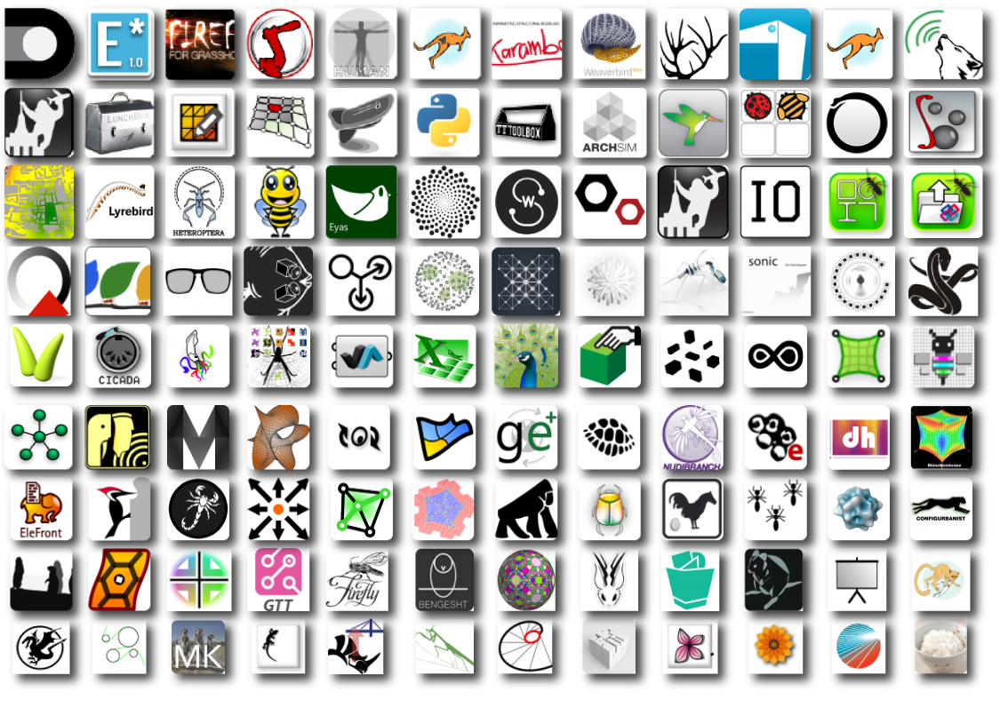

# 2. Erweiterungen

#### Fundamente sind gedacht, um darauf zu bauen. Diese Ausgabe nennt eine Reihe von Schlüsselplugins für Grasshopper, welche die Funktionalität der Anwendung erweitert *und* uns die Möglichkeit gibt, unsere Designs weiterzubringen. 

