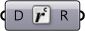
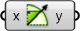
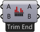

## 2.1. Index

##### Dieser Index stellt zusätzliche Informationen über alle Komponenten, die in diesem Primer verwendet werden, zur Verfügung und ergänzt diese mit weiteren Komponenten, die Du nützlich finden könntest. Hier findest Du eine Einführung in die Welt der über 500 Komponenten im Grasshopper Plugin.

--

#### Geometrie
||||
|--|--|--|
|P.G.Crv|Curve Parameter Stellt eine Sammlung von Kurvengeometrien dar. Kurvengeometrien sind der gemeinsame Nenner aller Kurvenarten in Grasshopper.||
|P.G.Circle|Circle Parameter Repräsentiert eine Sammlung von Kreisgeometrien.||
|P.G.Geo|Geometry Parameter Stellt eine Sammlung von Geometrien dar.||
|P.G.Pipeline|Geometry Pipeline Definiert eine Pipeline für Geometrien von Rhino zu Grasshopper.||
|P.G.Pt|Point Parameter Punktparameter können persistente Daten speichern. Du kannst einen persistenten Eintrag durch das Parametermenü herstellen.||
|P.G.Srf|Surface Parameter Stellt eine Kollektion von Flächengeometrien dar. Flächengeometrien sind der gemeinsame Nenner aller Flächenarten in Grasshopper.||

#### Grundparameter
||||
|--|--|--|
|P.P.Bool|Boolean Parameter Stellt eine Sammlung von boolschen Werten (Wahr/Falsch) dar.||
|P.P.D|Domain Parameter Repräsentiert eine Kollektion von eindimensionalen Intervallen. Intervalle werden typischerweise genutzt, um Kurvenfragmente und kontinuierliche numerische Bereiche darzustellen. Ein Intervall besteht aus zwei Zahlen, welche die jeweiligen Grenzen des Intervalls definieren. Der gesamte Bereich zwischen diesen Grenzen ist Teil des Intervalls.||
|P.P.D2|Domain2 Parameter Enthält eine Sammlung von zweidimensionalen Intervallen. 2D Intervalle werden typischerweise benutzt, um Flächenfragmente zu beschreiben. Ein zweidimensionales Intervall wird durch zwei eindimensionale Intervalle bestimmt||
|P.P.ID|Guid Parameter Repräsentiert eine Sammlung von Globalen Einzigartigen Identifikatoren (Guid). Guid Parameter haben die Fähigkeit, persistente Daten zu speichern. Du kannst einen persistenten Eintrag durch das Parametermenü hinzufügen.||
|P.P.Int|Integer Parameter Stellt eine Sammlung numerischer Integerwerte dar. Integerparameter können persistente Daten speichern. Du kannst einen persistenten Eintrag durch das Parametermenü hinzufügen.||
|P.P.Num|Number Parameter Stellt eine Kollektion von Fließkommawerten dar. Numerische Parameter können persistente Daten speichern. Du kannst einen persistenten Eintrag durch das Parametermenü hinzufügen.||
|P.P.Path|File Path Enthält eine Sammlung von Dateipfaden.||

#### Eingabeparameter
||||
|--|--|--|
|P.I.Toggle|Boolean Toggle Boolscher Schalter (Wahr/Falsch).||
|P.I.Button|Button Druckknopfobjekt mit zwei Werten. Wenn das Druckknopfobjekt gedrückt wird, sendet es einen Wahrwert, bevor es sich wieder auf Falsch zurücksetzt.||
|P.I.Swatch|Color Swatch Das Muster ist eine spezielle Schnittstelle, die es ermöglicht, individuelle Farbwerte einfach einzustellen. Du kannst die Farben der Musterkomponente durch das Kontextmenü anpassen.||
|P.I.Grad|Gradient Control Gradienten ermöglichen es Dir, einen Farbverlauf in einem numerischen Intervall zu bestimmen. Als Standard wird das Einheitsintervall (0.0 ~ 1.0) verwendet, aber dieses kann durch die Eingabeparameter L0 und L1 angepasst werden. Du kannst einen weiteren Griff zur Anpassung der Farbe im Gradientenobjekt hinzufügen, indem Du sie von dem Farbrad an der linken oberen Ecke herunterziehst und den Wert des Griffes anpassen, indem Du ihn rechtsklickst.||
|P.I.Graph|Graph Mapper Graphmapperobjekte ermöglichen es Dir, einer Reihe von Zahlen neue Werte zuzuweisen. Als Standard werden die {x} und {y} Intervalle der Graphfunktion auf die Einheitsintervalle (0.0 ~ 1.0) bezogen, aber diese können innerhalb des Grapheditors angepasst werden. Graphmapper können eine einzelne Zuweisungsfunktion enthalten, welche durch ein Kontextmenü ausgewählt werden können. Graphen haben typischerweise zwei Griffe (kleine Kreise), welche zur Modifikation der Variablen herangezogen werden können, um die Graphfunktion graphisch zu bestimmen. Ein Graphmapperobjekt enthält zu Beginn keinen Graphen und gibt eine 1:1 Zuweisung für die eingegebenen Werte aus.||
|P.I.Slider|Number Slider Ein Schieberegler ist ein spezielles Schnittstellenobjekt, das es ermöglicht individuelle numerische Werte schnell einzustellen. Du kannst die Werte und Eigenschaften durch ein Menü ändern, indem Du auf den Schieberegler doppelklickst. Schieberegler können länger oder kürzer dargestellt werden, indem Du die rechte Kante des Objektes nach rechts oder links ziehst. Merke, dass Schieberegler nur einen Ausgabeparameter (also keinen Eingabeparameter) haben.||
|P.I.Panel|Panel Die Paneelkomponente wird für benutzerdefinierte Notizen und Textwerte genutzt. Sie ist typischerweise ein passives Element, das es erlaubt, Anmerkungen und Erklärungen in das Dokument einzufügen. Panelle können ihre Informationen auch aus anderen Quellen beziehen. Wenn Du einen Ausgabeparameter in ein Paneel einsteckst, kannst Du den Inhalt dieses Parameters in Echtzeit beobachten. Alle Daten in Grasshopper können auf diese Weise gesehen werden. Paneele können ihren Inhalt auch in eine Textdatei streamen.||
|P.I.List|Value List Stellt eine Liste von voreingestellten Werten zur Verfügung, aus welchen gewählt werden kann.||

#### Nützliches
||||
|--|--|--|
|P.U.Cin|Cluster Input Stellt einen Cluster Eingabeparameter dar.||
|P.U.COut|Cluster Output Stellt einen Cluster Ausgabeparameter dar.||
|P.U.Dam|Data Dam Verzoegert Daten auf ihrem Weg durch das Dokument.||
|P.U.Jump|Jump Springt zwischen bestimmen Orten im Dokument.||
|P.U.Viewer|Param Viewer Eine Anzeige fuer Datenstrukturen.||
|P.U.Scribble|Scribble Fuer schnelle Notizen.||

Mathematik
--

#### Intervalle
||||
|--|--|--|
|M.D.Bnd|Bounds Erstellt ein numerisches Intervall, welches eine Liste von numerischen Werten umfasst.||
|M.D.Consec|Consecutive Domains Erstellt ein fortlaufendes Intervall aus einer Liste von Zahlen.||
|M.D.Dom|Construct Domain Erstellt ein numerisches Intervall aus zwei Grenzwerten.||
|M.D.Dom2Num|Construct Domain² Erstellt ein zweidimensionales Intervall aus vier Zahlen.||
|M.D.DeDomain|Deconstruct Domain Zerlegt ein numerisches Intervall in seine Bestandteile.||
|M.D.DeDom2Num|Deconstruct Domain² Zerlegt ein zweidimensionales Intervall in vier Zahlen.||
|M.D.Divide|Divide Domain² Teilt ein zweidimensionales Intervall in gleichgroße Teile.||
|M.D.Inc|Includes Testet einen numerischen Wert auf seine Zugehörigkeit zu einem Intervall.||
|M.D.ReMap|Remap Numbers Zuweisung von Zahlen in ein neues numerisches Intervall.||

#### Operatoren
||||
|--|--|--|
|M.O.Add|Addition Mathematische Addition.||
|M.O.Div|Division Mathematische Division.||
|M.O.Equals|Equality Testet die (Un)gleichheit zweier Zahlen.||
|M.O.And|Gate And Führt eine boolsche Konjunktion (AND Gatter) aus. Beide Eingabeparameter müssen Wahr sein, um Wahr als Ergebnis der Operation zu erhalten.||
|M.O.Not|Gate Not Führt eine boolsche Negation (NOT Gatter) aus.||
|M.O.Or|Gate Or Führt eine boolsche Disjunktion (OR Gatter) aus. Nur ein einzelner Eingabeparameter muss den Wert Wahr enthalten, um Wahr als Ergebnis der Operation zu erhalten.||
|M.O.Larger|Larger Than Größer (oder gleich).||
|M.O.Multiply|Multiplication Mathematische Multiplikation.||
|M.O.Smaller|Smaller Than Kleiner oder gleich).||
|M.O.Similar|Similarity Testet die Ähnlichkeit zweier Zahlen.||
|M.O.Sub|Subtraction Mathematische Subtraktion.||

#### Skripten
||||
|--|--|--|
|M.S.Eval|Evaluate Wertet eine Funktion mit einer flexiblen Zahl als Variable aus.||
|M.S.Expression|Expression Wertet einen mathematischen Ausdruck aus.||

#### Trigonometrie
||||
|--|--|--|
|M.T.Cos|Cosine Berechnet den Kosinuswert.||
|M.T.Deg|Degrees Rechnet einen Winkel von Bogenmaß zu Grad um.||
|M.T.Rad|Radians Rechnet einen Winkel von Grad zu Bogenmaß um.||
|M.T.Sin|Sine Berechnet den Sinuswert.||

#### Nützliches
||||
|--|--|--|
|M.U.Avr|Average Berechnet den arithmetrischen Durchschnitt für einen Satz von Objekten.||
|M.U.Phi|Golden Ratio Gibt ein vielfaches des Goldenen Schnittes (Phi) aus.||
|M.U.Pi|Pi Gibt ein Vielfaches von Pi aus.||

Sets
--

#### Listen
||||
|--|--|--|
|S.L.Combine|Combine Data Kombiniere nicht-null Elemente verschiedener Eingabeparameter.||
|S.L.CrossRef|Cross Reference Datenquerverweise von verschiedenen Listen.||
|S.L.Dispatch|Dispatch Verteile die Elemente einer Liste in zwei Ziellisten. Diese Komponente funktioniert sehr ähnlich wie die [Cull Pattern] Komponente, mit der Ausnahme, dass beide Listen als Ausgabe zur Verfügung stehen.||
|S.L.Ins|Insert Items Füge eine Sammlung von Elementen in eine Liste ein.||
|S.L.Item|List Item Beziehe ein bestimmtes Element aus einer Liste.||
|S.L.Lng|List Length Messe die Länge einer Liste. Elemente in einer Liste werden durch ihren Index eindeutig bezeichnet. Das erste Element wird unter dem Index 0 gespeichert, das zweite Element unter dem Index 1 und so weiter. Der höchst mögliche Index in einer Liste entspricht der Listenlänge minus eins.||
|S.L.Long|Longest List Erweitere eine Sammlung von Listen zur längsten Länge der Listen.||
|S.L.Split|Split List Teile eine Liste in Teillisten.||
|S.L.Replace|Replace Items Ersetze bestimmte Elemente einer Liste.||
|S.L.Rev|Reverse List Kehre die Reihenfolge einer Liste um. Der neue Index eines jeden Elementes wird N-i sein, wobei N der höchste Index in der Liste und i der ursprüngliche Index der Elemente ist.||
|S.L.Shift|Shift List Versetze alle Elemente einer Liste. Elemente in der Liste werden auf das Ende der Liste zu versetzt, wenn der angegebene Wert für den Versatz positiv ist. Wenn der Wert für Wrap auf Wahr steht, dann werden Elemente, die an den Enden der Liste entfallen, am anderen Ende wieder angehängt.||
|S.L.Short|Shortest List Verkürze eine Sammlung von Listen auf die Länge der kürzesten unter ihnen.||
|S.L.Sift|Sift Pattern Siebe Elemente einer Liste durch die Verwendung eines wiederholenden Muster auf Basis der Indices.||
|S.L.Sort|Sort List Sortiere eine Liste numerischer Werte. Damit etwas sortiert werden kann, muss es zuerst vergleichbar sein. Die meisten Arten von Daten sind nicht vergleichbar; Zahlen und Buchstabenfolgen sind grundsätzlicherweise die einzigen Ausnahmen. Falls Du andere Datentypen, wie z.B. Kurven, sortieren willst, musst Du zuerst eine Liste von Werten erzeugen, auf deren Basis die Sortierung erfolgen kann.||
|S.L.Weave|Weave Webe mehrere Eingabedatensätze auf Basis eines benutzerdefinierten Musters. Das Muster wird bestimmt durch eine Liste von Indexwerten, die bestimmen in welcher Reihenfolge die Eingabedaten gewählt werden.||

#### Datensätze
||||
|--|--|--|
|S.S.Culli|Cull Index Entferne Indexelemente von einer Liste.||
|S.S.Cull|Cull Pattern Entferne Elemente von einer Liste auf Grundlage einer Bitmaske. Die Bitmaske wird durch eine Liste boolscher Werte definiert. Sie wird wiederholt, bis alle Elemente des Datensatzes ausgewertet wurden.||
|S.S.Dup|Duplicate Data Dupliziere Daten auf Grundlage einer definierten Zahl. Die Daten können auf zwei Arten dupliziert werden. Entweder sie werden als Kopien der Eingabeliste an das Ende der Liste angehängt, bis die bestimmte Anzahl von Kopien erreicht wurden, oder jedes Element wird entsprechend of an der Stelle dupliziert, bis zum nächsten Element weitergegeangen wird.||
|S.S.Jitter|Jitter Mischt die Werte einer Liste auf zufällige Weise. Die Eingabeliste wird auf Grundlage von Weißen Rauschen neu geordnet. Mischen ist ein guter Weg, um eine zufällige Verteilung der Werte zu erreichen. Der Jitter Parameter legt den Radius des Weißen Rauschens fest. Wenn der Jitterwert 0.5 entspricht, dann wird jedes Element zufällig innerhalb der halben Spanne des gesamten Datensatzes neu angeordnet.||
|S.S.Random|Random Generiert eine Liste pseudozufälliger Zahlen, die Sequenz der Zahlen ist einzigartig aber stabil für jeden Seedwert. Wenn Du eine bestimmte zufällige Verteilung nicht magst, probiere verschiedene Werte als Seed.||
|S.S.Range|Range Erstelle eine Reihe von Zahlen. Die Zahlen werden gleichförmig innerhalb des numerischen Intervalls verteilt. Nutze diese Komponente, wenn Du Zahlen zwischen zwei Extremen erzeugen möchtest. Wenn Du Kontrolle über den Abstand zwischen den Werten möchtest, bist Du mit der [Series] Komponente besser beraten.||
|S.S.Repeat|Repeat Data Wiederhole ein Datenmuster, bis er eine bestimmte Länge erreicht.||
|S.S.Series|Series Erstelle eine Serie von Werten. Die Werte sind gleichmäßig auf Grundlage des {Step} Wertes verteilt. Wenn Du Zahlen innerhalb eines bestimmten numerischen Intervalls verteilen willst, wähle stattdessen die [Range] Komponente.||

#### Datenbäume
||||
|--|--|--|
|S.T.Explode|Explode Tree Extrahiert alle Äste aus einem Datenbaum.||
|S.T.Flatten|Flatten Tree Ebnet einen Datenbaum ein, indem alle Verzweigungsinformationen entfernt werden.||
|S.T.Flip|Flip Matrix Drehe einen matrixähnlichen Datenbaum, indem Zeilen und Spalten vertauscht werden.||
|S.T.Graft|Graft Tree Typischerweise werden Datenobjekte in Ästen mit einem spezifischen Wert gespeichert (0 für das erste Element, 1 für das zweite Element, usw.) und Äste werden in Datenbäumen an bestimmten Astpfaden gespeichert, z.B.: {0;1}, welches den zweiten Unterast im ersten Hauptast bezeichnet. Aufpfropfen erstellt einen neuen Ast für jedes Datenobjekt.||
|S.T.Merge|Merge Verschmelze verschiedene Datenströme.||
|S.T.Path|Path Mapper Führe lexikale Operationen für die Datenbäume aus. Lexikale Operationen sind logische Zuordnungen zwischen Datenpfaden und -indizes, welche durch textbasierte (lexikale) Masken oder Muster definiert werden.||
|S.T.Prune|Prune Tree Entferne alle Äste aus einem Datenbaum, die eine bestimmte Anzahl von Datenelementen beinhalten. Du kannst eine untere und eine obere Grenze für das Beschneiden des Datenbaumes bestimmen.||
|S.T.Simplify|Simplify Tree Vereinfache einen Datenbaum, indem die Überlappungen zwischen den verschiedenen Ästen entfernt werden.||
|S.T.TStat|Tree Statistics Beziehe einige Statistiken bezüglich des Datenbaums.||
|S.T.Unflatten|Unflatten Tree Revidiere die Einebnung eines Datenbaumes, indem die verschiedenen Elemente zurück in die Äste verschoben werden.||

Vector
--

#### Raster
||||
|--|--|--|
|V.G.HexGrid|Hexagonal 2D Raster mit hexagonalen Zellen.||
|V.G.RecGrid|Rectangular 2D Raster mit rechteckigen Zellen.||
|V.G.SqGrid|Square 2D Raster mit quadratischen Zellen||

#### Punkt
||||
|--|--|--|
|V.P.Pt|Construct Point Konstruiere einen Punkt aus {xyz} Koordinaten.||
|V.P.pDecon|Deconstruct Zerlege einen Punkt in seine Bestandteile.||
|V.P.Dist|Distance Berechne den euklidischen Abstand zwischen zwei Punktkoordinaten.||

#### Vektor
||||
|--|--|--|
|V.V.X|Unit X Einheitsvektor parallel der Welt {x} Achse.||
|V.V.Y|Unit Y Einheitsvektor parallel der Welt {Y} Achse.||
|V.V.Vec2Pt|Vector 2Pt Erstelle einen Vektor zwischen zwei Punkten.||

Kurve
--

#### Analyse
||||
|--|--|--|
|C.A.CP|Control Points Extrahiere die NURBS Kontroll- und Knotenpunkte aus einer Kurve.||

#### Division
||||
|--|--|--|
|C.D.Divide|Divide Curve Teile eine Kurve in gleichlange Segmente.||

#### Grundparameter
||||
|--|--|--|
|C.P.Cir|Circle Erstelle einen Kreis definiert durch eine Grundebene und einen Radius.||
|C.P.Cir3Pt|Circle 3Pt Erstelle einen Kreis definiert durch drei Punkte.||
|C.P.CirCNR|Circle CNR Erstelle einen Kreis definiert durch Zentrum, Normale und Radius.||
|C.P.Line|Line SDL Erstelle ein Liniensegment definiert durch Startpunkt, Richtung und Länge.||
|C.P.Polygon|Polygon Erstelle ein Polygon mit optional gerundeten Kanten.||

#### Spline
||||
|--|--|--|
|C.S.IntCrv|Interpolate Erstelle eine interpolierte Kurve durch einen Satz von Punkten.||
|C.S.KinkCrv|Kinky Curve Konstruiere eine interpolierte Kurve durch einen Satz von Punkten mit einem Schwellenwert für den Knickwinkel.||
|C.S.Nurbs|Nurbs Curve Konstruiere eine NURBS Kurve aus Kontrollpunkten.||
|C.S.PLine|PolyLine Erstelle eine Polylinie, indem Du eine Anzahl von Punkten miteinander verbindest.||

#### Nützliches
||||
|--|--|--|
|C.U.Explode|Explode Zerteile eine Kurve in kleinere Segmente.||
|<C.U.Join|Join Curves Verbinde so viele Kurven wie möglich.||
|C.U.Offset|Offset Versetze eine Kurve basierend auf einer definierten Distanz.||

Flächen
--

#### Analyse
||||
|--|--|--|
|S.A.DeBrep|Deconstruct Brep Zerlege Polygonflächen in ihre Bestandteile.||

#### Freiform
||||
|--|--|--|
|S.F.Boundary|Boundary Surfaces Erstelle eine planare Fläche aus einer Sammlung von Begrenzungskurven.||
|S.F.Extr|Extrude Extrudiere Kurven und Flächen entlang eines Vektors.||
|S.F.ExtrPt|Extrude Point Extrudiere Kurven und Flächen auf einen Punkt zu.||
|S.F.Loft|Loft Erstelle eine Loftfläche aus einer Reihe von Schnittkurven.||
|S.F.RevSrf|Revolution Erstelle eine Rotationsfläche.||
|S.F.Swp2|Sweep2 Erstelle eine Sweepfläche entlang zweier Leitkurven.||

#### Grundkörper
||||
|--|--|--|
|S.P.BBox|Bounding Box Erstelle eine Begrenzungskiste entlang einer orientierten Geometrie.||

#### Nützliches
||||
|--|--|--|
|S.U.SDivide|Divide Surface Generiere ein Raster von {uv} Punkten auf einer Fläche.||
|S.U.SubSrf|Isotrim Extrahiere eine isoparametrische Untermenge einer Fläche.||

Polygonnetz
--

#### Triangulation
||||
|--|--|--|
|M.T.Voronoi|Voronoi Planares Voronoidiagramm aus einer Sammlung von Punkten.||

Transformation
--

#### Affine
||||
|--|--|--|
|T.A.RecMap|Rectangle Mapping Transformiere eine Geometrie von einem Rechteck zu einem anderen.||

#### Anordnung
||||
|--|--|--|
|T.A.ArrLinear|Linear Array Erstelle eine lineare Anordnung von Geometrien.||

#### Morph
||||
|--|--|--|
|T.M.Morph|Box Morph Morphe ein Objekt in eine verzerrte Kiste.||
|T.M.SBox|Surface Box Erstelle eine verzerrte Kiste auf einem Flächenabschnitt.||

Anzeige
--

#### Farbe
||||
|--|--|--|
|D.C.HSL|Colour HSL Erstelle eine Farbe aus Fließkomma {HSL} Kanälen.||

#### Dimensionen
||||
|--|--|--|
|D.D.Tag|Text tags Eine Textschildkomponente ermöglicht es Dir einen kurzen String als Anzeigeelement im Ansichtsfenster darzustellen. Text und Position werden durch die Eingabeparameter bestimmt. Wenn Textschilder gebacken werden, werden sie zu Textpunkten.||
|D.D.Tag3D|Text Tag 3D Stellt eine Liste von 3D Textschildern im Rhinoansichtsfenster dar||

#### Vorschau
||||
|--|--|--|
|D.P.Preview|Custom Preview Erlaubt eine benutzerdefinierte Vorschau für Geometrien.||

#### Vektor
||||
|--|--|--|
|D.V.Points|Point List Zeigt Details zu Punktlisten an.||

