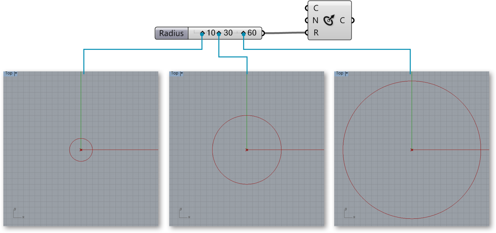
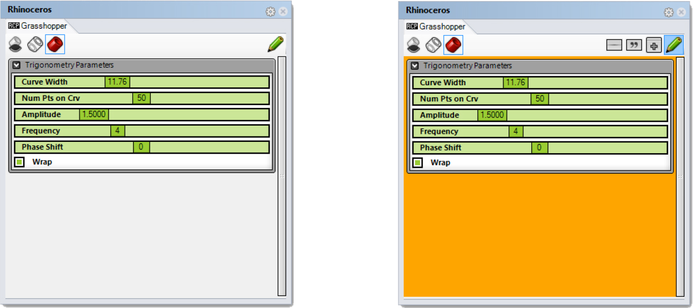
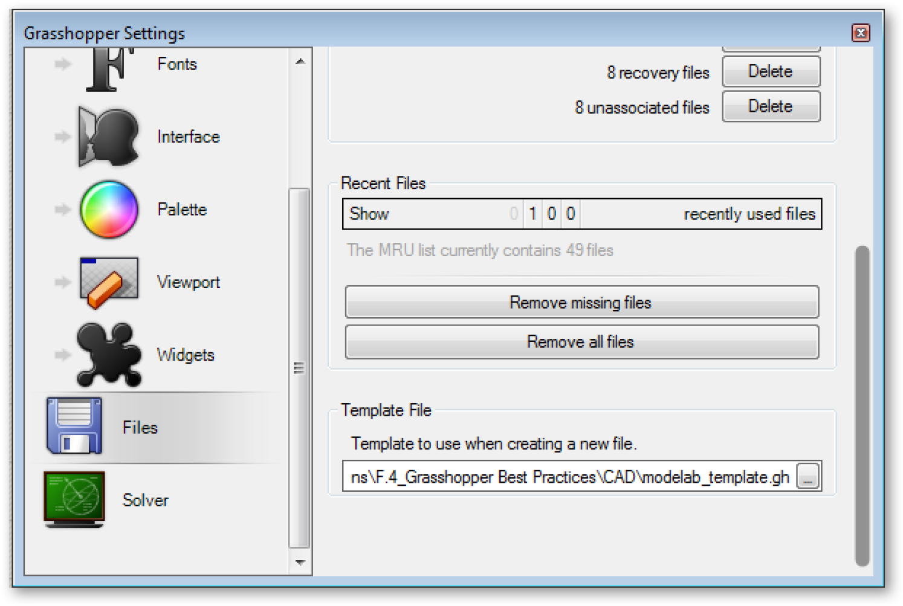

###1.1.3. TALKING TO RHINO

#####Unlike a Rhino document, a Grasshopper definition does not contain any actual objects or geometry. Instead, a Grasshopper definition represents a set of rules & instructions for how Rhino can automate tasks.

>1. Grasshopper preview geometry.
2. Rhino viewports.
3. Grasshopper Application window.

####1.1.3.1. VIEWPORT FEEDBACK
All geometry that is generated using the various Grasshopper components will
show up (by default) in the Rhino viewport. This preview is just an Open GL
approximation of the actual geometry, and as such you will not be able to select
the geometry in the Rhino viewport (you must first bake it into the scene). You
can turn the geometry preview on/off by right-clicking on a component and
selecting the Preview toggle. The geometry in the viewport is color coded to
provide visual feedback. The image below outlines the default color scheme.

>Note: This is the default color scheme, which can be modified using the Document Preview Settings tool on the canvas toolbar.

>1. Green geometry in the viewport belongs to a component which is currently selected.
2. Red geometry in the viewport belongs to a component which is currently unselected.
3. Point geometry is drawn as a cross rather than a rectangle to distinguish it from other Rhino point objects.
4. Blue feedback means you are currently making a selection in the Rhino Viewport.

####1.1.3.2. LIVE WIRES
Grasshopper is a dynamic environment. Changes that are made are live and their
preview display is updated in the Rhino viewport.

####1.1.3.3. GUMBALL WIDGET
When storing geometry as internalized in a Grasshopper parameter, the gumball
allows you to interface with that geometry in the Rhino viewport. This update is
live and updates will occur as you manipulate the gumball. In contrast, geometry
referenced from Rhino directly will continue to exist in the Rhino document and
updates from Grasshopper will happen only after any changes occur (as opposed
to during).

####1.1.3.4. BAKING GEOMETRY
In order to work with (select, edit, transform, etc.) geometry in Rhino that was
created in Grasshopper, you must “bake” it. Baking instantiates new geometry
into the Rhino document based on the current state of the Grasshopper graph. It
will no longer be responsive to the changes in your definition.

>1. Bake by right-clicking a component and selecting Bake.
2. A dialog will appear that allows you to select onto which Rhino layer the geometry will
bake.
3. Grouping your baked geometry is a convenient way to manage the instantiated Rhino geometry, particularly if you are creating many objects with Grasshopper.

####1.1.3.5. UNITS & TOLERANCES
Grasshopper inherits units and tolerances from Rhino. To change the units,
type Document Properties in the Rhino command line to access the Document
Properties menu. Select Units to change the units and tolerances.

>Change the units and tolerances in the Rhino Document Properties menu.

####1.1.3.6. REMOTE CONTROL PANEL
Grasshopper is an incredibly powerful and flexible tool which allows you to
explore design iterations using a rich graphic interface. However, because the
Grasshopper editor occupies a considerable portion of the screen, especially in
single-screen environments, trying to manipulate its user interface elements
and the Rhino viewport can get tricky. Fortunately the following elegant
solution avoids requiring the two interfaces to share the screen.

Grasshopper's Remote Control Panel (RCP) can hover over Rhino or dock into it,
providing a more visually compact way to control your Grasshopper definition.
The RCP can be instantiated by activating the toggle under the View menu of the
Main Menu bar. Initially, the RCP is blank — it doesn’t yet contain any
Grasshopper user interface element links. To add linked copies of Grasshopper
UI elements like sliders, toggles, and buttons to the RCP, right-click on the
element in Grasshopper and click Publish To Remote Panel. Publishing a control
copies a linked version of it into the RCP which helps since it acts like other
dockable Rhino toobars, active when the Rhino window has the focus. Multiple
Grasshopper UI elements can be published to the RCP so they are conveniently
accessible in a way that maximizes the screen area available for viewing Rhino.

>Note: Each linked copy of published UI elements will be labelled in the RCP
with the original UI element's name. As a best practice, provide all UI input
elements with comprehensible and meaningful names. Properly labelled elements
will make both Grasshopper and RCP interfaces easier to use.

> In order to get a UI element (eg. slider, toggle, button, etc.) to show up in
the Remote Control Panel, we have to first publish it.

To help users understand your RCP user-interface, arrange elements in the RCP
into groups that you can label and color. Clicking the green pencil in the
upper right hand corner of the RCP toggles it between Working Mode and Editing
Mode. To delete UI elements, simply drag them past the edge of the RCP.

>_The Remote Control Panel has two modes: Edit Mode (left) which allows you to
reorganize the look and feel of the RCP, and Working Mode where you can modify
the actual values of the UI elements._

>The Remote Control Panel in Edit Mode has an orange background.

####1.1.3.7. FILE MANAGEMENT
If your Grasshopper file references geometry from Rhino, you must open that
same file for the definition to work. Keep your files organized by storing the
Grasshopper and Rhino files in the same folder, and giving them related names.

>1. Project Folder.
2. Rhino file.
3. Grasshopper file.

####1.1.3.8. TEMPLATES
Creating and specifiying a template file in your Grasshopper preferences is
convenient way to set up every new Grasshopper definition you create. The
template can include Grasshopper components as well as panels and sketch
objects for labeling.

>Create a template file and save it

>1. In File/Preferences, load the file you just created under Template File. Your template will now be used each time you create a new file.

