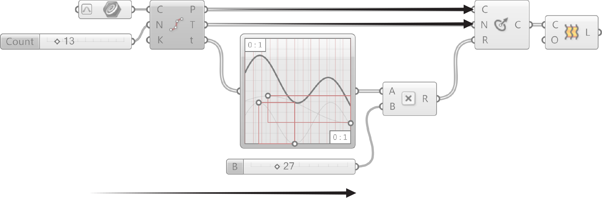

### 1.2.5. THE GRASSHOPPER DEFINITION

>Example files that accompany this section: [http://grasshopperprimer.com/appendix/A-2/1_gh-files.html](http://grasshopperprimer.com/appendix/A-2/1_gh-files.html)

>Example files that accompany this section: [Download](../../appendix/A-2/gh-files/1.2.5_the grasshopper definition.gh)


#####Grasshopper Definitions have a Program Flow that represents where to start program execution, what to do in the middle and how to know when program execution is complete.

####1.2.5.1. PROGRAM FLOW
Grasshopper visual programs are executed from left to right. Reading the graph relative to the wired connections from upstream to downstream provides understanding about the Program Flow.

>Directionality of data is left to right.

####1.2.5.2. THE LOGICAL PATH
All of the objects and the wires connecting the objects represent the logical graph of our program. This graph reveals the flow of data, dependencies of any input to its wiired output. Any time our graph changes, sometimes referrred to as being “dirtied,” every downstream connection and object will be updated.

>1. Reparameterize the curve domain between 0.0 and 1.0.
2. Reference a curve from Rhino.
3. Divide the curve into 13 equal segments.
4. Run the parameter values at each curve division point through the graph.
5. Multiply each value by 27.
6. Draw a circle at each division point along th ecurve, normal to the tangent vector at each pont, with a radius defined by the parameter values (t) modified by the graph mapper and multiplied by 27.
7. Loft a surface between the circles

>1. Variable circle radius.
2. Loft between circles.
