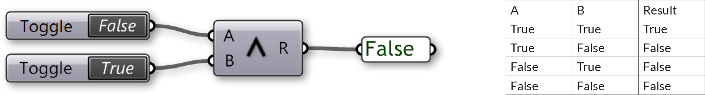
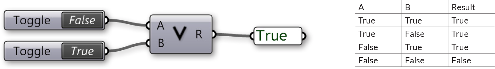

###1.3.5. Booleans & Logical Operators

>Example files that accompany this section: [http://grasshopperprimer.com/appendix/A-2/1_gh-files.html](http://grasshopperprimer.com/appendix/A-2/1_gh-files.html)

>Example files that accompany this section: [Download](../../appendix/A-2/gh-files/1.3.5_booleans and logical operators.gh)


####1.3.5.1. BOOLEANS
Numeric variables can store a whole range of different numbers. Boolean
variables can only store two values referred to as Yes or No, True or False, 1 or 0. Obviously we never use booleans to perform calculations because of their limited range. We use booleans to evaluate conditions.

>Boolean Parameter

In Grasshopper, booleans can be used in several ways. The boolean parameter is a container for one or multiple boolean values, while the Boolean Toggle allows you to quickly change between single true and false values as inputs.

>Boolean Toggle - double click the boolean value to toggle between true and false

Grasshopper also has objects that test conditions and output boolean values. For example, the Includes component allows you to test a numeric value to see if it is included in a domain.

>The Includes component is testing whether the number 6.8 is included in the domain from 0 to 10. It returns a boolean value of True.

####1.3.5.2. LOGICAL OPERATORS
Logical operators mostly work on booleans and they are indeed very logical. As you will remember, booleans can only have two values. Boolean mathematics
were developed by George Boole (1815-1864) and today they are at the very
core of the entire digital industry. Boolean algebra provides us with tools to analyze, compare and describe sets of data. Although Boole originally defined six boolean operators we will only discuss three of them:

1. Not
2. And
3. Or

The Not operator is a bit of an oddity among operators, because it doesn’t
require two values. Instead, it simply inverts the one on the right. Imagine we have a script which checks for the existence of a bunch of Block definitions in Rhino. If a block definition does not exist, we want to inform the user and abort the script.

>The Grasshopper Not operator (gate)

And and Or take two arguments on either side. The And operator requires both
of them to be True in order for it to evaluate to True. The Or operator is more than happy with a single True value.

As you can see, the problem with Logical operators is not the theory, it’s what happens when you need a lot of them to evaluate something. Stringing them together quickly results in convoluted code; not to mention operator precedence problems.

>The Grasshopper And operator (gate)

>The Grasshopper Or operator (gate)

A good way to exercise your own boolean logic is to use Venn diagrams. A Venn
diagram is a graphical representation of boolean sets, where every region
contains a (sub)set of values that share a common property. The most famous
one is the three-circle diagram:

Every circular region contains all values that belong to a set; the top circle for example marks off set {A}. Every value inside that circle evaluates True for {A} and every value not in that circle evaluates False for {A}. By coloring the regions we can mimic boolean evaluation in programming code:

