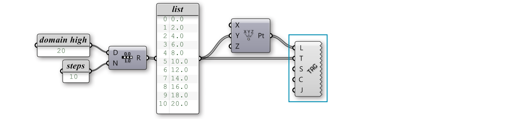

### 1.4.5. List Visualization

>Example files that accompany this section: [http://grasshopperprimer.com/appendix/A-2/1_gh-files.html](http://grasshopperprimer.com/appendix/A-2/1_gh-files.html)

>Example files that accompany this section: [Download](../../appendix/A-2/gh-files/1.4.5_list visualization.gh)


#####Understanding lists in Grasshopper can be difficult without being able to see the data flowing from one component to the next. There are several ways to visualize lists that can help to understand and manipulate data.

There are many different ways to visualize a list of data. The most common way is to create some geometry with the list of data. By connecting the R output of the Range component to the Y input of the Construct Point component, we can see an array of points in the Y direction.

Lets look at some components that can help us understand the data.

####1.4.5.1. THE POINT LIST COMPONENT
The Point List component is an extremely useful tool for visualizing the order of a set of points in a list. Essentially, the Point List component places the index item number next to the point geometry in the viewport. You can also specify whether or not you want to draw the number tags, the connection lines, or the size of the text tags.

>You can visualize the order of a set of points using the Point List component.

####1.4.5.2. TEXT TAGS
The text tag component allows you to draw little strings (a string is a set of ASCII characters) in the viewport as feedback items. Text and location are specified as input parameters. When text tags are baked into the scene, they turn into Text Dots. The other interesting thing about Text Tags is that they are viewport independent - meaning the tags always face the camera (including perspective views) and they always remain the same size on the screen regardless of your zoom settings.

>You can visualize any string information in the viewport using the Text Tag component. In this setup, we have decided to display the value of each point on top of each point locaiton. We could have assigned any text to display.

The Text Tag 3d component works very similarly to the Text Tag component.
They differ, in that, when Text Tag 3d objects are baked into the scene, they become Text objects in Rhino. The scale of the Text Tag 3d font can also be controlled via an input (which is inaccessible in the Text Tag component).

>You can use a Text Tag 3d component to visualize information like a Text object in Rhino.

####1.4.5.3. COLOR
One of the other things we can do to visualize the list data is to assign color to the geometry. Grasshopper has limited ‘rendering’ capabilities, but we can control simple Open GL settings like color, specular color, transparency, etc. The L0 value represents the low end (left side) of the gradient, whereas the L1 value represents the upper end (right side). These values correspond to the start and end of our domain. The t-values are the elements in the list that will get mapped somewhere within the L0 and L1 range. The output of the gradient is a list of RGB color values which correspond to each point in our list. Right-click on the Gradient to set one of the gradient presets, or define your own using the color node points.

>1. Points
2. Point list
3. Text Tag
4. Text Tag 3D
5. Custom color preview

