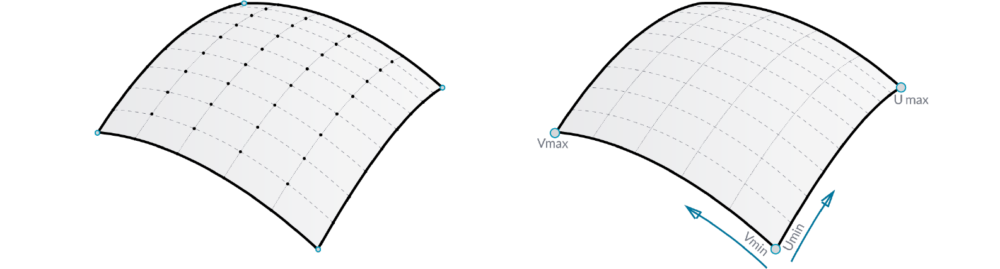
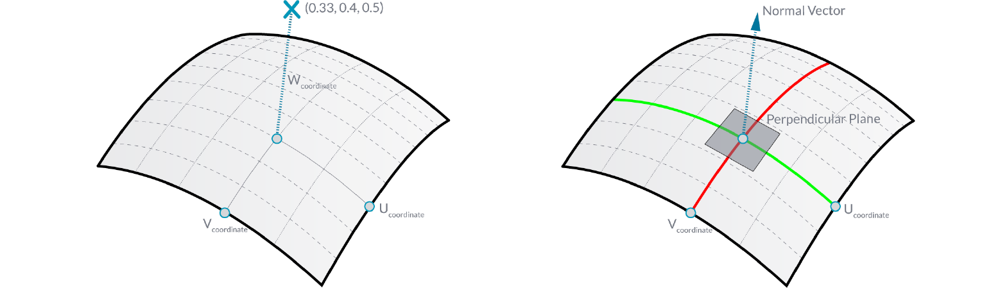

###1.5.1. Surface Geometry

#####NURBS (non-uniform rational B-splines) are mathematical representations that can accurately model any shape from a simple 2D line, circle, arc, or box to the most complex 3D free-form organic surface or solid. Because of their flexibility and accuracy, NURBS models can be used in any process from illustration and animation to manufacturing.

Apart from a few primitive surface types such as spheres, cones, planes and cylinders, Rhino supports three kinds of freeform surface types, the most useful of which is the NURBS surface. Similar to curves, all possible surface shapes can be represented by a NURBS surface, and this is the default fall-back in Rhino. It is also by far the most useful surface definition and the one we will be focusing on.

>1. Sphere Primitive [plane, radius]
2. Cylinder Primitive [plane, radius, height]
3. Plane Primitive [plane, width, height]
4. Cone Primitive [plane, radius, height]

####1.5.1.1. NURBS SURFACES
NURBS surfaces are very similar to NURBS curves. The same algorithms are
used to calculate shape, normals, tangents, curvatures and other properties, but there are some distinct differences. For example, curves have tangent vectors and normal planes, whereas surfaces have normal vectors and tangent planes.This means that curves lack orientation while surfaces lack direction. In  the case of NURBS surfaces, there are in fact two directions implied by the geometry, because NURBS surfaces are rectangular grids of {u} and {v} curves. And even though these directions are often arbitrary, we end up using them anyway because they make life so much easier for us.

>You can think of NURBS surfaces as a grid of NURBS curves that go in two directions. The shape of a NURBS surface is defined by a number of control points and the degree of that surface in the u and v directions. NURBS surfaces are efficient for storing and representing free-form surfaces with a high degree of accuracy.

**Surface Domain**
A surface domain is defined as the range of (u,v) parameters that evaluate into a
3-D point on that surface. The domain in each dimension (u or v) is usually
described as two real numbers (u_min to u_max) and (v_min to v_max) Changing
a surface domain is referred to as reparameterizing the surface.

In Grasshopper, it is often useful to reparameterize NURBS surfaces so that the u and v domains both range from 0 to 1. This allows us to easily evaluate and operate on the surface.

>Evaluating parameters at equal intervals in the 2-D parameter rectangle does not necessarily translate into equal intervals in 3-D space.

**Surface evaluation**
Evaluating a surface at a parameter that is within the surface domain results in a
point that is on the surface. Keep in mind that the middle of the domain (mid-u,
mid-v) might not necessarily evaluate to the middle point of the 3D surface. Also, evaluating u- and v-values that are outside the surface domain will not give a
useful result.

**Normal Vectors and Tangent Planes**
The tangent plane to a surface at a given point is the plane that touches the
surface at that point. The z-direction of the tangent plane represents the normal
direction of the surface at that point.

Grasshopper handles NURBS surfaces similarly to the way that Rhino does
because it is built on the same core of operations needed to generate the
surface. However, because Grasshopper is displaying the surface on top of the
Rhino viewport (which is why you can’t really select any of the geometry created
through Grasshopper in the viewport until you bake the results into the scene)
some of the mesh settings are slightly lower in order to keep the speed of the Grasshopper results fairly high. You may notice some faceting in your surface
meshes, but this is to be expected and is only a result of Grasshopper’s drawing
settings. Any baked geometry will still use the higher mesh settings.

####1.5.1.2. PROJECTING SURFACES
In the previous section, we explained that NURBS surfaces contain their own coordinate space desfined by u and v domains. This means that two dimensional geometry that is defined by x and y coordinates can be mapped onto the uv space of a surface. The geometry will stretch and change in response to the curvature of the surface. This is different from simply projecting 2d geometry onto a surface, where vectors are drawn from the 2d geometry in a specified direction until they intersect with the surface.

>You can think of projecting as geometry casting a shadow onto a surface, and mapping as geometry being stretched over a surface.
1. Mapped geometry defined by uv coordinates
2. Projecting geometry onto a surface

Just as 2d geometry can be projected onto the uv space of a surface, 3d
geometry that is contained by a box can be mapped to a corresponding twisted
box on a surface patch. This operation is called box morphing and is useful for
populating curved surfaces with three dimensional geometric components.

To array twisted boxes on a surface, the surface domain must be divided to
create a grid of surface patches. The twisted boxes are created by drawing
normal vectors at the corners of each patch to the desired height and creating
a box defined by the end points of those vectors and the corner points of the
patch.

####1.5.1.3. MORPHING DEFINITION

>Example files that accompany this section: [http://grasshopperprimer.com/appendix/A-2/1_gh-files.html](http://grasshopperprimer.com/appendix/A-2/1_gh-files.html)

>Example files that accompany this section: [Download](../../appendix/A-2/gh-files/1.5.1.3_morphing definition.gh)


In this example, we will use the box morph component to populate a NURBS
surface with a geometric component.

>1. NURBS surface populated with component.
2. Original component in reference box.
3. Surface divided into patches.
4. Twisted boxes arrayed on surface.

||||
|--|--|--|
|01.|Start a new definition, type Ctrl+N (in Grasshopper)||
|02.|**Params/Geometry/Surface** – Drag and drop a **Surface** parameter onto the canvas <blockquote>This is the surface that we will populate with geometric components.</blockquote>||
|03.|**Params/Geometry/Geometry** – Drag a **Geometry** parameter to the canvas <blockquote>This is the component that will be arrayed over the surface.</blockquote>||
|04.|Right click the **Surface** Parameter and select “Set One Surface” – select a surface to reference in the Rhino viewport||
|05.|Right click the **Geometry** parameter and select “Set One Geometry” – select the your Rhino geometry||
|06.|**Maths/Domain/Divide Domain2** – Drag and drop the **Divide Domain2** component onto the canvas||
|07.|**Params/Input/Number Slider** – Drag three **Number Sliders** onto the canvas||
|08.|Double click the first **Number Slider** and set the following: <ul>Rounding: Integer Lower Limit: 0 Upper Limit: 10 Value: 5</ul>||
|09.|Set the same values on the second and third **Number Sliders**||
|10.|Connect the output of the **Surface** parameter to the Domain (I) input of the **Divide Domain2** component||
|11.|Connect the first **Number Slider** to the U Count (U) input of the **Divide Domain2** component||
|12.|Connect the second **Number Slider** to the V Count (V) input of the **Divide Domain2** component||
|13.|**Transform/Morph/Surface Box** – Drag the **Surface Box** component to the canvas||
|14.|Connect the output of the **Surface** parameter to the Surface (S) input of the **Surface Box** component||
|15.|Connect the Segements (S) output of the **Divide Domain2** component to the Domain (D) input of the **Surface Box** component|||

>You should see a grid of twisted boxes populating your referenced surface. Change the U and V count sliders to change the number of boxes, and use the height slider to adjust their height.

||||
|--|--|--|
|16.|Connect the third **Number Slider** to the Height (H) input of the **Surface Box** component||
|17.|**Surface/Primitive/Bounding Box** – Drag a **Bounding Box** component to the canvas||
|18.|**Transform/Morph/Box Morph** – Drag and drop the **Box Morph** component onto the canvas||
|19.|Connect the output of the **Geometry** parameter to the Content (C) input of the **Bounding Box** component||
|20.|Connect the output of the **Geometry** parameter to the Geometry (G) input of the **Box Morph** component||
|21.|Connect the Box (B) output of the **Bounding Box** component to the Reference (R) input of the **Box Morph** component||
|22.|Connect the Twisted Box (B) output of the **Surface Box** component to the Target (T) input of the **Box Morph** component|||

>You should now see your geometry populating your surface.

