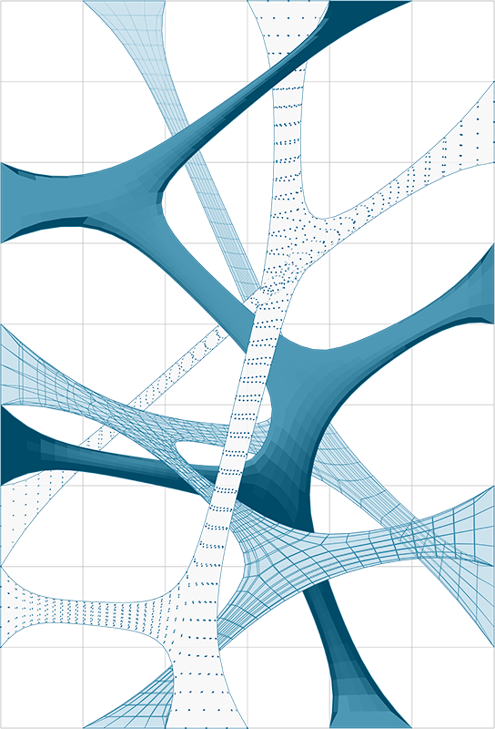

## 1.6. Getting Started with Meshes

####In the field of computational modeling, meshes are one of the most pervasive forms of representing 3D geometry. Mesh geometry can be a light-weight and flexible alternative to working with NURBS, and are used in everything from rendering and visualizations to digital fabrication and 3D printing. This chapter will provide an introduction to how mesh geometry is handled in Grasshopper.

