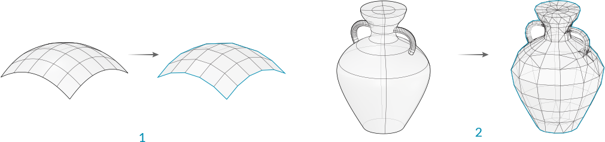
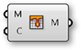
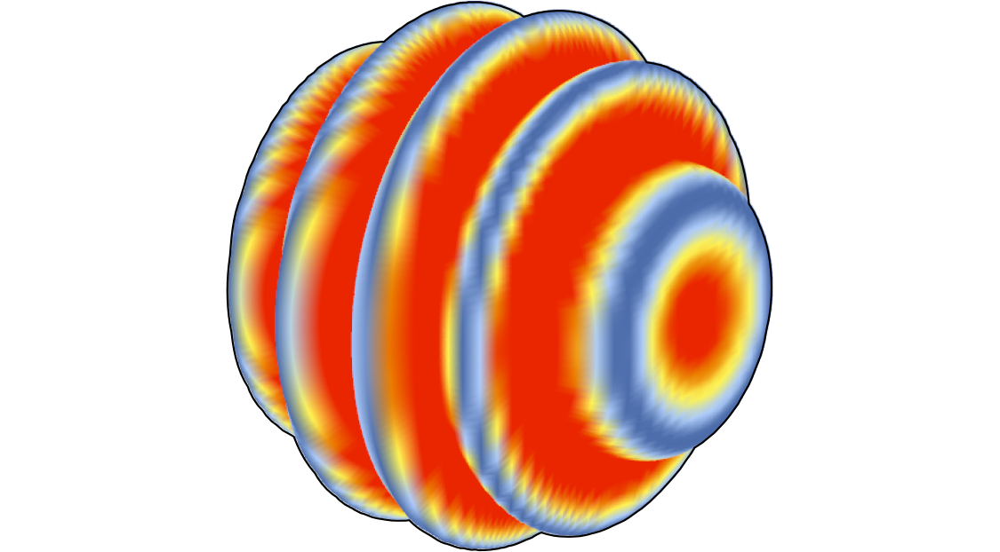
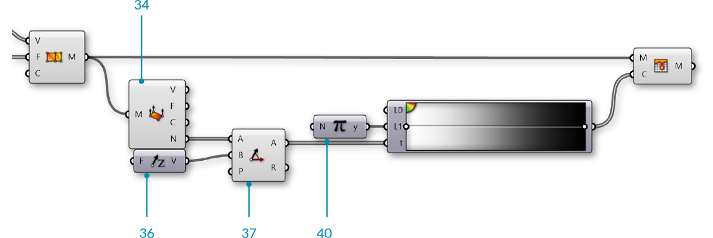

### 1.6.3 Creating  Meshes

#####In the last section, we looked at the basic structure of meshes. In this section, we give a brief introduction to different ways of generating mesh geometry.

There are three fundamental ways of creating mesh geometry in Grasshopper:
1. Starting with a mesh primitive
2. Manually constructing a mesh from faces and vertices
3. Converting NURBS geometry into a mesh

####1.6.3.1 Primitive

Grasshopper comes with a few simple mesh primitive components:

>1. **Mesh Box** - This primitve requires a Box object as an input which provides the size and location, as well as X,Y, and Z values that determine how many faces to divide the box into. The six sides of a Mesh Box are *unwelded* allowing for creases. (See the following section for more information about welded meshes)
2. **Mesh Plane** - This primitive requires a Rectangle input to determine the size and location of the plane, as well as W and H values to determine the number of faces.
3. **Mesh Sphere** - This primitive requires a base plane to determine the center and orientation of the sphere, a radius for the size, and U and V values to determine the number of faces.
4. **Mesh Sphere Ex** - Also known as a Quadball, this primitive creates a sphere composed of six patches, which are subdivided according to the C input. A quadball is topologically equivalent to a cube, even though it is geometrically spherical.

####1.6.3.2 Construct Mesh

As we saw in the previous section, the **Construct Mesh** component can be used to directly create a mesh from a list of vertices and a list of faces (and an optional list of vertex colors). Constructing an entire mesh manually can be extremely tedious, so this component is more often used with an existing list of faces and vertices which have been extracted using a **Deconstruct Mesh** component on an existing mesh.

####1.6.3.3 NURBS to Mesh

Perhaps the most common method of creating a complex mesh is to generate one based off of NURBS geometry. Individual NURBS surfaces can be converted to a mesh using the **Mesh Surface** component, which simply subdivides the surface along its UV coordinates and creates quad faces. This component allows you to enter the number of U and V divisions for the resultant mesh.

More complex polysurfaces can be converted to a single mesh with the **Mesh Brep** component. This component also has an optional Settings input, which can be set by using one of the built in *Speed*, *Quality*, or *Custom* Settings components, or by right-clicking the S input and selecting "Set Mesh Options". For efficient use of meshes, it is often necessary to refine this mesh by using various strategies such as rebuilding, smoothing, or subdividing. Some of these techniques will be discussed later in this Primer.

>1. **Mesh Surface** converts a NURBS surface to a mesh
2. **Mesh Brep** can convert polysurfaces and more complicated geometry into a single mesh. Adjusting the settings will allow for more or less faces, and a finer or coarser mesh.

NOTE: it is generally much easier to convert from a NURBS geometry to a mesh object rather than the other way around. While the UV coordinates of a NURBS surface are straightforward to convert to quad faces of a mesh, the opposite is not necessarily true, since a mesh might contain a combination of triangles and quads in a way that is not simple to extract a UV coordinate system out of. 

####1.6.3.4 Exercise

In this exercise, we use a basic Mesh primitive, perform a transformation on the vertices, and then assign a color based on the normal vectors to approximate the rendering process.


>Example files that accompany this section: [http://grasshopperprimer.com/appendix/A-2/1_gh-files.html](http://grasshopperprimer.com/appendix/A-2/1_gh-files.html)

>Example files that accompany this section: [Download](../../appendix/A-2/gh-files/1.6.3_creating meshes.gh)


||||
|--|--|--|
|01.| Start a new definition, type Ctrl-N (in Grasshopper)||
|02.| **Mesh/Primitive/Mesh Sphere** - Drag and drop a **Mesh Sphere** component onto the canvas||
|03.| **Params/Input/Number Slider** - Drag and drop a **Number Slider** component onto the canvas and set the following values: <ul>Rounding: Integer Lower Limit:0 Upper Limit: 100 Value: 10</ul>||
|04.| Connect the **Number Slider** to the U Count (U) and V Count (V) inputs of the **Mesh Sphere** Component|||

>Adjust the slider and notice how the resoultion of the sphere changes in the Rhino viewport. Higher numbers result in a smoother sphere, but also produce larger datasets which can require more processing time.

||||
|--|--|--|
|05.| **Mesh/Analysis/Deconstruct Mesh** - Drag and drop a **Deconstruct Mesh** component onto the canvas||
|06.| Connect the Mesh (M) output of the **Mesh Sphere** component to the Mesh (M) input of the **Deconstruct Mesh** component||
|07.| **Transform/Euclidean/Move** - Drag and drop a **Move** component onto the canvas||
|08.| Connect the Vertices (V) output of the **Deconstruct Mesh** component to the Geometry (G) input of the **Move** component||
|09.| Connect the Normals (N) output of the **Deconstruct Mesh** component to the Motion (T) input of the **Move** component||
|10.| **Mesh/Analysis/Construct Mesh** - Drag and drop a **Construct Mesh** component onto the canvas||
|11.| Connect the Geometry (G) output of the **Move** component to the Vertices (V) input of the **Construct Mesh** component||
|12.| Connect the Faces (F) output of the **Deconstruct Mesh** component to the Faces (F) of the **Construct Mesh** component|||

>We deconstructed the mesh to get its vertices, faces, and normals. We then simply moved each vertex according to its normal vector. Because we did not change the topology of the sphere at all, we re-used the list of faces to re-construct the new mesh. Normal vectors always have a length of one, so this ended up reconstructing a new mesh sphere with a radius of one more than the original sphere. 

Next, we will use a sine function to manipulate the sphere in a slightly more complicated way.

||||
|--|--|--|
|13.| **Vector/Point/Deconstruct** - Drag and drop a **Deconstruct** component onto the canvas||
|14.| Connect the Vertices (V) output of the **Deconstruct Mesh** component to the Point (P) input of the **Deconstruct** component||
|15.| **Params/Input/Number Slider** - Drag and drop two **Number Slider** components onto the canvas||
|16.| Set the values of the frist **Number Slider** to: <ul>Name: Amplitude  Rounding: Float Lower Limit: 0 Upper Limit: 10</ul>||
|17.| Set the values of the second **Number Slider** to: <ul>Name: Frequency Rounding: Float Lower Limit: 0 Upper Limit: 5</ul>||
|18.| **Maths/Script/Expression** - Drag and drop an **Expression** component onto the canvas||
|19.| Zoom in to the **Expression** component until you see the options for adding or removing input variables and click on a '+' to add a 'z' variable||
|20.| Right click the 'y' input of the **Expression** component and change the text to 'A'||
|21.| Right click the 'z' input of the **Expression** component and change the text to 'f'||
|22.| Double click the **Expression** component to edit the expression, and enter the following: <ul>A\*sin(x\*f/π)</ul>||
|23.| Connect the X output of the **Deconstruct** component to the 'x' input of the **Expression** component||
|24.| Connect the Amplitude **Number Slider** to the A input, and the Frequency **Number Slider** to the 'f' input of the **Expression** component||
|25.| **Maths/Operators/Multiplication** - Drag and drop a **Multiplication** component onto the canvas||
|26.| Connect the Normals (N) output of the **Deconstruct Mesh** component to the A input of the **Multiplication** component||
|27.| Connect the Result (R) output of the **Expression** component to the the B input of the **Multiplication** component||
|28.| Connect the Result (R) output of the **Multiplication** component to the Motion (T) input of the **Move** component|||

>Adjust the Amplitude and Frequency number sliders to see how the newly constructed mesh changes.

||||
|--|--|--|
|29.| **Mesh/Primitive/Mesh Colours** - Drag and drop a **Mesh Colours** component onto the canvas||
|30.| **Params/Input/Gradient** - Drag and drop a **Gradient** component onto the canvas   <blockquote>You can right-click the gradient component and select "Presets" to change the color gradient. In this example, we used the Red-Yellow-Blue gradient</blockquote>||
|31.| Connect the Result (R) output of the **Expression** component to the Parameter (t) input of the **Gradient** component||
|32.| Connect the output of the **Gradient** component to the Colours (C) input of the **Mesh Colours** component||
|33.| Connect the Mesh (M) output of the **Construct Mesh** component to the Mesh (M) input of the **Mesh Colours** component   <blockquote>In this step, we could achieve the same result by connecting the gradient directly to the Colours (C) input of the **Construct Mesh** component</blockquote>|||

>We used the Expression results to drive both the movement of the vertices and the color of the mesh, so the color gradient in this case corresponds to the magnitude of the movement of the vertices. 

For the final portion of the exercise, we will instead use the direction of the normals relative to a 'light source' vector to simulate the basic process of rendering a mesh.

||||
|--|--|--|
|34.| **Mesh/Analysis/Deconstruct Mesh** - Drag and drop a **Deconstruct Mesh** component onto the canvas||
|35.| Connect the Mesh (M) output of the **Construct Mesh** component to the Mesh (M) input of the **Deconstruct Mesh** component   <blockquote> While the topology of the original mesh has not changed, the normal vectors will be different, so we need to use a new **Deconstruct Mesh** to find the new normals.</blockquote||
|36.| **Vector/Vector/Unit Z** - Drag and drop a **Unit X** component onto the canvas   <blockquote> We will use this as the direction of a light source. You can use other vectors, or reference a line from Rhino to make this more dynamic</blockquote>||
|37.| **Vector/Vector/Angle** - Drag and drop an **Angle** component onto the canvas||
|38.| Connect the Normals (N) output of the **Deconstruct Mesh** component to the A input of the **Angle** component||
|39.| Connect the output of the **Unit Z** component to the B input of the **Angle** component||
|40.| **Maths/Util/Pi** - Drag and drop a **Pi** component onto the canvas||
|41.| Connect the **Pi** component to the Upper Limit (L1) input of the **Gradient** component||
|42.| Connect the Angle (A) output of the **Angle** component to the Parameter (t) input of the **Gradient** component|||

>We used the white-to-black preset for our gradient. This sets the mesh color according to the angle between the normal and the light source, with normals that are directly facing the light source to black and the normals facing away from the source to white (To be a little more accurate, you can reverse the gradient by adjusting the handles). The actual process of rendering a mesh is much more complicated than this, obviously, but this is the basic process of creating light and shadow on a rendered object.

---

