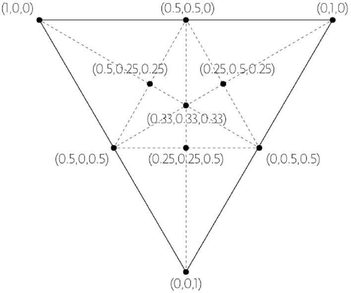
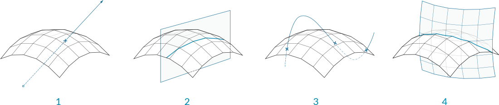

## 1.6.3 Working With Meshes

#####In the last section, we looked at the basic structure of meshes. In this section, we will look at ways to create and manipulate meshes, as well as methods to extract data and information.

####1.6.3.1 Creating

There are three fundamental ways of creating meshes in Grasshopper:
1. Starting with a mesh primitive
2. Manually constructing a mesh from faces and vertices
3. Converting NURBS geometry into a mesh

**Primitives** - Grasshopper comes with a few simple mesh primitive components:

>1. **Mesh Box** - This primitve requires a Box object as an input which provides the size and location, as well as X,Y, and Z values that determine how many faces to divide the box into. The six sides of a Mesh Box are *unwelded* allowing for creases. (See below for more information about welded meshes)
2. **Mesh Plane** - This primitive requires a Rectangle input to determine the size and location of the plane, as well as W and H values to determine the number of faces.
3. **Mesh Sphere** - This primitive requires a base plane to determine the center and orientation of the sphere, a radius for the size, and U and V values to determine the number of faces.
4. **Mesh Sphere Ex** - Also known as a Quadball, this primitive creates a sphere composed of six patches, which are subdivided according to the C input. Like the Mesh Box, these six patches are unwelded.

**Construct Mesh** 

We have already seen this component in the last section. The **Construct Mesh** component can be used to directly create a mesh from a list of vertices and a list of faces (and an optional list of vertex colors). Constructing an entire mesh manually can be extremely tedious, so this component is more often used with an existing list of faces and vertices which have been extracted using a **Deconstruct Mesh** component on an existing mesh.

**NURBS to Mesh**

Perhaps the most common method of creating a complex mesh is to generate one based off of NURBS geometry. Individual NURBS surfaces can be converted to a mesh using the **Mesh Surface** component, which simply subdivides the surface along its UV coordinates and creates quad faces. This component allows you to enter the number of U and V divisions for the resultant mesh.

More complex polysurfaces can be converted to a single mesh with the **Mesh Brep** component. This component also has an optional Settings input, which can be set by using one of the built in *Speed*, *Quality*, or *Custom* Settings components, or by right-clicking the S input and selecting "Set Mesh Options". For efficient use of meshes, it is often necessary to refine this mesh by using various strategies such as rebuilding, smoothing, or subdividing. Some of these techniques will be discussed later in this Primer.

>1. **Mesh Surface** converts a NURBS surface to a mesh
2. **Mesh Brep** can convert polysurfaces and more complicated geometry into a single mesh. Adjusting the settings will allow for more or less faces, and a finer or coarser mesh.

NOTE: it is generally much easier to convert from a NURBS geometry to a mesh object rather than the other way around. While the UV coordinates of a NURBS surface are straightforward to convert to quad faces of a mesh, the opposite is not necessarily true, since a mesh might contain a combination of triangles and quads in a way that is not simple to extract a UV coordinate system out of. 

####1.6.3.2 Mesh Operations

**Smooth**

Smoother meshes can sometimes be achieved by simply increasing the number of faces, but this can often lead to extremely large datasets which take a long time to calculate. In these situations, the **Smooth** component can be used as an alternative to make meshes less jagged or faceted, without increasing vertex and face count.  The *strength*, *number of iterations*, and displacement *limit* can all be used to adjust how much smoothing occurs.

Attaching a boolean value to the input N provides option to skip naked vertices. A vertex is naked if it is connected to a naked edge, meaning the vertex is on the boundary of an open mesh. By toggling this option, you maintain the exterior boundary of a mesh while smoothing the interior edges.

>1. Initial box mesh with 3 faces removed
2. Smoothing after 2 iterations
3. 6 iterations
4. 25 iterations
5. 50 iterations

**Blur**

The **Blur** component acts in a similar way as smooth, except it only affect the vertex colors. It can also be used to reduce the jagged appearance of colored meshes, although to a lesser extent since it does not change any geometry.

>1. Initial mesh
2. Blur after 1 iterations
3. 6 iterations
4. 12 iterations
5. 20 iterations

**Triangulate**

In order to ensure each face is planar, or to export a mesh to a different software that might not allow quad faces, it is sometimes necessary to triangulate a mesh. Using the **Triangulate** component, each quad face is replaced with two triangle faces by creating a new edge along the shortest diagonal of the face.

>1. Original quad mesh
2. Added edges according to shortest distance across quads
3. Triangulated resultant mesh

**Weld**

In the last section, we noticed that a single vertex can be shared by adjacent faces and the normal for that vertex is calculated as the average of the adjacent faces, allowing a smoother visualization. However, it is sometimes desireable to have a sharp crease or seam, where one face does not smoothly transition to the next by way of the vertex normals. For this situation, it is necessary for each face to have its own vertex with its own normal. The list of vertices would contain at least two point that have the same coordinates, but different indices.

>1. Welded Faces - Both faces share vertices 1 and 2. The vertex normals at these vertices are the average of the face vertices.
2. Unwelded Faces - Duplicate vertices are added to the list. The faces do not share any vertex indices. Vertex 1 and vertex 6 each have the same coordinates, but different indices. They each have their own vertex normal

The process of taking two vertices that are in the same position and combining them into a single vertex is called *welding*, while *unwelding* takes a single vertex and splits it into two.

The **Weld** component uses a threshold angle as input. Any two adjacent faces with an angle less than the threshold angle will be welded together, resulting in common vertices with a normal that is the average of the adjacent faces. **Unweld** works in the opposite manner, where adjancent faces with an angle greater than the given threshold will be unwelded, and their shared vertices will be duplicated.

>1. The default Box Mesh has 726 vertices. The mesh is creased at the corners of the box, where vertices are doubled up.
2. If the mesh is welded with an angle greater than 90 degrees, the resulting mesh faces are welded together, and the number of vertices has decreased to 602 while the number of faces has remained the same.
3. Looking at the previewed geometry, you can also notice that the rendered welded mesh has smoothed corners. 
4. Unlike the Smooth component which changes the mesh geometry, this mesh only appears smoother due to the vertex normal's role in rendering and shading. The edges and faces remain unaffected.

####1.6.3.3 Interactions with Other Objects

**Mesh Inclusion**

This component tests to determine whether a given point is inside a mesh solid or not. This only works with closed meshes.

**Mesh Closest Point**

This component will calculate the position on a mesh that is closest to a given point. This component outputs three pieces of data: the coordinates of the calculated point on the mesh, the index of the face which contains that point, and the mesh parameter. This parameter is extremely useful in conjunction with the **Mesh Eval** component discussed below.

>1. Given a point in space, We want to find the closet point on the mesh
2. The face that contains the closest point is identified
3. The parameters of the closest point on the face are calculated

For those users interested in a little more detail about how a mesh is parameterized, we can take a closer look at how a mesh parameter is structured. In the image below, we have attached a panel to the parameter output of a **Mesh Closest Point** component. The mesh parameter is N[A,B,C,D]. The first number, N, is the index of the face which contains the calculated point. The following four numbers define the *barycentric* coordinates of the point within that face. The coordinates of the referenced point can be found by multiplying each vertex of the face by these numbers in order and then add the results together. (Of course, this is already done for us, and is given in the Point output). Also note that barycentric coordinates are only unique for triangular faces, meaning that on a quad face the same point could have multiple different parameterizations. Grasshopper avoids this problem by internally triangulating a quad face when calculating a parameter, the result of which is that of the four numbers in a mesh parameter, at least one of them will always be zero.

>Barycentric Coordinates

**Mesh Eval**

The **Mesh Eval** component uses a mesh parameter as an input and returns the referenced point, as well as the normal and color at that point. The color and normal are calculated as interpolations of the vertex colors and vertex normals, using the same barycentric coordinates as the mesh parameter.

**Mesh Join**

Unlike joining curves or NURBS surfaces, which require adjacency, any meshes can be joined into a single mesh, even meshes that are not touching. Recall that a mesh is simply a list of vertices, and a list of faces. There is no actual requirement for those faces to be connected. 

**Mesh Boolean**

Meshes in Grasshopper have a set of boolean operations similar to boolean operations for NURBS solids. Boolean operations are order specific, meaning that  switching the order of the input meshes A and B will result in different outputs.

>1. Mesh Difference
2. Mesh Intersection
3. Mesh Split
4. Mesh Union

**Intersect**

Intersections can be calculated between meshes and other objects: rays, planes, curves, and other meshes

>1. Mesh | Ray
2. Mesh | Plane
3. Mesh | Curve
4. Mesh | Mesh

####1.6.3.4 Exercise
