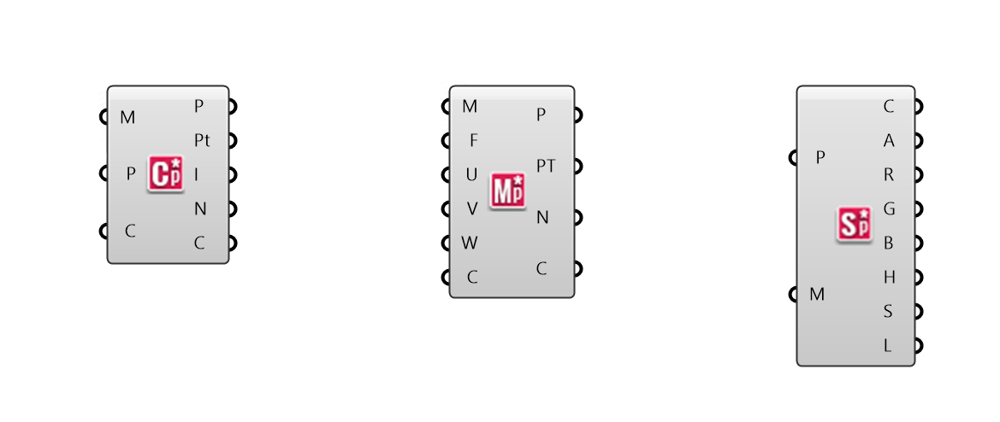

### 1.6.4 Element* 

#####Element\* is a mesh geometry plugin for Grasshopper, enabling mesh creation, analysis, transformation, subdivision, and smoothing. Element* provides access to mesh topology data using the Plankton half-edge data structure for polygon meshes.

####1.6.4.1 Half Edge Data

In the beginning of this chapter, we looked at how Grasshopper defines a mesh using a Face-Vertex data structure. This is a relatively simple data structure and is widely used in applications that use meshes, but can be computationally inefficient for more advanced algorithms. The Element\* add-on restructures the mesh using Half-Edge data in order to allow for efficient queries of adjacent vertices, faces, and edges, which can vastly improve on algorithm speed and performance.

The half-edge data structure is a representation for a mesh in which each edge is split up into two half-edges with opposite directions. This allows explicit and implicit access to data from one mesh element to adjacent elements.

>1. Half-Edge
2. Face
3. Vertex
4. Next
5. Half-Edge Face

####1.6.4.2 Analyse

>1. Mesh Closest Point
2. Mesh Evaluate
3. Mesh Sample Plus

**Element\* Mesh Closest Point**

Unlike Grasshopper's **Mesh Closest Point** component, this component also calculates the normal and color at the outputed point, eliminating the need for a  **Mesh Eval** component and simplfying the canvas workspace.

**Element\* Mesh Evaluate**

The built in Grasshopper **Mesh Eval** component requires a mesh parameter as an input, which can be extracted from a **Mesh Closest Point** component, but which can be difficult to construct manually. Element's closest point component allows direct input of the index of a mesh face and the barycentric coordinates. 

Note - barycentric coordinates are defined such that they always add to 1. If the input values of U,V, and W do not add to 1, this component will maintain the ratio of the three values while normalizing them. For example, if you had the input values of 2, 2, and 4 the mesh parameter would be calculated as {0.25;0.25;0.5}

**Element\* Mesh Sample Plus**

This component is used to quickly extract color information from a mesh. It returns the Alpha, Red, Green, Blue, Hue, Saturation, and Luminosity values of the inputed points. If the given points are not on the mesh, this component will calculate the closest point.

####1.6.4.3 Data

>1. Data Visualizer
2. Edge Neighbors
3. Face Neighbors
4. Vertex Neighbors

**Element\* Data Visualizer**

This component is used to help visualize the half-edge data of the faces of an input mesh. 

**Element\* Edge Neighbors**

This component provides access to the adjacency data structured according to the edges of the input mesh. The output data is provided as a tree with one branch for each edge in the mesh. It provides the end points, center ponts of adjacent faces, neighboring edges as line objects, and the center points of the neighboring faces.

EDIT - I don't currently know what a 'neighboring face' or 'neighboring edges' are with respect to an edge

>Diagram illustrating what a "neighboring face"

**Element\* Face Neighbors**

This component is similar to the others in this section, but the data is organized in a tree according to the faces of the mesh, with one branch per face. The outputs are the vertices of each face, the adjacent edges, and the centers of neighboring faces.

Note - This component only allows triangulated meshes.

>Diagram illustrating neighbors

**Element\* Vertex Neighbors**

This component outputs neighboring vertices, edges, and face centers structured in a tree according to the vertices of the mesh.

>Diagram illustrating neighbors
EDIT - These three diagrams can potentially be shown next to each other as a single image with three diagrams?

####1.6.4.4 Primitives

####1.6.4.5 Smooth

####1.6.4.6 Subdivide

####1.6.4.7 Transform

####1.6.4.8 Utility

####1.6.4.9 Exercise

