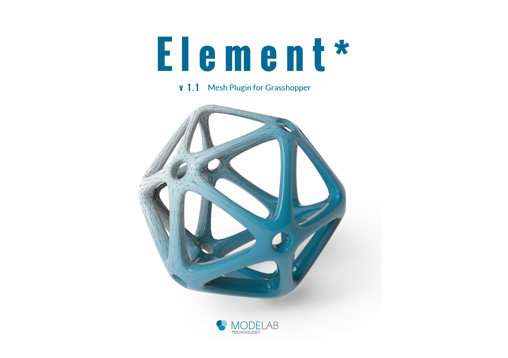

### 2.1 Element* 
###### v1.1 Mesh Plugin for Grasshopper
####Element\* is a mesh geometry plugin for Grasshopper, enabling mesh creation, analysis, transformation, subdivision, and smoothing. Element* provides access to mesh topology data using the Plankton half-edge data structure for polygon meshes.

