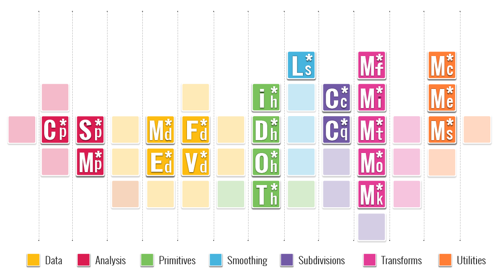
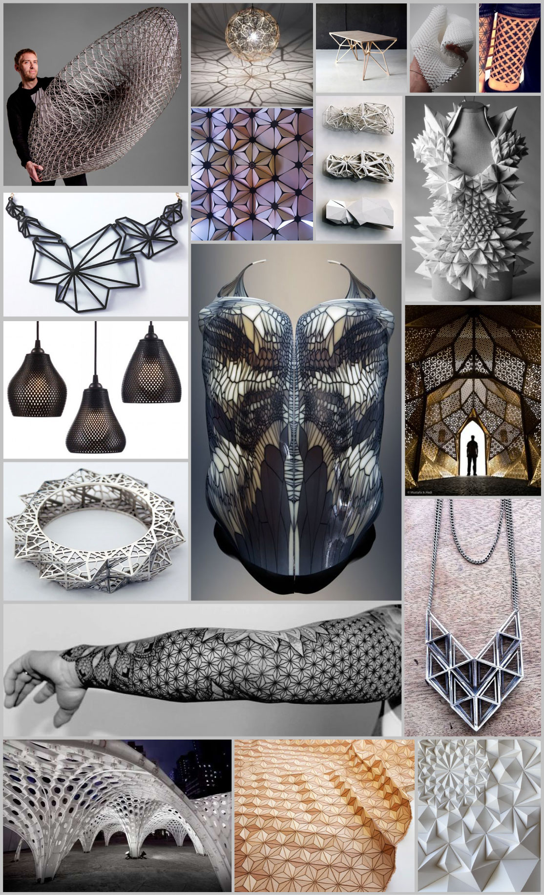

### 2.1.1. Element* 

##### Integrating the use of Meshes in your workflow offers a wide variety of opportunities to create shapes that range from faceted to smooth. Element\* allows you to go further, by giving you more intuitive access to analyzing mesh topology and smoothing routines. This chapter is a User's Guide for Element\* Version 1.1 and will get you up to speed. 

> [Download](http://www.food4rhino.com/project/element) the Element* plug-in to get started

##### Element\* components are categorized based on their operations. Much like the periodic table, which provides a framework for analyzing chemical behavior, Element provides a framework for analyzing and exloring geometry based on mesh data and operations. We imagine new components will be created by analysing the relationships between components in each category.

##### Below are some inspirational images of the types of products and applications that could be generated using Element*.

