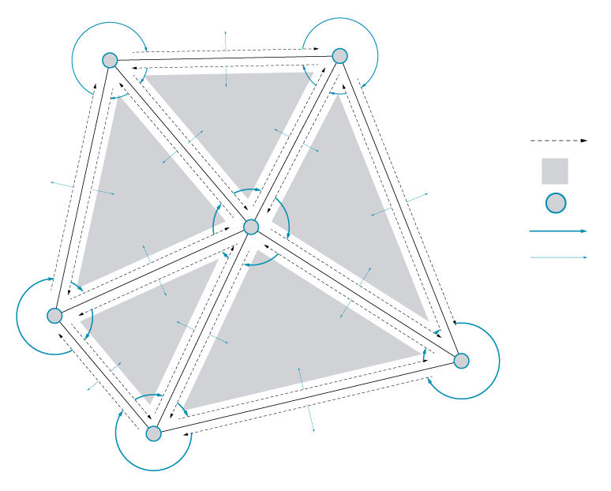

### 2.1 Element* 

#####Element\* is a mesh geometry plugin for Grasshopper, enabling mesh creation, analysis, transformation, subdivision, and smoothing. Element* provides access to mesh topology data using the Plankton half-edge data structure for polygon meshes.

####2.1.1 Half Edge Data

In the beginning of this chapter, we looked at how Grasshopper defines a mesh using a Face-Vertex data structure. This is a relatively simple data structure and is widely used in applications that use meshes, but can be computationally inefficient for more advanced algorithms. The Element\* add-on restructures the mesh using Half-Edge data in order to allow for efficient queries of adjacent vertices, faces, and edges, which can vastly improve on algorithm speed and performance.

The half-edge data structure is a representation for a mesh in which each edge is split up into two half-edges with opposite directions. This allows explicit and implicit access to data from one mesh element to adjacent elements.

