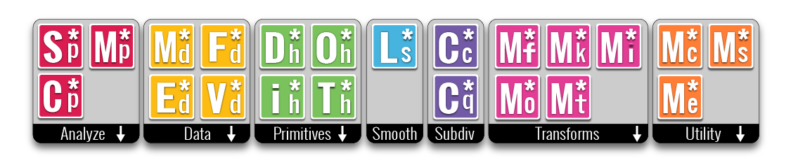
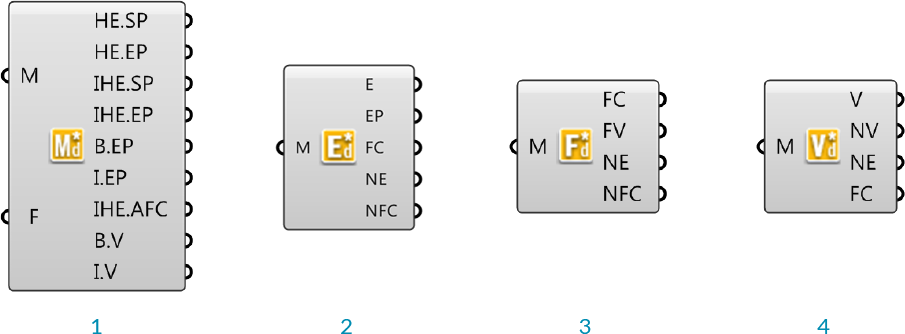
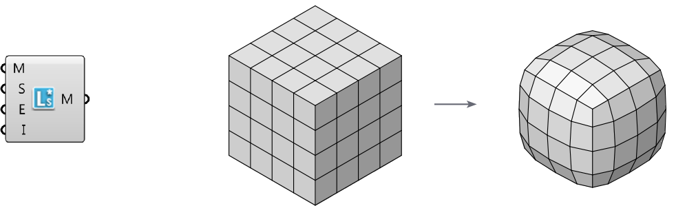
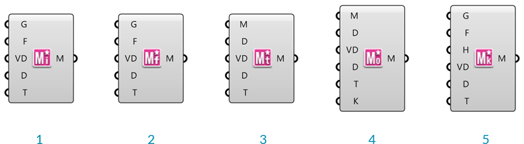

####2.1.2 Element* Components

####2.1.2.1 Analyse

>1. Mesh Closest Point
2. Mesh Evaluate
3. Mesh Sample Plus

**Element\* Mesh Closest Point**

Unlike Grasshopper's **Mesh Closest Point** component, this component also calculates the normal and color at the outputed point, eliminating the need for a  **Mesh Eval** component and simplfying the canvas workspace.

**Element\* Mesh Evaluate**

The built in Grasshopper **Mesh Eval** component requires a mesh parameter as an input, which can be extracted from a **Mesh Closest Point** component, but which can be difficult to construct manually. Element's closest point component allows direct input of the index of a mesh face and the barycentric coordinates. 

Note - barycentric coordinates are defined such that they always add to 1. If the input values of U,V, and W do not add to 1, this component will maintain the ratio of the three values while normalizing them. For example, if you had the input values of 2, 2, and 4 the mesh parameter would be calculated as {0.25;0.25;0.5}

**Element\* Mesh Sample Plus**

This component is used to quickly extract color information from a mesh. It returns the Alpha, Red, Green, Blue, Hue, Saturation, and Luminosity values of the inputed points. If the given points are not on the mesh, this component will calculate the closest point. This component uses Parallel Computing for speed.

####2.1.2.2 Data

>1. Data Visualizer
2. Edge Neighbors
3. Face Neighbors
4. Vertex Neighbors

**Element\* Data Visualizer**

This component is used to help visualize the half-edge data of the faces of an input mesh. 

**Element\* Edge Neighbors**

This component provides access to the adjacency data structured according to the edges of the input mesh. The output data is provided as a tree with one branch for each edge in the mesh. It returns the mesh edges, the edge end points, center ponts of the faces adjacent to each edge (dual), the neighboring edges as line objects (arranged in clockwise order) , and neighbouring face centers (center points of faces adjacent to the edge start and end points)

> **Edge Neighbors** - Edges, End vertices, Adjacent face centers, Neighboring edges, and Neighbouring face centers

**Element\* Face Neighbors**

This component is similar to the others in this section, but the data is organized in a tree according to the faces of the mesh, with one branch per face. The outputs are the face centers, vertices of each face (arranged in counter clockwise order), neighbouring edges (arranged in counter clockwise order), and the centers of neighboring faces (arranged in counter clockwise order).

> **Face Neighbors** - Face centers, face vertices, neighbouring edges, neighbouring face centers

**Element\* Vertex Neighbors**

This component outputs the mesh vertices, neighboring vertices (arranged in clockwise order), neighbouring edges (arranged in clockwise order), and neighbouring face centers (arranged in clockwise order) structured in a tree according to the vertices of the mesh.

> **Vertex Neighbors** - Vertices, neighbouring vertices, neighbouring edges, neighbouring face centers

####2.1.2.3 Primitives

Element\* provides four additional mesh primitives: the Icosohedron, Dodecahedron, Octahedron, and Tetrahedron. These components take a single number as input for the radius, and produce meshes centered at the origin, and composed of one face per side. With the addition of the Cube, which is already availible through Grasshopper's built-in primitives, these make up the five Platonic solids. 

>1. Dodecahedron
2. Tetrahedron
3. Octahedron
4. Tetrahedron

####2.1.2.4 Smooth

**Element\* Smooth** provides an optimized smoothing algorithm that is more efficient than Grasshopper's **Smooth Mesh** for large datasets. It makes use of the Lapacian Smoothing algorithm for Half-Edge structured meshes. It does not change the topology or vertex count of welded meshes, but will weld together any unwelded meshes.

####2.1.2.5 Subdivide

**Element\* Catmull Clark Subdivision** 

This is a recursive subdivision defined by the Catmull Clark algorithm. We can specify the number of iterations as well as how to handle naked edge conditions.

**Element\* Constant Quad**

This subdivison component will create an all quad mesh by adding a face for each edge of the mesh.

>1. Constant Quad subdivision
2. Catmull Clark subdivision

####2.1.2.6 Transform

>1. Mesh Windown
2. Mesh Frame
3. Mesh Thicken
4. Mesh Offset

These components provide a number of different transformations described below. Each component has the additional capability of accepting per-vertex distance data to allow for variations of the transformation magnitudes across the mesh.

**Element\* Mesh Window**

Reconstructs a new mesh on the inside of a face based on an offset value. This component accepts either a mesh or a list of closed polylines as input.

**Element\* Mesh Frame**

Outputs a frame around mesh faces. Each resultant face will have a new hole in the center. This component accepts either a mesh or a list of closed polylines as input.

**Element\* Mesh Thicken**

This component will thicken an input mesh along the vertex normals, and according to provided distance values.

**Element\* Mesh Offset**

This component creats an offset of the input mesh based on the vertex normals.

>1. Mesh Window
2. Mesh Frame
3. Icosohedron transformed with mesh frame, then thickend and subdivided

####2.1.2.7 Utility

The **Element\* Mesh Combine and Clean** component will combine multiple meshes together and weld the vertices and vertex normals according to an input threshold angle.
