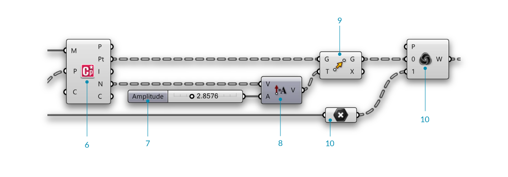
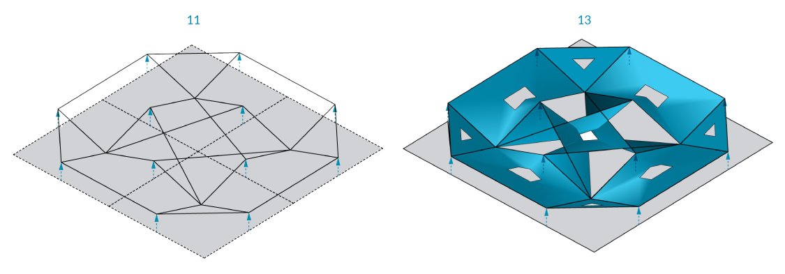
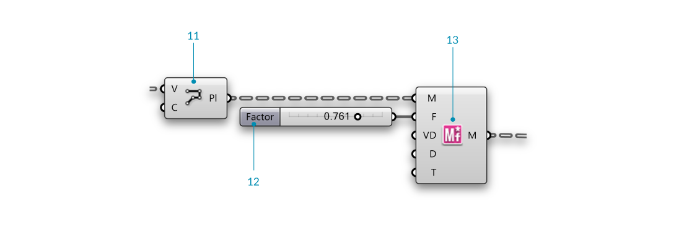
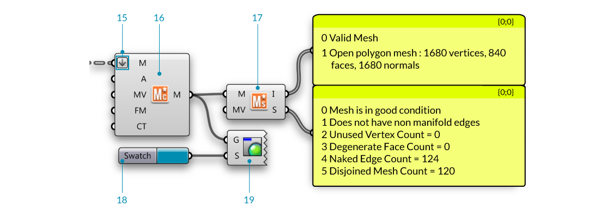
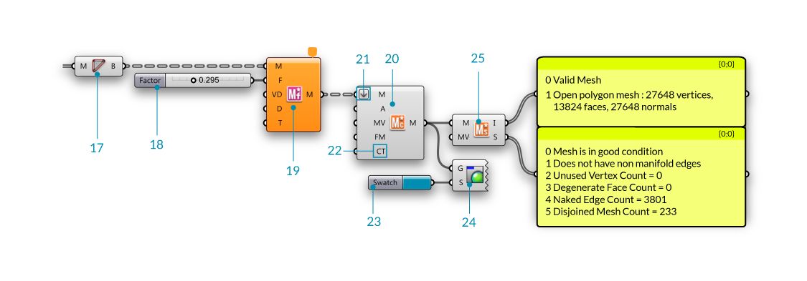

### 2.1.4 Element* Architectural Case Study 

#####In this section, we will work through a simple exercise file for producing architectural facades. The case studies will be broken down into 3 Phases with this being Phase 1. Phase 2 and 3 will come at a later time. This example incorporates Half Edge data structures along with basic Element* components without the use of per vertex features.

####2.1.4.1 Example 1


>Example files that accompany this section: [http://grasshopperprimer.com/appendix/A-2/1_gh-files.html](http://grasshopperprimer.com/appendix/A-2/1_gh-files.html)

>Example files that accompany this section: [Download](../../appendix/A-2/gh-files/2.1_element addon.gh)


---

---

||||
|--|--|--|
|00.| Create a meshplane in Rhino with **XFaces = 2 & YFaces==2** and Start a new definition, type Ctrl-N (in Grasshopper)||
|01.| **Params/Geometry/Mesh** - Drag and drop a **Mesh** container onto the canvas||
|01b.| Reference a mesh in Rhino by right-clicking the **Mesh** component and selecting "Set one Mesh".  <blockquote>We are going to use a simple mesh plane to walk through the definition, feel free to swap out the mesh with your own mesh</blockquote>||
|02.| **Element\*/Utility/Mesh Combine and Clean** - Drag and drop a **Element* Mesh Combine and Clean** component on the canvas||
|03.| **Element\*/Data/Vertex Neighbors** - Drag and drop the **Element* Vertex Neighbors** component onto the canvas| |
|04.| **Params/Input/Number Slider** - Drag and drop a **Number Slider** component onto the canvas and set the following values: <ul>Lower Limit: 0.0000 Upper Limit: 1.0000</ul>||
|05.| **Curve/Analysis/Evaluate Curve** - Drag and drop a **Evaluate Curve** container onto the canvas||
|05b.| Connect the Neighbouring Edges (NE) output of the **Element* Vertex Neighbors** component to the Curve (C) input of the **Evaluate Curve** component||
|05c.| Connect the **Number Slider** to the Float (t) input of the **Evaluate Curve** component and set the value to 0.5000||
|05d.| Right click the Curve (C) input of the **Evaluate Curve** component and enable **Reparameterize** |||

---
>Looking at the data of the Neighboring Face Edges (NE) output, we see that we have a tree with 20 branches, where each branch contains three lines. The 20 branches each represent a face of the icosohedron which has 20 sides, while the three lines are the edges of each triangular face.

||||
|--|--|--|
|06.| **Element\*/Analyse/Mesh Closest Point** - Drag and drop a **Element* Mesh Closest Point** container onto the canvas||
|06a.| Connect the Mesh output (M) of the **Element\*/Utility/Mesh Combine and Clean** component to the Mesh (M) input of the **Element* Mesh Closest Point** component||
|06b.| Connect the Points output (P) of the **Curve/Analysis/Evaluate Curve** component to the Point (P) input of the **Element* Mesh Closest Point** component||
|07.| **Params/Input/Number Slider** - Drag and drop a **Number Slider** component onto the canvas and set the following values: <ul>Rounding: Float Lower Limit:0 Upper Limit: 10.000</ul>||
|08.| **Vector/Vector/Amplitude** - Drag and drop a **Amplitude** component onto the canvas||
|09.| **Transform/Euclidean/Move** - Drag and drop a **Move** component onto the canvas||
|10.| **Params/Geometry/Point** - Drag and drop a **Point** container onto the canvas||
|10b.| Connect the Face Centers output (FC) of the **Element* Vertex Neighbors** component to the **Point** component||
|11.| **Sets/List/Weave** - Drag and drop a **Weave** component onto the canvas|||

---

||||
|--|--|--|
|12.| **Curve/Primitive/Polyline** - Drag and drop a **Polyline** component onto the canvas||
|12b.| Connect the Weave output (W) of the **Weave** component to the Vertices (V) input of the **Polyline** component||
|12c.| Right click the Closed (C) input of the **Polyline** component, click "Set Boolean" and set the value to True  <blockquote>This has created a closed polyline.</blockquote>||
|13.| **Params/Input/Number Slider** - Drage and drop a **Number Silder** component onto the canvas. We will keep the default range of 0 to 1 for this slider||
|14.| **Element\*/Transform/Mesh Frame** - Drag and drop a **Element* Mesh Frame** component onto the canvas.||
|14b.| Connect the Polyline (Pl) output of the **Polyline** component to the Geometry (G) input of the **Mesh Frame** component  <blockquote>Note that the **Mesh Frame** component can take either meshes or a list of closed polyline curves as input</blockquote>||
|14c.| Connect the **Number Slider** to the Factor (F) input of the **Mesh Frame** component|||

---

*>We have truncated the triangular faces of the initial mesh, effectively also creating rings around each original vertex. We have also created a frame for each face, then thickened the mesh and refined it with subdivision. Next we will take advantage of the Per Vertex capabilities of the transform components by using an attractor point.

||||
|--|--|--|
|15.| **Element\*/Utility/Mesh Combine and Clean** - Drag and drop a **Element* Mesh Combine and Clean** component on the canvas| |
|15b.| Right click the Combine Type (CT) input of the **Element* Mesh Combine and Clean** component, click "Set Integer" and set the value to 1.  <blockquote>The Combine Type input has two options (0, which combines and cleans the meshes) and (1, which joins the meshes in the list without merging vertices). In this example we want to join the meshes  </blockquote>||
|16.| Right click the Mesh (M) input of the **Element* Mesh Combine and Clean** component, click "Flatten".  <blockquote>This will flatten the list so we can join the mesh list together.</blockquote>||
|17.| **Element\*/Utility/Mesh Status** - Drag and drop a **Element* Mesh Status** component on the canvas| |
|17b| Connect the Info (I) and Status (S) outputs of **Element* Mesh Status** to a **Params/Input/Panel** component  <blockquote>The mesh **Info** output contains mesh validity information, closed or open type and mesh component counts (vertices, faces, normals). The mesh **Status** informs the user if the mesh is in "Good" condition as well as data regarding non manifold edges, unused vertex count, degenerate face count, naked edge count and disjoined mesh count. </blockquote>||
|18.| **Params/Input/Colour Swatch** - Drag and drop a **Colour Swatch** component on the canvas||
|19.| **Display/Preview/Custom Preview** - Drag and drop a **Custom Preview** component on the canvas|||

---

---

####2.1.4.2 Example 2
---

---

---

---

---

