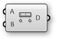

###2.1.4. Exercise

#####In this section, we will work through a simple exercise using the Element* primitives as a base. We will incorporate the half-edge data structure as well using both features of the transform components (uniform and per vertex)


>Example files that accompany this section: [http://grasshopperprimer.com/appendix/A-2/1_gh-files.html](http://grasshopperprimer.com/appendix/A-2/1_gh-files.html)

>Example files that accompany this section: [Download](../../appendix/A-2/gh-files/2.1_element addon.gh)


||||
|--|--|--|
|01.| Start a new definition, type Ctrl-N (in Grasshopper)||
|02.| **Element\*/Primitive/Icosohedron** - Drag and drop the **Icosohedron** component onto the canvas||
|03.| **Params/Input/Number Slider** - Drag and drop the **Number Slider** component onto the canvas||
|04.| Connect the **Number Slider** to the Radius (R) input of the **Icosohedron** component||
|05.| Double-click the **Number Slider** and set appropriate values. For this example, we used: <ul>Name: Radius Rounding: Integer Lower Limit: 5 Upper Limit: 50 Value: 25</ul> ||
|06.| **Element\*/Data/Face Neighbors** - Drag and drop the **Face Neighbors** component onto the canvas| |
|07.| Connect the Mesh (M) output of the **Icosohedron** component to the Mesh (M) input of the **Face Neighbors** component.|||

>Looking at the data of the Neighboring Face Edges (NE) output, we see that we have a tree with 20 branches, where each branch contains three lines. The 20 branches each represent a face of the icosohedron which has 20 sides, while the three lines are the edges of each triangular face.

||||
|--|--|--|
|08.| **Params/Input/Number Slider** - Drag and drop a **Number Slider** component onto the canvas and set the following values: <ul>Rounding: Float Lower Limit:0 Upper Limit: 0.5</ul>||
|09.| **Params/Input/Panel** - Drag and drop a **Panel** component onto the canvas||
|10.| Double-click the **Panel** component and enter "1" into the text-field||
|11.| **Math/Operators/Subtraction** - Drag and drop a **Subtraction** component onto the canvas||
|12.| Connect the **Panel** with a value of "1" into the A input and connect the number slider to the B input of the **Subtraction** component||
|13.| **Sets/Tree/Merge** - Drag and drop a **Merge** component onto the canvas||
|14.| Connect the **Number Slider** to the D1 input of **Merge**, and connect the output R of the **Subtraction** component to the D2 input of **Merge**||
|15.| **Curve/Analysis/Evaluate Curve** - Drag and drop an **Evaluate Curve** component onto the canvas|
|16.| Connect the Face Edges (NE) output of the **Face Neighbors** component to the Curve (C) input of the the **Evaluate Curve** component||
|17.| Right click the Curve (C) input of the **Evaluate Curve** component and select Graft. This will create a new branch for each edge.||
|18.| Connect the Result (R) output of the **Merge** component to the Parameter (t) input of the **Evaluate Curve** component. Because we grafted the Curve input, each edge is evaluated at both parameters from **Merge**|||

||||
|--|--|--|
|19.| **Sets/Tree/Trim Tree** - Drag and drop a **Trim Tree** component onto the canvas||
|20.| Connect the Points (P) output of **Evaluate Curve** to the Tree (T) input of the **Trim Tree** component.  <blockquote>The default value of Depth (D) input for **Trim Tree** is 1. This reduce the depth of our data tree one level by merging the outer most branch. The result is 20 branches, each with six points. </blockquote>||
|21.| **Curve/Spline/Polyline** - Drag and drop a **Polyline** component onto the canvas||
|22.| Connect the Tree (T) output of the **Trim Tree** component to the Vertices (V) input of the **Polyline** component ||
|23.| Right click the Closed (C) input of the **Polyline** component, click "Set Boolean" and set the value to True  <blockquote>This has created a closed polyline of six sides for each original face of the mesh.</blockquote>||
|24.| **Element\*/Transform/Mesh Frame** - Drag and drop a **Mesh Frame** component onto the canvas.|
|25.| Connect the Polyline (Pl) output of the **Polyline** component to the Geometry (G) input of the **Mesh Frame** component  <blockquote>Note that the **Mesh Frame** component can take either meshes or a list of closed polyline curves as input</blockquote>||
|26.| **Params/Input/Number Slider** - Drage and drop a **Number Silder** component onto the canvas. We will keep the default range of 0 to 1 for this slider||
|27.| Connect the **Number Slider** to the Factor (F) input of the **Mesh Frame** component|||

||||
|--|--|--|
|28.| **Element\*/Utility/Mesh Combine and Clean** - Drag and drop a **Mesh Combine and Clean** component on the canvas||
|29.| Connect the Mesh (M) output of **Mesh Frames** to the Mesh (M) input of the **Mesh Combine and Clean** component||
|30.| Right click the Mesh (M) input of **Mesh Combine and Clean** and select Flatten  <blockquote>By flattening the tree of meshes, **Combine and Clean** will merge all 20 face meshes into a single mesh</blockquote>||
|31.| **Element\*/Transform/Mesh Thicken** - Drag and drop a **Mesh Thicken** component onto the canvas||
|32.| Connect the Mesh (M) output of **Combine and Clean** to the Mesh (M) input of **Mesh Thicken**||
|33.| **Element\*/Subdivide/Catmull Clark Subdivision** - Drag and drop a **Catmull Clark Subdivision** component onto the canvas|
|34.| Connect the Mesh (M) output of **Mesh Thicken** to the Mesh (M) input of the **Catmull Clark Subdivision** component|||

>We have truncated the triangular faces of the initial mesh, effectively also creating rings around each original vertex. We have also created a frame for each face, then thickened the mesh and refined it with subdivision. Next we will take advantage of the Per Vertex capabilities of the transform components by using an attractor point.

||||
|--|--|--|
|35.| **Params/Geometry/Point** - Drag and drop a **Point** parameter onto the canvas||
|36.| Right click the **Point** parameter and select "Set on point" to select a point in the Rhino viewport  <blockquote>Tip - you can also create a point directly in Grasshopper by double-clicking the canvas to bring up the Search window, then typing a point coordinate such as "10,10,0" (without the quotes) </blockquote>||
|37.| **Mesh/Analysis/Deconstruct Mesh** - Drag and drop a **Deconstruct Mesh** component onto the canvas||
|38.| Connect the Mesh (M) output of the **Combine and Clean** component to the Mesh (M) input of the **Deconstruct Mesh** component.  <blockquote>We will use this to extract the vertices of our combined mesh, and then apply an attractor point to these vertices</blockquote>||
|39.| **Vector/Point/Distance** - Drag and drop a **Distance** component onto the canvas||
|40.| Connect the Vertices (V) output of the **Deconstruct Mesh** component to the A input of the the **Distance** component||
|41.| Connect the **Point** parameter to the B input of the **Distance** component||
|42.| Connect the Distance (D) output of the **Distance** component to the PerVectex Data (VD) input of the **Thicken** component||
|43.| **Params/Input/Number Slider** - Drag and drop two **Number Slider** components onto the canvas. We will use these to set the lower and upper limits for the **Mesh Thicken** component||
|44.| Double-click the **Number Sliders** and set the values. In this example, we left the first slider at default values, and set the Upper Limit of the second slider to 5.0||
|45.| **Maths/Domain/Construct Domain** - Drag and drop a **Construct Domain** component onto the canvas|
|46.| Connect the two number sliders to the A and B inputs of the **Construct Domain** component||
|47.| Connect the Domain (I) output of the **Construct Domain** component to the Min and Max Values (D) input of the **Mesh Thicken** component.||
|48.| Right click the Type (T) input of the **Thicken** component, select "Set Integer" and enter a value of 1  <blockquote>You can also enable the PerVertex Data by using a **Boolean Toggle** component set to True.</blockquote>|||

---

