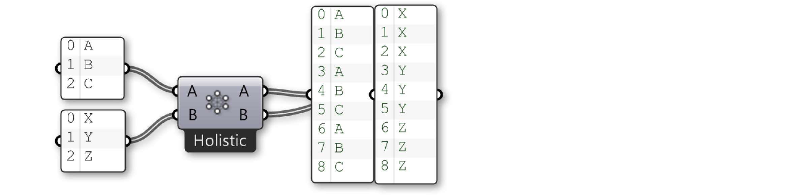

### 1.4.3. Data Stream Matching

>Example files that accompany this section: [http://grasshopperprimer.com/appendix/A-2/1_gh-files.html](http://grasshopperprimer.com/appendix/A-2/1_gh-files.html)

>Example files that accompany this section: [Download](../../appendix/A-2/gh-files/1.4.3_data matching.gh)


#####Data matching is a problem without a clean solution. It occurs when a component has access to differently sized inputs. Changing the data matching algorithm can lead to vastly different results.

Imagine a component which creates line segments between points. It will have two input parameters which both supply point coordinates (List A and List B):

As you can see there are different ways in which we can draw lines between these sets of points. New to Grasshopper 0.9 are three components for data matching, found under the Sets/List panel: Shortest List, Longest List, and Cross Reference. These new components allow for greater flexibility within the three basic data matching algorithms. Right clicking each component allows you to select a data matching option from the menu.

The simplest way is to connect the inputs one-on-one until one of the streams runs dry. This is called the **“Shortest List” **algorithm:

>Select a matching algorithm option from the component menu by right-clicking the component.

The **“Longest List”** algorithm keeps connecting inputs until all streams run dry. This is the default behavior for components:

Finally, the **“Cross Reference”** method makes all possible connections:

This is potentially dangerous since the amount of output can be humongous. The problem becomes more intricate as more input parameters are involved and when the volatile data inheritance starts to multiply data, but the logic remains the same.

Let’s look more closely at the Shortest List component:

Here we have two input lists {A,B,C,D,E} and {X,Y,Z}. Using the Trim End option, the last two items in the first list are disregarded., so that the lists are of equal length.

Using the Trim Start option, the first two items in the first list are disregarded, so that the lists are of equal length.

The Interpolate option skips the second and fourth items in the first list. Now let’s look at the Cross Reference component:

Here we have two input lists {A,B,C} and {X,Y,Z}. Normally Grasshopper would iterate over these lists and only consider the combinations {A,X}, {B,Y} and {C,Z}. There are however six more combinations that are not typically considered, to wit: {A,Y}, {A,Z}, {B,X}, {B,Z}, {C,X} and {C,Y}. As you can see the output of the Cross Reference component is such that all nine permutations are indeed present.

We can denote the behaviour of data cross referencing using a table. The
rows represent the first list of items, the columns the second. If we create all possible permutations, the table will have a dot in every single cell, as every cell represents a unique combination of two source list indices.

Sometimes however you don’t want all possible permutations. Sometimes you
wish to exclude certain areas because they would result in meaningless or invalid computations. A common exclusion principle is to ignore all cells that are on the diagonal of the table. The image above shows a ‘holistic’ matching, whereas the ‘diagonal’ option (available from the Cross Reference]component menu has gaps for {0,0}, {1,1}, {2,2} and {3,3}.
If we apply this to our {A,B,C}, {X,Y,Z} example, we should expect to not see the combinations for {A,X}, {B,Y} and {C,Z}:

The rule that is applied to ‘diagonal’ matching is: “Skip all permutations where all items have the same list index”. ‘Coincident’ matching is the same as ‘diagonal’ matching in the case of two input lists, but the rule is subtly different: “Skip all permutations where any two items have the same list index”.

The four remaining matching algorithms are all variations on the same theme. ‘Lower triangle’ matching applies the rule: “Skip all permutations where the index of an item is less than the index of the item in the next list”, resulting in an empty triangle but with items on the diagonal.

‘Lower triangle (strict)’ matching goes one step further and also eliminates the items on the diagonal:

‘Upper Triangle’ and ‘Upper Triangle (strict)’ are mirror images of the previous two algorithms, resulting in empty triangles on the other side of the diagonal line.
