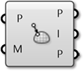

### 1.6.5 Mesh Interactions

#####This section looks at ways in which Mesh Objects can interact with other objects, such as evaluating nearest points or combining multiple meshes together.

####1.6.5.1 Mesh Geometry and Points

**Inclusion**

This component tests to determine whether a given point is inside a mesh solid or not. This only works with closed meshes.

**Mesh Closest Point**

This component will calculate the position on a mesh that is closest to a given point. This component outputs three pieces of data: the coordinates of the calculated point on the mesh, the index of the face which contains that point, and the mesh parameter. This parameter is extremely useful in conjunction with the **Mesh Eval** component discussed below.

>1. Given a point in space, We want to find the closet point on the mesh
2. The face that contains the closest point is identified
3. The parameters of the closest point on the face are calculated

For those users interested in a little more detail about how a mesh is parameterized, we can take a closer look at how a mesh parameter is structured. You can see this structure by attaching a panel to the parameter output of a **Mesh Closest Point** component. The mesh parameter has the form: N[A,B,C,D]. The first number, N, is the index of the face which contains the calculated point. 

The following four numbers define the *barycentric* coordinates of the point within that face. The coordinates of the referenced point can be found by multiplying each vertex of the face by these numbers in order and then add the results together. (Of course, this is already done for us, and is given in the Point output). Also note that barycentric coordinates are only unique for triangular faces, meaning that on a quad face the same point could have multiple different parameterizations. Grasshopper avoids this problem by internally triangulating a quad face when calculating a parameter, the result of which is that of the four numbers in a mesh parameter, at least one of them will always be zero.

>Barycentric Coordinates

**Mesh Eval**

The **Mesh Eval** component uses a mesh parameter as an input and returns the referenced point, as well as the normal and color at that point. The color and normal are calculated as interpolations of the vertex colors and vertex normals, using the same barycentric coordinates as the mesh parameter.

####1.6.5.2 Combining Mesh Geometry 

**Mesh Join**

Unlike joining curves or NURBS surfaces which require adjacency, any meshes can be joined into a single mesh - even meshes that are not touching. Recall that a mesh is simply a list of vertices, and a list of faces. There is no actual requirement for those faces to be connected (Although in most applications, such a mesh would not be very desirable!!).

This component does not weld mesh vertices together, so it is often useful to use this in combination with a **Weld** component.

**Mesh Boolean**

Meshes in Grasshopper have a set of boolean operations similar to boolean operations for NURBS solids. Boolean operations are order specific, meaning that  switching the order of the input meshes A and B will result in different outputs.

>1. Mesh Difference
2. Mesh Intersection
3. Mesh Split
4. Mesh Union

####1.6.5.3 Intersections and Occlusions 

**Intersect**

Intersections can be calculated between meshes and other objects: rays, planes, curves, and other meshes

>1. Mesh | Ray
2. Mesh | Plane
3. Mesh | Curve
4. Mesh | Mesh

**Occlusion**

As we have discussed, one of the (many) uses of mesh geometry is for visualizations and creating shaded rendering based on face normals. When rendering, it also necessary to know when an object is in shadow behind another object. The **Occlusion** component in Grasshopper allows us to enter a set of sample points, along with occluding mesh geometry that will 'cast shadows', and a *view ray*, or vector, to indicate the direction that 'light' is coming from.

Such a process can be used to create shadows in rendering, or determine whether objects are hidden from a certain camera view.

>1. View Ray to test for occlusion
2. Occluding mesh geometry
3. 'Hit' sample points
4. 'Occluded' sample points
