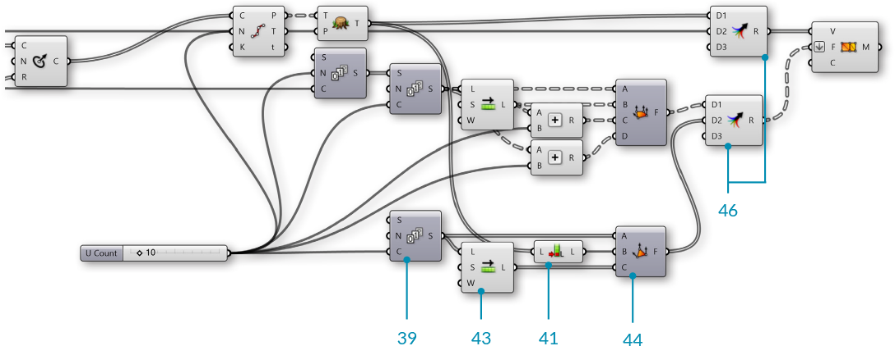

### 1.6.6 Working with Mesh Geometry

#####In this section, we will work through an exercise file for producing a complete mesh solid. By the end of this exercise, we will have a dynamic definition to produce custom vases that can be 3D printed.


>Example files that accompany this section: [http://grasshopperprimer.com/appendix/A-2/1_gh-files.html](http://grasshopperprimer.com/appendix/A-2/1_gh-files.html)

>Example files that accompany this section: [Download](../../appendix/A-2/gh-files/1.6.6_working with meshes.gh)


Since this definition is somewhat longer than previous examples in this primer, we will first walk through the basic steps we will take:

>1. Create a series of circles as a base cylinder
2. Use a Graph Mapper component to define the profile of our vase
3. Construct the topology of the mesh faces to produce a single mesh surface
4. Cap the bottom of the mesh
5. Introduce a twist to the vertical orientation for a more dynamic form
6. Add corrugated ridges for a textured vase
7. Offset the mesh surface to give the vase thickness
8. Cap the top gap between the two surfaces to produce a closed solid

||||
|--|--|--|
|01.| Start a new definition, type Ctrl-N (in Grasshopper)||
|02.| **Params/Geometry/Point** - Drag and drop a **Point** container onto the canvas||
|03.| Reference a point in Rhino by right-clicking the **Point** component and selecting "Set one point". This will serve as the origin point of our vase.   <blockquote>You can create a point manually in Grasshopper by double-clicking the canvas to bring up the search window, then typing the coordinates of the point separated by commas, such as: '0,0,0' (without quotes)</blockquote>||
|04.| **Params/Input/Number Slider** - Drag and drop a **Number Slider** component onto the canvas and set the following values: <ul>Name: Length Lower Limit: 1 Upper Limit: 10</ul>||
|05.| **Curve/Primitive/Line SDL** - Drag and drop a **Line SDL** component onto the canvas||
|06.| Connect the **Point** component to the Start (S) input of the **Line SDL** component, and connect the **Number Slider** to the Length (L) input.   <blockquote>The default Direction (D) value of **Line SDL** is the Unit Z vector, which is what we will use for this example</blockquote>||
|07.| **Params/Input/Number Slider** - Drag and drop a **Number Slider** onto the canvas and set the following values: <ul>Name: V Count Rounding: Integer Lower Limit: 1 Upper Limit: 100</ul>||
|08.| **Curve/Division/Divide Curve** - Drag and drop a **Divide Curve** component onto the canvas||
|09.| Connect the Line (L) output of the **Line SDL** component to the Curve (C) input of the **Divide Curve** component||
|10.| Connect the **V Count** number slider to the Count (N) input of the **Divide Curve** component||
|11.| **Curve/Primitive/Circle CNR** - Drag and drop a **Circle CNR** component onto the canvas||
|12.| Connect the Points (P) output of the **Divide Curve** component to the Center (C) input of the **Circle CNR** component|||

>We have a series of circles stacked vertically. We will use these to make the profile of our vase. 

Next, we will use a Graph Mapper to control the radii of the circles.

||||
|--|--|--|
|13.| **Sets/Sequence/Range** - Drag and drop a **Range** component onto the canvas||
|14.| Connect the **V Count** number slider to the Steps (N) input of the **Range** component||
|15.| **Params/Input/Graph Mapper** - Drag and drop a **Graph Mapper** component onto the canvas||
|16.| Right-click the **Graph Mapper**, click 'Graph Types' from the menu and select 'Bezier'||
|17.| **Params/Input/Number Slider** - Drag and drop a **Number Slider** component onto the canvas and set the following values: <ul>Name: Width Lower Limit: 0 Upper Limit: 10</ul>||
|18.| **Maths/Operators/Multiplication** - Drag and drop a **Multiplication** component onto the canvas||
|19.| Connect the **Graph Mapper** and the **Width** number slider to the A and B inputs of the **Multiplication** component||
|20.| Connect the Result (R) output of the **Multiplication** component to the Radius (R) input of the **Circle CNR** component|||

>Use the handles on the **Graph Mapper** to adjust the profile of the circles. 

>NOTE: It is important to make sure the start point of the bezier curve on the **Graph Mapper** is not at zero. By lifting the start point to a number greater than zero, we produce a flat base for our vase.

We now have a profile for our vase. Next, we will construct a mesh surface. This will require creating mesh vertices and defining mesh faces according to the index of those vertices.

||||
|--|--|--|
|21.| **Params/Input/Number Slider** - Drag and drop a **Number Slider** component onto the canvas and set the following values: <ul>Name: U Count Rounding: Even Lower Limit: 2 Upper Limit: 100</ul>||
|22.| **Curve/Division/Divide Curve** - Drag and drop a **Divide Curve** component onto the canvas||
|23.| Connect the Circle (C) output of the **Circle CNR** component to the the Curve (C) input of the **Divide Curve** component, and connect the **U Count** number slider to the Count (N) input   <blockquote>The Points(P) output of this component are the vertices we will use for our mesh</blockquote>||
|24.| **Sets/Sequence/Series** - Drag and drop two **Series** components onto the canvas||
|25.| Connect the **U Count** number slider to the Step (N) input of the first **Series** component, and connect the **V Count** number slider to the Count (C) input of the same **Series** component||
|26.| Connect the Series (S) output of the first **Series** component to the Start (S) input of the second **Series** component, and connect the **U Count** number slider to the Count (C) input||
|27.| **Sets/List/Shift List** - Drag and drop a **Shift List** component onto the canvas||
|28.| Connect the output of the second **Series** component to the List (L) input of the **Shift List** component||
|29.| **Maths/Operators/Addition** - Drag and drop two **Addition** components onto the canvas||
|30.| Connect the output of the second **Series** component and the **U Count** number slider to the A and B inputs of the first **Addition** component||
|31.| Connect the output of the **Shift List** component and the **U Count** number slider to the A and B inputs of the second **Addition** component||
|32.| **Mesh/Primitive/Mesh Quad** - Drag and drop a **Mesh Quad** component onto the canvas||
|33.| Connect the following to the inputs of the **Mesh Quad** component: <ul>A - Second **Series** component B - **Shift List**   C - First **Addition** component  D - Second **Addition** component</ul> <blockquote>We have just create the initial topology for our mesh. These faces will be combined with the vertices. The order of these connections is crucial, so go ahead and double check all the connections at this point!</blockquote>||
|34.| **Sets/Tree/Flatten** - Drag and drop a **Flatten Tree** component onto tha canvas||
|35.| Connect the Points (P) output of the **Divide Curve** component to the Tree (T) input of the **Flatten Tree** Component||
|36.| **Mesh/Primitive/Construct Mesh** - Drag and drop a **Construct Mesh** component onto the canvas||
|37.| Connect the Tree (T) output of the **Flatten Tree** component to the Vertices (V) input of the **Construct Mesh** component||
|38.| Connect the Face (F) output of the **Mesh Quad** component to the Faces (F) input of the **Construct Mesh** component. Right-click the F (Faces) input and select 'Flatten'|||

>We now have a mesh surface for our vase.

 

Next we will close the bottom of the vase. To do this, we will add the original origin point to our list of vertices, and then construct triangle mesh faces from the bottom edge to that point.

||||
|--|--|--|
|39.| **Sets/Sequence/Series** - Drag and drop a **Series** component onto the canvas||
|40.| Connect the **U Count** number slider to the Count (C) input of the **Series** component||
|41.| **Sets/List/List Length** - Drag and drop a **List Length** component onto the canvas||
|42.| Connect the Tree (T) output of the **Flatten Tree** component to the List (L) input of the **List Length** component   <blockquote>This will be the index of the origin point after we add it to the existing list of vertices.</blockquote>||
|43.| **Sets/List/Shift List** - Drag and drop a **Shift List** component onto the canvas||
|44.| **Mesh/Primitive/Mesh Triangle** - Drag and drop a **Mesh Triangle** component onto the canvas||
|45.| Connect the following to the inputs of the **Mesh Triangle** component: <ul>A - Newest **Series** component B - **List Length** C - **Shift List**</ul>||
|46.| **Sets/Tree/Merge** - Drag and drop two **Merge** components onto the canvas||
|47.| Connect the Tree (T) output of the **Flatten Tree** component to the D1 input, and connect the initial **Point** component to the D2 input of the first **Merge** component||
|48.| Connect the Faces (F) of the **Mesh Quad** component to the D1 input, and connect the **Mesh Triangle** output to the D2 input of the second **Merge** component||
|49.| Connect the first **Merge** component to the Vertices (V) input of the **Construct Mesh** component, and connect the second **Merge** component to the Faces (F) input of the **Construct Mesh** component.|||

>We have capped the bottom of the vase with triangle mesh faces.

 

We will now add some detailing to the vase. We will start by adding a curve to the vertical direction by adjusting the *seam* of the original circles

||||
|--|--|--|
|50.| **Curve/Util/Seam** - Drag and drop a **Seam** component onto the canvas||
|51.| Connect the Circle (C) output of the **Circle CNR** component to the Curve (C) input of the **Seam** component||
|52.| Right click the Curve (C) input of the **Seam** component and select 'Reparameterize'||
|53.| **Params/Input/Number Slider** - Drag and drop a **Number Slider** component onto the canvas. We will use the default settings for this slider||
|54.| **Maths/Operator/Multiplication** - Drag and drop a **Multiplication** component onto the canvas.||
|55.| Connect the output from the **Graph Mapper** to the A input, and the newest **Number Slider** to the B input of the **Multiplication** component||
|56.| Connect the Result (R) of the **Multiplication** component to the Parameter (t) input of the **Seam** component|||

>The curvature is achieved by changing the *seam* position of the initial circles, and uses the same Graph Mapper as the vase profile.

 

Next we will add some vertical ridges to the vase.

||||
|--|--|--|
|57.| **Sets/List/Dispatch** - Drag and drop a **Dispatch** component onto the canvas||
|58.| Connect the Point (P) output of the second **Divide Curve** component to the List (L) input of the **Dispatch** component   <blockquote>We are using the default Pattern (P) input of the **Dispatch** component to separate the points into two lists with alternating points</blockquote>||
|59.| **Vector/Vector/Vector 2Pt** - Drag and drop a **Vector 2Pt** component onto the canvas||
|60.| Connect the B output of the **Dispatch** component to the A input of the **Vector 2Pt** component||
|61.| Connect the Points (P) of the *first* **Divide Curve** component to the B input of the **Vector 2Pt** component||
|62.| Right-click the B input of the **Vector 2Pt** component and select 'Graft', and right-click the Unitize (U) input, go to 'Set Boolean' and select 'True'   <blockquote>This creates a unit vector for each point that points towards the center of the circle</blockquote>||
|63.| **Params/Input/Number Slider** - Drag and drop a **Number Slider** component onto the canvas. We will use the default settings||
|64.| **Maths/Operator/Multiplication** - Drag and drop a **Multiplication** component onto the canvas||
|65.| Connect the Vector (V) output of the **Vector 2Pt** component to the A input, and connect the **Number Slider** to the B input of the **Multiplication** component||
|66.| **Transform/Euclidean/Move** - Drag and drop a **Move** component onto the canvas||
|67.| Connect the B output of the **Dispatch** component to the Geometry (G) input of the **Move** component||
|68.| Connect the Result (R) output of the **Multiplication** component to the Motion (T) input of the **Move** component||
|69.| **Sets/List/Weave** - Drag and drop a **Weave** component onto the canvas||
|70.| Connect the A output of the **Dispatch** component to the 0 input of the **Weave** component||
|71.| Connect the Geometry (G) output of the **Move** component to the 1 input of the **Weave** component||
|72.| Connect the Weave (W) output of the **Weave** component to the Tree (T) input of the **Flatten Tree** component|||

>Remember to go back and adjust your sliders and graph mapper to see how the model changes, and to make sure everything still works. This is known as 'flexing' the model, and should be done frequently to check for mistakes in the definition.

We now have a single surface for our vase. If we wanted to print this vase using a 3D printer, we need it to be a closed solid. We will create a solid by offsetting the current mesh, then combining the original mesh and the offset mesh.

||||
|--|--|--|
|73.| **Mesh/Analysis/Deconstruct Mesh** - Drag and drop a **Deconstruct Mesh** component onto the canvas||
|74.| Connect the Mesh (M) output of the **Construct Mesh** component to the Mesh (M) input of the **Deconstruct Mesh** component||
|75.| **Params/Input/Number Slider** - Drag and drop a **Number Slider** component onto the canvas. We will use the default settings||
|76.| **Maths/Operator/Multiplication** - Drag and drop a **Multiplication** component onto the canvas||
|77.| Connect the Normals (N) output of the **Deconstruct Mesh** component to the A input, and connect the **Number Slider** to the B input of the **Multiplication** component||
|78.| **Transform/Euclidean/Move** - Drag and drop a **Move** component onto the canvas||
|79.| Connect the Vertices (V) output of the **Deconstruct Mesh** component to Geometry (G) input of the **Move** component||
|80.| Connect the Result (R) output of the **Multiplication** component to the Motion (T) input of the **Move** component||
|81.| **Mesh/Primitive/Construct Mesh** Drag and drop a **Construct Mesh** component onto the canvas||
|82.| Connect the Geometry (G) output of the **Move** component to the Vertices (V) input of the **Construct Mesh** component||
|83.| Connect the Faces (F) output of the **Deconstruct Mesh** component to the Face (F) input of the **Construct Mesh** component|||

>By offseting the mesh according to the vertex normals, we now have an 'inside' and an 'outside' mesh, but we still have a gap at the top between the two mesh geometries

The final step will be to create a closed mesh by creating a new mesh geometry to close the gap and then joining the meshes together.

||||
|--|--|--|
|84.| **Mesh/Analysis/Mesh Edges** - Drag and drop a **Mesh Edges** component onto the canvas||
|85.| Connect the Mesh (M) output of the first **Construct Mesh** component to the Mesh (M) input of the **Mesh Edges** component||
|86.| **Curve/Util/Join Curves** - Drag and drop a **Join Curves** component onto the canvas||
|87.| Connect the Naked Edges (E1) output of the **Mesh Edges** component to the Curves (C) input of the **Join Curves** component||
|88.| **Curve/Analysis/Control Points** - Drag and drop a **Control Points** component onto the canvas||
|89.| Connect the Curves (C) output of the **Join Curves** component to the Curve (C) input of the **Control Points** component   <blockquote>By joining the curves and then extrating the control points, we ensure that the order of the points is consistent along the rim of the vase, which is important for making the resulting mesh orientable and manifold</blockquote>||
|90.| **Sets/List/Shift List** - Drag and drop a **Shift List** component onto the canvas||
|91.| Connect the Points (P) output of the **Control Points** component to the List (L) input of the **Shift List** component||
|92.| Repeat steps 84 through 91 for the second **Construct Mesh** component||
|93.| **Sets/Tree/Entwine** - Drag and drop an **Entwine** component onto the canvas||
|94.| Zoom in to the **Entwine** component to show the option to add an extra input. We will need four inputs. Connect them in the following way: <ul>{0;0} - Points (P) from first **Control Points** component {0;1} - output from first **Shift List**  {0;2} - output from second **Shift List** {0;3} - Points (P) from second **Control Points** component</ul>||
|95.| **Sets/Tree/Flip Matrix** - Drag and drop a **Flip Matrix** component onto the canvas||
|96.| Connect the Result (R) from the **Entwine** component to the Data (D) input of the **Flip Matrix** component||
|97.| **Mesh/Primitive/Construct Mesh** - Drag and drop a **Construct Mesh** component onto the canvas||
|98.| Connect the Data (D) outut of the **Flip Matrix** component to the Vertices (V) input of the **Construct Mesh** component||
|99.| **Mesh/Util/Mesh Join** - Drag and drop a **Mesh Join** component onto the canvas||
|100.| Connect all three **Construct Mesh** components to the **Mesh Join** component by holding down the Shift key while connecting the wires (or use a **Merge** component). Right-click the Mesh (M) input of the **Mesh Join** component and select 'Flatten'|||

---

