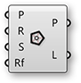
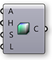
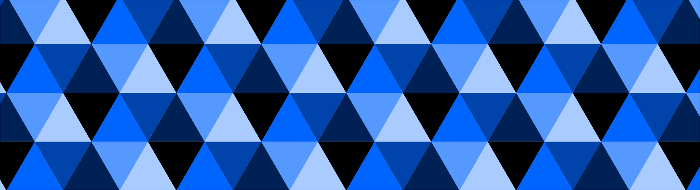

###1.3.4. Domains & Color


>Example files that accompany this section: [http://grasshopperprimer.com/appendix/A-2/1_gh-files.html](http://grasshopperprimer.com/appendix/A-2/1_gh-files.html)

>Example files that accompany this section: [Download](../../appendix/A-2/gh-files/1.3.4_domains and color.gh)


#####The color wheel is a model for organizing colors based on their hue. In Grasshopper, colors can be defined by their hue value in a range of 0.0 to 1.0. Domains are used to define a range of all possible values between a set of numbers between a lower limit(A) and an upper limit (B).

>In the color wheel, hue corresponds to the angle. Grasshopper has taken this 0-360 domainand remapped it between zero and one.

By dividing the Hue domain (0.0 to 1.0) by the number of segments desired, we can assign a hue value to each segment to create a color wheel.

In this example, we will use Grasshopper’s domain and color components to create a color wheel with a variable amount of segments.

||||
|--|--|--|
|01.| Type Ctrl+N (in Grasshopper) to start a new definition||
|02.| **Curve/Primitive/Polygon** – Drag and drop a **Polygon** component onto the canvas||
|03.| **Params/Geometry/Point** – Drag and drop a **Point** Parameter onto the canvas||
|04.| Right-Click on the **Point** Component and select set one point||
|05.| Set a point in the model space.||
|06.| Connect the **Point** Parameter (Base Point) to the Plane (P) input of the **Polygon** component||
|07.| **Params/Input/Number Sliders** – Drag and drop two **Number Sliders** onto the canvas||
|08.| Double-click on the first **Number Sliders** and set the following:<ul>Rounding: Integers Lower Limit: 0 Upper Limit: 10 Value: 10</ul>||
|09.| Double-click on the second **Number Sliders** and set the following:<ul>Rounding: Integers Lower Limit: 0 Upper Limit: 100 Value: 37</ul>||
|10.| Connect the **Number Slider** (Radius) to the Radius (R) input of the **Polygon** component <blockquote>When you connect a number slider to a component in will automatically change its name to the name of input that it is connecting to.</blockquote>||
|11.| Connect the **Number Slider** (Segments) to the Segments (S) input of the **Polygon** component|||

||||
|--|--|--|
|12.| **Curve/Util/Explode** – Drag and drop an **Explode** component onto the canvas.||
|13.| Connect the Polygon (P) output of the **Polygon** component to the Curve (C) input of the **Explode** component||
|14.| **Surface/Freeform/Extrude Point** – Drag and drop the **Extrude Point** component onto the canvas||
|15.| Connect the Segments (S) output of the **Explode** component to the Base (B) input of the **Extrude Point**||
|16.| Connect the **Point** Parameter (Base Point) to the Extrusion Tip (P) of the **Extrude Point** component||
|17.| **Surface/Analysis/Deconstruct Brep** – Drag and drop the **Deconstruct Brep** component on to the canvas||
|18.| Connect the Extrusion (E) output of the **Extrude Point** component to the **Deconstruct Brep** (B) component|||

||||
|--|--|--|
|19.| **Maths/Domain/Divide Domain** – Drag and drop the **Divide Domain** component<blockquote>The Base Domain (I) is automatically set between 0.0-1.0 which is what we need for this exercise</blockquote>||
|20.| Connect the **Number Slider** (Segments) to the Count (C) input of the **Divide Domain** component||
|21.| **Math/Domain/Deconstruct Domain** – Drag and drop the **Deconstruct Domain** component||
|22.| Connect the Segments (S) output of the **Divide Domain** component to the Domain (I) input of the **Deconstruct Domain** component||
|23.| **Display/Colour/Colour HSL** – Drag and drop the **Colour HSL** component||
|24.| Connect the Start (S) output of the **Deconstruct Domain** component to the Hue (H) input of the **Colour HSL** components||
|25.| **Display/Preview/Custom Preview** – Drag and drop the **Custom Preview** component||
|26.| Right click on the Geometry (G) input of the **Custom Preview** component and select Flatten<blockquote>See 1-4 Designing with Data Trees for details about flattening</blockquote>||
|27.| Connect the Faces (F) output of the **Deconstruct Brep** component to the Geometry (G) input of the **Custom Preview** component||
|28.| Connect the Colour (C) output of the **Colour HSL** component to the Shade (S) input of the **Custom Preview** component|||

For different color effects, try connecting the Deconstruct Domain component to the saturation (S) or Luminance (L) inputs of the Colour HSL component.

